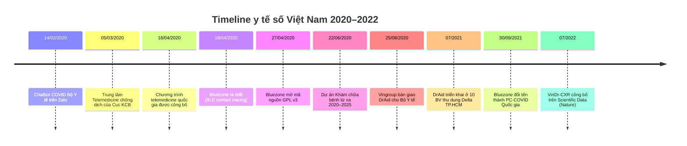
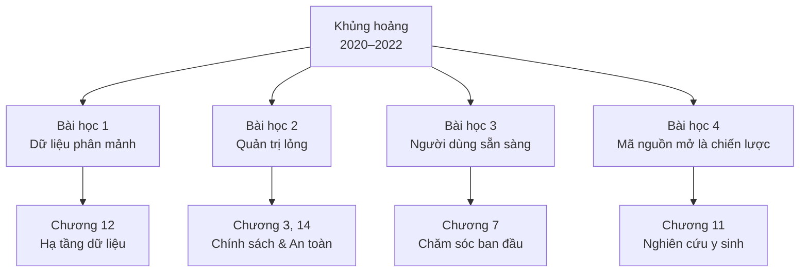

# Hậu COVID: cú huých số hóa y tế Việt Nam

> **Điểm neo của chương** — COVID không tạo ra {t:ai}trí tuệ nhân tạo{/t} trong y tế Việt Nam từ con số không. Nó chỉ ép ngành y phải triển khai AI, {t:telemedicine}y tế từ xa{/t} và các ứng dụng cộng đồng ở quy mô hàng chục bệnh viện và hàng chục triệu người dùng chỉ trong vài tháng — điều mà những năm bình thường trước đó không hề làm được. Bốn bài học then chốt về dữ liệu, quản trị, người dùng và mã nguồn mở từ giai đoạn 2020–2022 vẫn là kim chỉ nam cho mọi dự án AI y tế đang triển khai năm 2026.

## 1. Trước dịch: một quán tính chậm chạp

Nếu quay lại đầu năm 2020, bức tranh chuyển đổi số y tế Việt Nam đứng ở đâu? Câu trả lời thật lòng là: rất chậm. Đề án bệnh án điện tử đã có từ Thông tư 46/2018/TT-BYT, nhưng đến cuối 2019, cả nước chỉ có vài chục bệnh viện triển khai {t:emr}bệnh án điện tử{/t} thực chất. Y tế từ xa có Thông tư 49/2017/TT-BYT quy định khung, nhưng lại không có cơ chế thanh toán bảo hiểm cho các dịch vụ khám qua video, khiến quy định gần như nằm im trên giấy ([Thư viện Pháp luật](https://thuvienphapluat.vn/van-ban/Cong-nghe-thong-tin/Thong-tu-49-2017-TT-BYT-quy-dinh-ve-hoat-dong-y-te-tu-xa-347138.aspx)). Các sản phẩm AI y tế do doanh nghiệp Việt phát triển, nếu có, chủ yếu vẫn nằm ở giai đoạn nghiên cứu phòng lab hoặc thử nghiệm với một số ít bệnh viện thân hữu.

Ba nguyên nhân chính đứng sau sự chậm chạp đó. Thứ nhất, dữ liệu y tế Việt Nam vô cùng phân mảnh: mỗi bệnh viện là một ốc đảo với hệ thống HIS riêng, cấu trúc dữ liệu riêng, và hầu như không có cơ chế trao đổi. Thứ hai, đầu tư cho công nghệ y tế phụ thuộc nặng vào ngân sách sự nghiệp, mà ngân sách này lại được phân bổ ưu tiên cho thuốc, vật tư và bảo hiểm chứ không phải phần mềm. Thứ ba — và có lẽ là quan trọng nhất — thiếu một khủng hoảng đủ lớn để đánh thức sự cấp bách.

Cuộc khủng hoảng đó đã đến từ Vũ Hán, cuối tháng 12/2019.

## 2. Sáu tháng đầu 2020: khủng hoảng ép chuyển đổi

Điều đáng chú ý là ngành y Việt Nam đã phản ứng bằng công nghệ số nhanh hơn nhiều người kỳ vọng. Ngày 14/02/2020, tức chỉ hai tuần sau khi có ca COVID đầu tiên tại Vĩnh Phúc, Cục Công nghệ Thông tin Bộ Y tế đã tích hợp {t:llm}chatbot{/t} tra cứu COVID-19 trên Zalo ([Tuổi Trẻ](https://tuoitre.vn/bo-y-te-tich-hop-tro-ly-ao-tra-cuu-ve-covid-19-tren-zalo-20200218161741759.htm)). Đây có thể coi là ứng dụng AI đối thoại quy mô đại chúng đầu tiên trong y tế Việt Nam — dù về công nghệ, chatbot này còn khá cơ bản, chưa dùng {t:transformer}kiến trúc Transformer{/t} như các trợ lý ảo hiện đại.

Đến đầu tháng 3, Cục Quản lý Khám chữa bệnh thành lập Trung tâm Telemedicine để phối hợp hỗ trợ chuyên môn cho các cơ sở y tế vùng sâu vùng xa đang tiếp nhận ca nghi nhiễm ([Frontiers in Public Health](https://www.frontiersin.org/journals/public-health/articles/10.3389/fpubh.2021.672732/full)). Ngày 16/04/2020, Bộ Y tế chính thức công bố Chương trình telemedicine quốc gia — một tuần sau đó, mô hình được thí điểm tại Bệnh viện Đại học Y Hà Nội. Ngày 22/06/2020, Dự án "Khám, chữa bệnh từ xa giai đoạn 2020–2025" ra đời, đặt mục tiêu kết nối 1.000 bệnh viện tuyến trên với tuyến dưới. Đó là những mốc mà trước dịch, có thể đã cần ba đến năm năm để đạt được.

Song song với telemedicine, ba ứng dụng cộng đồng lớn được triển khai. NCOVI, Bluezone và VHD được phát triển bởi các đội ngũ khác nhau, sau này gộp lại thành PC-COVID Quốc gia vào ngày 30/09/2021 ([Wikipedia](https://vi.wikipedia.org/wiki/PC-COVID)). Đây là lần đầu tiên Việt Nam có một ứng dụng y tế công cộng đạt quy mô hàng chục triệu người dùng — con số mà mọi dự án chuyển đổi số y tế trước đây chỉ dám mơ.

Nguồn tổng hợp: [Frontiers in Public Health](https://www.frontiersin.org/journals/public-health/articles/10.3389/fpubh.2021.672732/full) và [Wikipedia PC-COVID](https://vi.wikipedia.org/wiki/PC-COVID).

## 3. Ba sản phẩm biểu tượng của giai đoạn COVID

Trong hàng chục ứng dụng và mô hình AI được triển khai trong hai năm đại dịch, ba sản phẩm sau đây đáng được xem xét kỹ vì chúng đại diện cho ba mô thức khác nhau về ứng dụng AI trong y tế: AI đọc ảnh chẩn đoán tại bệnh viện, AI mở nguồn cho cộng đồng nghiên cứu, và AI cộng đồng quy mô quốc gia.

### 3.1. DrAid™ — AI đọc X-quang phổi của VinBrain

Câu chuyện DrAid bắt đầu từ trước dịch. VinBrain, một công ty con của Vingroup thành lập năm 2019, đã phát triển hệ thống AI đọc X-quang phổi bằng {t:cnn}mạng nơ-ron tích chập{/t} và {t:deep-learning}học sâu{/t} cho nhiều bệnh lý tim–phổi–xương. Khi COVID bùng phát, đội ngũ này nhanh chóng chuyển hướng: dùng {t:gan}kiến trúc đối kháng XPGAN{/t} để sinh dữ liệu ảo, bù vào thiếu hụt ảnh X-quang COVID trong giai đoạn đầu ([Frontiers](https://www.frontiersin.org/journals/public-health/articles/10.3389/fpubh.2021.672732/full)).

Ngày 25/08/2020, VinBrain bàn giao chính thức DrAid cho Bộ Y tế. Đây là một khoảnh khắc mang tính biểu tượng: lần đầu tiên một sản phẩm AI đọc ảnh y khoa "Made in Vietnam" được Bộ Y tế công nhận và khuyến nghị triển khai. Ba con số kỹ thuật được công bố khi đó vẫn đáng để trích lại: độ nhạy tới 95%, độ đặc hiệu 99%, F1 đạt 94% khi sàng lọc COVID trên X-quang; thời gian phân tích dưới 5 giây cho mỗi ảnh; kiến trúc XPGAN cho phép huấn luyện được ngay cả khi chỉ có vài chục ngàn ảnh COVID thật ([Sở Y tế Hà Tĩnh](http://soyte.hatinh.gov.vn/?page=Article.Print.detail&id=60755433309a17740e5da521)).

Nhưng con số đáng nói hơn không nằm ở phòng lab, mà ở quy mô triển khai. Trong đợt bùng phát Delta năm 2021, khi TP.HCM có hơn một triệu ca COVID trong ba tháng và hệ thống {t:pacs}lưu trữ ảnh y khoa{/t} của các bệnh viện tuyến quận huyện quá tải, DrAid được triển khai tại mười bệnh viện thu dung — chín tại TP.HCM và một tại Kỳ Anh, Hà Tĩnh ([VinBrain / Forbes Việt Nam](https://vinbrain.net/vi/forbes-viet-nam-tro-ly-ao-cua-bac-si)). Đến 2022–2023, con số triển khai mở rộng lên 63 bệnh viện trên toàn quốc ([Sở Y tế Hà Tĩnh](http://soyte.hatinh.gov.vn/?page=Article.Print.detail&id=60755433309a17740e5da521)). Với một sản phẩm AI y tế của Việt Nam, đây là quy mô chưa từng có.

Câu chuyện DrAid không hoàn hảo. Bài đánh giá độc lập của [Frontiers in Public Health](https://www.frontiersin.org/journals/public-health/articles/10.3389/fpubh.2021.672732/full) chỉ ra rằng nhiều đánh giá hiệu năng chỉ được thực hiện nội bộ, chưa qua kiểm định độc lập kiểu {t:fda-samd}510(k){/t} như tại Hoa Kỳ. Vấn đề tích hợp với hệ thống {t:dicom}DICOM{/t} và {t:emr}bệnh án điện tử{/t} tại các bệnh viện tuyến dưới cũng gặp trở ngại về hạ tầng. Dù vậy, DrAid đã tạo ra một tiền lệ: một sản phẩm AI y tế Việt Nam có thể được ngành y sử dụng thật, ở quy mô đáng kể, trong khủng hoảng.

### 3.2. VinDr-CXR — bộ dữ liệu mở của Việt Nam ra thế giới

Sản phẩm thứ hai đáng được kể là VinDr-CXR — không phải là một hệ thống AI, mà là bộ dữ liệu công khai để đào tạo AI. Vingroup Big Data Institute (VinBigData) thu thập hồi cứu hơn 100.000 ảnh {t:dicom}X-quang DICOM{/t} từ Bệnh viện Trung ương Quân đội 108 và Bệnh viện Đại học Y Hà Nội trong giai đoạn 2018–2020. Sau khi ẩn danh và gán nhãn, 18.000 ảnh được công bố mở, tách thành 15.000 ảnh huấn luyện và 3.000 ảnh kiểm thử ([Scientific Data / Nature](https://pmc.ncbi.nlm.nih.gov/articles/PMC9300612/)).

Điều làm VinDr-CXR nổi bật là chất lượng gán nhãn. Mười bảy bác sĩ chẩn đoán hình ảnh tham gia dự án, mỗi ảnh trong tập huấn luyện được gán nhãn độc lập bởi ba bác sĩ, còn mỗi ảnh trong tập kiểm thử phải qua đồng thuận của năm bác sĩ. Bộ nhãn gồm 22 nhãn cục bộ có hộp giới hạn và sáu nhãn toàn cục cho các bệnh nghi ngờ — tổng cộng 28 phát hiện và chẩn đoán. Đây là mức chi tiết mà ngay cả các bộ dữ liệu quốc tế nổi tiếng như ChestX-ray14 của NIH cũng không có ([GitHub — vinbigdata-medical/vindr-cxr](https://github.com/vinbigdata-medical/vindr-cxr)).

Ý nghĩa chiến lược của VinDr-CXR vượt xa giá trị kỹ thuật. Tại thời điểm công bố tháng 7/2022, đây là bộ dữ liệu ảnh X-quang có gán nhãn lớn nhất Đông Nam Á. Nó đặt Việt Nam vào bản đồ nghiên cứu AI y tế thế giới với tư cách nước đóng góp dữ liệu chất lượng cao — không chỉ là nước tiêu dùng công nghệ. Repo mã nguồn mở trên GitHub, dataset đầy đủ trên [PhysioNet](https://physionet.org/content/vindr-cxr/), và bài báo trên Scientific Data thuộc nhà xuất bản Nature tạo thành một "gói tài liệu" mà bất kỳ nhóm nghiên cứu nào trên thế giới cũng có thể tải về và sử dụng.

Con đường mở nguồn không phải là điều tất yếu. Ban lãnh đạo Vingroup đã có thể giữ VinDr-CXR như một tài sản độc quyền của tập đoàn. Việc chọn công bố mở thể hiện một tính toán chiến lược dài hạn: tạo hạ tầng dùng chung để hệ sinh thái AI y tế Việt Nam có nền để phát triển, thay vì mỗi công ty phải tự thu thập từ đầu. Bài học này sẽ được nhắc lại ở Chương 11 khi bàn về nghiên cứu y sinh và Chương 12 khi bàn về hạ tầng dữ liệu.

### 3.3. Bluezone / PC-COVID — ứng dụng truy vết cấp quốc gia

Sản phẩm thứ ba không phải là AI theo nghĩa hiện đại, nhưng lại đại diện cho một hình thái quan trọng: công nghệ số y tế công cộng ở quy mô quốc gia. Bluezone ra mắt ngày 18/04/2020 bởi liên minh doanh nghiệp công nghệ Việt Nam do Bkav dẫn đầu, dùng công nghệ Bluetooth Low Energy để ghi nhận tiếp xúc gần trong phạm vi 2 mét mà không thu thập dữ liệu vị trí ([Frontiers](https://www.frontiersin.org/journals/public-health/articles/10.3389/fpubh.2021.672732/full)). Chỉ chín ngày sau khi ra mắt, mã nguồn ứng dụng được công bố dưới giấy phép GNU GPL v3 — một quyết định táo bạo cho phép cả cộng đồng kiểm tra tính bảo mật.

Con đường của Bluezone cho thấy cả tiềm năng lẫn giới hạn của y tế số Việt Nam. Về mặt tăng trưởng, con số ấn tượng: đến 07/08/2020, ứng dụng có hơn 10 triệu lượt tải; đến tháng 9/2021, con số lên tới 45 triệu lượt tải với 20 triệu người dùng hoạt động hàng tuần ([Wikipedia](https://vi.wikipedia.org/wiki/PC-COVID)). Nhưng về mặt hiệu quả truy vết, kết quả khiêm tốn hơn: đến tháng 8/2020, ứng dụng chỉ mới phát hiện 21 trường hợp F1–F2 trong cộng đồng theo báo cáo của Bộ Thông tin và Truyền thông. Một hạn chế mà chính báo chí Việt Nam đã nêu là công nghệ Bluetooth chỉ hoạt động khi cả hai điện thoại cùng bật ứng dụng, cùng cấp quyền — một điều kiện khó đạt ở quy mô toàn dân ([Tuổi Trẻ](https://tuoitre.vn/can-50-trieu-luot-tai-bluezone-de-day-lui-dich-moi-chi-dat-hon-4-trieu-20200805165059287.htm)).

Đến 30/09/2021, khi Việt Nam chuyển sang chiến lược "sống chung với dịch", Bluezone được sáp nhập cùng NCOVI và VHD thành PC-COVID Quốc gia, bổ sung tính năng khai báo tiêm chủng và mã QR địa điểm. Đây là lần đầu tiên Việt Nam có một ứng dụng y tế đơn tuyến do Chính phủ điều phối trung tâm — một mô hình quản trị mà cả các nước phát triển cũng chưa làm được ngay từ đầu.

## 4. Bốn bài học then chốt vẫn còn giá trị đến 2026

Sáu năm sau đại dịch, khi chúng ta bắt tay xây dựng thế hệ AI y tế mới với {t:generative-ai}AI sinh tạo{/t}, {t:rag}RAG{/t} và các mô hình {t:llm}ngôn ngữ lớn{/t}, những bài học từ giai đoạn 2020–2022 vẫn có giá trị nguyên vẹn. Bốn bài học sau đây sẽ được nhắc lại xuyên suốt cẩm nang này.

**Bài học thứ nhất, dữ liệu phân mảnh là rào cản lớn nhất, chứ không phải thuật toán.** VinBrain đã phải huấn luyện DrAid trên hơn 1,3 triệu ảnh X-quang tổng hợp từ nhiều nguồn, trong khi VinDr-CXR chỉ đủ dữ liệu công bố mở 18.000 ảnh sau ba năm thu thập ([VinBrain / Forbes](https://vinbrain.net/vi/forbes-viet-nam-tro-ly-ao-cua-bac-si)). Vấn đề không nằm ở việc thiếu dữ liệu — mỗi ngày các bệnh viện Việt Nam sinh ra hàng terabyte dữ liệu chẩn đoán hình ảnh. Vấn đề là dữ liệu bị chia cắt, mỗi bệnh viện là một ốc đảo, không theo chuẩn {t:fhir}HL7 FHIR{/t} hay bất kỳ chuẩn liên thông nào. Sáu năm sau COVID, tình trạng này vẫn chưa được giải quyết triệt để — đó là lý do Phần III của cẩm nang dành trọn cho hạ tầng dữ liệu.

**Bài học thứ hai, quản trị lỏng khiến AI trở thành "hộp đen" trong bệnh viện.** Bài đánh giá độc lập trên [Frontiers](https://www.frontiersin.org/journals/public-health/articles/10.3389/fpubh.2021.672732/full) chỉ rõ "thiếu quản trị mạnh mẽ trong phát triển digital health" là hạn chế lớn nhất của Việt Nam giai đoạn COVID. Cụ thể: ai chịu trách nhiệm khi AI đọc ảnh sai? Ai kiểm định hiệu năng khi mô hình được deploy tại bệnh viện thứ 30 sau bệnh viện thứ nhất? Ai đảm bảo dữ liệu bệnh nhân được xử lý đúng {t:pdpd}Nghị định 13/2023/NĐ-CP{/t}? Đại dịch buộc phải triển khai nhanh nên các câu hỏi này bị gác lại. Nhưng khi các sản phẩm AI y tế ngày càng mạnh và ảnh hưởng ngày càng lớn, câu trả lời không còn có thể trì hoãn. Chương 3 sẽ đi sâu vào khung chính sách, Chương 14 vào an toàn và tuân thủ.

**Bài học thứ ba, người dân Việt Nam sẵn sàng dùng công nghệ số hơn ta tưởng.** Con số 20 triệu người dùng hoạt động hàng tuần của Bluezone trong dân số 100 triệu — với một ứng dụng mà lợi ích cá nhân không rõ ràng ngoài "trách nhiệm cộng đồng" — là một bằng chứng mạnh. Điều này bác bỏ quan niệm phổ biến rằng "người Việt không quen công nghệ số" hay "phải chờ thế hệ trẻ hơn". Nếu ứng dụng đủ đơn giản, có động lực rõ ràng, và không đòi hỏi thao tác phức tạp, người dùng Việt tiếp nhận rất nhanh. Bài học này quan trọng cho mọi dự án chăm sóc sức khỏe ban đầu qua ứng dụng di động, được bàn kỹ ở Chương 7.

**Bài học thứ tư, mã nguồn mở không phải là phụ kiện, mà là chiến lược.** Bluezone mở mã nguồn chỉ chín ngày sau khi ra mắt. VinDr-CXR công bố mở dataset hai năm sau khi triển khai nội bộ. Cả hai quyết định đều có tính toán chiến lược: khi mã nguồn mở, cộng đồng có thể kiểm tra bảo mật, tin tưởng và sử dụng; khi dataset mở, hệ sinh thái nghiên cứu Việt Nam có nền để cùng phát triển thay vì mỗi nhóm phải tự thu thập từ đầu. Xu hướng này tiếp tục lan rộng: các mô hình {t:llm}ngôn ngữ lớn{/t} mã nguồn mở như Llama 4 và DeepSeek R1 đang thay đổi cục diện AI y tế toàn cầu, cho phép cả các nước đang phát triển như Việt Nam tự chủ ở tầng mô hình. Chương 11 sẽ bàn kỹ vấn đề này.

## 5. Case đóng chương — DrAid trong đợt Delta TP.HCM 2021

Để hình dung cụ thể cách một sản phẩm AI y tế Việt Nam vận hành trong khủng hoảng, không có ví dụ nào rõ hơn đợt triển khai DrAid tại các bệnh viện thu dung TP.HCM trong tháng 7–9/2021.

Bối cảnh khi đó vô cùng căng thẳng. Chỉ trong tám tuần từ tháng 7 đến tháng 9, TP.HCM ghi nhận hơn một triệu ca COVID-19 với biến thể Delta, hệ thống y tế quá tải nghiêm trọng, các bệnh viện thu dung được thành lập gấp rút. Trong bối cảnh đó, X-quang phổi vẫn là công cụ chẩn đoán và tiên lượng quan trọng nhất, nhưng số bác sĩ chẩn đoán hình ảnh không đủ để đọc kịp hàng ngàn phim mỗi ngày. Đây là điểm giao trọng yếu cần AI.

VinBrain triển khai DrAid tại chín bệnh viện thu dung TP.HCM và một bệnh viện tại Hà Tĩnh với quy trình bốn bước rất đơn giản. Bước một, bác sĩ chụp X-quang tại giường bệnh nhân bằng máy chụp di động — vốn được huy động từ nhiều nguồn. Bước hai, ảnh được gửi thẳng lên hệ thống DrAid qua kết nối 4G thay vì phải qua {t:pacs}PACS{/t} truyền thống. Bước ba, DrAid trả kết quả trong vòng năm giây, khoanh vùng các bất thường trên phổi và đo kích thước tổn thương tự động. Bước bốn, bác sĩ có thể chuyển ảnh kèm gợi ý AI cho chuyên gia hội chẩn từ xa nếu cần ý kiến thứ hai.

Điểm đáng học từ mô hình này không nằm ở công nghệ AI — thuật toán CNN đọc X-quang phổi đã có từ 2016. Điểm đáng học nằm ở thiết kế triển khai: **AI không thay thế bác sĩ, mà làm phân tầng nhanh trong khủng hoảng**. Bác sĩ vẫn đọc lại và ký báo cáo cuối. AI chỉ giúp giảm 60–70% thời gian phân loại giữa "ca cần chú ý ngay" và "ca có thể chờ". Trong một cơn bão dịch, tiết kiệm được vài phút mỗi ca là cứu được thêm nhiều bệnh nhân.

Đây cũng là mô hình sẽ được nhắc lại xuyên suốt cẩm nang: AI làm sàng lọc và hỗ trợ, bác sĩ giữ vai trò quyết định. Không có gì đảo ngược trật tự này — kể cả khi các mô hình {t:generative-ai}AI sinh tạo{/t} và {t:llm}mô hình ngôn ngữ lớn{/t} đã tiến bộ vượt bậc đến 2026.

## 6. Lab 1 — Bài học từ COVID cho AI y tế 2026

Bài thực hành đầu tiên của cẩm nang được thiết kế cho tầng nhận thức đầu tiên trong thang Miller: "Biết" — nắm được dòng thời gian, các tác nhân chính, và mối liên hệ nguyên nhân–kết quả của giai đoạn 2020–2022. Bạn sẽ viết một đoạn văn ngắn trả lời câu hỏi phản biện, và AI sẽ chấm theo rubric 1–5 ngay tại chỗ, gợi ý điểm cải thiện cụ thể.

<a href="/lab/lab-01" target="_blank" rel="noopener noreferrer" class="lab-btn">
▶ Mở Lab 1 trong tab mới
</a>

~15 phút · AI chấm tự động · Lưu tiến độ vào sổ grading

## Tài liệu tham khảo

1. Nguyễn HQ và cộng sự. **VinDr-CXR: An open dataset of chest X-rays with radiologist's annotations**. *Scientific Data* 9, 429 (2022). [PMC](https://pmc.ncbi.nlm.nih.gov/articles/PMC9300612/) · [PhysioNet](https://physionet.org/content/vindr-cxr/)
2. Nguyen HT và cộng sự. **The Contribution of Digital Health in the Response to COVID-19 in Vietnam**. *Frontiers in Public Health* 9:672732 (2021). [Frontiers](https://www.frontiersin.org/journals/public-health/articles/10.3389/fpubh.2021.672732/full)
3. VinBrain — **Forbes Việt Nam: Trợ lý ảo của bác sĩ** (2022). [VinBrain](https://vinbrain.net/vi/forbes-viet-nam-tro-ly-ao-cua-bac-si)
4. Sở Y tế Hà Tĩnh — **Ứng dụng DrAid hỗ trợ phát hiện và cảnh báo COVID-19**. [soyte.hatinh.gov.vn](http://soyte.hatinh.gov.vn/?page=Article.Print.detail&id=60755433309a17740e5da521)
5. Bộ Y tế — **Thông tư 49/2017/TT-BYT về hoạt động y tế từ xa**. [Thư viện Pháp luật](https://thuvienphapluat.vn/van-ban/Cong-nghe-thong-tin/Thong-tu-49-2017-TT-BYT-quy-dinh-ve-hoat-dong-y-te-tu-xa-347138.aspx)
6. Wikipedia tiếng Việt — **PC-COVID**. [vi.wikipedia.org/wiki/PC-COVID](https://vi.wikipedia.org/wiki/PC-COVID)
7. Báo Tuổi Trẻ — **Cần 50 triệu lượt tải Bluezone để đẩy lùi dịch** (05/08/2020). [Tuổi Trẻ](https://tuoitre.vn/can-50-trieu-luot-tai-bluezone-de-day-lui-dich-moi-chi-dat-hon-4-trieu-20200805165059287.htm)
8. VinBigData — **VinDr-CXR repository**. [GitHub](https://github.com/vinbigdata-medical/vindr-cxr)
9. Báo Tuổi Trẻ — **Bộ Y tế tích hợp trợ lý ảo tra cứu COVID-19 trên Zalo** (18/02/2020). [Tuổi Trẻ](https://tuoitre.vn/bo-y-te-tich-hop-tro-ly-ao-tra-cuu-ve-covid-19-tren-zalo-20200218161741759.htm)

---

## Ghi chú của biên tập

Bản thảo được bot soạn ngày 09/09/2026, sẵn sàng cho nhóm chấp bút chỉnh chi tiết. Các điểm khuyến nghị bổ sung: ảnh chụp giao diện DrAid trong bệnh viện thu dung; biểu đồ tương quan giữa số ca COVID theo tháng và số bệnh viện triển khai DrAid; phỏng vấn ngắn một bác sĩ chẩn đoán hình ảnh đã dùng DrAid thời Delta; và một hộp thoại "nếu tôi làm lại" gồm ba câu hỏi phản biện — điều gì đáng tiếc không làm, điều gì sẽ làm khác nếu quay lại 2020. Các con số kỹ thuật của DrAid nên được đối chiếu lại với công bố chính thức mới nhất của VinBrain nếu có, và các mốc thời gian nên được đối chiếu với công báo Bộ Y tế.
