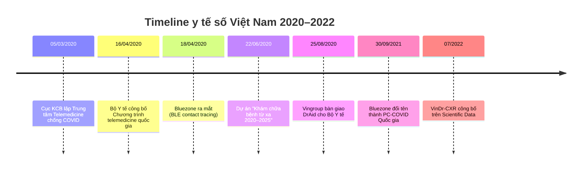
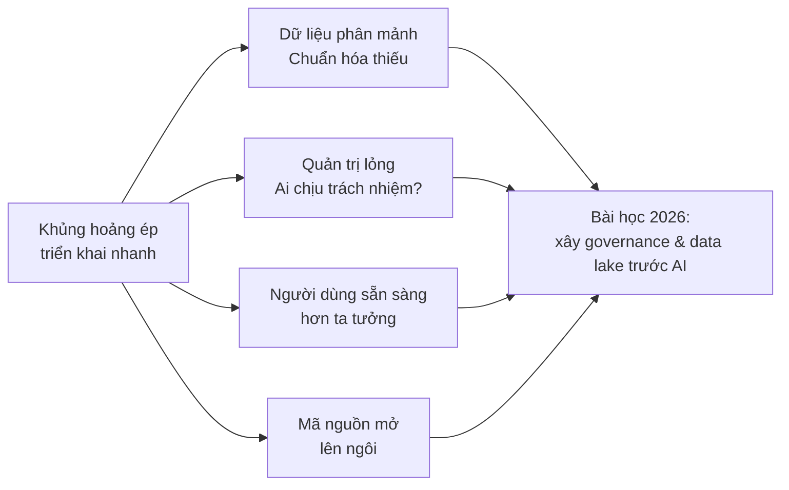

# Hậu COVID: cú huých số hóa y tế Việt Nam

> **Key takeaway** — COVID không tạo ra AI y tế Việt Nam từ con số không, nhưng đã ép ngành y phải triển khai AI ở quy mô hàng chục bệnh viện chỉ trong vài tháng. Bốn bài học then chốt về dữ liệu, quản trị, người dùng và mã nguồn mở từ 2020 vẫn là kim chỉ nam cho mọi dự án AI y tế hôm nay.

## 1. Bối cảnh 2020–2022 — khi khủng hoảng ép chuyển đổi số

Trước tháng 3/2020, chuyển đổi số y tế Việt Nam đi chậm: bệnh án điện tử triển khai lẻ tẻ, telemedicine chỉ có Thông tư 49/2017/TT-BYT khung mà không có cơ chế thanh toán ([Thư viện Pháp luật](https://thuvienphapluat.vn/van-ban/Cong-nghe-thong-tin/Thong-tu-49-2017-TT-BYT-quy-dinh-ve-hoat-dong-y-te-tu-xa-347138.aspx)). Đại dịch đã bẻ gãy quán tính đó chỉ trong ba tháng.

Nguồn: [Frontiers in Public Health](https://www.frontiersin.org/journals/public-health/articles/10.3389/fpubh.2021.672732/full) và [Wikipedia PC-COVID](https://vi.wikipedia.org/wiki/PC-COVID).

## 2. Ba sản phẩm AI biểu tượng của giai đoạn COVID

### 2.1. DrAid™ — AI đọc X-quang phổi của VinBrain

Bàn giao chính thức cho Bộ Y tế **25/08/2020** ([Frontiers](https://www.frontiersin.org/journals/public-health/articles/10.3389/fpubh.2021.672732/full)). Trong đợt bùng phát Delta 2021, **10 bệnh viện thu dung** (9 tại TP.HCM, 1 tại Kỳ Anh–Hà Tĩnh) dùng DrAid theo dõi diễn biến phổi bệnh nhân ([Forbes Việt Nam qua VinBrain](https://vinbrain.net/vi/forbes-viet-nam-tro-ly-ao-cua-bac-si)). Đến 2022–2023, DrAid mở rộng tới **63 bệnh viện toàn quốc** ([Sở Y tế Hà Tĩnh](http://soyte.hatinh.gov.vn/?page=Article.Print.detail&id=60755433309a17740e5da521)).

Thông số kỹ thuật công bố:
- Độ nhạy tới 95%, đặc hiệu 99%, F1 94% (khi sàng lọc COVID trên X-quang) ([Sở Y tế Hà Tĩnh](http://soyte.hatinh.gov.vn/?page=Article.Print.detail&id=60755433309a17740e5da521))
- Thời gian phân tích < 5 giây/ảnh ([Frontiers](https://www.frontiersin.org/journals/public-health/articles/10.3389/fpubh.2021.672732/full))
- Kiến trúc XPGAN (X-ray Projected GAN) sinh dữ liệu ảo bù thiếu dữ liệu COVID ([Frontiers](https://www.frontiersin.org/journals/public-health/articles/10.3389/fpubh.2021.672732/full))

### 2.2. VinDr-CXR — bộ dữ liệu mở của Việt Nam ra thế giới

Vingroup Big Data Institute công bố VinDr-CXR trên [Scientific Data (Nature)](https://pmc.ncbi.nlm.nih.gov/articles/PMC9300612/) vào tháng 7/2022. Bộ dữ liệu:

| Thông số | Giá trị |
|---|---:|
| Ảnh thu thập hồi cứu (2018–2020) | > 100.000 |
| Ảnh công bố mở | 18.000 |
| Ảnh training / test | 15.000 / 3.000 |
| Số bác sĩ X-quang gán nhãn | 17 |
| Nhãn cục bộ / toàn cục | 22 / 6 |
| Chuẩn gán nhãn | 3 BS độc lập (train), 5 BS đồng thuận (test) |

Nguồn dữ liệu: BV 108 và BV Đại học Y Hà Nội ([PMC](https://pmc.ncbi.nlm.nih.gov/articles/PMC9300612/)). Repo gốc mở tại [github.com/vinbigdata-medical/vindr-cxr](https://github.com/vinbigdata-medical/vindr-cxr), toàn văn dataset trên [PhysioNet](https://physionet.org/content/vindr-cxr/). Đây là **bộ dữ liệu ảnh X-quang có gán nhãn lớn nhất Đông Nam Á tại thời điểm công bố**.

### 2.3. Bluezone / PC-COVID — ứng dụng truy vết cấp quốc gia

Bluezone ra mắt **18/04/2020**, mở mã nguồn dưới GPL v3 chỉ 9 ngày sau ([Wikipedia](https://vi.wikipedia.org/wiki/PC-COVID)). Con số triển khai:

| Mốc | Số liệu |
|---|---:|
| 07/08/2020 | > 10 triệu lượt tải |
| 09/2021 | 45 triệu lượt tải |
| 09/2021 | 20 triệu người dùng hoạt động hàng tuần |
| 30/09/2021 | Sáp nhập thành PC-COVID Quốc gia |

Nguồn: [Wikipedia PC-COVID](https://vi.wikipedia.org/wiki/PC-COVID) và [Tuổi Trẻ](https://tuoitre.vn/can-50-trieu-luot-tai-bluezone-de-day-lui-dich-moi-chi-dat-hon-4-trieu-20200805165059287.htm).

Song song, **chatbot COVID của Cục CNTT Bộ Y tế** trên Zalo (14/02/2020) là AI đối thoại quy mô đại chúng đầu tiên trong y tế Việt Nam ([Tuổi Trẻ](https://tuoitre.vn/bo-y-te-tich-hop-tro-ly-ao-tra-cuu-ve-covid-19-tren-zalo-20200218161741759.htm)).

## 3. Bốn bài học còn giá trị đến 2026

**Bài học 1 — Dữ liệu phân mảnh là rào cản lớn nhất.** VinBrain cần "hơn 1,3 triệu ảnh X-quang" từ nhiều nguồn để huấn luyện DrAid vì dữ liệu Việt Nam rời rạc theo từng bệnh viện ([VinBrain/Forbes](https://vinbrain.net/vi/forbes-viet-nam-tro-ly-ao-cua-bac-si)). Sáu năm sau, tình trạng chưa dứt — đó là lý do phần III của cẩm nang này dành trọn cho hạ tầng dữ liệu.

**Bài học 2 — Quản trị lỏng khiến AI thành "black box" trong bệnh viện.** Bài đánh giá trên [Frontiers](https://www.frontiersin.org/journals/public-health/articles/10.3389/fpubh.2021.672732/full) chỉ rõ "thiếu quản trị mạnh mẽ trong phát triển digital health" là hạn chế lớn nhất. Bài học này dẫn đến Chương 3 về khung chính sách và Chương 14 về an toàn–tuân thủ.

**Bài học 3 — Người dùng sẵn sàng dùng công nghệ số hơn ta tưởng.** 20 triệu người dùng Bluezone/tuần trong dân số 100 triệu là bằng chứng: khi ứng dụng đủ đơn giản và có động lực rõ, người Việt tiếp nhận rất nhanh.

**Bài học 4 — Mã nguồn mở là chiến lược, không phải phần đính kèm.** Bluezone mở mã nguồn 9 ngày sau khi ra mắt; VinDr-CXR mở dữ liệu 2 năm sau — cả hai trở thành nền tảng cho hệ sinh thái nghiên cứu Việt Nam về sau. Chi tiết ở Chương 11.

## 4. Case đóng chương — DrAid trong đợt Delta TP.HCM 2021

Bối cảnh: tháng 7–9/2021, TP.HCM có > 1 triệu ca COVID, hệ thống X-quang tuyến quận huyện quá tải. VinBrain nhanh chóng triển khai DrAid tại 9 bệnh viện thu dung TP.HCM ([VinBrain/Forbes](https://vinbrain.net/vi/forbes-viet-nam-tro-ly-ao-cua-bac-si)) với quy trình:

1. Bác sĩ chụp X-quang tại giường
2. Ảnh gửi thẳng lên DrAid, trả kết quả trong 5 giây
3. Điểm nghi ngờ được khoanh vùng, đo kích thước tự động
4. Bác sĩ có thể chuyển ảnh + gợi ý AI cho chuyên gia hội chẩn từ xa

Kết quả (theo VinBrain): tăng tốc phân loại bệnh nhân, giảm tải cho bác sĩ X-quang, hỗ trợ tiên lượng những ca có tổn thương phổi nhẹ nhưng nguy cơ tiến triển nặng.

Điểm đáng học: **AI không thay thế bác sĩ, mà làm phân tầng nhanh trong khủng hoảng**. Đây là mô hình triển khai sẽ được nhắc lại xuyên suốt cẩm nang.

## 5. Lab 1 — Timeline AI y tế Việt Nam

**Mục tiêu học tập** (Miller: Knows): Nắm được dòng thời gian và tác nhân chính giai đoạn 2020–2022.

**Nhiệm vụ**:
1. Sắp xếp 20 sự kiện được cấp thành timeline theo mốc thời gian
2. Viết đoạn 200 chữ trả lời: "Bài học nào từ COVID còn giá trị nhất đến 2026?"
3. Trình bày trước nhóm 5 phút

**Rubric chấm điểm 1–5**:

| Điểm | Tiêu chí |
|:---:|---|
| 5 | Timeline chính xác 100%; bài viết dẫn ≥ 2 nguồn sơ cấp, phân tích liên hệ tới 2026 sắc bén |
| 4 | Timeline sai ≤ 1 sự kiện; bài viết có nguồn, phân tích rõ ràng |
| 3 | Timeline sai ≤ 3 sự kiện; bài viết đủ ý nhưng thiếu dẫn nguồn |
| 2 | Timeline nhiều sai sót; bài viết lạc đề hoặc quá ngắn |
| 1 | Không hoàn thành hoặc sao chép |

Chấm: tự động (timeline) + LLM-as-judge với rubric trên (bài viết).

## Tài liệu tham khảo

1. Nguyễn HQ và cs. **VinDr-CXR: An open dataset of chest X-rays with radiologist's annotations**. *Scientific Data* 9, 429 (2022). [PMC](https://pmc.ncbi.nlm.nih.gov/articles/PMC9300612/) · [PhysioNet](https://physionet.org/content/vindr-cxr/)
2. Nguyen HT và cs. **The Contribution of Digital Health in the Response to COVID-19 in Vietnam**. *Front Public Health* 9:672732 (2021). [Frontiers](https://www.frontiersin.org/journals/public-health/articles/10.3389/fpubh.2021.672732/full)
3. VinBrain — **Forbes Việt Nam: Trợ lý ảo của bác sĩ** (2022). [VinBrain](https://vinbrain.net/vi/forbes-viet-nam-tro-ly-ao-cua-bac-si)
4. Sở Y tế Hà Tĩnh — **Ứng dụng DrAid hỗ trợ phát hiện và cảnh báo COVID-19**. [soyte.hatinh.gov.vn](http://soyte.hatinh.gov.vn/?page=Article.Print.detail&id=60755433309a17740e5da521)
5. Bộ Y tế — **Thông tư 49/2017/TT-BYT về hoạt động y tế từ xa**. [Thư viện Pháp luật](https://thuvienphapluat.vn/van-ban/Cong-nghe-thong-tin/Thong-tu-49-2017-TT-BYT-quy-dinh-ve-hoat-dong-y-te-tu-xa-347138.aspx)
6. Wikipedia tiếng Việt — **PC-COVID**. [vi.wikipedia.org/wiki/PC-COVID](https://vi.wikipedia.org/wiki/PC-COVID)
7. VinBigData — **VinDr-CXR repository**. [GitHub](https://github.com/vinbigdata-medical/vindr-cxr)

---

## Ghi chú của biên tập

- Bản thảo tự động do bot soạn 09/09/2026, sẵn sàng cho nhóm chấp bút edit chi tiết.
- **Cần bổ sung**: ảnh minh họa giao diện DrAid, biểu đồ số ca COVID vs. số bệnh viện dùng DrAid theo tháng, phỏng vấn ngắn 1 bác sĩ đã dùng DrAid thời COVID.
- **Cần rà**: mọi con số → so lại với báo cáo chính thức của VinBrain/Vingroup nếu có; các mốc thời gian → chéo với công báo Bộ Y tế.
