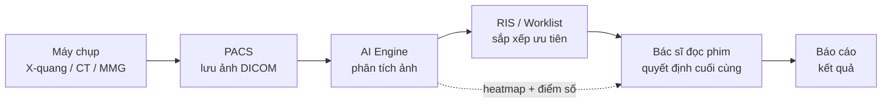
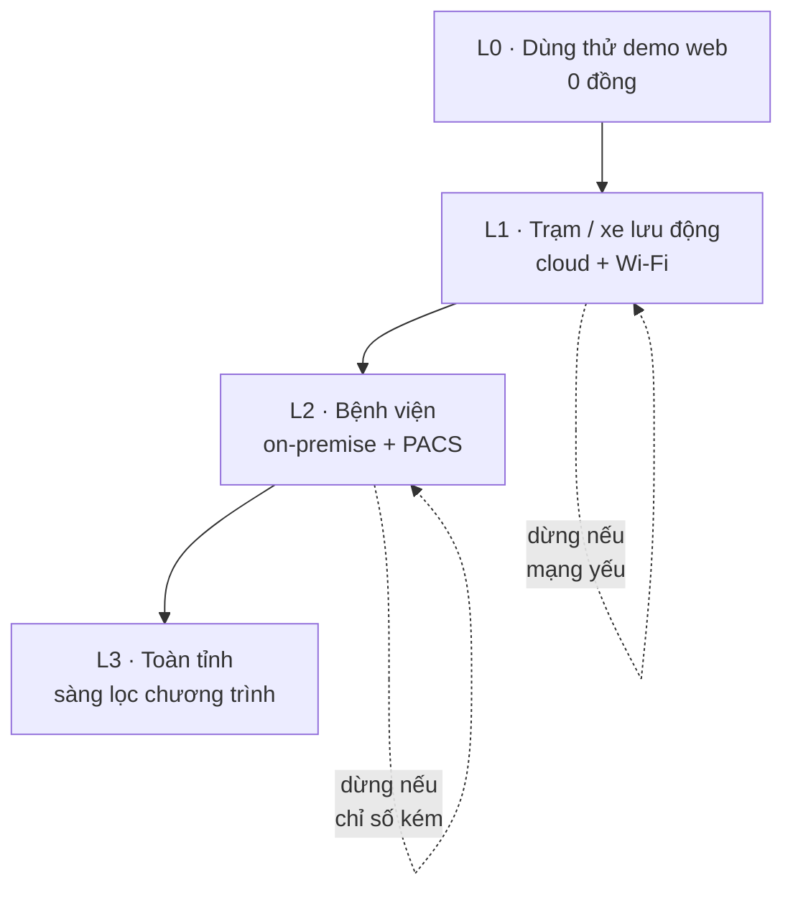

# Chương 5. AI trong chẩn đoán hình ảnh: qXR và Lunit tại Việt Nam

## Mở đầu: 200 phim X-quang và một buổi chiều thứ Sáu

> **Tình huống mô phỏng** — nhân vật và diễn biến dưới đây do tác giả dựng để minh họa, không phản ánh một bác sĩ hay bệnh viện cụ thể nào.

Bác sĩ Minh, khoa Chẩn đoán hình ảnh một bệnh viện tuyến tỉnh, nhìn danh sách chờ đọc phim lúc 4 giờ chiều thứ Sáu: 187 phim X-quang phổi chưa đọc, thêm 23 ca CT sọ não cấp cứu đang xếp hàng. Hai bác sĩ trong khoa, một người đi học, một người trực cấp cứu. Theo quy trình, mỗi phim X-quang phổi cần 3–5 phút đọc kỹ — nghĩa là riêng đống phim tồn đã cần hơn 12 giờ làm việc. Thực tế, anh đọc lướt mỗi phim trong 1–2 phút, đánh dấu những ca rõ ràng, và hy vọng mình không bỏ sót nốt mờ 8mm nào của bệnh nhân lao hay ung thư phổi giai đoạn sớm.

Đây không phải câu chuyện về bác sĩ yếu kém. Đây là bài toán **năng suất và độ bao phủ** của chẩn đoán hình ảnh ở Việt Nam: số lượng phim tăng nhanh hơn số bác sĩ đọc phim, tuyến xã/huyện gần như không có bác sĩ chẩn đoán hình ảnh, và những tổn thương nhỏ, sớm — đúng loại cần phát hiện nhất — lại là loại dễ bị bỏ sót nhất khi đọc vội.

Câu hỏi trung tâm của chương này: **AI đọc ảnh y khoa làm được gì hôm nay, tích hợp vào quy trình đọc phim ra sao, đánh giá nó bằng cách nào, và triển khai an toàn ở Việt Nam với những bước nào?** Đọc xong chương, bạn sẽ:

- Hiểu 5 nhóm ảnh AI đọc tốt nhất hiện nay và vì sao;
- Nắm kiến trúc tích hợp PACS + AI (từ máy chụp đến tay bác sĩ đọc);
- Đánh giá một sản phẩm AI đọc ảnh bằng 4 chỉ số lâm sàng đúng (không chỉ "độ chính xác");
- Biết case qXR (sàng lọc cộng đồng) và Lunit INSIGHT (bệnh viện) tại Việt Nam;
- Có lộ trình triển khai L0–L3 từ dùng thử đến sàng lọc toàn tỉnh, cùng các yêu cầu tuân thủ bắt buộc.

```metrics
[
  {"value":"5","label":"Nhóm ảnh AI đọc tốt nhất","hint":"X-quang · CT · MMG · đáy mắt · siêu âm"},
  {"value":"4","label":"Chỉ số đánh giá bắt buộc","hint":"Sensitivity · Specificity · PPV · NPV"},
  {"value":"2","label":"Mô hình tích hợp chuẩn","hint":"Cloud cho tuyến xã · On-premise cho bệnh viện"},
  {"value":"1","label":"Nguyên tắc vàng","hint":"AI gợi ý, bác sĩ quyết định"}
]
```

## 1. Bức tranh AI đọc ảnh y khoa 2026

### 1.1. Năm loại ảnh AI đọc tốt nhất — và vì sao là chúng

Không phải loại ảnh nào AI cũng đọc tốt như nhau. Năm nhóm dưới đây là nơi AI đã chứng minh giá trị trong thực hành, vì chúng có ba điểm chung: **chuẩn hóa cao** (cách chụp giống nhau ở mọi nơi), **dữ liệu lớn** (hàng trăm nghìn ảnh đã gán nhãn), và **bài toán rõ ràng** (phát hiện / phân loại / đo đạc).

**X-quang phổi** là "mặt trận" lớn nhất: số lượng phim khổng lồ, kỹ thuật chụp chuẩn toàn cầu, và danh sách bệnh cần tìm rất dài — lao, viêm phổi, tràn dịch, xẹp phổi, nốt phổi, ung thư. AI đọc X-quang phổi thường cho ra danh sách các bất thường kèm điểm số nghi ngờ và bản đồ nhiệt (heatmap) chỉ vùng ảnh khiến AI "chú ý". Đây cũng là loại ảnh phù hợp nhất cho sàng lọc cộng đồng, vì máy X-quang lưu động rẻ và triển khai được đến tận xã.

**CT sọ não cấp cứu** là nơi AI cứu thời gian theo đúng nghĩa đen: phát hiện xuất huyết nội sọ, nhồi máu não trong vài phút, tự động đẩy ca nguy kịch lên đầu danh sách đọc (worklist prioritization). Trong đột quỵ, mỗi phút chậm trễ là hàng triệu tế bào não mất đi — AI không thay bác sĩ đọc, nhưng nó bảo đảm ca nguy kịch không nằm chờ sau 50 ca thường.

**Mammography (X-quang vú)** phục vụ sàng lọc ung thư vú: bài toán tìm tổn thương rất nhỏ trên ảnh rất lớn, đọc đôi (double reading) tốn nhân lực. AI đóng vai trò "người đọc thứ hai" không biết mệt — đây là use-case mà Lunit INSIGHT đã chứng minh mạnh nhất (xem mục 3).

**Ảnh đáy mắt** phát hiện bệnh võng mạc đái tháo đường: chụp bằng máy ảnh đáy mắt không cần giãn đồng tử, AI phân loại mức độ bệnh. Mô hình triển khai điển hình là **sàng lọc tại trạm y tế xã** rồi chuyển tuyến những ca AI đánh dấu — đúng bài toán của Việt Nam với hàng triệu người đái tháo đường chưa từng soi đáy mắt.

**Siêu âm tim** là nhóm mới nhất: AI đo phân suất tống máu (EF), phát hiện rối loạn vận động vùng — những phép đo vốn phụ thuộc nhiều vào tay nghề người siêu âm. AI giúp chuẩn hóa kết quả giữa các cơ sở.

Điểm chung cần nhớ: AI đọc ảnh hôm nay giỏi nhất ở **phát hiện và sắp xếp ưu tiên**, chưa thay được bác sĩ ở **chẩn đoán tổng hợp** (kết hợp ảnh + lâm sàng + xét nghiệm). Vị trí đúng của nó trong quy trình là "trợ lý đọc phim", không phải "bác sĩ đọc phim".

### 1.2. Kiến trúc PACS + AI: ảnh đi từ máy chụp đến tay bác sĩ như thế nào

Để dùng AI đọc ảnh trong bệnh viện, bạn cần hiểu luồng dữ liệu chuẩn. Mọi hệ thống PACS (Picture Archiving and Communication System — hệ thống lưu trữ và truyền ảnh y khoa) hiện đại đều nói cùng một "ngôn ngữ": chuẩn DICOM cho ảnh và HL7/{t:fhir}FHIR{/t} cho thông tin bệnh nhân. AI đọc ảnh cắm vào luồng này như một "trạm xử lý" trung gian:



Luồng chi tiết:

1. **Máy chụp** tạo ảnh, gửi về PACS theo chuẩn DICOM (kèm thông tin bệnh nhân đã được hệ thống HIS/RIS gắn).
2. **AI Engine** tự động lấy ảnh mới từ PACS, chạy mô hình, trả về: danh sách bất thường phát hiện được, điểm số nghi ngờ từng loại, và heatmap phủ lên ảnh gốc.
3. **RIS/Worklist** nhận điểm ưu tiên từ AI: ca nghi ngờ cao (ví dụ nghi tràn khí màng phổi, xuất huyết não) được đẩy lên đầu danh sách đọc — bác sĩ không phải đọc theo thứ tự thời gian nữa.
4. **Bác sĩ đọc phim** mở ảnh kèm kết quả AI: xem heatmap, đồng ý hoặc bác bỏ từng phát hiện, viết báo cáo cuối cùng và ký. **Chữ ký và trách nhiệm luôn thuộc về bác sĩ.**

Hai mô hình triển khai chính:

- **Cloud (đám mây):** ảnh được gửi (mã hóa) lên máy chủ của nhà cung cấp AI để xử lý. Ưu điểm: triển khai nhanh, không cần máy chủ tại chỗ, phù hợp trạm y tế, xe X-quang lưu động, bệnh viện nhỏ. Nhược điểm: phụ thuộc đường truyền, câu hỏi về dữ liệu ra nước ngoài (xem mục 5).
- **On-premise (tại chỗ):** máy chủ AI đặt trong bệnh viện, ảnh không rời khỏi nội bộ. Ưu điểm: kiểm soát dữ liệu tuyệt đối, chạy được khi mất mạng. Nhược điểm: chi phí đầu tư ban đầu, cần đội IT vận hành.

Với điều kiện Việt Nam, công thức thực tế thường là **kết hợp**: cloud cho sàng lọc cộng đồng và tuyến xã, on-premise cho bệnh viện tuyến tỉnh/trung ương có PACS sẵn.


### 1.3. Đánh giá AI đọc ảnh: bốn chỉ số bạn bắt buộc phải biết

Sai lầm phổ biến nhất khi mua AI đọc ảnh là hỏi mỗi một câu: "độ chính xác bao nhiêu phần trăm?" — rồi tin vào con số 95–99% mà nhà cung cấp đưa ra. Trong y tế, **accuracy (độ chính xác tổng) là chỉ số dễ gây hiểu lầm nhất**, vì nó bị chi phối bởi tỷ lệ bệnh trong tập dữ liệu thử nghiệm. Bốn chỉ số dưới đây mới nói lên giá trị lâm sàng thật:

- **Sensitivity (độ nhạy):** trong 100 người thật sự có bệnh, AI phát hiện đúng bao nhiêu người? Chỉ số này quyết định AI có **bỏ sót** bệnh hay không. Với sàng lọc lao cộng đồng, sensitivity thấp nghĩa là người lao đi về nhà và tiếp tục lây — không chấp nhận được.
- **Specificity (độ đặc hiệu):** trong 100 người không bệnh, AI kết luận đúng "không bệnh" bao nhiêu người? Specificity thấp nghĩa là nhiều người khỏe bị gọi đi chụp thêm, xét nghiệm thêm — tốn kém và gây lo lắng.
- **PPV (giá trị dự báo dương tính):** khi AI báo "nghi ngờ", xác suất người đó thật sự bệnh là bao nhiêu? PPV phụ thuộc vào **tỷ lệ bệnh trong dân số sàng lọc**: cùng một AI, sàng lọc ở vùng lao cao cho PPV cao hơn hẳn sàng lọc ở vùng ít bệnh.
- **NPV (giá trị dự báo âm tính):** khi AI báo "bình thường", xác suất người đó thật sự khỏe là bao nhiêu? Với bài toán loại trừ (rule-out), NPV cao mới cho phép bạn yên tâm.

Và **AUC** (diện tích dưới đường cong ROC) là thước đo tổng hợp khả năng phân biệt bệnh/khỏe của mô hình trên mọi ngưỡng — dùng để so sánh các mô hình với nhau, nhưng không thay thế bốn chỉ số trên khi quyết định triển khai.

```callout kind=tip title="Cách đọc báo cáo đánh giá của nhà cung cấp"
Luôn hỏi 4 câu: (1) Tập dữ liệu thử nghiệm bao nhiêu ảnh, từ mấy bệnh viện, có bệnh viện Việt Nam không? (2) Sensitivity/specificity ở ngưỡng nào — ngưỡng này có điều chỉnh được không? (3) Tỷ lệ bệnh trong tập thử nghiệm là bao nhiêu (quyết định PPV/NPV thực tế)? (4) Có đánh giá độc lập (bên thứ ba) hay chỉ số liệu của hãng? Nếu nhà cung cấp chỉ đưa "accuracy 98%" mà không trả lời được 4 câu này, hãy coi như chưa có bằng chứng.
```

🎬 **Video minh họa:** [Thử nghiệm ngẫu nhiên có đối chứng (RCT) đầu tiên về AI hỗ trợ đọc mammography — thử nghiệm MASAI: AI phân loại ca nguy cơ cao để đọc đôi, giảm 44% khối lượng đọc của bác sĩ X-quang mà không tăng báo động giả (7/2026)](https://www.youtube.com/watch?v=ZX4XEYQUyhs).

```timeline
[
  {"year":"2017","event":"CheXNet (Stanford): deep learning phát hiện viêm phổi trên X-quang ngực","kind":"milestone"},
  {"year":"2018","event":"FDA phê duyệt IDx-DR: AI tự động chẩn đoán bệnh võng mạc đái tháo đường","kind":"milestone"},
  {"year":"2020","event":"Bùng nổ AI đọc ảnh COVID trên X-quang/CT toàn cầu","kind":"event"},
  {"year":"2022","event":"VinDr-CXR (Việt Nam) công bố trên Scientific Data — dataset mở 18.000 ảnh","kind":"milestone"},
  {"year":"2024","event":"Hàng trăm sản phẩm AI đọc ảnh được FDA/CE phê duyệt; WHO ra hướng dẫn LMM","kind":"event"},
  {"year":"2026","event":"Luật AI Việt Nam hiệu lực: AI chẩn đoán hình ảnh thuộc nhóm rủi ro cao","kind":"policy"}
]
```

### 1.4. Khung pháp lý: vì sao AI đọc ảnh là "rủi ro cao"

{t:luatai}Luật Trí tuệ nhân tạo số 134/2025/QH15{/t} (hiệu lực từ 01/03/2026) xếp các hệ thống AI **trực tiếp ảnh hưởng đến sức khỏe, tính mạng con người** — trong đó có AI hỗ trợ chẩn đoán hình ảnh — vào nhóm **rủi ro cao**. Hệ quả thực tế cho đơn vị triển khai:

- Sản phẩm phải **đăng ký lưu hành thiết bị y tế** (thường loại C hoặc D — xem mục 5) trước khi dùng cho người bệnh thật;
- Đơn vị phải có **hồ sơ quản trị rủi ro**: đánh giá lâm sàng, quy trình giám sát sau triển khai, kế hoạch xử lý khi AI sai;
- **Con người quyết định cuối cùng**: AI chỉ được phép "hỗ trợ", báo cáo chẩn đoán phải có chữ ký bác sĩ.

Nói cách khác: mua phần mềm AI đọc ảnh về cài là chưa đủ điều kiện dùng — phải đi qua cửa đăng ký thiết bị y tế và cửa quản trị rủi ro. Chi tiết ở mục 5.

## 2. Case chính: qXR của Qure.ai trong sàng lọc cộng đồng

Qure.ai là công ty AI y tế (Ấn Độ) với sản phẩm chủ lực **qXR** — AI đọc X-quang phổi phát hiện lao, viêm phổi, tràn dịch màng phổi, xẹp phổi, nốt phổi và một số bất thường khác. Điểm đặc biệt của qXR trong bối cảnh Việt Nam không nằm ở thuật toán, mà ở **mô hình triển khai**: nó được thiết kế cho sàng lọc cộng đồng quy mô lớn — xe X-quang lưu động đến tận xã, chụp hàng trăm người mỗi ngày, AI đọc ngay tại chỗ và chỉ những ca nghi ngờ mới được chuyển lên tuyến trên.

<!-- CẦN TÁC GIẢ XÁC MINH: toàn bộ chi tiết pilot qXR tại Việt Nam dưới đây (địa bàn, số lượng ca, chỉ số sensitivity/specificity, thời gian, đối tác triển khai) -->

Case triển khai tại Việt Nam (theo ghi nhận của tác giả): qXR được dùng trong chương trình sàng lọc lao cộng đồng, tích hợp với xe chụp X-quang lưu động. Quy trình vận hành gồm 4 bước: (1) người dân đến điểm chụp lưu động, được chụp X-quang phổi kỹ thuật số; (2) ảnh được gửi qua 4G/Wi-Fi lên cloud qXR (hoặc xử lý trên máy chủ đặt tại xe nếu mất mạng); (3) trong khoảng 1 phút, AI trả về điểm số nghi ngờ lao và heatmap; (4) kỹ thuật viên/kíp sàng lọc dựa vào điểm số để quyết định: cho về (điểm thấp), hoặc lấy đờm xét nghiệm GeneXpert và chuyển tuyến (điểm cao).

Bài học quan trọng nhất từ case này không phải "AI chính xác bao nhiêu", mà là **thiết kế ngưỡng (threshold) theo mục tiêu chương trình**: với sàng lọc lao cộng đồng, ngưỡng được đặt thấp để sensitivity cao — chấp nhận một số ca "dương tính giả" phải xét nghiệm thêm, đổi lại không bỏ sót ca lao. Đây chính là vận dụng trực tiếp bốn chỉ số ở mục 1.3: người làm chương trình phải hiểu mình đang đánh đổi specificity lấy sensitivity, và tính được chi phí xét nghiệm khẳng định cho số ca dương tính giả đó.

Bài học thứ hai là **tích hợp vào chương trình sẵn có, không xây chương trình mới quanh AI**: qXR thành công khi cắm vào quy trình sàng lọc lao quốc gia đã có (đội lưu động, GeneXpert, hệ thống báo cáo), chứ không phải khi đứng một mình như một "dự án AI". Đơn vị y tế nào muốn nhân rộng mô hình này nên bắt đầu từ câu hỏi: chương trình sàng lọc nào của chúng ta đang tắc ở khâu đọc phim — rồi mới hỏi AI nào giải được.

Bài học thứ ba liên quan đến **dữ liệu và hiệu chuẩn địa phương**: mô hình huấn luyện trên dữ liệu Ấn Độ khi mang sang Việt Nam cần được kiểm định lại trên ảnh của chính người Việt (thể trạng, tỷ lệ lao, chất lượng máy chụp khác nhau). Quy trình chuẩn là chạy thử (pilot) có đối chiếu với bác sĩ đọc phim trong nước trước khi mở rộng — tuyệt đối không áp dụng "nguyên xi" kết quả đánh giá của hãng.


## 3. Case song song: Lunit INSIGHT — từ phòng đọc phim bệnh viện

Nếu qXR đại diện cho AI "đi ra cộng đồng", thì **Lunit INSIGHT** (công ty Lunit, Hàn Quốc) đại diện cho AI "ngồi trong bệnh viện": tích hợp sâu vào PACS, phục vụ bác sĩ chẩn đoán hình ảnh trong quy trình đọc phim hằng ngày. Hai sản phẩm chính là **INSIGHT CXR** (X-quang ngực) và **INSIGHT MMG** (mammography) — cả hai đều đã được FDA (Mỹ) và CE (châu Âu) phê duyệt, tức đã vượt qua cửa đánh giá độc lập khắt khe.

<!-- CẦN TÁC GIẢ XÁC MINH: chi tiết tích hợp Lunit tại bệnh viện Việt Nam dưới đây (tên bệnh viện, hình thức triển khai cloud/on-premise, quy mô, kết quả) -->

Điểm mạnh nhất của Lunit INSIGHT, theo ghi nhận triển khai, nằm ở **mammography**: phát hiện tổn thương vú sớm với độ nhạy cao, đóng vai trò "người đọc thứ hai" trong sàng lọc ung thư vú — bài toán mà Việt Nam đang thiếu nhân lực đọc phim chuyên sâu. Với X-quang ngực, INSIGHT CXR phát hiện khoảng 10 nhóm bất thường (nốt phổi, tràn dịch, xẹp phổi, xơ hóa...) kèm điểm số và heatmap, tích hợp trực tiếp vào worklist của bác sĩ: ca nguy kịch tự động nhảy lên đầu.

Case tích hợp tại bệnh viện Việt Nam (theo ghi nhận của tác giả): Lunit được triển khai theo mô hình on-premise, cắm vào PACS sẵn có của bệnh viện qua chuẩn DICOM — bác sĩ không phải học phần mềm mới, kết quả AI hiện ngay trong giao diện đọc phim quen thuộc. Đây là chi tiết quyết định sự sống còn của mọi dự án AI bệnh viện: **AI phải đến chỗ bác sĩ đang làm việc, không bắt bác sĩ đến chỗ AI**. Mọi triển khai yêu cầu đổi giao diện, đổi quy trình, đăng nhập thêm một hệ thống nữa đều có nguy cơ bị bỏ xó sau 3 tháng.

So sánh đáng chú ý: **VinDr-CXR** (bộ dữ liệu mở của Việt Nam, xem chương 1) đi theo hướng ngược lại — mở dữ liệu và mô hình để cộng đồng nghiên cứu cùng phát triển, thay vì sản phẩm thương mại đóng gói. Hai hướng bổ sung cho nhau: Lunit/qXR cho đơn vị cần dùng ngay với hỗ trợ kỹ thuật của hãng; hướng mở (VinDr-CXR và các mô hình phát triển tiếp từ nó) cho đơn vị có năng lực kỹ thuật muốn tự chủ, tùy biến theo dữ liệu của chính mình (xem chương 13 về hạ tầng tính toán).

🎬 **Video minh họa:** [Brandon Suh (CEO Lunit) về Lunit INSIGHT đọc X-quang ngực/mammography và tầm nhìn "AI là người đọc thứ hai hỗ trợ bác sĩ" — phỏng vấn Scott Amyx, 10/2020](https://www.youtube.com/watch?v=gg7QTjkVVZw) (lưu ý video từ 2020, nội dung mang tính thời điểm).

🎬 **Xem thêm:** [TS. Connie Lehman (Mass General Brigham/Harvard) về AI trích xuất thông tin dự báo nguy cơ ung thư vú từ ảnh mammogram — Axios Boston, 9/2026](https://www.youtube.com/watch?v=BIe9MF1cXfg).
```callout kind=warning title="Không so sánh 'accuracy' giữa các hãng"
Mỗi hãng đánh giá trên tập dữ liệu khác nhau, ngưỡng khác nhau, định nghĩa "bất thường" khác nhau. Con số 97% của hãng A và 96% của hãng B không so sánh được với nhau. Cách so sánh đúng duy nhất: chạy thử cả hai trên cùng một tập ảnh của chính đơn vị bạn, với cùng bác sĩ đối chiếu — gọi là đánh giá "head-to-head" nội bộ.
```

## 4. Hướng dẫn triển khai theo tầng: từ dùng thử đến toàn tỉnh

Đừng bắt đầu bằng hợp đồng tiền tỷ. Lộ trình 4 tầng dưới đây cho phép đơn vị đi từ "xem thử" đến "sàng lọc toàn tỉnh" mà mỗi bước đều có điểm dừng để đánh giá.

**L0 — Dùng thử cá nhân (0 đồng, 1 buổi chiều).** Bác sĩ mở bản demo web của nhà cung cấp (hầu hết các hãng AI đọc ảnh đều có demo công khai), tải lên vài ảnh X-quang **đã khử định danh** của khoa mình, xem AI phát hiện gì, đối chiếu với kết quả đọc của chính mình. Mục tiêu duy nhất: trả lời câu hỏi "công nghệ này có hiểu ảnh của mình không?" — không cần mua gì, không cần IT hỗ trợ.

**L1 — Trạm y tế / xe lưu động (cloud + Wi-Fi).** Triển khai cho sàng lọc cộng đồng: máy X-quang kỹ thuật số (hoặc xe lưu động) + đường truyền 4G/Wi-Fi + tài khoản cloud của nhà cung cấp. Ảnh được gửi lên cloud xử lý, kết quả về trong 1–2 phút. Điểm kiểm tra ở tầng này: (1) đường truyền tại điểm chụp có ổn định không — hãy đo thực tế, đừng tin bản đồ phủ sóng; (2) quy trình khi mất mạng là gì (lưu ảnh, xử lý sau, hay dừng chụp?); (3) ai chịu trách nhiệm với ca AI bỏ sót — phải có văn bản phân công trước khi chụp ca đầu tiên.

**L2 — Bệnh viện tích hợp PACS (on-premise).** Đặt máy chủ AI trong bệnh viện, kết nối DICOM hai chiều với PACS sẵn có: ảnh tự động chảy sang AI, kết quả tự động về worklist. Tầng này cần đội IT của bệnh viện (hoặc nhà thầu) và thời gian tích hợp thực tế từ 1–3 tháng. Điểm kiểm tra: (1) chạy thử song song 1 tháng — AI chạy "ngầm", bác sĩ đọc như bình thường, cuối tháng đối chiếu AI vs bác sĩ để đo sensitivity/specificity **trên dữ liệu của chính bệnh viện**; (2) đào tạo bác sĩ cách đọc heatmap và khi nào nên tin/không tin AI; (3) hợp đồng SLA (thời gian uptime, xử lý sự cố) với nhà cung cấp.

**L3 — Sở Y tế triển khai toàn tỉnh.** Sàng lọc lao/ung thư phổi quy mô tỉnh: nhiều điểm chụp, một trung tâm đọc tập trung, AI làm "bộ lọc đầu vào". Tầng này là bài toán **quản trị chương trình** nhiều hơn là bài toán công nghệ: chuẩn hóa kỹ thuật chụp giữa các điểm, hệ thống chuyển tuyến cho ca dương tính, theo dõi chỉ số (số ca phát hiện/tháng, tỷ lệ chuyển tuyến thành công), và đánh giá định kỳ 6 tháng/lần. Không có tỉnh nào nên nhảy thẳng lên L3 mà chưa qua L1.



> Nguyên tắc xuyên suốt: **mỗi tầng đều có cửa thoát** — nếu chỉ số không đạt hoặc quy trình chưa sẵn sàng, dừng lại ở tầng hiện tại thay vì cố leo tiếp.

## 5. Rủi ro và tuân thủ: bốn việc bắt buộc trước khi dùng cho người bệnh thật

### 5.1. Đăng ký lưu hành thiết bị y tế (loại C/D)

AI đọc ảnh chẩn đoán là **phần mềm thiết bị y tế** (SaMD — Software as a Medical Device), tại Việt Nam thường xếp loại C hoặc D (mức rủi ro trung bình-cao đến cao) tùy phạm vi chỉ định. Nghĩa là: **không được dùng cho người bệnh thật khi chưa có số đăng ký lưu hành**. Quy trình đăng ký yêu cầu hồ sơ kỹ thuật, bằng chứng đánh giá lâm sàng và nhãn hướng dẫn sử dụng tiếng Việt. Hãy yêu cầu nhà cung cấp xuất trình số đăng ký còn hiệu lực **trước khi ký hợp đồng** — đây là câu hỏi đầu tiên, không phải câu hỏi cuối cùng.

### 5.2. Hồ sơ tuân thủ Luật AI 134/2025 cho nhóm rủi ro cao

Vì AI chẩn đoán hình ảnh thuộc nhóm rủi ro cao theo {t:luatai}Luật AI 134/2025/QH15{/t}, đơn vị triển khai cần chuẩn bị:

- **Đánh giá tác động**: mô tả rõ AI làm gì, không làm gì, và rủi ro khi nó sai (đặc biệt false negative — bỏ sót bệnh);
- **Quy trình con người quyết định cuối**: văn bản quy định bác sĩ đọc và ký mọi báo cáo có AI hỗ trợ; AI không được tự động ban hành kết luận chẩn đoán;
- **Nhật ký và giám sát**: lưu lại kết quả AI cho từng ca (phục vụ truy vết khi có sự cố), theo dõi chỉ số định kỳ;
- **Ghi nhãn minh bạch**: người bệnh và nhân viên y tế được biết AI tham gia vào quy trình đọc phim.

### 5.3. Đánh giá lâm sàng trên dữ liệu của chính đơn vị trước khi mở rộng

Số liệu của hãng là điểm khởi đầu, không phải bằng chứng cuối cùng. Quy trình chuẩn gồm 2 bước: (1) **đánh giá hồi cứu** — chạy AI trên 500–1.000 ảnh cũ đã có kết luận của bác sĩ, đo sensitivity/specificity; (2) **thử nghiệm tiến cứu có giám sát** — AI chạy song song với quy trình thường trong 1–3 tháng, mọi bất đồng giữa AI và bác sĩ được hội chẩn lại. Chỉ mở rộng khi cả hai bước đều đạt ngưỡng mà hội đồng chuyên môn của đơn vị đã thống nhất **trước khi** bắt đầu (tránh tình trạng "đạt bao nhiêu cũng khen").

### 5.4. Xử lý false negative bằng quy trình second read

Rủi ro nguy hiểm nhất của AI đọc ảnh không phải báo nhầm (false positive — tốn thêm xét nghiệm), mà là **bỏ sót** (false negative — người bệnh về nhà với khối u không được phát hiện). Biện pháp phòng vệ là quy trình **second read** (đọc lại lần hai):

```callout kind=danger title="Quy tắc second read bắt buộc"
1. Mọi ca AI kết luận "bình thường" trong chương trình sàng lọc phải được bác sĩ đọc lại (hoặc đọc mẫu ngẫu nhiên tối thiểu 10% nếu khối lượng quá lớn) — AI không được là người duy nhất "cho về".
2. Mọi ca AI và bác sĩ bất đồng phải được hội chẩn (bác sĩ thứ hai hoặc hội đồng).
3. Định kỳ hàng quý: rà soát các ca AI bỏ sót đã phát hiện ra sau (qua tái khám, xét nghiệm khác) để hiệu chuẩn lại ngưỡng và quy trình.
4. Khi AI sai gây hậu quả: dừng sử dụng cho nhóm ca tương tự, báo cáo sự cố theo quy định thiết bị y tế, và chỉ mở lại sau khi hội đồng chuyên môn đánh giá.
```


## 6. Lab 5 — Đọc X-quang phổi cùng AI

```chart
{"type":"bar","title":"Lab 5 — thời lượng ước tính theo mức nhiệm vụ","data":[{"name":"L0 · Dùng thử demo","phút":20},{"name":"L1 · Đọc 10 ca mẫu","phút":45},{"name":"L2 · Báo cáo 3 ca khó","phút":90},{"name":"L3 · Đánh giá mini","phút":120}],"keys":["phút"],"yLabel":"phút"}
```

<div class="lab-cta">
<a href="/lab/lab-05" target="_blank" rel="noopener noreferrer" class="lab-btn">
▶ Mở Lab 5 trong tab mới
</a>
<div class="lab-meta">20–120 phút tùy mức (L0–L3) · AI chấm rubric 5 tiêu chí · Lưu tiến độ vào sổ grading</div>
<span class="lab-cta-note">Tải 10 ảnh DICOM mẫu (bộ dữ liệu công khai VinDr-CXR), xem heatmap AI, đối chiếu với đáp án chuẩn và viết báo cáo 3 ca khó nhất.</span>
</div>

## 7. Nguồn và đọc thêm

**Văn bản pháp luật Việt Nam:**
- Quốc hội (2025), [*Luật Trí tuệ nhân tạo số 134/2025/QH15*](https://vanban.chinhphu.vn/?pageid=27160&docid=216334&classid=1&typegroupid=3) (thông qua ngày 10/12/2025, hiệu lực từ 01/03/2026) — AI chẩn đoán thuộc nhóm rủi ro cao.

**Tài liệu quốc tế:**
- WHO (2024), [*Ethics and governance of artificial intelligence for health: Guidance on large multi-modal models*](https://www.who.int/publications/i/item/9789240084759) — có phần về AI chẩn đoán hình ảnh.
- FDA (Mỹ), [*Artificial Intelligence and Machine Learning (AI/ML)-Enabled Medical Devices*](https://www.fda.gov/medical-devices/software-medical-device-samd/artificial-intelligence-and-machine-learning-aiml-enabled-medical-devices) — danh sách thiết bị AI/ML được phê duyệt và khung quản lý.

**Sản phẩm và dữ liệu mở:**
- [Qure.ai — qXR](https://www.qure.ai) — thông tin sản phẩm AI đọc X-quang phổi.
- [Lunit INSIGHT](https://www.lunit.io) — thông tin sản phẩm INSIGHT CXR và INSIGHT MMG.
- [VinDr-CXR trên GitHub](https://github.com/vinbigdata-medical/vindr-cxr) — bộ dữ liệu X-quang ngực mở của Việt Nam.

**Đọc thêm trong cẩm nang:** [chương 6 — AI hỗ trợ quyết định lâm sàng](/chapters/06-cdss) (AI đọc ảnh kết hợp với CDSS), [chương 14 — An toàn, tuân thủ](/chapters/14-an-toan-tuan-thu) (khung quản trị đầy đủ).

**Video minh họa trong chương:**
- "AI vs. Radiologists: Can Artificial Intelligence Improve Breast Cancer Screening? | The MASAI Trial" — phân tích RCT về AI đọc mammography (7/2026) ([YouTube](https://www.youtube.com/watch?v=ZX4XEYQUyhs)).
- TS. Connie Lehman, "How AI could shift breast cancer care toward prevention" — Axios Boston (9/2026) ([YouTube](https://www.youtube.com/watch?v=BIe9MF1cXfg)).
- Brandon Suh (CEO Lunit), "Innovating with Scott Amyx" — phỏng vấn về Lunit INSIGHT (10/2020) ([YouTube](https://www.youtube.com/watch?v=gg7QTjkVVZw)).

> Lưu ý: nội dung video mang tính thời điểm; kiểm tra lại thông tin trước khi trích dẫn.

---

> **Trạng thái bản thảo:** đây là bản nháp do AI soạn theo "Quy chuẩn biên tập chương và Lab" ngày 04/10/2026, **chưa qua tác giả duyệt**. Không phát hành dưới tên chủ biên. Các case qXR, Lunit tại Việt Nam cần tác giả xác minh lại số liệu trước khi xuất bản.
