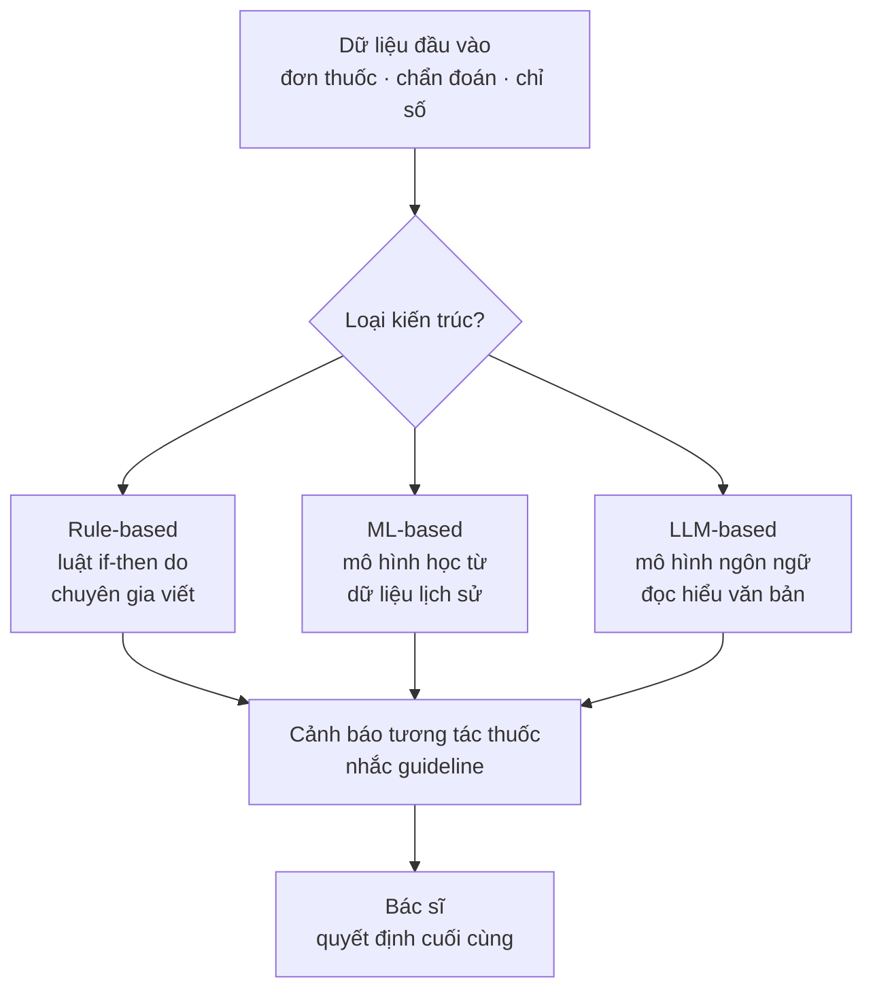
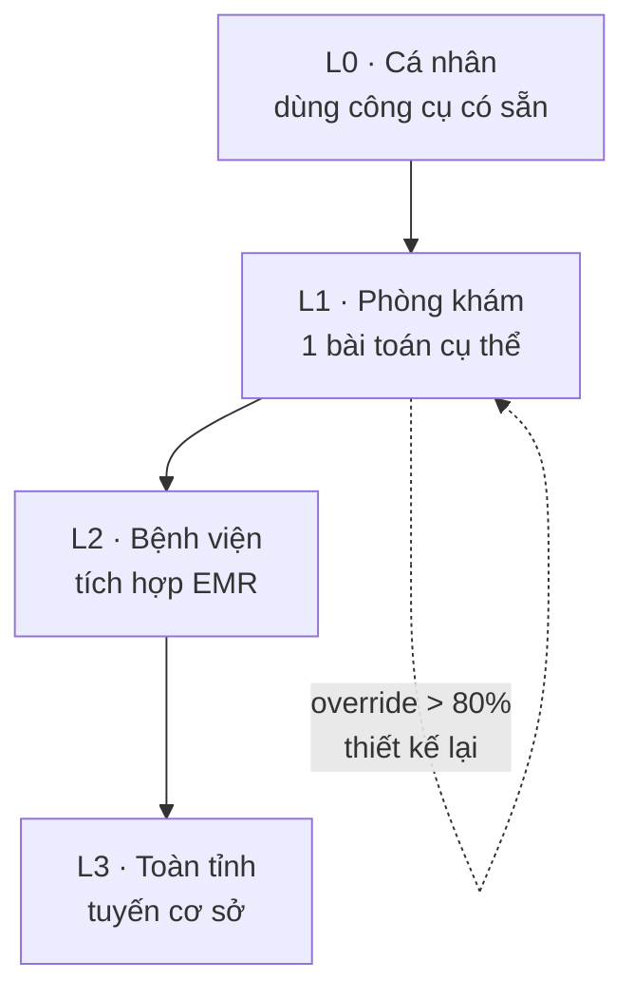

# Chương 6. AI hỗ trợ ra quyết định lâm sàng (CDSS): case Leira của AstraZeneca × AI4Life

## Mở đầu: đơn thuốc lúc nửa đêm

> **Tình huống mô phỏng** — nhân vật và diễn biến dưới đây do tác giả dựng để minh họa, không phản ánh một bác sĩ hay bệnh viện cụ thể nào.

2 giờ sáng, khoa Cấp cứu. Bác sĩ trực kê đơn cho bệnh nhân nam 68 tuổi đau ngực: aspirin, clopidogrel, thêm một kháng sinh vì nghi viêm phổi. Ba loại thuốc, mỗi loại đều đúng chỉ định riêng. Nhưng kết hợp lại, nguy cơ chảy máu tăng vọt — một tương tác mà trong ca trực căng thẳng, không ai kịp tra. Sáng hôm sau, bệnh nhân nôn ra máu. May mắn được xử trí kịp. Trong buổi giao ban, câu hỏi không ai trả lời được: tại sao hệ thống bệnh án điện tử không báo gì?

Câu chuyện này không hiếm. Nghiên cứu về an toàn người bệnh suốt hai thập kỷ qua chỉ ra một mẫu số chung: phần lớn sai sót y khoa không đến từ thiếu kiến thức, mà từ **quá tải thông tin trong lúc quyết định**. Bác sĩ biết tương tác thuốc đó — nhưng vào lúc 2 giờ sáng, với 40 bệnh nhân chờ, kiến thức không tự bật lên đúng lúc.

Đó chính là việc của **CDSS** (Clinical Decision Support System — hệ thống hỗ trợ quyết định lâm sàng): không phải AI thay bác sĩ ra quyết định, mà là **đưa đúng thông tin, đúng lúc, đúng chỗ** — một cảnh báo hiện lên ngay khi kê đơn, một gợi ý phác đồ khi chẩn đoán được nhập, một cờ đỏ khi các chỉ số gợi ý sepsis sớm. Câu hỏi trung tâm của chương này: **CDSS làm được gì hôm nay, các loại kiến trúc khác nhau ra sao, vì sao nhiều hệ thống cảnh báo bị bác sĩ tắt đi, và triển khai thế nào để nó thực sự cứu người thay vì gây phiền?** Đọc xong chương, bạn sẽ:

- Hiểu 4 việc CDSS làm tốt nhất hiện nay;
- Phân biệt 3 kiến trúc: rule-based, ML-based, LLM-based — và biết khi nào dùng loại nào;
- Hiểu bài toán alert fatigue (mệt mỏi cảnh báo) và cách thiết kế cảnh báo có ý nghĩa;
- Biết case Leira (AstraZeneca × AI4Life) và thử nghiệm FaCare tại Việt Nam;
- Nắm nguyên tắc human-in-the-loop và trách nhiệm pháp lý khi CDSS gợi ý sai.

```metrics
[
  {"value":"4","label":"Việc CDSS làm tốt nhất","hint":"thuốc · phác đồ · sepsis · tái nhập viện"},
  {"value":"3","label":"Kiến trúc chính","hint":"rule-based · ML · LLM"},
  {"value":"1","label":"Bài toán lớn nhất","hint":"alert fatigue"},
  {"value":"1","label":"Nguyên tắc bất di bất dịch","hint":"human-in-the-loop"}
]
```

## 1. CDSS làm được gì hôm nay

### 1.1. Bốn việc CDSS đã chứng minh giá trị

**Cảnh báo tương tác thuốc và dị ứng** là ứng dụng lâu đời và phổ biến nhất: khi bác sĩ kê đơn trong {t:emr}bệnh án điện tử{/t}, hệ thống kiểm tra tức thì đơn mới với thuốc bệnh nhân đang dùng, tiền sử dị ứng, chức năng thận/gan — và bật cảnh báo nếu phát hiện tương tác nguy hiểm, trùng lặp điều trị, hoặc liều vượt ngưỡng an toàn theo tuổi/cân nặng. Đây chính là "người gác cổng" cho ca trực nửa đêm ở phần mở đầu.

**Gợi ý phác đồ điều trị** dựa trên chẩn đoán đã nhập: với bệnh nhân tăng huyết áp mới chẩn đoán có đái tháo đường kèm theo, CDSS gợi ý nhóm thuốc ưu tiên theo guideline (ví dụ ức chế men chuyển), nhắc các xét nghiệm cần làm trước khi bắt đầu điều trị, và lịch tái khám. Giá trị lớn nhất nằm ở **chuẩn hóa**: mọi bác sĩ — từ chuyên khoa đến đa khoa tuyến huyện — đều được gợi ý cùng một phác đồ dựa trên cùng một guideline.

**Sàng lọc sepsis sớm** là nơi AI/ML tỏa sáng: hệ thống liên tục quét các chỉ số sinh tồn, xét nghiệm (lactate, bạch cầu...) và phát hiện mẫu hình suy giảm **trước khi** bác sĩ nhận ra bằng mắt thường — thường sớm hơn vài giờ. Với sepsis, mỗi giờ chậm kháng sinh làm tăng tử vong, nên cảnh báo sớm ở đây có ý nghĩa sinh tử.

**Dự báo tái nhập viện** giúp quản lý sau ra viện: mô hình đánh giá nguy cơ bệnh nhân quay lại trong 30 ngày, từ đó đội ngũ y tế ưu tiên gọi điện theo dõi, hẹn tái khám sớm, hoặc can thiệp dược lâm sàng cho nhóm nguy cơ cao. Đây là CDSS "dân số" — không can thiệp vào một quyết định cụ thể mà giúp phân bổ nguồn lực theo dõi.

### 1.2. Ba kiến trúc: rule-based, ML-based, LLM-based

Không phải mọi CDSS đều "AI" theo cùng một nghĩa. Ba kiến trúc dưới đây khác nhau căn bản về cách chúng "biết" điều cần gợi ý — và khác nhau về điểm mạnh, điểm yếu:



**Rule-based (dựa trên luật):** hệ thống chạy các quy tắc "nếu-thì" do chuyên gia viết từ guideline — ví dụ "NẾU kê warfarin VÀ bệnh nhân đang dùng aspirin THÌ cảnh báo nguy cơ chảy máu". Ưu điểm: **minh bạch tuyệt đối** — mọi cảnh báo đều truy được về đúng điều luật/guideline cụ thể, dễ kiểm định, dễ cập nhật khi guideline đổi. Nhược điểm: cứng nhắc, không học được từ dữ liệu, và số lượng luật phình to theo thời gian (một hệ thống lớn có thể chứa hàng chục nghìn luật).

**ML-based (học máy):** mô hình học từ dữ liệu lịch sử của bệnh viện — ví dụ học từ 100.000 ca nhập viện để dự báo ai có nguy cơ sepsis. Ưu điểm: phát hiện được mẫu hình phức tạp mà luật viết tay không bao quát hết, và tự cải thiện khi có thêm dữ liệu. Nhược điểm: **khó giải thích** ("vì sao mô hình cho điểm nguy cơ 0.87?"), phụ thuộc chất lượng dữ liệu huấn luyện, và có thể mang theo thiên lệch (bias) của dữ liệu cũ.

**LLM-based (mô hình ngôn ngữ lớn):** {t:llm}LLM{/t} đọc hiểu ghi chú lâm sàng dạng văn bản tự do, tóm tắt bệnh án, hoặc trả lời câu hỏi của bác sĩ bằng ngôn ngữ tự nhiên ("bệnh nhân này có chống chỉ định gì với thuốc X?"). Ưu điểm: giao tiếp tự nhiên, xử lý được văn bản không cấu trúc (chiếm phần lớn bệnh án). Nhược điểm: nguy cơ {t:hallucination}thông tin bịa đặt{/t} — LLM có thể viện dẫn guideline không tồn tại với vẻ rất tự tin, nên **mọi đầu ra LLM trong CDSS bắt buộc phải có cơ chế kiểm chứng** (xem chương 4).

Thực tế triển khai tốt nhất hiện nay là **kết hợp**: rule-based cho những gì chắc chắn và cần minh bạch (tương tác thuốc, chống chỉ định), ML cho dự báo nguy cơ, LLM cho tóm tắt và tra cứu — mỗi thứ đúng chỗ mạnh của nó.

**Ví dụ minh họa — một quyết định kê đơn đi qua 3 lớp:** bác sĩ kê amlodipine 10mg cho bệnh nhân tăng huyết áp 72 tuổi có suy thận nhẹ. Lớp rule-based kiểm tra tức thì: liều có vượt ngưỡng theo tuổi và chức năng thận không, có tương tác với thuốc bệnh nhân đang dùng không — tất cả đều qua, không cảnh báo. Lớp ML quét hồ sơ: điểm nguy cơ tái nhập viện 30 ngày ở mức trung bình-cao do tiền sử nhập viện 2 lần/năm — hệ thống gắn một gợi ý nhẹ (không ngắt quãng): "cân nhắc hẹn tái khám sau 2 tuần thay vì 1 tháng". Lớp LLM tóm tắt toàn bộ vào một dòng trong bệnh án: "BN 72T, THA + suy thận nhẹ, khởi trị amlodipine 10mg, nguy cơ tái nhập viện trung bình-cao, hẹn 2 tuần". Bác sĩ đọc lướt, đồng ý, ký đơn. Toàn bộ quá trình mất thêm khoảng 10 giây — đó là chuẩn vàng của CDSS tốt: **hữu ích mà không làm chậm bác sĩ**.

🎬 **Video minh họa:** [GS. Christoph Correll về CDSS gắn trong bệnh án điện tử: tổng hợp tiền sử và diễn biến để gợi ý chẩn đoán/phác đồ theo thời gian thực, với nguyên tắc "AI không ra quyết định thay bác sĩ" — Psychiatric Times, 10/2026](https://www.youtube.com/watch?v=ESm0NDuz8oI).

### 1.3. Bài toán alert fatigue: vì sao bác sĩ tắt cảnh báo

Đây là thất bại phổ biến và đắt giá nhất của CDSS: hệ thống cảnh báo quá nhiều, quá vô duyên, đến mức bác sĩ **bấm "bỏ qua" theo phản xạ** — kể cả với cảnh báo thật sự nguy hiểm. Nghiên cứu quốc tế ghi nhận tỷ lệ bỏ qua (override) cảnh báo tương tác thuốc lên tới 90%+ ở nhiều bệnh viện. Khi đó, CDSS không những vô dụng mà còn nguy hiểm: nó tạo **ảo giác an toàn** ("có hệ thống cảnh báo rồi") trong khi thực tế không ai đọc cảnh báo nữa.

```callout kind=warning title="Năm nguyên nhân gây alert fatigue"
1. **Cảnh báo quá nhạy:** báo cả những tương tác nhẹ, hiếm gặp, không có ý nghĩa lâm sàng — bác sĩ học được rằng "cảnh báo = không sao".
2. **Thiếu ngữ cảnh:** cảnh báo hiện lên mà không nói rõ mức độ nghiêm trọng, bằng chứng, và hành động cụ thể nên làm.
3. **Sai thời điểm:** hiện cảnh báo khi bác sĩ đã quyết định xong (ví dụ lúc ký đơn thay vì lúc chọn thuốc) — chỉ còn là thủ tục bấm cho qua.
4. **Không phân tầng:** cảnh báo nguy hiểm chết người và nhắc nhở hành chính trông giống hệt nhau.
5. **Không có vòng phản hồi:** bác sĩ bỏ qua cảnh báo mà hệ thống không học được gì — lần sau vẫn báo y hệt.
```

Thiết kế cảnh báo có ý nghĩa tuân theo 5 nguyên tắc ngược lại: **phân tầng nghiêm trọng** (chỉ ngắt quãng bác sĩ với nguy cơ cao; nguy cơ thấp hiển thị nhẹ), **đưa ra hành động cụ thể** (không chỉ "cảnh báo tương tác" mà là "đề xuất thay bằng thuốc Y, liều Z"), **đúng thời điểm** (khi đang chọn thuốc, chưa ký đơn), **giải thích được** (trích đúng guideline/điều khoản), và **học từ phản hồi** (theo dõi tỷ lệ bỏ qua để tinh chỉnh).

🎬 **Video minh họa:** [TS. Siru Liu (NIH) về dùng AI giải thích được (XAI) để tối ưu tiêu chí cảnh báo CDSS, giảm alert fatigue — kênh Thư viện Y khoa Quốc gia Hoa Kỳ](https://www.youtube.com/watch?v=grRwLsGCj6g).

```timeline
[
  {"year":"1970s","event":"MYCIN (Stanford): hệ chuyên gia rule-based chẩn đoán nhiễm trùng","kind":"milestone"},
  {"year":"1999","event":"Báo cáo 'To Err Is Human': an toàn người bệnh thành ưu tiên toàn cầu","kind":"event"},
  {"year":"2009","event":"HITECH Act (Mỹ): bệnh án điện tử + CDSS phổ cập theo chính sách","kind":"milestone"},
  {"year":"2016","event":"Deep learning dự báo từ dữ liệu bệnh án (EHR) quy mô lớn","kind":"event"},
  {"year":"2023","event":"LLM bước vào CDSS: tóm tắt bệnh án, tra cứu bằng ngôn ngữ tự nhiên","kind":"event"},
  {"year":"2026","event":"Việt Nam: CDSS bệnh không lây thí điểm tuyến cơ sở (Leira, FaCare)","kind":"milestone"}
]
```

## 2. Case chính: Leira — CDSS bệnh không lây của AstraZeneca × AI4Life

Bệnh không lây (tăng huyết áp, đái tháo đường, tim mạch) là gánh nặng bệnh tật lớn nhất của Việt Nam hiện nay, và cũng là nơi CDSS có "đất" rộng nhất: phác đồ điều trị chuẩn hóa theo guideline, bệnh nhân cần theo dõi suốt đời, và tuyến cơ sở — nơi thiếu bác sĩ chuyên khoa nhất — lại là nơi quản lý phần lớn bệnh nhân.

<!-- CẦN TÁC GIẢ XÁC MINH: toàn bộ chi tiết về Leira dưới đây (chủ thể triển khai, phạm vi, kiến trúc kỹ thuật, hình thức tích hợp EMR, số cơ sở tham gia, kết quả đo lường) -->

**Leira** là hệ thống CDSS cho bệnh không lây được phát triển trong hợp tác giữa AstraZeneca và AI4Life, triển khai tại Việt Nam. Theo ghi nhận của tác giả, Leira tập trung vào ba nhóm bệnh: **tăng huyết áp, đái tháo đường và tim mạch** — đúng ba "sát thủ thầm lặng" chiếm tỷ trọng lớn nhất trong gánh nặng bệnh tật.

Về kiến trúc, Leira đi theo hướng **kết hợp rule-based làm lõi**: các quy tắc được xây dựng từ guideline điều trị (trong nước và quốc tế), bao phủ các quyết định thường gặp nhất ở tuyến cơ sở — khởi trị tăng huyết áp chọn nhóm thuốc nào theo bệnh kèm theo, khi nào cần phối hợp thuốc, ngưỡng nào phải chuyển tuyến, lịch theo dõi và xét nghiệm định kỳ cho bệnh nhân đái tháo đường. Lựa chọn rule-based làm lõi là có chủ ý: với bệnh không lây, guideline rõ ràng và ổn định, minh bạch quan trọng hơn "thông minh" — bác sĩ tuyến xã cần biết **vì sao** hệ thống gợi ý như vậy, và gợi ý đó dựa trên khuyến cáo nào.

Điểm then chốt của case Leira nằm ở **tích hợp EMR**: CDSS không đứng riêng như một ứng dụng độc lập mà được cắm vào luồng khám bệnh — khi bác sĩ nhập chẩn đoán và chỉ số (huyết áp, đường huyết, HbA1c...), gợi ý hiện lên ngay trong màn hình làm việc, không cần chuyển ứng dụng. Đây là bài học lặp lại từ chương 5: **AI phải đến chỗ bác sĩ đang làm việc**. Mọi CDSS yêu cầu bác sĩ mở thêm một phần mềm, nhập lại dữ liệu đã nhập ở bệnh án, đều có chung kết cục: bị bỏ quên sau vài tuần.

Bài học đa trung tâm từ Leira: khi triển khai ở nhiều cơ sở cùng lúc, khác biệt lớn nhất không nằm ở công nghệ mà ở **dữ liệu đầu vào** — mỗi bệnh viện/trạm ghi chẩn đoán, chỉ số theo một kiểu; có nơi đo huyết áp ghi vào trường tự do, có nơi ghi vào trường cấu trúc. CDSS chỉ gợi ý đúng khi "hiểu" được dữ liệu đầu vào, nên 30–40% công sức triển khai thực tế là **chuẩn hóa dữ liệu**, không phải cài đặt AI. Đơn vị nào chuẩn bị triển khai CDSS nên bắt đầu bằng kiểm tra: dữ liệu lâm sàng của mình có đủ sạch, đủ cấu trúc để máy đọc không — trước khi hỏi mua AI nào.

🎬 **Video minh họa:** [TS. Matthew Robinson (Johns Hopkins) về xây dựng CDSS kê đơn kháng sinh trong bệnh án điện tử thực tế: chuyển guideline thành chỉ dẫn cho máy, so sánh hỗ trợ quyết định dạng luật vs LLM — 6/2026](https://www.youtube.com/watch?v=Kxxlj3rlUIg).

## 3. Case song song: thử nghiệm FaCare CDSS tuyến cơ sở

Nếu Leira là CDSS "đa bệnh, đa trung tâm", thì **FaCare** đi theo hướng "sâu ở tuyến cơ sở": thử nghiệm hệ thống hỗ trợ quyết định cho quản lý **tăng huyết áp và đái tháo đường** ngay tại trạm y tế xã — nơi bác sĩ đa khoa một mình quản lý hàng trăm bệnh nhân mạn tính, không có chuyên khoa để hội chẩn.

<!-- CẦN TÁC GIẢ XÁC MINH: toàn bộ chi tiết về thử nghiệm FaCare dưới đây (thiết kế thử nghiệm, số xã tham gia, chỉ số đánh giá, kết quả, thời gian) -->

Theo ghi nhận của tác giả, thử nghiệm FaCare được thiết kế như một nghiên cứu can thiệp tại tuyến xã: nhóm xã dùng CDSS hỗ trợ bác sĩ trạm trong quản lý bệnh nhân tăng huyết áp/đái tháo đường, nhóm đối chứng duy trì quy trình thường quy. Điểm đáng chú ý trong thiết kế là **chỉ số đánh giá hướng vào kết quả người bệnh** (tỷ lệ huyết áp đạt mục tiêu, HbA1c kiểm soát) chứ không chỉ đo "bác sĩ có dùng hệ thống không" — vì một CDSS được dùng nhiều nhưng không cải thiện kết quả lâm sàng thì vẫn là thất bại.

Bài học lớn nhất từ hướng đi này: **CDSS tuyến xã phải đơn giản hơn, không phức tạp hơn**. Bác sĩ trạm không có thời gian đọc cảnh báo dài; gợi ý phải gọn trong 1–2 dòng, hành động rõ ràng ("tăng liều amlodipine lên 10mg, hẹn 2 tuần"), và hệ thống phải chịu được mạng chập chờn (chế độ offline hoặc đồng bộ sau). Đây cũng là lý do kiến trúc rule-based chiếm ưu thế ở tuyến cơ sở: nhẹ, chạy được trên thiết bị yếu, minh bạch, và dễ cập nhật khi Bộ Y tế ban hành hướng dẫn mới.

Hai case Leira và FaCare cùng chỉ ra một nguyên tắc: **CDSS thành công không phải CDSS "thông minh nhất", mà là CDSS khớp nhất với quy trình và năng lực của nơi nó được đặt vào**.

## 4. Hướng dẫn triển khai theo tầng L0–L3

**L0 — Cá nhân: dùng CDSS có sẵn trong công cụ hằng ngày (0 đồng).** Nhiều bác sĩ đã chạm vào CDSS mà không biết: các ứng dụng tra cứu thuốc (kiểm tra tương tác), guideline điện tử có thuật toán quyết định, chatbot y khoa có trích nguồn. Bài tập L0: với 5 đơn thuốc gần nhất của mình, nhập vào một công cụ kiểm tra tương tác và xem nó phát hiện gì mà bạn bỏ qua. Mục tiêu: cảm nhận trực tiếp giá trị và giới hạn của gợi ý máy — trước khi bàn chuyện hệ thống lớn.

**L1 — Phòng khám: CDSS độc lập cho một bài toán cụ thể.** Chọn MỘT bài toán đau nhất (ví dụ: tương tác thuốc ở phòng khám đa khoa, hoặc nhắc lịch tái khám đái tháo đường), triển khai một công cụ CDSS độc lập (không cần tích hợp sâu vào bệnh án). Điểm kiểm tra: đo tỷ lệ cảnh báo bị bỏ qua trong tháng đầu — nếu trên 80%, dừng lại và thiết kế lại cảnh báo (xem mục 1.3) thay vì mở rộng. Một CDSS nhỏ được dùng thật giá trị hơn CDSS lớn bị tắt.

**L2 — Bệnh viện: CDSS tích hợp EMR.** Cắm CDSS vào bệnh án điện tử qua chuẩn HL7/{t:fhir}FHIR{/t}: chẩn đoán, đơn thuốc, xét nghiệm chảy tự động sang CDSS; cảnh báo/gợi ý hiện trong màn hình bác sĩ đang làm việc. Tầng này cần IT bệnh viện, chuẩn hóa dữ liệu (bài học từ Leira), và **chạy song song có giám sát** 2–3 tháng: ghi lại mọi trường hợp bác sĩ bỏ qua cảnh báo để hội đồng chuyên môn rà soát — đây là dữ liệu vàng để tinh chỉnh hệ thống.

**L3 — Sở Y tế: CDSS tuyến cơ sở quy mô tỉnh.** Nhân rộng mô hình FaCare: triển khai CDSS quản lý bệnh không lây xuống trạm y tế xã toàn tỉnh, kèm đào tạo và đường dây hỗ trợ chuyên môn từ tuyến trên. Ở tầng này, thành công đo bằng **chỉ số dân số** (tỷ lệ huyết áp đạt mục tiêu toàn tỉnh) chứ không phải số trạm đã cài phần mềm.



## 5. Rủi ro và tuân thủ: ba việc bắt buộc

### 5.1. Trách nhiệm pháp lý khi CDSS gợi ý sai

Câu hỏi khó nhất của CDSS: **nếu bác sĩ làm theo gợi ý của hệ thống mà bệnh nhân gặp biến cố, ai chịu trách nhiệm?** Khung pháp lý hiện hành (kể cả {t:luatai}Luật AI 134/2025/QH15{/t} xếp CDSS vào nhóm rủi ro cao) cho câu trả lời rõ ràng: **bác sĩ là người quyết định cuối cùng và chịu trách nhiệm cuối cùng**. CDSS là công cụ hỗ trợ, không phải chủ thể ra quyết định.

Hệ quả thực tế cho đơn vị triển khai:

- Văn bản nội bộ phải quy định rõ: mọi gợi ý của CDSS đều cần bác sĩ xem xét và phê duyệt; **cấm** quy trình "hệ thống gợi ý gì làm nấy" không qua kiểm tra;
- Lưu nhật ký (log) đầy đủ: với mỗi quyết định, ghi lại CDSS đã gợi ý gì, bác sĩ chấp nhận hay bác bỏ, và lý do — đây là bằng chứng bảo vệ cả bác sĩ (khi làm đúng) và bệnh nhân (khi cần truy vết);
- Hợp đồng với nhà cung cấp CDSS phải có điều khoản về trách nhiệm khi thuật toán sai, phạm vi bảo hành, và nghĩa vụ cập nhật.

```callout kind=danger title="Human-in-the-loop tuyệt đối"
CDSS không bao giờ được tự động: kê đơn, thay đổi liều, hủy/chỉ định xét nghiệm, hay chuyển tuyến — mà không có bác sĩ phê duyệt từng trường hợp. Mọi nút "tự động áp dụng gợi ý" trong CDSS dùng cho quyết định lâm sàng đều phải bị vô hiệu hóa. Ngoại lệ duy nhất là các cảnh báo an toàn thuần túy (ví dụ chặn đơn thuốc quá liều gây chết người) — và ngay cả khi đó, bác sĩ vẫn có quyền ghi đè có lý do.
```

### 5.2. Cập nhật khi guideline thay đổi

CDSS rule-based chỉ đúng bằng guideline mà nó được viết từ. Khi Bộ Y tế ban hành hướng dẫn mới (ví dụ cập nhật phác đồ tăng huyết áp), mọi luật liên quan phải được rà soát và cập nhật — **CDSS chạy guideline cũ nguy hiểm hơn không có CDSS**, vì nó tạo sự tự tin sai lầm. Đơn vị triển khai cần:

- Hợp đồng bảo trì nêu rõ thời hạn cập nhật guideline của nhà cung cấp (ví dụ trong 90 ngày kể từ khi hướng dẫn mới ban hành);
- Một bác sĩ được phân công làm "chủ" nội dung CDSS: rà soát bản cập nhật của hãng trước khi áp dụng;
- Nhật ký phiên bản: biết được tại thời điểm X, CDSS đang chạy theo guideline nào.

### 5.3. Dữ liệu và phân biệt đối xử

CDSS ML học từ dữ liệu lịch sử — mà dữ liệu lịch sử có thể mang thiên lệch: nhóm bệnh nhân ít được khám, ít được xét nghiệm sẽ ít xuất hiện trong dữ liệu, khiến mô hình dự báo kém chính xác cho chính nhóm dễ tổn thương nhất. Khi đánh giá CDSS, luôn yêu cầu nhà cung cấp báo cáo hiệu năng **theo nhóm** (tuổi, giới, dân tộc, tuyến cơ sở) chứ không chỉ con số trung bình chung.

## 6. Lab 6 — Xây CDSS rule cho tăng huyết áp

```chart
{"type":"bar","title":"Lab 6 — thời lượng ước tính theo mức nhiệm vụ","data":[{"name":"L0 · Đọc hiểu rule","phút":20},{"name":"L1 · Viết 5 rule","phút":45},{"name":"L2 · Decision tree","phút":90},{"name":"L3 · Test 20 case","phút":120}],"keys":["phút"],"yLabel":"phút"}
```

<div class="lab-cta">
<a href="/lab/lab-06" target="_blank" rel="noopener noreferrer" class="lab-btn">
▶ Mở Lab 6 trong tab mới
</a>
<div class="lab-meta">20–120 phút tùy mức (L0–L3) · AI chấm rubric 5 tiêu chí · Lưu tiến độ vào sổ grading</div>
<span class="lab-cta-note">Xây cây quyết định (decision tree) hỗ trợ điều trị tăng huyết áp trên sandbox, test với 20 ca bệnh theo hướng dẫn của Bộ Y tế.</span>
</div>

## 7. Nguồn và đọc thêm

**Văn bản pháp luật Việt Nam:**
- Quốc hội (2025), [*Luật Trí tuệ nhân tạo số 134/2025/QH15*](https://vanban.chinhphu.vn/?pageid=27160&docid=216334&classid=1&typegroupid=3) (thông qua ngày 10/12/2025, hiệu lực từ 01/03/2026) — CDSS thuộc nhóm rủi ro cao.

**Tài liệu quốc tế:**
- WHO (2024), [*Ethics and governance of artificial intelligence for health: Guidance on large multi-modal models*](https://www.who.int/publications/i/item/9789240084759) — khung đạo đức AI y tế.
- WHO (2021), [*Ethics and governance of artificial intelligence for health*](https://www.who.int/publications/i/item/9789240029200) — 6 nguyên tắc đạo đức và quản trị AI y tế, nền tảng cho CDSS có trách nhiệm.

**Đọc thêm trong cẩm nang:** [chương 5 — AI trong chẩn đoán hình ảnh](/chapters/05-ai-chan-doan-hinh-anh) (AI đọc ảnh kết hợp CDSS), [chương 14 — An toàn, tuân thủ](/chapters/14-an-toan-tuan-thu) (khung quản trị đầy đủ).

**Video minh họa trong chương:**
- GS. Christoph Correll, "AI as a Task-Replacing Tool for Psychiatric Care" — CDSS trong bệnh án điện tử, nguyên tắc AI không thay bác sĩ (10/2026) ([YouTube](https://www.youtube.com/watch?v=ESm0NDuz8oI)).
- TS. Siru Liu, "Using Explainable AI to Improve Healthcare" — giảm alert fatigue bằng AI giải thích được, Thư viện Y khoa Quốc gia Hoa Kỳ ([YouTube](https://www.youtube.com/watch?v=grRwLsGCj6g)).
- TS. Matthew Robinson (Johns Hopkins), "Informatics Grand Rounds" — CDSS kê đơn kháng sinh, so sánh rule-based vs LLM (6/2026) ([YouTube](https://www.youtube.com/watch?v=Kxxlj3rlUIg)).

> Lưu ý: nội dung video mang tính thời điểm; kiểm tra lại thông tin trước khi trích dẫn.

---

> **Trạng thái bản thảo:** đây là bản nháp do AI soạn theo "Quy chuẩn biên tập chương và Lab" ngày 04/10/2026, **chưa qua tác giả duyệt**. Không phát hành dưới tên chủ biên. Các case Leira và FaCare cần tác giả xác minh lại chi tiết trước khi xuất bản.
