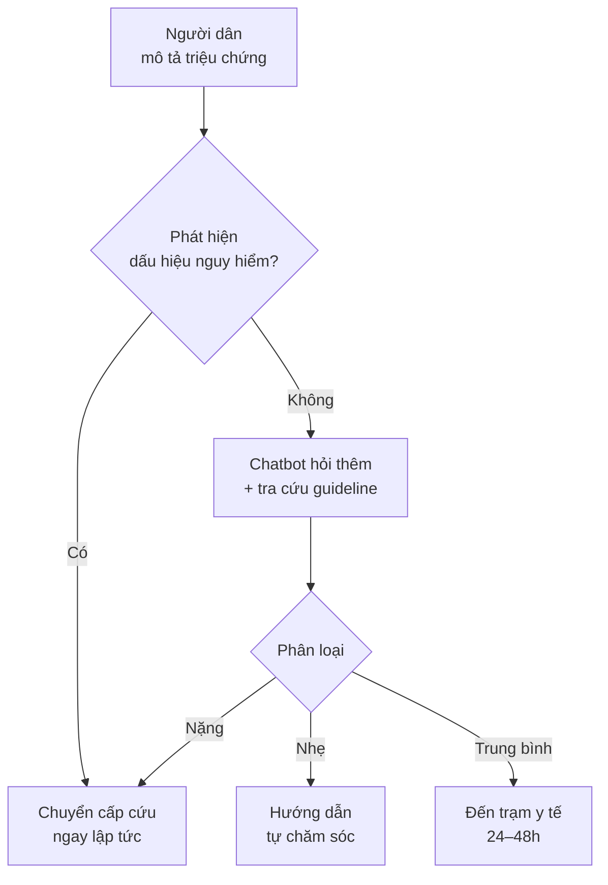
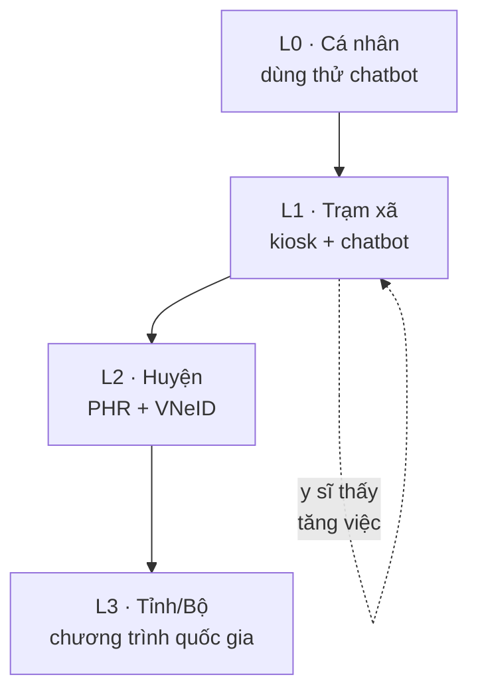

# Chương 7. AI trong chăm sóc sức khỏe ban đầu và cộng đồng

## Mở đầu: trạm y tế xã lúc 9 giờ tối

> **Tình huống mô phỏng** — nhân vật và diễn biến dưới đây do tác giả dựng để minh họa, không phản ánh một trạm y tế hay cá nhân cụ thể nào.

Trạm Y tế xã N., 9 giờ tối. Chị Hoa, y sĩ trạm, vừa tiếp một bà cụ 70 tuổi đau ngực nhẹ đã hai hôm. Huyết áp 150/95, không có máy điện tim, bác sĩ tuyến huyện cách 20km. Chị gọi điện hội chẩn, được hướng dẫn theo dõi và chuyển tuyến nếu nặng thêm — nhưng "nặng thêm" cụ thể là gì, chị phải tự đánh giá bằng kinh nghiệm. Cùng lúc, điện thoại trạm nhận tin nhắn của một thanh niên trong xã: "em bị sốt 3 ngày, uống thuốc không đỡ, có cần đi viện không?" — chị chưa kịp trả lời thì có thêm 5 tin nhắn tương tự.

Trạm y tế xã là nơi **thiếu nhất mà cần nhất**: thiếu bác sĩ, thiếu thiết bị, thiếu kết nối — nhưng lại là tuyến đầu tiên người dân tìm đến, nơi quản lý bệnh mạn tính cho cả cộng đồng, và nơi mọi chương trình y tế dự phòng bắt đầu. Câu hỏi của chương này: **AI có thể làm gì cho tuyến đầu này — chatbot tư vấn, sàng lọc, kiosk sức khỏe, hồ sơ sức khỏe điện tử — mà không vượt quá năng lực hạ tầng và nhân lực nơi đây?** Đọc xong chương, bạn sẽ:

- Hiểu 4 ứng dụng AI phù hợp nhất cho chăm sóc ban đầu và cộng đồng;
- Biết đặc thù tuyến xã quyết định thiết kế AI ra sao (mạng yếu, đa ngôn ngữ, nhân lực hạn chế);
- Nắm chuỗi case của tác giả: MediBot, VietPHR, Health Kiosk × FaCare, Corsano;
- Có lộ trình triển khai L0–L3 từ trạm đến tỉnh/Bộ, gắn với VNeID;
- Nắm các ranh giới đỏ: chatbot không tự chẩn đoán, dữ liệu PHR, đối tượng dễ tổn thương.

```metrics
[
  {"value":"4","label":"Ứng dụng AI tuyến đầu","hint":"chatbot · sàng lọc · kiosk · PHR"},
  {"value":"3","label":"Đặc thù tuyến xã","hint":"mạng yếu · ít nhân lực · đa ngôn ngữ"},
  {"value":"4","label":"Case chuỗi của tác giả","hint":"MediBot · VietPHR · Kiosk · Corsano"},
  {"value":"1","label":"Ranh giới đỏ","hint":"chatbot không chẩn đoán thay người"}
]
```

## 1. Chăm sóc ban đầu gặp AI: bốn ứng dụng đúng chỗ

### 1.1. Chatbot tư vấn triệu chứng (symptom triage)

Đây là ứng dụng gần người dân nhất: người dân mô tả triệu chứng bằng tiếng Việt (nói hoặc gõ), chatbot hỏi thêm các câu sàng lọc, rồi **phân loại mức độ**: tự chăm sóc tại nhà (kèm hướng dẫn), đến trạm y tế trong 24–48 giờ, hay đi cấp cứu ngay. Kiến trúc chuẩn của chatbot y tế nghiêm túc gồm 3 lớp:

1. **{t:llm}LLM{/t} hiểu ngôn ngữ**: chuyển câu chữ tự nhiên của người dân thành thông tin có cấu trúc (triệu chứng, thời gian, mức độ);
2. **{t:rag}RAG{/t} (truy xuất tăng cường)**: câu trả lời được sinh **dựa trên** tài liệu y khoa đã kiểm duyệt (phác đồ Bộ Y tế, WHO) chứ không phải kiến thức "tự do" của LLM — đây là lớp chống {t:hallucination}thông tin bịa đặt{/t} quan trọng nhất;
3. **Cây phân loại an toàn**: mọi luồng hội thoại đều có "cửa thoát khẩn cấp" — dấu hiệu nguy hiểm (đau ngực, khó thở, lơ mơ...) thì dừng tư vấn, chuyển ngay sang hướng dẫn cấp cứu/chuyển tuyến.



Điểm mấu chốt mà chương này nhấn mạnh nhiều lần: **chatbot tuyến đầu là công cụ phân loại và giáo dục, không phải bác sĩ trực tuyến**. Nó không chẩn đoán bệnh, không kê đơn — nó giúp người dân quyết định **đi đâu, gấp đến mức nào**, và chuẩn bị thông tin trước khi gặp nhân viên y tế.

🎬 **Video minh họa:** [Thử nghiệm chatbot AI về vắc-xin HPV tại Nhật Bản: so sánh chatbot với tờ rơi chính phủ — tăng kiến thức, duy trì sau 2 tuần (10/2026)](https://www.youtube.com/watch?v=D47r2-8vKRE) — minh chứng thử nghiệm có đối chứng về chatbot trong truyền thông sức khỏe cộng đồng.

🎬 **Video tiếng Việt:** [Ứng dụng chatbot AI trong tư vấn chăm sóc sức khỏe (5/2026)](https://www.youtube.com/watch?v=hESDYe-8bQU).

### 1.2. Sàng lọc bệnh không lây tại cộng đồng

Tăng huyết áp, đái tháo đường, nguy cơ tim mạch — các bệnh không lây cần **tìm ra người bệnh chưa biết mình bệnh** trong cộng đồng. AI hỗ trợ ở 3 điểm: (1) **chấm điểm nguy cơ** từ dữ liệu sẵn có (tuổi, BMI, huyết áp đo tại kiosk, tiền sử gia đình) để ưu tiên mời khám; (2) **nhắc lịch** tái khám, uống thuốc qua tin nhắn tự động cá nhân hóa; (3) **phân tích xu hướng** ở cấp xã/huyện để cán bộ y tế biết nhóm dân cư nào đang "đỏ" lên.

### 1.3. Giáo dục sức khỏe cá nhân hóa

Khác với tờ rơi chung chung, AI có thể giải thích kết quả xét nghiệm bằng ngôn ngữ của từng người: "đường huyết của bác hơi cao, nghĩa là..." ở trình độ phù hợp, bằng tiếng Việt hoặc tiếng dân tộc, kèm hình minh họa. Ứng dụng này ít rủi ro nhất (không can thiệp quyết định lâm sàng) mà tác động lớn đến tuân thủ điều trị — đặc biệt với bệnh mạn tính.

### 1.4. Health kiosk, thiết bị đeo, PHR có AI

**Health kiosk** là tủ/máy đặt tại trạm y tế, nhà văn hóa, chợ: người dân tự đo huyết áp, cân nặng, SpO2, đường huyết — dữ liệu tự động đồng bộ về hệ thống, AI chấm điểm nguy cơ và in phiếu hướng dẫn. **Thiết bị đeo** (vòng/băng tay) theo dõi liên tục mạch, giấc ngủ, vận động — AI phát hiện bất thường và nhắc nhở. **PHR** (Personal Health Record — hồ sơ sức khỏe cá nhân) là nơi người dân xem toàn bộ dữ liệu sức khỏe của mình, với AI giải thích từng chỉ số bằng ngôn ngữ dễ hiểu.

Ba mảnh này ghép lại thành vòng tròn chăm sóc liên tục: đo tại kiosk/đeo → dữ liệu về PHR → AI giải thích và nhắc nhở → người dân đến trạm khi cần → dữ liệu khám mới lại vào PHR.

### 1.5. Đặc thù tuyến xã: thiết kế AI phải "chịu đựng" được thực tế

Mọi AI cho tuyến đầu phải vượt qua 3 bài kiểm tra thực tế:

- **Kết nối kém:** mạng 4G chập chờn, mất điện thường xuyên. AI phải có chế độ offline hoặc "lưu-chuyển sau" (store-and-forward) — chatbot tư vấn không thể đứng hình khi mất mạng giữa chừng.
- **Nhân lực hạn chế:** y sĩ trạm không có thời gian học hệ thống phức tạp. Giao diện phải đơn giản đến mức dùng được ngay, và AI phải **giảm** việc chứ không thêm việc (tự điền biểu mẫu, tự tổng hợp báo cáo).
- **Đa ngôn ngữ dân tộc:** hàng chục dân tộc thiểu số với rào cản tiếng Việt. Chatbot và nội dung giáo dục cần lộ trình đa ngôn ngữ — bắt đầu từ tiếng Việt chuẩn, mở rộng dần; với ngôn ngữ chưa có dữ liệu, giải pháp tạm thời là nội dung song ngữ có kiểm duyệt của cán bộ y tế địa phương.

```callout kind=info title="Nguyên tắc thiết kế cho tuyến xã"
AI tuyến xã tốt = chạy được khi mất mạng + y sĩ dùng được không cần đào tạo dài + nói được ngôn ngữ người dân hiểu. Mọi tính năng không vượt qua 3 tiêu chí này đều là trang trí.
```

### 1.6. Kiến trúc offline-first: AI vẫn chạy khi mất mạng

Vì tuyến xã không thể trông chờ vào mạng ổn định, mọi AI tuyến đầu nghiêm túc đều phải thiết kế theo nguyên tắc **offline-first (ưu tiên ngoại tuyến)**:

- **Xử lý trên thiết bị (on-device):** các tác vụ nhẹ — phân loại triệu chứng cơ bản, chấm điểm nguy cơ từ chỉ số đã đo — chạy trực tiếp trên điện thoại/máy tính bảng của trạm bằng mô hình nhỏ, không cần mạng;
- **Lưu-chuyển sau (store-and-forward):** dữ liệu kiosk, kết quả sàng lọc được lưu cục bộ khi mất mạng, tự động đồng bộ lên hệ thống khi có mạng trở lại — kèm cơ chế chống trùng lặp;
- **SMS/USSD dự phòng:** với vùng hoàn toàn không có internet, nhắc uống thuốc và lịch tái khám vẫn đi được qua tin nhắn SMS — "AI" ở đây đơn giản là hệ thống gửi đúng tin, đúng người, đúng giờ;
- **Đồng bộ theo lịch:** thay vì đòi hỏi kết nối liên tục, hệ thống hẹn giờ đồng bộ (ví dụ mỗi tối) để cập nhật guideline, kho tri thức RAG và gửi báo cáo tổng hợp lên tuyến trên.

Nguyên tắc này cũng là câu trả lời cho lo ngại về chi phí: không phải xã nào cũng cần đường truyền riêng và máy chủ — một máy tính bảng + mô hình on-device + đồng bộ định kỳ đã đủ cho 80% nhu cầu tuyến đầu.

```timeline
[
  {"year":"2020","event":"COVID-19 thúc đẩy y tế số: khai báo điện tử, tư vấn từ xa bùng nổ","kind":"event"},
  {"year":"2023","event":"Nghị định 13/2023/NĐ-CP về bảo vệ dữ liệu cá nhân có hiệu lực","kind":"policy"},
  {"year":"2024","event":"Luật Dữ liệu 60/2024/QH15: khung pháp lý cho dữ liệu số quốc gia","kind":"policy"},
  {"year":"2025","event":"Luật AI 134/2025/QH15 được thông qua; Thông tư 13/2025/TT-BYT","kind":"policy"},
  {"year":"2026","event":"Luật AI hiệu lực; VNeID tích hợp dữ liệu sức khỏe; AI tuyến xã thí điểm","kind":"milestone"}
]
```

## 2. Chuỗi case của tác giả: từ chatbot đến hệ sinh thái tuyến đầu

Bốn case dưới đây là chuỗi triển khai thực tế của tác giả tại Việt Nam, đi từ tư vấn (MediBot) đến dữ liệu cá nhân (VietPHR), điểm chạm vật lý (Health Kiosk) và theo dõi liên tục (Corsano). Mỗi case đều có chi tiết cần tác giả xác minh lại trước khi xuất bản — được đánh dấu rõ trong bài.

### 2.1. MediBot — chatbot y tế thuần Việt

<!-- CẦN TÁC GIẢ XÁC MINH: toàn bộ số liệu MediBot (quy mô 10–100 triệu lượt/tháng, thử nghiệm 1.172 người dân, thời gian, phạm vi, chỉ số đánh giá) -->

**MediBot** là chatbot y tế thuần Việt do tác giả phát triển, hướng đến tư vấn sức khỏe ban đầu cho người dân. Theo ghi nhận của tác giả, hệ thống đạt quy mô 10–100 triệu lượt tương tác mỗi tháng và đã được thử nghiệm trên 1.172 người dân — những con số cần được xác minh lại về phương pháp đo và thời gian trước khi xuất bản.

Về thiết kế, MediBot tuân thủ đúng kiến trúc 3 lớp ở mục 1.1: LLM hiểu tiếng Việt tự nhiên (kể cả cách diễn đạt dân gian như "đau ê ẩm", "mệt rũ"), lớp RAG truy xuất từ tài liệu đã kiểm duyệt, và cây phân loại an toàn với cửa thoát khẩn cấp. Điểm khác biệt cốt lõi so với chatbot nước ngoài "dịch sang tiếng Việt" là **hiểu ngữ cảnh Việt Nam**: biết trạm y tế xã là gì, biết chuyển tuyến nghĩa là đi đâu, và diễn đạt theo cách người dân nông thôn hiểu được.

Bài học lớn nhất từ MediBot: **độ tin cậy của chatbot y tế không nằm ở LLM mạnh cỡ nào, mà ở lớp RAG và quy trình kiểm duyệt nội dung**. Cùng một LLM, cắm vào kho tài liệu đã được hội đồng chuyên môn duyệt thì cho ra tư vấn an toàn; để nó "tự do sáng tạo" thì sớm muộn cũng có ngày nó bịa ra phác đồ. Đơn vị nào muốn làm chatbot y tế nên đầu tư 70% công sức vào **kho tri thức và quy trình kiểm duyệt**, 30% vào mô hình.

### 2.2. VietPHR — hồ sơ sức khỏe cá nhân theo chuẩn mới

<!-- CẦN TÁC GIẢ XÁC MINH: chi tiết nâng cấp VietPHR theo Thông tư 13/2025/TT-BYT (phạm vi, nội dung thay đổi), mức độ áp dụng HL7 FHIR R4, tiến độ triển khai -->

**VietPHR** là hệ thống hồ sơ sức khỏe cá nhân do tác giả phát triển, cho phép người dân xem, quản lý và chia sẻ dữ liệu sức khỏe của mình. Theo ghi nhận của tác giả, VietPHR đã được nâng cấp theo **Thông tư 13/2025/TT-BYT** và áp dụng chuẩn **HL7 FHIR R4** — chuẩn trao đổi dữ liệu y tế quốc tế (xem {t:fhir}thuật ngữ FHIR{/t} ở chương 4).

Vì sao FHIR quan trọng với PHR? Vì hồ sơ sức khỏe cá nhân chỉ có giá trị khi **nói chuyện được** với các hệ thống khác: kết quả xét nghiệm từ bệnh viện A, đơn thuốc từ phòng khám B, dữ liệu đo tại kiosk — tất cả phải chảy về một nơi theo cùng một chuẩn. FHIR R4 là "ngôn ngữ chung" đó. Không có chuẩn, PHR chỉ là một ứng dụng ghi chép đơn lẻ nữa; có chuẩn, nó thành trung tâm dữ liệu sức khỏe của mỗi người dân.

Lớp AI trong VietPHR nằm ở **giải thích và nhắc nhở**: dịch kết quả xét nghiệm thành ngôn ngữ dễ hiểu ("HbA1c 7.2% nghĩa là đường huyết trung bình 3 tháng hơi cao"), nhắc lịch tái khám, uống thuốc, và cảnh báo sớm khi các chỉ số có xu hướng xấu đi. Nguyên tắc: AI giải thích **dữ liệu đã có**, không tự suy ra chẩn đoán mới — ranh giới này phải được ghi rõ trong điều khoản sử dụng.

### 2.3. Health Kiosk × FaCare — điểm chạm vật lý ở cộng đồng

<!-- CẦN TÁC GIẢ XÁC MINH: chi tiết Health Kiosk (số lượng kiosk, địa bàn đặt, loại chỉ số đo, hình thức kết nối Bluetooth, kết quả vận hành) và mối liên hệ với FaCare -->

**Health Kiosk** là tủ đo sức khỏe tự phục vụ đặt tại cộng đồng (trạm y tế, nhà văn hóa...), cho phép người dân tự đo huyết áp, cân nặng, SpO2 và một số chỉ số cơ bản khác. Theo ghi nhận của tác giả, kiosk được thiết kế mở, kết nối Bluetooth với thiết bị đo, và dữ liệu được đồng bộ về hệ thống FaCare — tạo thành chuỗi **đo tại cộng đồng → dữ liệu về hệ thống → CDSS phân tích** (nối với chương 6).

Bài học từ kiosk: **rào cản lớn nhất không phải công nghệ mà là thói quen**. Người dân — nhất là người cao tuổi — cần được hướng dẫn lần đầu tận tay; kiosk đặt ở nơi không có người hỗ trợ sẽ nhanh chóng thành "tủ trưng bày". Mô hình hiệu quả là kiosk + **cộng tác viên y tế thôn bản** hướng dẫn, đúng tinh thần "công nghệ khuếch đại con người, không thay thế con người".

### 2.4. Corsano pilot — theo dõi liên tục bằng thiết bị đeo

<!-- CẦN TÁC GIẢ XÁC MINH: chi tiết pilot Corsano (thiết bị cụ thể, số người tham gia, chỉ số theo dõi, thời gian, kết quả) -->

**Corsano** là thiết bị đeo (băng tay) theo dõi liên tục các chỉ số sinh tồn. Theo ghi nhận của tác giả, một pilot đã được triển khai tại Việt Nam để đánh giá khả năng dùng thiết bị đeo cho theo dõi sức khỏe liên tục ở cộng đồng.

Giá trị của theo dõi liên tục nằm ở **phát hiện xu hướng**: một lần đo huyết áp tại trạm chỉ cho một điểm dữ liệu; đeo liên tục 7 ngày cho ra đường cong — AI phát hiện được tăng huyết áp "áo choàng trắng", tụt huyết áp về đêm, rối loạn nhịp thoáng qua mà đo điểm không bao giờ thấy. Thách thức thực tế: pin, độ thoải mái khi đeo lâu, độ chính xác của cảm biến trên da người Việt (màu da, mồ hôi ảnh hưởng cảm biến quang học), và — quan trọng nhất — **ai đọc dữ liệu liên tục này** khi trạm xã đã quá tải? Câu trả lời phải là AI lọc trước, chỉ báo động khi thật sự cần (quay lại bài học alert fatigue, chương 6).

🎬 **Video minh họa:** [BS. Toyin Ajayi (CEO Cityblock Health) về dùng AI + dữ liệu để mở rộng chăm sóc ban đầu cho nhóm dân số khó khăn: giảm cấp cứu, tăng gắn kết bệnh nhân — podcast The Dose, 10/2026](https://www.youtube.com/watch?v=azPbBidfKg0).

```callout kind=tip title="Chuỗi giá trị tuyến đầu"
MediBot (hỏi) → Health Kiosk (đo) → VietPHR (lưu) → AI (giải thích + nhắc) → trạm y tế (can thiệp khi cần) → dữ liệu mới lại vào PHR. Mỗi mảnh đứng riêng đều yếu; ghép thành vòng tròn mới mạnh. Khi lập kế hoạch, hãy hỏi: mảnh nào trong chuỗi này đơn vị mình đang thiếu?
```

## 3. Hướng dẫn triển khai theo tầng: từ trạm đến Bộ

**L0 — Cá nhân: trải nghiệm với tư cách người dân (0 đồng).** Dùng thử một chatbot sức khỏe có uy tín: mô tả 3 tình huống (nhẹ, trung bình, khẩn cấp — **tình huống giả định, không phải triệu chứng thật của bạn**) và đánh giá: nó phân loại đúng không? Có cửa thoát khẩn cấp không? Có trích nguồn không? Mục tiêu: hiểu chatbot y tế "cảm giác" ra sao trước khi nghĩ đến triển khai.

**L1 — Trạm y tế xã: một kiosk + một chatbot.** Triển khai thí điểm tại 1–3 xã: đặt kiosk đo tại trạm, cung cấp chatbot cho người dân trong xã qua Zalo/mã QR, đào tạo y sĩ trạm cách đọc báo cáo tổng hợp. Điểm kiểm tra sau 3 tháng: bao nhiêu người dân dùng? Phát hiện được bao nhiêu ca tăng huyết áp/đái tháo đường mới? Y sĩ trạm có thấy giảm việc hay tăng việc? Nếu y sĩ thấy tăng việc, thiết kế sai — sửa trước khi nhân rộng.

**L2 — Huyện: PHR + VNeID.** Mở rộng ra toàn huyện: người dân đăng ký PHR, định danh qua **VNeID** (định danh điện tử quốc gia) để dữ liệu sức khỏe gắn đúng người, liên thông giữa trạm xã và trung tâm y tế huyện. Tầng này là bài toán **tích hợp dữ liệu**: chuẩn FHIR, bảo mật, phân quyền ai được xem gì. Cần phối hợp với công an (VNeID) và Sở Thông tin — không phải việc của ngành y tế một mình.

**L3 — Tỉnh/Bộ: chương trình sức khỏe số cộng đồng.** Nhân rộng mô hình L2 ra toàn tỉnh, gắn với chương trình quản lý bệnh không lây quốc gia: chỉ số theo dõi ở cấp dân số (tỷ lệ người dân có PHR, tỷ lệ tăng huyết áp được phát hiện sớm), đánh giá định kỳ, và cơ chế tài chính bền vững (ai trả tiền duy trì kiosk, server, đường truyền sau khi dự án kết thúc?).



## 4. Rủi ro và tuân thủ: ba ranh giới đỏ

### 4.1. Chatbot không tự chẩn đoán: disclaimer và chuyển tuyến

Đây là ranh giới pháp lý và đạo đức quan trọng nhất của chương này. Mọi chatbot y tế phục vụ người dân phải:

- Hiển thị **tuyên bố miễn trừ (disclaimer)** rõ ràng, dễ hiểu: "Đây là công cụ hỗ trợ thông tin, không thay thế bác sĩ. Nếu có dấu hiệu nguy hiểm, hãy đến cơ sở y tế ngay";
- **Không bao giờ** đưa ra chẩn đoán xác định ("bạn bị X") hay kê đơn thuốc cụ thể — chỉ phân loại mức độ và hướng dẫn bước tiếp theo;
- Mọi luồng hội thoại có **cửa thoát khẩn cấp**: phát hiện dấu hiệu nguy hiểm thì dừng tư vấn, chuyển sang hướng dẫn cấp cứu;
- Lưu nhật ký hội thoại phục vụ truy vết khi có sự cố, theo quy định về {t:pdpd}bảo vệ dữ liệu cá nhân{/t}.

```callout kind=danger title="Bốn câu hỏi trước khi cho người dân dùng chatbot"
1. Disclaimer có hiện rõ trước khi bắt đầu hội thoại không — hay giấu trong điều khoản dài không ai đọc?
2. Khi người dùng mô tả dấu hiệu nguy hiểm, chatbot có dừng lại và chuyển cấp cứu trong 1 bước không?
3. Nội dung tư vấn có trích từ tài liệu đã kiểm duyệt (RAG) không — hay LLM tự "sáng tác"?
4. Ai chịu trách nhiệm khi chatbot tư vấn sai gây hậu quả — đã có văn bản phân công chưa?
```

### 4.2. Dữ liệu PHR: tuân thủ NĐ 13/2023 và Luật Dữ liệu

Dữ liệu sức khỏe là **dữ liệu cá nhân nhạy cảm** theo Nghị định 13/2023/NĐ-CP — mức bảo vệ cao nhất. Hệ thống PHR phải có:

- **Sự đồng ý** của người dân trước khi thu thập, với mục đích rõ ràng (không thu thập "để sau này tính");
- **Phân quyền chặt**: người dân xem toàn bộ của mình; bác sĩ điều trị xem khi được ủy quyền; cán bộ quản lý chỉ xem số liệu tổng hợp, không xem chi tiết cá nhân;
- **Lưu trữ trong nước** hoặc theo đúng quy định về chuyển dữ liệu ra nước ngoài;
- **Quyền của chủ thể dữ liệu**: xem, sửa, xóa, rút lại sự đồng ý — phải làm được thật, không chỉ ghi trong chính sách.

{t:luatai}Luật AI 134/2025/QH15{/t} bổ sung lớp yêu cầu về minh bạch: người dân phải biết khi nào mình đang tương tác với AI (chatbot phải tự giới thiệu là máy), và nội dung do AI tạo ra phải có dấu hiệu nhận biết.

### 4.3. Đối tượng dễ tổn thương: người cao tuổi, trẻ em, đồng bào dân tộc

AI tuyến đầu phục vụ chính những nhóm dễ tổn thương nhất — và cũng dễ bị AI làm hại nhất:

- **Người cao tuổi:** khó dùng công nghệ, dễ tin tuyệt đối vào "máy nói". Chatbot phải dùng ngôn ngữ đơn giản, và mọi khuyến nghị quan trọng đều phải có câu "hãy hỏi lại y sĩ/bác sĩ";
- **Trẻ em:** không cho trẻ vị thành niên tự dùng chatbot y tế mà không có người lớn — quy định độ tuổi sử dụng rõ ràng;
- **Đồng bào dân tộc thiểu số:** rào cản ngôn ngữ + thói quen khám chữa bệnh khác biệt. Triển khai phải có cán bộ y tế địa phương đồng hành, nội dung được kiểm duyệt văn hóa — không dịch máy ẩu.

## 5. Lab 7 — Thiết kế chatbot tư vấn triệu chứng cho trạm y tế xã

```chart
{"type":"bar","title":"Lab 7 — thời lượng ước tính theo mức nhiệm vụ","data":[{"name":"L0 · Dùng thử chatbot","phút":20},{"name":"L1 · Viết system prompt","phút":45},{"name":"L2 · Test 10 kịch bản","phút":90},{"name":"L3 · Test 30 + safety","phút":150}],"keys":["phút"],"yLabel":"phút"}
```

<div class="lab-cta">
<a href="/lab/lab-07" target="_blank" rel="noopener noreferrer" class="lab-btn">
▶ Mở Lab 7 trong tab mới
</a>
<div class="lab-meta">20–150 phút tùy mức (L0–L3) · AI chấm rubric 5 tiêu chí · Lưu tiến độ vào sổ grading</div>
<span class="lab-cta-note">Thiết kế system prompt tiếng Việt cho chatbot trạm y tế xã, test với 30 kịch bản gồm kiểm tra an toàn (safety check).</span>
</div>

## 6. Nguồn và đọc thêm

**Văn bản pháp luật Việt Nam:**
- Quốc hội (2025), [*Luật Trí tuệ nhân tạo số 134/2025/QH15*](https://vanban.chinhphu.vn/?pageid=27160&docid=216334&classid=1&typegroupid=3) (thông qua ngày 10/12/2025, hiệu lực từ 01/03/2026) — minh bạch AI và dấu hiệu nhận biết nội dung AI tạo ra.
- Chính phủ (2023), Nghị định 13/2023/NĐ-CP về bảo vệ dữ liệu cá nhân — dữ liệu sức khỏe là dữ liệu nhạy cảm.

**Tài liệu quốc tế:**
- WHO (2024), [*Ethics and governance of artificial intelligence for health: Guidance on large multi-modal models*](https://www.who.int/publications/i/item/9789240084759) — hướng dẫn AI y tế, có phần về chatbot và công bằng tiếp cận.

**Đọc thêm trong cẩm nang:** [chương 6 — AI hỗ trợ quyết định lâm sàng](/chapters/06-cdss) (CDSS tuyến cơ sở), [chương 14 — An toàn, tuân thủ](/chapters/14-an-toan-tuan-thu) (khung quản trị đầy đủ).

**Video minh họa trong chương:**
- BS. Toyin Ajayi (CEO Cityblock Health), "AI Has More to Offer Health Care" — AI mở rộng chăm sóc ban đầu cho nhóm khó khăn, podcast The Dose (10/2026) ([YouTube](https://www.youtube.com/watch?v=azPbBidfKg0)).
- "HPV Vaccine Chatbot Trial in Japan" — thử nghiệm có đối chứng chatbot y tế trong truyền thông sức khỏe (10/2026) ([YouTube](https://www.youtube.com/watch?v=D47r2-8vKRE)).
- "Ứng dụng chatbot AI trong tư vấn chăm sóc sức khỏe" — video tiếng Việt (5/2026) ([YouTube](https://www.youtube.com/watch?v=hESDYe-8bQU)).

> Lưu ý: nội dung video mang tính thời điểm; kiểm tra lại thông tin trước khi trích dẫn.

---

> **Trạng thái bản thảo:** đây là bản nháp do AI soạn theo "Quy chuẩn biên tập chương và Lab" ngày 04/10/2026, **chưa qua tác giả duyệt**. Không phát hành dưới tên chủ biên. Các case MediBot, VietPHR, Health Kiosk, Corsano cần tác giả xác minh lại số liệu và chi tiết trước khi xuất bản.
