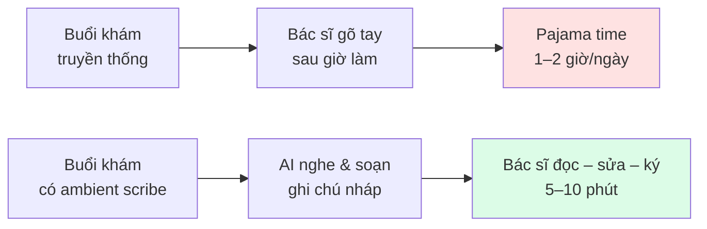
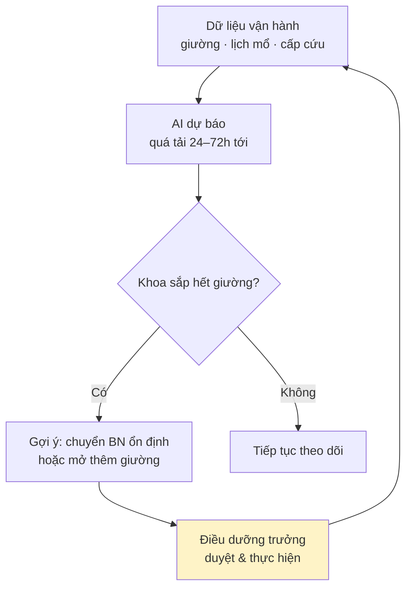

# Chương 8. AI trong quản trị bệnh viện và ambient scribe

## Mở đầu: ca trực không bao giờ kết thúc

Bác sĩ Minh, ngoại khoa một bệnh viện tuyến tỉnh, kết thúc ca mổ cuối cùng lúc 17 giờ 40. Nhưng ngày làm việc của anh chưa xong. Trên bàn là 23 bệnh án cần hoàn thiện: mỗi ca mổ phải có tường trình phẫu thuật, mỗi bệnh nhân phải có ghi chú diễn biến, chưa kể biên bản hội chẩn sáng nay và báo cáo tai biến cần gửi phòng Kế hoạch tổng hợp. Anh gõ máy tính đến 21 giờ, mắt cay, lưng mỏi — người ta gọi đó là "pajama time", giờ làm việc mặc đồ ngủ ở nhà mà không ai trả lương.

Sáng hôm sau, trong buổi giao ban khoa, trưởng khoa thông báo: bệnh viện thí điểm một công cụ mới — bác sĩ chỉ cần bật ghi âm trên điện thoại trong lúc khám, AI sẽ tự nghe, tự tóm tắt thành ghi chú bệnh án chuẩn, tự gợi ý mã bệnh. Bác sĩ Minh hoài nghi: "Máy nghe có hiểu được tiếng Việt chuyên ngành của mình không? Nó viết sai thì ai chịu?" Câu hỏi đó hoàn toàn chính đáng — và cũng chính là câu hỏi trung tâm của chương này.

Câu chuyện của bác sĩ Minh không phải chuyện viễn tưởng. Tại nhiều hệ thống y tế trên thế giới, công cụ "ghi chép xung quanh" (ambient scribe) đã đi vào thực tế hằng ngày từ vài năm nay. Và bài học lớn nhất từ những nơi triển khai thành công là: **đừng bắt đầu AI từ chẩn đoán — hãy bắt đầu từ giấy tờ**. Những việc hành chính, lặp lại, tốn thời gian nhưng ít rủi ro lâm sàng chính là nơi AI mang lại giá trị nhanh nhất, rõ nhất, và an toàn nhất.

Đó chính là câu hỏi trung tâm của chương này: **với gánh nặng hành chính hiện tại của đơn vị mình, AI có thể gỡ được nút thắt nào trước, triển khai theo lộ trình nào, và đâu là ranh giới pháp lý không được vượt qua?** Đọc xong chương, bạn sẽ:

- Hiểu ambient scribe là gì, nó biến buổi khám thành hồ sơ bệnh án như thế nào, và giới hạn của nó ở đâu;
- Nắm được ba nhóm ứng dụng hành chính có giá trị nhanh nhất: ghi chép lâm sàng, mã hóa bệnh (ICD-10), và tối ưu vận hành (lịch mổ, giường bệnh);
- Có lộ trình triển khai 4 mức (L0–L3) từ dùng cá nhân đến toàn viện, biết mỗi mức cần gì và ai quyết định;
- Nắm rõ các nghĩa vụ pháp lý khi ghi âm buổi khám: consent, ẩn danh hóa, và nguyên tắc bác sĩ ký duyệt cuối cùng.

```metrics
[
  {"value":"2–3 giờ","label":"Thời gian bác sĩ làm hồ sơ mỗi ngày","hint":"pajama time — ước tính phổ biến"},
  {"value":"3","label":"Nhóm quick win hành chính","hint":"scribe · coding · vận hành"},
  {"value":"4","label":"Mức triển khai L0–L3","hint":"cá nhân → toàn viện"},
  {"value":"1","label":"Nguyên tắc bất di bất dịch","hint":"bác sĩ ký duyệt cuối cùng"}
]
```

## 1. Vì sao bắt đầu từ hành chính, không phải lâm sàng

Trong y tế, mọi ứng dụng AI đều nằm trên một phổ rủi ro. Một đầu là **hành chính**: ghi chép, mã hóa, xếp lịch — sai sót gây phiền toái, tốn công sửa, nhưng hiếm khi trực tiếp hại bệnh nhân. Đầu kia là **lâm sàng**: chẩn đoán, kê đơn, chỉ định — sai sót có thể gây hậu quả nghiêm trọng và trách nhiệm pháp lý nặng nề.

Logic của chương này rất thực dụng: **hãy thắng ở đầu dễ trước**. Ba lý do:

1. **Giá trị thấy ngay.** Giảm 30–40% thời gian làm hồ sơ là con số bác sĩ cảm nhận được ngay tuần đầu tiên, không cần nghiên cứu đối chứng phức tạp. <!-- CẦN TÁC GIẢ XÁC MINH: mức giảm thời gian cụ thể tại đơn vị thí điểm -->
2. **Rủi ro thấp, dễ kiểm soát.** Ghi chú do AI soạn luôn phải qua tay bác sĩ đọc lại và ký trước khi lưu vào {t:emr}bệnh án điện tử{/t} — vòng kiểm soát con người (human-in-the-loop) được thiết kế sẵn trong quy trình.
3. **Tạo niềm tin cho bước tiếp theo.** Một khoa đã quen dùng AI ghi chép sẽ cởi mở hơn nhiều khi bệnh viện triển khai AI đọc ảnh hay hỗ trợ quyết định lâm sàng (xem chương 5, 6). Niềm tin công nghệ được xây bằng trải nghiệm tốt, không bằng slide thuyết trình.

{t:pajama-time}Pajama time{/t} là thuật ngữ trong y văn quốc tế chỉ thời gian bác sĩ phải làm việc với bệnh án điện tử ngoài giờ — buổi tối ở nhà, mặc đồ ngủ, gõ máy tính. Nhiều khảo sát tại Mỹ cho thấy bác sĩ dành 1–2 giờ mỗi ngày cho việc này, và đó là một trong những nguyên nhân hàng đầu gây kiệt sức nghề nghiệp (burnout). Ambient scribe ra đời để xóa chính khoảng thời gian đó.



## 2. Ambient scribe hoạt động thế nào

{t:ambient-scribe}Ambient scribe{/t} (tạm dịch: thư ký xung quanh) là AI lắng nghe cuộc trò chuyện giữa bác sĩ và bệnh nhân trong buổi khám, rồi tự động soạn thành ghi chú lâm sàng có cấu trúc. "Ambient" nghĩa là nó hoạt động nền — bác sĩ không phải đọc chính tả vào máy, không phải gõ trong lúc khám, mà tập trung nhìn vào mắt bệnh nhân.

Luồng xử lý gồm 4 bước:

1. **Thu âm:** điện thoại hoặc thiết bị chuyên dụng ghi lại cuộc hội thoại trong phòng khám (có sự đồng ý của bệnh nhân — xem phần 7).
2. **Chuyển giọng nói thành văn bản (transcription):** mô hình nhận dạng giọng nói chuyên ngành y chuyển audio thành bản ghi chữ, nhận diện được ai đang nói (bác sĩ hay bệnh nhân).
3. **Trích xuất và cấu trúc hóa:** {t:llm}mô hình ngôn ngữ lớn{/t} đọc bản ghi, trích thông tin lâm sàng và sắp xếp theo mẫu {t:soap}SOAP{/t} (Subjective – chủ quan: triệu chứng bệnh nhân kể; Objective – khách quan: dấu hiệu thăm khám; Assessment – nhận định; Plan – kế hoạch điều trị).
4. **Bác sĩ kiểm tra và ký:** bản nháp hiện lên để bác sĩ đọc, sửa, rồi ký duyệt mới được lưu vào bệnh án điện tử. **Không có chữ ký của bác sĩ, ghi chú của AI không có giá trị.**

Ba cái tên quốc tế đáng biết:

- **Nuance DAX (Dragon Ambient eXperience):** tiên phong từ khoảng 2020; sau khi Microsoft mua lại Nuance, phiên bản DAX Copilot tích hợp {t:llm}GPT-4{/t} ra mắt cuối 2023 và được triển khai rộng tại các hệ thống bệnh viện Mỹ.
- **Abridge:** startup chuyên sâu vào ghi chép lâm sàng bằng AI, nổi lên mạnh từ 2023–2024 với các hợp đồng triển khai tại nhiều hệ thống y tế lớn của Mỹ.
- **Suki:** trợ lý giọng nói cho bác sĩ, mạnh về ra y lệnh bằng giọng nói và ghi chép nhanh trên di động.

🎬 **Video minh họa:** [Demo chính thức "Nuance – DAX Copilot": ghi âm hội thoại khám bệnh, AI tự sinh ghi chú lâm sàng — kênh chính thức của Nuance (Microsoft)](https://www.youtube.com/watch?v=tBulTCOVWg8).

Điểm khó nhất khi đưa ambient scribe về Việt Nam là **tiếng Việt y khoa**: thuật ngữ Latin xen tiếng Việt ("bệnh nhân có tiền sử đái tháo đường type 2, HA 150/95"), giọng địa phương, tiếng ồn phòng khám đông. Mô hình nhận dạng giọng nói đa ngôn ngữ chung thường sai nhiều ở khâu này. Vì vậy tiêu chí số một khi chọn giải pháp cho bệnh viện Việt Nam không phải là thương hiệu quốc tế, mà là **độ chính xác với tiếng Việt chuyên ngành qua thử nghiệm thực tế tại chính đơn vị mình** — cho chạy thử 2–4 tuần với 3–5 bác sĩ trước khi ký hợp đồng.

Về mặt kỹ thuật tích hợp, ambient scribe không thay thế {t:emr}bệnh án điện tử{/t} mà "đứng trước" nó: bản nháp SOAP sau khi bác sĩ ký duyệt được đẩy vào EMR qua chuẩn trao đổi dữ liệu y tế như {t:fhir}FHIR{/t} hoặc API của hệ thống HIS/EMR hiện có. Khi đánh giá nhà cung cấp, hãy hỏi 3 câu kỹ thuật: (1) có đẩy được vào EMR/HIS của bệnh viện tôi không (tên hệ thống cụ thể), hay chỉ xuất file Word/PDF? (2) dữ liệu audio và bản ghi được xử lý ở đâu — máy chủ trong nước hay nước ngoài? (3) có nhật ký ai đã truy cập bản ghi nào không? Nhà cung cấp trả lời ấp úng cả 3 câu thì chưa sẵn sàng cho bệnh viện.

## 3. Tự động hóa mã hóa bệnh và hồ sơ hành chính

Sau ghi chép, "mỏ vàng" thứ hai của AI hành chính là **mã hóa bệnh** — gán {t:icd10}mã ICD-10{/t} cho mỗi chẩn đoán để thanh toán bảo hiểm y tế và báo cáo thống kê. Đây là việc vừa tốn thời gian, vừa dễ sai, vừa ảnh hưởng trực tiếp đến doanh thu của bệnh viện (mã sai có thể khiến hồ sơ bị BHYT từ chối thanh toán).

{t:computer-assisted-coding}Mã hóa hỗ trợ bằng máy tính{/t} (CAC — computer-assisted coding) hoạt động như sau: AI đọc ghi chú lâm sàng (hoặc bản tóm tắt của ambient scribe), đề xuất danh sách mã ICD-10 kèm đoạn văn bản dẫn chứng ("đoạn này trong ghi chú ủng hộ mã J18.9"). Nhân viên mã hóa (coder) kiểm tra, chấp nhận hoặc sửa từng mã. Điểm mấu chốt: **AI đề xuất, con người quyết định** — giống hệt nguyên tắc ký duyệt của ambient scribe.

**Ví dụ minh họa cách AI gợi ý mã:** với ghi chú "Bệnh nhân nam 62 tuổi, đau ngực trái lan lên vai 2 giờ, ECG ST chênh lên DII-DIII-aVF, troponin tăng", AI có thể đề xuất mã chính I21.1 (nhồi máu cơ tim thành dưới) kèm dẫn chứng là 3 cụm từ trong ghi chú, đồng thời gợi ý thêm mã phụ nếu ghi chú đề cập tăng huyết áp hay đái tháo đường đi kèm. Coder chỉ cần kiểm tra 4–5 gợi ý thay vì tra cứu thủ công từ đầu trong cuốn ICD dày hàng nghìn trang. Nhưng cũng chính ví dụ này cho thấy giới hạn: nếu ghi chú viết tắt khó hiểu ("ĐNCT" — đau ngực trái — hay "đợt nhồi cấp tính" tùy người viết), AI có thể gợi ý sai, và coder thiếu kinh nghiệm bấm "đồng ý" hàng loạt sẽ biến sai sót của AI thành sai sót của bệnh viện. Vì vậy tháng đầu triển khai, quy định nên là **coder kiểm tra 100% gợi ý**, chỉ giảm tần suất kiểm tra khi tỷ lệ gợi ý đúng đã ổn định trên 95% qua ít nhất 1.000 hồ sơ. <!-- CẦN TÁC GIẢ XÁC MINH: ngưỡng 95%/1.000 hồ sơ phù hợp thực tế -->

Ngoài coding, AI hành chính còn làm được:

- **Soạn biên bản tự động:** biên bản hội chẩn, biên bản giao ban, biên bản kiểm thảo tử vong — từ ghi âm hoặc dàn ý ngắn.
- **Tóm tắt bệnh án ra viện:** tổng hợp toàn bộ đợt điều trị thành giấy ra viện đúng mẫu.
- **Trả lời văn bản hành chính:** dự thảo công văn, báo cáo định kỳ từ số liệu có sẵn (kết hợp với kỹ năng ở chương 4).

```callout kind=tip title="Nguyên tắc vàng của AI hành chính"
AI hành chính chỉ nên làm những việc mà (1) có mẫu chuẩn rõ ràng, (2) sai sót phát hiện được khi đọc lại, và (3) luôn có người ký duyệt cuối cùng. Bất cứ việc gì thiếu một trong ba điều kiện trên thì chưa nên giao cho AI.
```

## 4. Tối ưu vận hành: lịch mổ, giường bệnh, dự báo nhu cầu

Nhóm ứng dụng thứ ba ít được chú ý nhưng giá trị rất lớn: **dùng AI để điều hành bệnh viện thông minh hơn**. Khác với hai nhóm trên (xử lý văn bản), nhóm này dùng AI phân tích dữ liệu vận hành:

- **Quản lý giường bệnh:** dự báo thời điểm khoa nào sẽ quá tải, gợi ý chuyển bệnh nhân ổn định xuống tuyến dưới hoặc sang khoa còn giường trống — thay vì điều dưỡng trưởng phải gọi điện hỏi từng khoa mỗi sáng.
- **Tối ưu lịch mổ:** sắp xếp ca mổ dựa trên thời gian mổ trung bình theo loại phẫu thuật và phẫu thuật viên, giảm giờ chết của phòng mổ và ca mổ kéo dài quá giờ hành chính.
- **Dự báo nhu cầu:** dự báo lượng bệnh nhân cấp cứu theo mùa, theo dịch (ví dụ mùa sốt xuất huyết), để chủ động bố trí nhân lực và vật tư — thay vì bị động ứng phó khi đã quá tải.



Lưu ý: trong sơ đồ trên, AI chỉ **gợi ý**, người điều hành (điều dưỡng trưởng, trưởng khoa) mới là người **quyết định** chuyển bệnh nhân. Việc chuyển bệnh nhân giữa các khoa là quyết định chuyên môn có trách nhiệm — không bao giờ để AI tự ra lệnh.

```timeline
[
  {"year":"2020","event":"Nuance DAX ra mắt — ambient scribe thế hệ đầu tại Mỹ","kind":"milestone"},
  {"year":"2021–2022","event":"Microsoft mua lại Nuance; làn sóng quan tâm AI ghi chép lan rộng","kind":"event"},
  {"year":"10/2023","event":"DAX Copilot tích hợp GPT-4 — chất lượng ghi chú tăng vọt","kind":"milestone"},
  {"year":"2024","event":"Abridge, Suki mở rộng mạnh; ambient scribe thành chuẩn mới tại nhiều hệ thống Mỹ","kind":"event"},
  {"year":"2025–2026","event":"Thử nghiệm ambient scribe tiếng Việt tại một số bệnh viện Việt Nam","kind":"milestone"}
]
```

Lưu ý quan trọng: AI vận hành chỉ tốt khi **dữ liệu vận hành sạch**. Nếu bệnh viện chưa có bệnh án điện tử đầy đủ, số liệu giường bệnh còn ghi tay, thì đừng vội mua AI dự báo — hãy đầu tư vào số hóa trước (xem chương 12 về hạ tầng dữ liệu). AI không sửa được dữ liệu rác, nó chỉ phóng đại dữ liệu rác nhanh hơn.

## 5. Case quốc tế và Việt Nam

**Bắc Mỹ — nơi ambient scribe thành chuẩn.** Sau khi DAX Copilot tích hợp mô hình ngôn ngữ lớn cuối 2023, nhiều hệ thống y tế lớn tại Mỹ triển khai cho hàng nghìn bác sĩ. Các báo cáo từ chính các hệ thống này cho thấy bác sĩ tiết kiệm đáng kể thời gian ghi chép mỗi ngày và mức độ hài lòng tăng lên. <!-- CẦN TÁC GIẢ XÁC MINH: số liệu % tiết kiệm thời gian và nguồn công bố cụ thể --> Abridge và Suki cũng công bố các hợp đồng triển khai quy mô lớn trong 2024–2025. Điểm chung của các case thành công: triển khai theo từng khoa, có đo lường trước–sau, và luôn giữ vòng bác sĩ kiểm duyệt.

**Việt Nam — thử nghiệm bước đầu.** Một số bệnh viện tuyến trung ương đã bắt đầu thử nghiệm ambient scribe tiếng Việt: ghi âm buổi khám (có consent bệnh nhân), AI chuyển thành văn bản và soạn ghi chú nháp để bác sĩ sửa. Kết quả ban đầu cho thấy giảm khoảng 40% thời gian làm hồ sơ so với gõ tay. <!-- CẦN TÁC GIẢ XÁC MINH: tên bệnh viện, quy mô thử nghiệm, phương pháp đo 40%, nguồn số liệu --> Thách thức lớn nhất được ghi nhận là độ chính xác với thuật ngữ chuyên ngành và giọng nói đa vùng miền — đúng như dự báo ở phần 2.

Một thiết kế thí điểm tốt cho bệnh viện Việt Nam gồm 5 yếu tố: (1) chọn 1 khoa có khối lượng hồ sơ lớn và trưởng khoa ủng hộ (thường là nội hoặc ngoại); (2) chạy 4–8 tuần với 5–8 bác sĩ tình nguyện; (3) đo 3 chỉ số trước–sau: phút làm hồ sơ/bệnh nhân, tỷ lệ ghi chú phải sửa nặng, điểm hài lòng của bác sĩ (thang 1–5); (4) song song đánh giá độ chính xác tiếng Việt theo chuyên khoa (nội khoa khác ngoại khoa khác sản khoa về từ vựng); (5) có nhóm đối chứng hoặc ít nhất số liệu baseline 2 tuần trước khi bật AI. Thiếu baseline thì mọi con số "giảm 40%" đều không có giá trị.

Bài học rút ra: đừng nhập khẩu nguyên xi case nước ngoài. Hãy thí điểm nhỏ (một khoa, 4–8 tuần), đo lường bằng chính số liệu của mình (thời gian làm hồ sơ trước–sau, tỷ lệ sửa của bác sĩ, mức hài lòng), rồi mới quyết định mở rộng.

🎬 **Video minh họa:** [Dr. Jonathan Block — "Can AI Actually Stop Physician Burnout?": vai trò của AI scribe trong giảm kiệt sức nghề nghiệp, và cảnh báo "trust, but verify" — trách nhiệm kiểm chứng của con người](https://www.youtube.com/watch?v=Kb7_FYgexcY).

## 6. Hướng dẫn triển khai theo 4 mức

| Mức | Phạm vi | Cần gì | Ai quyết định |
|---|---|---|---|
| L0 — Cá nhân | 1 bác sĩ dùng app scribe trên điện thoại cho ghi chú của mình | Điện thoại, tài khoản dùng thử, consent bệnh nhân từng ca | Chính bác sĩ đó |
| L1 — Phòng khám | 3–5 bác sĩ một phòng khám, tích hợp với kê đơn | Hợp đồng dùng thử có DPA, quy trình consent chuẩn, 1 người phụ trách đánh giá | Trưởng phòng khám |
| L2 — Khoa | Toàn khoa, scribe + gợi ý ICD-10, đo lường trước–sau | Đấu thầu/mua sắm, tích hợp một phần với HIS/EMR, đào tạo coder | Trưởng khoa + phòng CNTT + Ban giám đốc |
| L3 — Toàn viện | Mọi khoa lâm sàng, tích hợp sâu EMR + coding + dashboard vận hành | Dự án CNTT chính thức, đánh giá ATTT, hợp đồng DPA đầy đủ, kế hoạch đào tạo toàn viện | Ban giám đốc + Hội đồng khoa học công nghệ |

Nguyên tắc leo thang: **không nhảy cóc**. Mỗi mức phải chạy ổn định ít nhất 4–8 tuần và đạt 3 tiêu chí mới lên mức tiếp theo: (1) bác sĩ thực sự dùng hằng ngày (không phải dùng vì bị ép thí điểm), (2) tỷ lệ ghi chú phải sửa nặng dưới ngưỡng chấp nhận được (ví dụ dưới 15% số ca — <!-- CẦN TÁC GIẢ XÁC MINH: ngưỡng phù hợp thực tế -->), (3) không có sự cố dữ liệu nào.

```callout kind=warning title="Đừng mua trước khi thử"
Mọi hợp đồng ambient scribe/coding AI nên có điều khoản dùng thử (pilot) 4–8 tuần với điều kiện thoát hợp đồng nếu không đạt chỉ tiêu đã thỏa thuận (độ chính xác, tỷ lệ dùng, mức hài lòng). Nhà cung cấp từ chối pilot có đo lường thì đó là tín hiệu đỏ.
```

## 7. Rủi ro và tuân thủ: ghi âm, dữ liệu, chữ ký

Đây là phần không được bỏ qua. Ghi âm buổi khám chạm vào ba vùng pháp lý nhạy cảm:

**1. Consent ghi âm.** Cuộc trò chuyện khám bệnh là thông tin cá nhân nhạy cảm. Theo {t:pdpd}Nghị định 13/2023/NĐ-CP{/t} về bảo vệ dữ liệu cá nhân, xử lý dữ liệu nhạy cảm cần có sự đồng ý rõ ràng của chủ thể. Vận dụng thực tế: bệnh viện cần **quy trình xin consent chuẩn** — thông báo cho bệnh nhân biết buổi khám được ghi âm để AI hỗ trợ ghi chép, mục đích sử dụng, thời gian lưu trữ, và quyền từ chối (từ chối thì bác sĩ ghi tay như cũ, không được phân biệt đối xử). Consent nên được ghi nhận bằng văn bản hoặc ghi âm lại chính lời đồng ý.

Mẫu lời thông báo gợi ý (điều chỉnh theo quy chế của bệnh viện): *"Thưa bác, để tiết kiệm thời gian ghi chép và dành nhiều thời gian thăm khám hơn, buổi khám hôm nay bệnh viện xin phép ghi âm. Bản ghi chỉ dùng để AI hỗ trợ bác sĩ viết hồ sơ bệnh án, sau đó sẽ được xóa. Bác có quyền từ chối, và việc từ chối không ảnh hưởng gì đến chất lượng khám chữa bệnh. Bác đồng ý chứ ạ?"* — ngắn gọn, nói bằng tiếng Việt phổ thông, tránh thuật ngữ "AI", "ambient scribe" mà bệnh nhân không hiểu.

**2. Audio sau khi chuyển thành văn bản.** File ghi âm chứa giọng nói — dữ liệu sinh trắc tiềm năng. Quy tắc tốt nhất: **sau khi đã có bản ghi chữ và bác sĩ đã ký duyệt, xóa file audio gốc** (hoặc ẩn danh hóa), chỉ lưu văn bản. Không lưu audio "để dành", không dùng audio để huấn luyện lại mô hình trừ khi có consent riêng và đánh giá tuân thủ.

**3. Bác sĩ ký duyệt — không thương lượng.** Mọi ghi chú, mã bệnh, biên bản do AI tạo ra đều ở trạng thái "nháp" cho đến khi bác sĩ có chuyên môn đọc, sửa (nếu cần) và ký. Chữ ký này không phải thủ tục hình thức: người ký chịu trách nhiệm chuyên môn và pháp lý về nội dung. Nếu AI viết sai chẩn đoán mà bác sĩ ký mù, lỗi thuộc về người ký.

```callout kind=danger title="Checklist tuân thủ trước khi bật ghi âm tại khoa"
<label style="display:block;margin:8px 0;cursor:pointer"><input type="checkbox" style="margin-right:10px;transform:scale(1.3);accent-color:#dc2626"> Đã có quy trình xin consent bệnh nhân (văn bản, có quyền từ chối)?</label>
<label style="display:block;margin:8px 0;cursor:pointer"><input type="checkbox" style="margin-right:10px;transform:scale(1.3);accent-color:#dc2626"> Đã ký DPA với nhà cung cấp (dữ liệu lưu ở đâu, ai truy cập, xóa khi nào)?</label>
<label style="display:block;margin:8px 0;cursor:pointer"><input type="checkbox" style="margin-right:10px;transform:scale(1.3);accent-color:#dc2626"> Đã có quy định xóa/ẩn danh audio sau khi ký duyệt?</label>
<label style="display:block;margin:8px 0;cursor:pointer"><input type="checkbox" style="margin-right:10px;transform:scale(1.3);accent-color:#dc2626"> Bác sĩ đã được tập huấn: đọc kỹ trước khi ký, không ký mù?</label>

Thiếu một dấu tick thì dừng lại, chưa triển khai.
```

Ngoài ra, {t:hallucination}thông tin bịa đặt{/t} của AI trong ghi chú y khoa là rủi ro thực: AI có thể "sáng tác" một triệu chứng bệnh nhân không hề nói. Vì vậy quy trình đọc–sửa–ký không phải là khuyến nghị cho có, mà là **cơ chế an toàn bắt buộc** — tương tự kiểm tra chéo trong y khoa.

## 8. Case đóng chương: buổi sáng của bác sĩ Minh, sáu tháng sau

> **Tình huống mô phỏng tổng hợp** — các nhân vật, số liệu và diễn biến dưới đây do tác giả dựng để minh họa cách làm, không phản ánh một bệnh viện cụ thể nào.

Sáu tháng sau buổi giao ban định mệnh, khoa ngoại của bác sĩ Minh đã đi hết lộ trình L0→L2. Sáng nay anh khám 18 bệnh nhân ngoại trú. Với mỗi ca, anh bật ghi âm trên điện thoại (bệnh nhân nào từ chối thì anh ghi tay như cũ — có 2 ca như vậy, không ai khó chịu vì được hỏi ý kiến đàng hoàng).

12 giờ trưa, 16/18 ghi chú đã có bản nháp. Anh đọc lướt từng bản trong lúc ăn trưa: 13 bản gần như hoàn hảo, chỉ cần ký; 2 bản sai tên thuốc (AI nghe "Celecoxib" thành một từ vô nghĩa) — anh sửa trong 30 giây; 1 bản thiếu chi tiết vết mổ — anh bổ sung 2 dòng. Tổng thời gian xử lý hồ sơ buổi sáng: khoảng 25 phút, thay vì gần 2 giờ như trước. <!-- CẦN TÁC GIẢ XÁC MINH: số liệu minh họa, điều chỉnh theo thực tế thí điểm -->

Chiều đó, anh về nhà lúc 18 giờ — lần đầu tiên sau nhiều năm không mang việc về. Nhưng điều anh tâm đắc nhất không phải thời gian rảnh, mà là 3 việc khoa anh đã làm đúng: xin consent bài bản ngay từ đầu (không một khiếu nại nào), coder của khoa kiểm tra 100% mã ICD-10 do AI gợi ý trong tháng đầu (phát hiện AI hay nhầm mã biến chứng), và quy định "không ký mù" được trưởng khoa nhắc trong mọi buổi giao ban.

Bài học của chương này gói trong một câu: **AI hành chính không thay bác sĩ làm việc — nó trả lại cho bác sĩ thời gian để làm đúng việc của bác sĩ.**

## 9. Lab 8 — Nghe, sinh SOAP note và ký duyệt

```chart
{"type":"bar","title":"Lab 8 — thời lượng ước tính theo mức nhiệm vụ","data":[{"name":"L0 · Nghe thử","phút":20},{"name":"L1 · Sinh SOAP","phút":40},{"name":"L2 · Full quy trình","phút":60},{"name":"L3 · Đánh giá","phút":90}],"keys":["phút"],"yLabel":"phút"}
```

<div class="lab-cta">
<a href="/lab/lab-08" target="_blank" rel="noopener noreferrer" class="lab-btn">
▶ Mở Lab 8 trong tab mới
</a>
<div class="lab-meta">20–90 phút tùy mức (L0–L3) · AI chấm rubric 5 tiêu chí · Lưu tiến độ vào sổ grading</div>
<span class="lab-cta-note">Nghe audio khám bệnh mẫu (ẩn danh), dùng AI sinh SOAP note, chỉnh sửa như bác sĩ ký duyệt, rồi nộp bài.</span>
</div>

## 10. Nguồn và đọc thêm

**Văn bản pháp luật Việt Nam:**
- Chính phủ (2023), *Nghị định 13/2023/NĐ-CP về bảo vệ dữ liệu cá nhân* — nghĩa vụ consent khi xử lý dữ liệu cá nhân nhạy cảm như ghi âm buổi khám.

**Tài liệu quốc tế (tham khảo):**
- Microsoft / Nuance — thông tin về DAX Copilot và ambient clinical documentation (kiểm tra trang chính thức của nhà cung cấp tại thời điểm mua).
- WHO (2021), *Ethics and governance of artificial intelligence for health* — nguyên tắc quản trị AI y tế.

> Lưu ý phân biệt: tài liệu của nhà cung cấp là thông tin thương mại để tham khảo khi mua sắm; chỉ văn bản pháp luật Việt Nam mới là nghĩa vụ pháp lý áp dụng tại Việt Nam.

**Đọc thêm trong cẩm nang:** [chương 4 — Nền tảng AI đa nhiệm](/chapters/04-nen-tang-ai-da-nhiem) (kỹ năng dùng trợ lý AI), [chương 14 — An toàn, tuân thủ](/chapters/14-an-toan-tuan-thu) (khung quản trị đầy đủ), [chương 12 — Hạ tầng dữ liệu](/chapters/12-ha-tang-du-lieu) (điều kiện dữ liệu cho AI vận hành).

**Video minh họa trong chương:**
- "Nuance – DAX Copilot Demo Video" — demo chính thức, kênh Nuance (Microsoft) ([YouTube](https://www.youtube.com/watch?v=tBulTCOVWg8)).
- "Inside Abridge: The AI Listening to 100 Million Doctor Visits" — Janie Lee & Chai Asawa (Abridge) về ambient clinical documentation và "pajama time" ([YouTube](https://www.youtube.com/watch?v=vUARtyOvh5U)).
- "Suki: The Only Comprehensive AI Assistant for Healthcare Workflows" — demo chính thức, có tự động gợi ý mã ICD-10 ([YouTube](https://www.youtube.com/watch?v=3_kWP8WA3QQ)).
- Dr. Jonathan Block, "Can AI Actually Stop Physician Burnout? (The Truth)" — The Ascend Podcast ([YouTube](https://www.youtube.com/watch?v=Kb7_FYgexcY)).
- "Ứng dụng trí tuệ nhân tạo (A.I) trong y tế" — VTV ([YouTube](https://www.youtube.com/watch?v=qUJVUUd7ZNE)) — tiếng Việt.

> Lưu ý: nội dung video mang tính thời điểm; kiểm tra lại thông tin trước khi trích dẫn.

---

> **Trạng thái bản thảo:** đây là bản nháp do AI soạn theo "Quy chuẩn biên tập chương và Lab" ngày 04/10/2026, **chưa qua tác giả duyệt**. Không phát hành dưới tên chủ biên. Các số liệu hiệu quả (%, thời gian tiết kiệm) mang tính thời điểm và minh họa, cần tác giả xác minh trước khi xuất bản.
