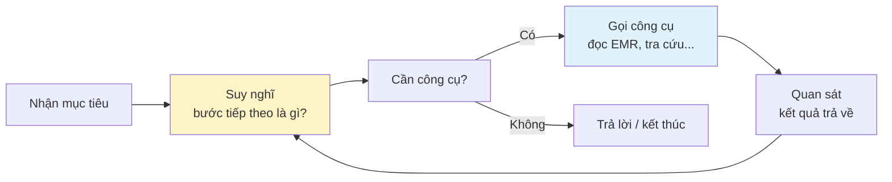
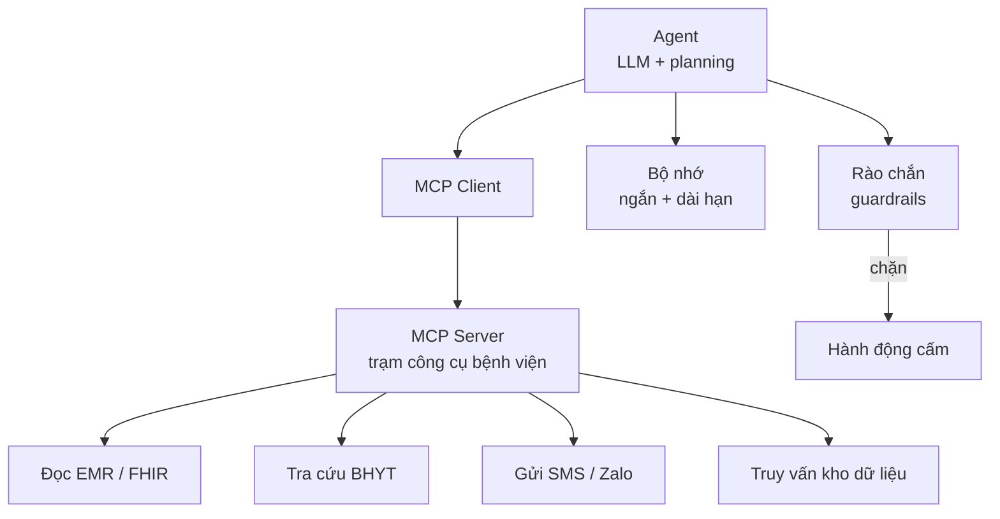
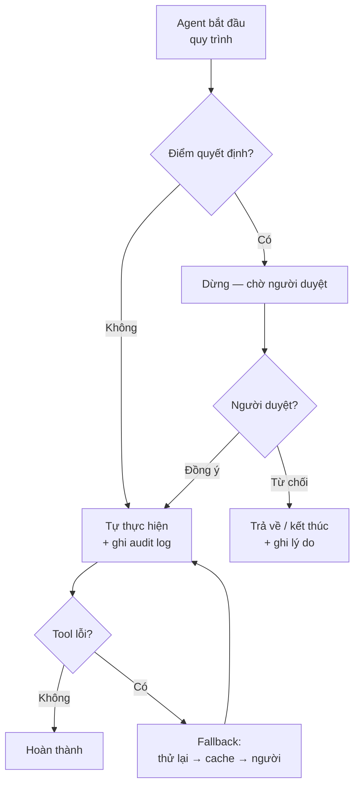

# Chương 9. Agentic AI — làn sóng 2025–2026

## Mở đầu: một hồ sơ BHYT đi qua bao nhiêu bàn tay

Chị Hoa làm giám định bảo hiểm y tế tại một bệnh viện tuyến tỉnh. Mỗi tháng, khoa chị xử lý hơn 3.000 hồ sơ thanh toán. Một bộ hồ sơ "đẹp" đi qua 4 bàn tay: nhân viên tổng hợp, coder gán mã, giám định viên kiểm tra, kế toán thanh toán. Một bộ hồ sơ "xấu" — thiếu chữ ký, mã bệnh không khớp chẩn đoán, thuốc vượt trần — bị trả về, đi lại 2–3 vòng, kéo dài cả tháng. Chị Hoa giỏi nghề, nhưng chị chỉ có hai mắt và một ngày 8 tiếng.

Đầu năm 2026, bệnh viện thí điểm một thứ mới. Thay vì thuê thêm người, họ triển khai một {t:agent}tác nhân AI{/t}: nó tự đọc hồ sơ điện tử, tự đối chiếu từng mục với quy định BHYT hiện hành, tự đánh dấu những điểm bất thường — và chỉ chuyển cho chị Hoa những hồ sơ có vấn đề, kèm lý do cụ thể từng điểm. Tháng đầu tiên, tỷ lệ hồ sơ phải làm lại giảm một nửa. Chị Hoa không mất việc — chị chuyển sang làm việc khó hơn: xử lý các ca phức tạp mà trước đây chị không có thời gian đụng tới.

Câu chuyện này không phải về một chatbot thông minh hơn. Chatbot chỉ trả lời khi bạn hỏi. Thứ bệnh viện của chị Hoa triển khai là một thứ khác: **AI tự làm một quy trình nhiều bước** — đọc, đối chiếu, đánh dấu, chuyển việc — mà không cần ai nhắc từng bước. Đó chính là Agentic AI, làn sóng công nghệ định hình 2025–2026, và là "chương gánh" của cuốn cẩm nang này: hiểu được nó, bạn sẽ hiểu được hướng đi của AI y tế trong 5 năm tới.

Câu hỏi trung tâm của chương này: **Agentic AI khác gì chatbot mà ta đã quen, nó làm được những việc gì cụ thể trong bệnh viện Việt Nam, và làm sao triển khai nó mà không mất kiểm soát?** Đọc xong chương, bạn sẽ:

- Phân biệt được Agentic AI với chatbot, với AI hẹp (narrow AI) và với AGI — không còn nhầm lẫn khái niệm;
- Hiểu 5 thành phần tạo nên một agent (mô hình ngôn ngữ, gọi công cụ, bộ nhớ, lập kế hoạch, rào chắn) bằng ngôn ngữ không lập trình;
- Nắm 8 use case ưu tiên cho y tế Việt Nam, mỗi use case biết rõ agent làm gì và con người can thiệp ở đâu;
- Biết kiến trúc production an toàn: human-in-the-loop, audit log, fallback và cách đánh giá hiệu quả.

```metrics
[
  {"value":"5","label":"Thành phần của một agent","hint":"LLM · tool · memory · planning · guardrail"},
  {"value":"8","label":"Use case ưu tiên y tế VN","hint":"BHYT → dược lâm sàng"},
  {"value":"1","label":"Nguyên tắc kiểm soát","hint":"human-in-the-loop"},
  {"value":"100%","label":"Hành động được ghi log","hint":"audit trail đầy đủ"}
]
```

## 1. Agentic AI là gì — và không phải là gì

### 1.1. Định nghĩa gọn

{t:agent}Agentic AI{/t} là hệ thống AI có thể **tự thực hiện một chuỗi hành động để hoàn thành mục tiêu**, bằng cách kết hợp 5 thành phần:

1. **{t:llm}Mô hình ngôn ngữ lớn{/t} (LLM)** — "bộ não": hiểu yêu cầu, suy luận, quyết định bước tiếp theo.
2. **{t:tool-calling}Gọi công cụ{/t} (tool calling)** — "đôi tay": gọi các hàm, API, hệ thống bên ngoài (đọc {t:emr}bệnh án{/t}, tra cứu {t:fhir}FHIR{/t}, gửi email, truy vấn cơ sở dữ liệu...).
3. **Bộ nhớ (memory)** — "trí nhớ": nhớ ngữ cảnh cuộc trò chuyện hiện tại (ngắn hạn) và thông tin đã học về người dùng/quy trình (dài hạn).
4. **Lập kế hoạch (planning)** — "bản đồ": chia mục tiêu lớn thành các bước nhỏ, điều chỉnh khi gặp trở ngại.
5. **{t:guardrail}Rào chắn{/t} (guardrail)** — "phanh và dây an toàn": giới hạn những gì agent được/không được làm, lọc đầu vào và đầu ra.

🎬 **Video minh họa:** [Harrison Chase (LangChain) — "Long Term Memory with LangGraph" tại AI Dev 25: bộ nhớ dài hạn của agent (semantic/episodic/procedural memory) — một trong 5 thành phần cốt lõi](https://www.youtube.com/watch?v=R0OdB-p-ns4).

Thiếu bất kỳ thành phần nào, hệ thống sẽ khập khiễng: có não không tay thì chỉ nói được (đó là chatbot); có tay không phanh thì nguy hiểm (đó là điều chương này cảnh báo).

### 1.2. Vòng lặp ReAct: cách agent "suy nghĩ và làm"

Hầu hết agent hiện nay chạy theo một vòng lặp đơn giản gọi là {t:react}ReAct{/t} (Reason + Act):



Ví dụ cụ thể với hồ sơ BHYT của chị Hoa: agent nhận mục tiêu "kiểm tra hồ sơ này" → suy nghĩ "cần đọc chẩn đoán và mã bệnh" → gọi công cụ đọc EMR → quan sát thấy mã J18.9 nhưng ghi chú ghi "viêm phổi" → suy nghĩ "cần đối chiếu quy định" → gọi công cụ tra cứu → phát hiện mã không khớp → đánh dấu và chuyển cho người giám định. Mỗi vòng lặp chỉ vài giây, nhưng chuỗi 5–10 vòng lặp tạo thành một "quy trình" hoàn chỉnh mà trước đây cần con người làm thủ công.

### 1.3. Phân biệt nhanh: chatbot, narrow AI, Agentic AI, AGI

| Khái niệm | Làm gì | Ví dụ y tế |
|---|---|---|
| **Chatbot** | Trả lời theo câu hỏi, một lượt | Hỏi đáp về thủ tục khám bệnh |
| **AI hẹp (Narrow AI)** | Một việc chuyên sâu, rất giỏi | AI đọc ảnh X-quang (chương 5) |
| **Agentic AI** | Chuỗi hành động đa bước, dùng công cụ | Agent kiểm tra hồ sơ BHYT end-to-end |
| **AGI** | Trí tuệ tổng quát ngang con người | **Chưa tồn tại** — mọi tuyên bố ngược lại đều là marketing |

Điểm cần nhớ: Agentic AI **không phải** AGI. Nó không "hiểu" như con người, không có ý thức, và vẫn mắc lỗi — nhất là {t:hallucination}bịa đặt{/t} và sai lầm trong chuỗi dài (lỗi bước 2 bị khuếch đại ở bước 8). Vì vậy toàn bộ phần 5 của chương này dành cho kiểm soát.

### 1.4. Agent khác gì tự động hóa cũ (RPA)?

Nhiều bệnh viện đã nghe về RPA (robotic process automation) — "robot phần mềm" tự động nhập liệu, copy-paste giữa các hệ thống. Phân biệt nhanh:

| | RPA truyền thống | Agentic AI |
|---|---|---|
| Cách làm việc | Làm theo kịch bản cứng đã lập trình sẵn từng bước | Tự lập kế hoạch và điều chỉnh theo tình huống |
| Khi gặp dữ liệu lạ | Dừng lại, báo lỗi, chờ người sửa kịch bản | Thử cách khác (gọi tool khác, hỏi thêm thông tin) |
| Vốn hiểu biết | Không có — chỉ biết đúng việc được dạy | Có kiến thức nền rộng từ LLM |
| Điểm mạnh | Ổn định, rẻ, dễ kiểm soát với việc hoàn toàn lặp lại | Linh hoạt với việc có biến thể, cần suy luận |

Nói nôm na: RPA là **công nhân dây chuyền** (làm đúng một động tác, rất nhanh, nhưng đổi mẫu sản phẩm là phải lập trình lại), agent là **thợ lành nghề** (giao mục tiêu, tự xoay sở). Trong y tế, RPA phù hợp với việc hoàn toàn chuẩn hóa (ví dụ: tự động tải báo cáo BHYT theo mẫu cố định mỗi tháng), còn agent phù hợp với việc mỗi ca mỗi khác (ví dụ: kiểm tra hồ sơ BHYT với đủ loại sai sót không đoán trước được). Hai thứ bổ sung nhau, không thay thế nhau.

🎬 **Video minh họa:** [Satya Nadella (CEO Microsoft) nói về hệ thống AI đa tác vụ và case Stanford Medicine dùng multi-agent hỗ trợ tumor board ung thư — ghi hình tại Build 2025](https://www.youtube.com/watch?v=5P9nRF4lIwU).

## 2. Tám use case ưu tiên cho y tế Việt Nam

Dưới đây là 8 use case được chọn theo 3 tiêu chí: **giá trị rõ** (tiết kiệm thời gian hoặc tiền thật), **rủi ro kiểm soát được** (có điểm dừng cho con người), và **khả thi với hạ tầng hiện tại** (dùng được với EMR/HIS đã có). Mỗi use case nêu rõ: agent làm gì, và human-in-the-loop ở đâu.

### Use case 1. Tự động hóa giám định BHYT

**Mô tả:** như câu chuyện mở đầu — hàng nghìn hồ sơ thanh toán mỗi tháng, phần lớn công việc là đối chiếu một cách máy móc với quy định.

**Agent làm gì:** đọc hồ sơ điện tử → trích chẩn đoán, thủ thuật, thuốc, vật tư → đối chiếu với danh mục BHYT chi trả và các quy định hiện hành → phân loại "đạt / cần xem lại / từ chối đề xuất", kèm lý do từng điểm và đoạn văn bản dẫn chứng.

**Human-in-the-loop:** giám định viên chỉ xem các hồ sơ "cần xem lại"; mọi quyết định từ chối thanh toán hoặc truy thu đều do người ký. Agent không bao giờ được tự ra quyết định tài chính.

### Use case 2. Phê duyệt trước (prior authorization)

**Mô tả:** nhiều kỹ thuật cao, thuốc đắt cần được phê duyệt chi trả trước khi thực hiện. Quy trình hiện tại: bác sĩ viết giấy, nhân viên mang đi xin dấu, chờ đợi.

**Agent làm gì:** thu thập hồ sơ bệnh án liên quan → kiểm tra xem ca bệnh có đáp ứng tiêu chí chi trả không → soạn tờ trình phê duyệt đầy đủ căn cứ → theo dõi trạng thái và nhắc khi quá hạn.

**Human-in-the-loop:** hội đồng/bộ phận phê duyệt ra quyết định cuối cùng. Agent chỉ chuẩn bị hồ sơ, không quyết định chi tiền.

### Use case 3. Điều phối lịch hẹn liên khoa

**Mô tả:** bệnh nhân cần khám 3 chuyên khoa trong một buổi sáng; điều dưỡng phải gọi điện từng khoa để xếp slot — việc tốn giờ nhưng ít giá trị chuyên môn.

**Agent làm gì:** đọc chỉ định của bác sĩ → tìm khung giờ trống của các khoa liên quan → đề xuất lịch tối ưu (giảm thời gian chờ) → nhắn tin xác nhận cho bệnh nhân → tự động dời lịch khi có thay đổi đột xuất.

**Human-in-the-loop:** điều dưỡng duyệt các lịch phức tạp (bệnh nhân nặng, cần chuẩn bị đặc biệt); bệnh nhân luôn có nút "gặp người thật".

### Use case 4. Hậu kiểm hồ sơ bệnh án

**Mô tả:** hồ sơ thiếu chữ ký, thiếu tường trình, chẩn đoán và mã bệnh không khớp — phát hiện muộn thì sửa rất tốn công, nhất là khi quyết toán.

**Agent làm gì:** quét định kỳ toàn bộ hồ sơ đã đóng → phát hiện thiếu sót (thiếu biên bản, mã ICD không khớp ghi chú, thuốc không có chỉ định tương ứng) → gửi danh sách việc cần bổ sung cho từng bác sĩ, kèm link trực tiếp đến chỗ thiếu.

**Human-in-the-loop:** bác sĩ điều trị là người bổ sung và chịu trách nhiệm. Agent chỉ "soi", không tự sửa hồ sơ.

### Use case 5. Trợ lý nghiên cứu lâm sàng

**Mô tả:** nghiên cứu sinh mất hàng tháng để rà y văn, trích số liệu, theo dõi tiến độ tuyển bệnh nhân cho đề tài.

**Agent làm gì:** tìm kiếm y văn theo câu hỏi nghiên cứu → trích xuất bảng số liệu từ các bài báo → đối chiếu tiêu chí tuyển chọn với hồ sơ bệnh nhân (đã ẩn danh) → nhắc lịch tái khám, thu thập số liệu theo protocol.

**Human-in-the-loop:** nhà nghiên cứu đọc và xác minh mọi trích dẫn (chống bịa đặt tài liệu tham khảo — xem chương 4); mọi quyết định đưa bệnh nhân vào nghiên cứu do hội đồng đạo đức và bác sĩ quyết định.

### Use case 6. Agent giáo dục sức khỏe cá nhân hóa

**Mô tả:** tờ rơi hướng dẫn chung chung ít ai đọc. Bệnh nhân đái tháo đường 65 tuổi ở nông thôn cần nội dung khác hẳn bệnh nhân 30 tuổi ở thành phố.

**Agent làm gì:** dựa trên hồ sơ (tuổi, trình độ, bệnh nền, ngôn ngữ) → soạn tài liệu giáo dục phù hợp (câu ngắn, ví dụ gần gũi) → nhắc uống thuốc, tái khám qua Zalo/SMS → trả lời câu hỏi thường gặp trong phạm vi đã duyệt.

**Human-in-the-loop:** điều dưỡng/bác sĩ duyệt nội dung trước khi gửi lần đầu cho từng nhóm bệnh; agent chỉ được trả lời trong "hàng rào" câu hỏi đã phê duyệt, ngoài phạm vi thì chuyển cho người thật.

### Use case 7. Agent theo dõi bệnh mạn tính

**Mô tả:** bệnh nhân tăng huyết áp, đái tháo đường cần theo dõi chỉ số tại nhà, nhưng bác sĩ không thể gọi điện cho hàng trăm người mỗi tuần.

**Agent làm gì:** tổng hợp chỉ số từ thiết bị đo tại nhà (huyết áp, đường huyết) → phát hiện xu hướng bất thường (tăng dần 3 tuần liên tiếp) → cảnh báo cho bác sĩ kèm biểu đồ → nhắc bệnh nhân tái khám sớm.

**Human-in-the-loop (tuyệt đối):** agent **không bao giờ** tự điều chỉnh liều thuốc hay đưa ra chỉ định điều trị mới. Mọi thay đổi điều trị do bác sĩ quyết định. Đây là lằn ranh đỏ không thương lượng (xem chương 6 về CDSS).

### Use case 8. Agent quản lý dược lâm sàng

**Mô tả:** dược sĩ lâm sàng phải rà tương tác thuốc trên hàng trăm đơn mỗi ngày, đồng thời theo dõi tồn kho thuốc.

**Agent làm gì:** quét đơn thuốc → cảnh báo tương tác, trùng lặp, liều bất thường theo tuổi/cân nặng/suy thận → gợi ý thuốc thay thế trong danh mục → dự báo tồn kho và đề xuất đặt hàng.

**Human-in-the-loop:** dược sĩ duyệt mọi cảnh báo trước khi phản hồi cho bác sĩ kê đơn; quyết định thay đổi thuốc là của bác sĩ điều trị.

🎬 **Video minh họa:** ["Keragon Agents: AI Teammates for Healthcare Ops" — demo agent thực tế trong vận hành y tế: tiếp nhận bệnh nhân, nhắc lịch hẹn, xác minh bảo hiểm, xử lý no-show](https://www.youtube.com/watch?v=8-xQq6B5NO0).

```callout kind=tip title="Cách chọn use case đầu tiên cho đơn vị mình"
Chấm mỗi use case theo 3 câu hỏi: (1) Việc này có lặp lại trên 100 lần/tháng không? (2) Khi agent sai, có người phát hiện trước khi gây hại không? (3) Dữ liệu cần thiết đã có trong EMR/HIS chưa? Use case nào "có" cả 3 câu thì làm trước.
```

## 3. Kiến trúc agent: MCP là "cổng USB-C chung"

Để agent gọi được công cụ của bệnh viện (đọc EMR, tra cứu BHYT, gửi SMS...), trước đây mỗi tích hợp phải viết riêng — tốn kém và khó bảo trì. {t:mcp}MCP (Model Context Protocol){/t}, chuẩn mở do Anthropic khởi xướng cuối 2024, giải quyết đúng vấn đề này theo cách rất dễ hình dung:

**Hãy tưởng tượng MCP như cổng USB-C.** Trước đây mỗi hãng điện thoại một loại sạc (như mỗi hệ thống một API riêng). USB-C thống nhất tất cả: một đầu cắm dùng cho mọi thiết bị. Tương tự, MCP thống nhất cách agent "cắm" vào các hệ thống: một lần triển khai MCP server cho HIS/EMR, mọi agent (dù chạy trên mô hình nào) đều dùng được — không phải viết lại tích hợp cho từng agent.

Ba khái niệm kỹ thuật, giải thích không lập trình:

- **{t:tool-calling}Gọi công cụ (function/tool calling):** khả năng của {t:llm}LLM{/t} không chỉ trả lời chữ mà còn "bấm nút" — ví dụ thay vì nói "tôi sẽ tra cứu", nó thực sự gọi hàm tra cứu và đọc kết quả trả về.
- **MCP server:** một "trạm công cụ" của bệnh viện — nơi tập hợp các công cụ đã được đóng gói chuẩn (đọc bệnh án, tra danh mục thuốc, gửi tin nhắn...). Agent chỉ cần biết địa chỉ trạm là dùng được.
- **Bộ nhớ (memory):** gồm trí nhớ ngắn hạn (đang làm dở hồ sơ nào, bệnh nhân vừa nói gì) và trí nhớ dài hạn (quy định BHYT mới nhất, sở thích làm việc của khoa). Không có memory, agent mỗi lần gọi là "mất trí" và phải hỏi lại từ đầu.



🎬 **Video minh họa:** ["Claude & MCP: Building the USB-C for the Legal Tech" — Den Delimarsky (core maintainer MCP tại Anthropic) giải thích Model Context Protocol: phân quyền, auditability và kiểm soát truy cập](https://www.youtube.com/watch?v=OWzI07mw5Dc).

## 4. Framework, công cụ và rào chắn

**Framework** là bộ khung phần mềm để xây agent mà không phải làm từ số không. Ba cái tên đáng biết (tình hình đến 10/2026):

- **LangGraph (LangChain):** framework phổ biến nhất để xây agent dạng đồ thị trạng thái — phù hợp với quy trình y tế nhiều bước, nhiều nhánh rẽ (ví dụ: hồ sơ đạt → duyệt; không đạt → trả về bổ sung).
- **OpenAI Agents SDK:** bộ công cụ nhẹ của OpenAI để dựng agent dùng mô hình GPT, kèm cơ chế handoff (chuyển việc giữa các agent chuyên trách).
- **MCP servers:** hệ sinh thái "trạm công cụ" chuẩn MCP ngày càng nhiều — có server đọc file, truy vấn SQL, duyệt web... Đơn vị y tế có thể tự viết MCP server cho HIS/EMR của mình (xem chương 13).

Ngoài ra còn có các nền tảng low-code/no-code cho phép ghép agent bằng kéo-thả — phù hợp cho Lab 9 và cho các đơn vị không có đội lập trình.

| Framework | Cách tiếp cận | Phù hợp với |
|---|---|---|
| **LangGraph** | Xây agent dạng đồ thị trạng thái, kiểm soát từng nhánh rẽ | Đội kỹ thuật, quy trình y tế phức tạp nhiều bước |
| **OpenAI Agents SDK** | Nhẹ, nhanh, agent chuyển việc cho nhau (handoff) | Thử nghiệm nhanh, tích hợp hệ OpenAI |
| **MCP servers** | Chuẩn mở cho "trạm công cụ" dùng chung | Bệnh viện muốn nhiều agent dùng chung một bộ công cụ |
| **Nền tảng low-code** | Kéo-thả, không cần lập trình | Đơn vị không có đội dev, Lab 9, POC nhanh |

Chọn framework nào ít quan trọng hơn việc **thiết kế đúng quy trình và rào chắn** (phần 5). Một agent LangGraph thiết kế cẩu thả vẫn nguy hiểm hơn một agent low-code được rào chắn kỹ.

**{t:guardrail}Rào chắn{/t} (guardrails)** là lớp bảo vệ bao quanh agent, gồm:

- **Bộ lọc đầu vào:** chặn prompt độc hại, chặn yêu cầu vượt quyền (ví dụ: "xóa toàn bộ hồ sơ").
- **Bộ lọc đầu ra:** kiểm tra kết quả trước khi thực hiện — chặn nội dung bịa đặt, chặn hành động rủi ro cao.
- **Sandbox công cụ:** mỗi công cụ chỉ được quyền tối thiểu cần thiết (agent đọc EMR thì không được quyền xóa; agent gửi SMS thì không được truy cập tài khoản ngân hàng).

**Ví dụ rào chắn cho agent giám định BHYT (use case 1):** công cụ đọc EMR đặt ở chế độ **chỉ đọc** (read-only) — agent có gọi sai cũng không sửa được hồ sơ; công cụ tra cứu quy định chỉ được đọc văn bản đã phê duyệt; agent **không được cấp** công cụ "phê duyệt thanh toán" — chức năng đó chỉ tồn tại trong tài khoản của giám định viên; mọi đề xuất "từ chối" của agent bắt buộc đi qua màn hình duyệt của người, kèm lý do và dẫn chứng. Với 4 lớp này, kể cả khi agent "nổi loạn" (bịa lý do từ chối), thiệt hại tối đa cũng chỉ là một đề xuất sai bị người gạt đi — chứ không phải một quyết định sai đã thực thi.

```callout kind=warning title="Agent càng tự chủ, rào chắn càng phải chắc"
Một agent được phép làm 3 việc cần 3 lớp kiểm soát tương ứng. Quy tắc thực tế: liệt kê mọi công cụ agent được gọi, với mỗi công cụ trả lời "nếu nó gọi sai thì hậu quả tệ nhất là gì?" — hậu quả càng nặng, rào chắn càng phải dày (từ log đơn giản đến bắt buộc người duyệt).
```

🎬 **Video minh họa:** [Harrison Chase (LangChain) — "3 ingredients for building reliable enterprise agents": 3 nguyên tắc xây agent đáng tin cậy — tối đa giá trị khi đúng, giảm thiểu chi phí khi sai](https://www.youtube.com/watch?v=kTnfJszFxCg).

## 5. Kiến trúc production cho y tế: kiểm soát trước, thông minh sau

Triển khai agent trong bệnh viện thật khác hẳn demo trên sân khấu. Kiến trúc production cần 4 trụ cột:

**1. Human-in-the-loop tại điểm quyết định.** Không phải mọi bước đều cần người — chỉ những điểm "không thể quay lại": ký duyệt thanh toán, thay đổi điều trị, gửi thông tin ra ngoài bệnh viện. Thiết kế tốt là agent tự chạy 90% việc lặp lại, và dừng lại đúng 10% điểm cần người. Vẽ sơ đồ quy trình và đánh dấu đỏ các điểm dừng này trước khi viết một dòng code nào.

**2. Audit log toàn bộ hành động.** Mọi suy nghĩ, mọi lần gọi công cụ, mọi kết quả trả về của agent đều phải được ghi log không thể sửa. Khi có sự cố, log là thứ duy nhất cho phép truy vết "ai đã làm gì, khi nào, dựa trên cái gì". Đây cũng là yêu cầu gần như chắc chắn của kiểm toán và pháp chế.

**3. Fallback khi công cụ thất bại.** Công cụ có thể sập, API có thể timeout, dữ liệu có thể thiếu. Agent production phải có kịch bản dự phòng cho từng lỗi: thử lại 3 lần → dùng dữ liệu cache → chuyển cho người xử lý thủ công → báo cáo. Agent "đơ" im lặng hoặc bịa kết quả khi tool lỗi là thiết kế tồi.

**4. Đánh giá liên tục.** Đo 3 chỉ số: **tỷ lệ thành công tác vụ** (bao nhiêu % quy trình agent hoàn thành đúng không cần sửa), **thời gian xử lý trung bình**, và **chi phí token** (mỗi lần agent "suy nghĩ" đều tốn tiền theo lượng chữ xử lý). Đặt ngưỡng tối thiểu (ví dụ task success > 90%) và tự động cảnh báo khi rớt ngưỡng.



🎬 **Video minh họa:** [Phiên thảo luận về AI tại Hội đồng Bảo an Liên Hợp Quốc — Sam Altman (OpenAI), Dario Amodei (Anthropic), Yoshua Bengio cùng bàn về an toàn và quản trị AI, 23/09/2026](https://www.youtube.com/watch?v=5nAe_t6cy4s).

```callout kind=danger title="Checklist trước khi cho agent chạm vào hệ thống thật"
<label style="display:block;margin:8px 0;cursor:pointer"><input type="checkbox" style="margin-right:10px;transform:scale(1.3);accent-color:#dc2626"> Đã liệt kê mọi công cụ và quyền tối thiểu của từng công cụ?</label>
<label style="display:block;margin:8px 0;cursor:pointer"><input type="checkbox" style="margin-right:10px;transform:scale(1.3);accent-color:#dc2626"> Đã đánh dấu mọi điểm quyết định cần người duyệt trên sơ đồ quy trình?</label>
<label style="display:block;margin:8px 0;cursor:pointer"><input type="checkbox" style="margin-right:10px;transform:scale(1.3);accent-color:#dc2626"> Audit log đã bật và không thể bị agent tự xóa?</label>
<label style="display:block;margin:8px 0;cursor:pointer"><input type="checkbox" style="margin-right:10px;transform:scale(1.3);accent-color:#dc2626"> Đã test fallback với 10 tình huống tool lỗi giả lập?</label>
<label style="display:block;margin:8px 0;cursor:pointer"><input type="checkbox" style="margin-right:10px;transform:scale(1.3);accent-color:#dc2626"> Dữ liệu test là mô phỏng — không có dữ liệu bệnh nhân thật?</label>

Thiếu một dấu tick thì agent ở lại môi trường thử nghiệm.
```

## 6. Case đóng chương: MediBot từ chatbot đến agent

> **Case của tác giả (tình huống mô phỏng dựa trên kinh nghiệm triển khai)** — các chi tiết kỹ thuật và số liệu dưới đây được đơn giản hóa để minh họa kiến trúc, không phải tài liệu kỹ thuật của một sản phẩm cụ thể. <!-- CẦN TÁC GIẢ XÁC MINH: mức độ khớp với kiến trúc MediBot thực tế -->

MediBot khởi đầu năm 2024 như một chatbot {t:rag}RAG{/t} đơn giản: bệnh nhân hỏi về thủ tục khám, bot tìm trong tài liệu bệnh viện và trả lời. Nó làm tốt đúng một việc — trả lời. Nhưng ban giám đốc muốn nhiều hơn: "bot có tự đặt lịch tái khám cho bệnh nhân được không?"

Nhóm kỹ thuật nhận ra chatbot không làm được việc đó — đặt lịch cần **hành động**: đọc chỉ định, kiểm tra lịch trống, ghi vào hệ thống, nhắn xác nhận. Họ thiết kế lại MediBot thành agent với 4 thay đổi:

1. **Thêm tool calling:** MediBot được cấp 3 công cụ qua một MCP server nội bộ: đọc lịch hẹn (FHIR Appointment), ghi lịch mới, gửi SMS xác nhận.
2. **Thêm planning:** thay vì trả lời ngay, MediBot lập kế hoạch 4 bước (đọc chỉ định → tìm slot → đề xuất 2 khung giờ → chờ bệnh nhân chọn → ghi lịch).
3. **Thêm memory:** nhớ bệnh nhân đã khám khoa nào, thích khung giờ nào, để lần sau đề xuất nhanh hơn.
4. **Thêm guardrail + HITL:** MediBot được phép ghi lịch khám thường, nhưng mọi lịch can thiệp/phẫu thuật đều dừng lại chờ điều dưỡng xác nhận; toàn bộ hành động ghi audit log.

Kết quả sau 3 tháng thí điểm tại một phòng khám: <!-- CẦN TÁC GIẢ XÁC MINH: số liệu thí điểm --> tỷ lệ bệnh nhân tự đặt lịch thành công qua bot tăng rõ rệt, điều dưỡng giảm thời gian nghe điện thoại đặt lịch. Nhưng cũng có bài học xương máu: tuần thứ hai, một tool tra cứu lịch bị lỗi timeout, agent thay vì báo lỗi lại... bịa ra một khung giờ không tồn tại. May mắn là bệnh nhân gọi điện xác nhận nên phát hiện kịp. Từ đó nhóm bổ sung quy tắc sắt: **tool lỗi thì dừng và báo, không bao giờ được đoán**.

Bài học của MediBot cũng là bài học của chương này: **sức mạnh của agent nằm ở đôi tay (tool), nhưng an toàn của agent nằm ở cái phanh (guardrail + human-in-the-loop).** Đừng bao giờ triển khai tay mà quên phanh.

## 7. Lab 9 — Xây agent BHYT trên sandbox

```chart
{"type":"bar","title":"Lab 9 — thời lượng ước tính theo mức nhiệm vụ","data":[{"name":"L0 · Hiểu agent","phút":20},{"name":"L1 · Ghép tool","phút":45},{"name":"L2 · Full quy trình","phút":75},{"name":"L3 · Guardrail","phút":105}],"keys":["phút"],"yLabel":"phút"}
```

<div class="lab-cta">
<a href="/lab/lab-09" target="_blank" rel="noopener noreferrer" class="lab-btn">
▶ Mở Lab 9 trong tab mới
</a>
<div class="lab-meta">20–105 phút tùy mức (L0–L3) · AI chấm rubric 5 tiêu chí · Lưu tiến độ vào sổ grading</div>
<span class="lab-cta-note">Trên sandbox low-code: ghép các tool (đọc FHIR, mã hóa ICD-10, kiểm tra chính sách BHYT, xử lý từ chối) thành agent kiểm tra hồ sơ, test với 10 hồ sơ giả lập.</span>
</div>

## 8. Nguồn và đọc thêm

**Tài liệu kỹ thuật (tham khảo, kiểm tra phiên bản mới nhất khi dùng):**
- LangChain — tài liệu LangGraph và framework agent ([docs.langchain.com](https://docs.langchain.com)).
- Anthropic — giới thiệu Model Context Protocol ([modelcontextprotocol.io](https://modelcontextprotocol.io)).
- OpenAI — tài liệu Agents SDK ([openai.github.io/openai-agents-python](https://openai.github.io/openai-agents-python/)).

**Khung pháp lý và đạo đức:**
- {t:luatai}Luật Trí tuệ nhân tạo số 134/2025/QH15{/t} — nghĩa vụ minh bạch và ghi log hệ thống AI tương tác với con người.

> Lưu ý: tài liệu kỹ thuật của nhà cung cấp thay đổi nhanh; luôn đối chiếu với phiên bản mới nhất khi triển khai thực tế.

**Đọc thêm trong cẩm nang:** [chương 4 — Nền tảng AI đa nhiệm](/chapters/04-nen-tang-ai-da-nhiem) (chatbot và tác nhân AI), [chương 8 — AI trong quản trị bệnh viện](/chapters/08-quan-tri-benh-vien) (quy trình hành chính để agent tự động hóa), [chương 13 — Hạ tầng tính toán](/chapters/13-ha-tang-tinh-toan) (tự chủ mô hình), [chương 14 — An toàn, tuân thủ](/chapters/14-an-toan-tuan-thu) (khung quản trị đầy đủ).

**Video minh họa trong chương:**
- Satya Nadella (Microsoft), "The Future of AI-Powered Coding and Multi-Agent Systems" — Build 2025 ([YouTube](https://www.youtube.com/watch?v=5P9nRF4lIwU)).
- Harrison Chase (LangChain), "Long Term Memory with LangGraph" — AI Dev 25 ([YouTube](https://www.youtube.com/watch?v=R0OdB-p-ns4)).
- Harrison Chase, "3 ingredients for building reliable enterprise agents" — AI Engineer, 23/07/2025 ([YouTube](https://www.youtube.com/watch?v=kTnfJszFxCg)).
- Den Delimarsky (Anthropic), "Claude & MCP: Building the USB-C for the Legal Tech" — The Geek In Review, 15/03/2026 ([YouTube](https://www.youtube.com/watch?v=OWzI07mw5Dc)).
- "Keragon Agents: AI Teammates for Healthcare Ops" — demo agent vận hành y tế, 01/09/2026 ([YouTube](https://www.youtube.com/watch?v=8-xQq6B5NO0)).
- UN Security Council, "AI session with Sam Altman, Dario Amodei, Yoshua Bengio" — 23/09/2026 ([YouTube](https://www.youtube.com/watch?v=5nAe_t6cy4s)).

> Lưu ý: nội dung video mang tính thời điểm; kiểm tra lại thông tin trước khi trích dẫn.

---

> **Trạng thái bản thảo:** đây là bản nháp do AI soạn theo "Quy chuẩn biên tập chương và Lab" ngày 04/10/2026, **chưa qua tác giả duyệt**. Không phát hành dưới tên chủ biên. Các tên framework, tính năng sản phẩm mang tính thời điểm (10/2026) và cần kiểm tra lại khi xuất bản.
