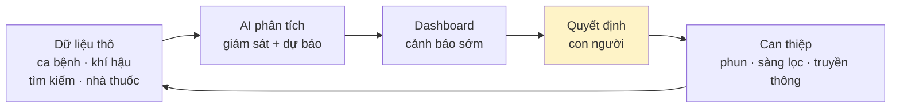

# Chương 10. AI trong y tế dự phòng và dịch tễ

## Mở đầu: mùa sốt xuất huyết đến trước khi ta kịp chuẩn bị

Tháng 7, bác sĩ Tuấn — phó giám đốc Trung tâm Y tế dự phòng một tỉnh miền Trung — nhận được báo cáo tuần: số ca sốt xuất huyết tăng gấp đôi so với tuần trước, 3 ổ dịch mới ở 2 huyện. Ông gọi điện cho các trạm: "Phun hóa chất chưa? Còn tồn bao nhiêu lít?" Trạm này bảo hết, trạm kia bảo máy phun hỏng. Ông mở file Excel tổng hợp ca bệnh — số liệu của tuần trước nữa, vì các trạm gửi báo cáo chậm 7–10 ngày. Mùa mưa mới bắt đầu. Ông biết đỉnh dịch còn ở phía trước, nhưng không biết nó sẽ rơi vào tuần nào, huyện nào, và cần bao nhiêu nhân lực.

Cách làm hiện tại của chúng ta về cơ bản là **nhìn gương chiếu hậu**: thống kê những gì đã xảy ra, rồi phản ứng. AI mang đến khả năng mới: **nhìn qua kính chắn gió** — dùng dữ liệu quá khứ và hiện tại để dự báo 2–4 tuần tới, đủ sớm để phun hóa chất trước khi muỗi sinh sôi, chứ không phải sau khi bệnh nhân đã nhập viện.

Đó chính là câu hỏi trung tâm của chương này: **AI giúp y tế dự phòng chuyển từ "chữa cháy" sang "đón đầu" bằng cách nào, cần dữ liệu gì, mô hình nào phù hợp với điều kiện Việt Nam, và giới hạn của dự báo ở đâu?** Đọc xong chương, bạn sẽ:

- Hiểu 3 trụ cột của y tế dự phòng thời AI: giám sát dịch bằng big data, dự báo bùng phát, và phân tích bệnh không lây nhiễm;
- Phân biệt được các họ mô hình dự báo (từ ARIMA cổ điển đến foundation models) và biết khi nào dùng họ nào;
- Biết cách đọc và dùng dashboard dịch tễ để ra quyết định — và cách kể chuyện bằng số liệu với lãnh đạo;
- Có lộ trình triển khai 4 mức từ trạm y tế xã đến cấp quốc gia, cùng các cảnh báo về chất lượng dữ liệu và giới hạn của dự báo.

```metrics
[
  {"value":"2–4 tuần","label":"Dự báo trước đỉnh dịch","hint":"đủ sớm để can thiệp"},
  {"value":"3","label":"Trụ cột y tế dự phòng AI","hint":"giám sát · dự báo · NCD"},
  {"value":"4","label":"Họ mô hình dự báo","hint":"cổ điển → foundation"},
  {"value":"0","label":"Quyết định phong tỏa do AI","hint":"con người quyết định"}
]
```

## 1. Y tế dự phòng thời AI: ba trụ cột

Y tế dự phòng truyền thống dựa vào hệ thống báo cáo định kỳ: trạm y tế gửi số liệu lên huyện, huyện lên tỉnh, tỉnh lên trung ương — mỗi nấc trễ vài ngày đến vài tuần. AI không thay thế hệ thống này, mà bổ sung ba năng lực mới:

**Trụ cột 1 — Giám sát dịch bằng big data ({t:digital-epidemiology}dịch tễ học số{/t}).** Ngoài báo cáo ca bệnh chính thức, AI có thể đọc các "tín hiệu sớm": xu hướng tìm kiếm triệu chứng trên mạng, đơn thuốc hạ sốt bán ra tại nhà thuốc, số lượt khám cấp cứu vì sốt — những dữ liệu xuất hiện **trước** khi ca bệnh được xác nhận và báo cáo. Kết hợp nhiều tín hiệu, hệ thống phát hiện ổ dịch sớm hơn 1–2 tuần so với báo cáo truyền thống. <!-- CẦN TÁC GIẢ XÁC MINH: con số 1–2 tuần, nguồn nghiên cứu cụ thể -->

Hai tín hiệu sớm đáng chú ý trong những năm gần đây: **giám sát nước thải** — xét nghiệm nước thải đô thị để phát hiện mầm bệnh đang lưu hành trong cộng đồng trước khi ca bệnh lâm sàng xuất hiện (đã được dùng rộng rãi trong đại dịch COVID-19); và **giám sát gen** — giải trình tự gen mầm bệnh để phát hiện sớm biến chủng mới. AI đóng vai trò "phiên dịch viên": biến hàng terabyte dữ liệu thô từ các nguồn này thành cảnh báo mà con người đọc được.

**Trụ cột 2 — Dự báo bùng phát.** Từ dữ liệu quá khứ (số ca theo tuần, nhiệt độ, lượng mưa, mật độ dân cư...), mô hình AI dự báo số ca 2–4 tuần tới theo từng địa phương. Không phải để biết chính xác "tuần sau có 137 ca", mà để trả lời câu hỏi điều hành: "huyện nào cần ưu tiên phun hóa chất tuần này?"

**Trụ cột 3 — Bệnh không lây nhiễm (NCD) và chấm điểm rủi ro dân số.** Sốt xuất huyết gây chú ý theo mùa, nhưng đái tháo đường, tăng huyết áp, ung thư mới là gánh nặng âm thầm lớn nhất. AI phân tích dữ liệu khám sức khỏe định kỳ, bảo hiểm y tế để **chấm điểm rủi ro** từng nhóm dân cư (xã nào tỷ lệ tiền đái tháo đường cao nhất?), giúp y tế cơ sở chủ động mời khám sàng lọc thay vì chờ bệnh nhân đến khi đã biến chứng.



Điểm chung của cả ba trụ cột: **AI đề xuất, con người quyết định**. Không một mô hình nào được phép tự ra lệnh phong tỏa, cách ly hay phân bổ ngân sách — đó là quyết định của cơ quan có thẩm quyền, dựa trên bằng chứng mà AI cung cấp cùng nhiều yếu tố khác.

## 2. Các họ mô hình dự báo dịch: từ cổ điển đến hiện đại

Không cần biết lập trình để hiểu logic của 4 họ mô hình dưới đây. Hãy hình dung chúng như 4 thế hệ "thầy bói" với cách nhìn quá khứ khác nhau:

| Họ mô hình | Logic cốt lõi | Điểm mạnh | Điểm yếu | Dùng khi nào |
|---|---|---|---|---|
| **ARIMA / Prophet** (thống kê cổ điển) | Tìm quy luật lặp lại theo mùa trong chuỗi số liệu quá khứ | Đơn giản, chạy nhanh, dễ giải thích cho lãnh đạo | Không hiểu được yếu tố bên ngoài (mưa, nhiệt độ) | Tỉnh mới bắt đầu, dữ liệu ít, cần kết quả nhanh |
| **XGBoost** (học máy) | Kết hợp hàng chục yếu tố (mưa, nhiệt độ, mật độ dân...) thành cây quyết định | Mạnh với dữ liệu bảng, chịu được dữ liệu thiếu | Cần dữ liệu sạch và đủ dài (3–5 năm) | Đã có dữ liệu đa nguồn ổn định |
| **LSTM** (học sâu) | Mạng nơ-ron "nhớ" được diễn biến dài hạn của dịch | Bắt được đợt dịch bất thường, không theo mùa | Cần nhiều dữ liệu, khó giải thích ("hộp đen") | Có đội kỹ thuật, dữ liệu lớn |
| **Foundation models** (Chronos, TimeGPT) | Mô hình đã học từ hàng triệu chuỗi thời gian trên thế giới, tinh chỉnh cho địa phương | Khởi đầu tốt ngay cả khi dữ liệu địa phương ít | Mới, ít kiểm chứng độc lập trong y tế | Thử nghiệm, so sánh với mô hình cổ điển |

**Dữ liệu đầu vào quyết định 80% chất lượng dự báo** — mô hình chỉ chiếm 20%. Một mô hình ARIMA đơn giản chạy trên dữ liệu ca bệnh đầy đủ, đúng hạn sẽ thắng một mô hình học sâu chạy trên dữ liệu rỗng lỗ chỗ. Các nguồn dữ liệu nên kết hợp:

| Nguồn dữ liệu | Đơn vị cung cấp (ví dụ) | Tần suất cần | Lưu ý |
|---|---|---|---|
| Số ca bệnh theo xã/phường | Hệ thống giám sát bệnh truyền nhiễm (Cục Phòng bệnh) | Hàng tuần | Xương sống của mọi mô hình; kiểm tra độ đầy đủ trước |
| Nhiệt độ, lượng mưa, độ ẩm | Đài khí tượng thủy văn tỉnh | Hàng tuần/tháng | Yếu tố then chốt với bệnh do muỗi truyền |
| Ngập úng, công trình xây dựng | Sở TN&MT, UBND huyện | Hàng tháng/quý | Nơi muỗi sinh sản; dữ liệu thường thô, cần làm sạch |
| Lễ hội, mùa du lịch | Sở VH-TT&DL | Theo sự kiện | Giải thích các đợt lan dịch bất thường |
| Tín hiệu sớm (tìm kiếm, nhà thuốc) | Đối tác dữ liệu (thỏa thuận riêng) | Hàng ngày/tuần | Mạnh nhưng cần đánh giá tuân thủ dữ liệu |

- **Dữ liệu ca bệnh:** số ca theo tuần/tháng theo xã/phường (xương sống của mọi mô hình).
- **Dữ liệu khí hậu:** nhiệt độ, lượng mưa, độ ẩm — yếu tố then chốt với bệnh do muỗi truyền như sốt xuất huyết.
- **Dữ liệu môi trường:** chỉ số ngập úng, mật độ xây dựng (nơi muỗi sinh sản).
- **Dữ liệu di chuyển:** lễ hội, mùa du lịch làm dịch lan giữa các địa phương.

🎬 **Video minh họa:** [Dr. Swapnil Mishra (WHO Pandemic Hub) — "Using AI to Strengthen Infectious Disease Surveillance Systems": AI mô hình hóa bệnh truyền nhiễm trong điều hành y tế thực tế, với ví dụ giám sát sốt xuất huyết](https://www.youtube.com/watch?v=XXO519zTB_g).

```callout kind=tip title="Bắt đầu dự báo dịch mà không cần đội AI"
Một CDC tỉnh có thể bắt đầu ngay với Excel và mô hình Prophet (miễn phí): lấy 3 năm số ca sốt xuất huyết theo tuần + dữ liệu mưa, chạy dự báo 4 tuần tới, so sánh với thực tế 2 tháng. Nếu sai số chấp nhận được thì mới đầu tư sâu hơn. Đừng thuê đội AI khi chưa biết dữ liệu của mình có "xài được" không.
```

**Khi nào không nên dùng mô hình phức tạp.** Có 3 tình huống mà mô hình đơn giản thắng mô hình hiện đại: (1) dữ liệu dưới 2 năm — mô hình học sâu sẽ "học vẹt" nhiễu thay vì quy luật; (2) người dùng cuối là lãnh đạo không chuyên — một đường ARIMA giải thích được ("sốt xuất huyết năm nào cũng tăng tháng 7–10") có giá trị điều hành hơn một LSTM chính xác hơn 5% nhưng không ai hiểu vì sao; (3) cần chạy nhanh trong tình huống khẩn cấp — khi ổ dịch mới bùng phát, một dự báo thô trong 2 giờ quý hơn một dự báo tinh xảo sau 2 tuần. Nguyên tắc: **dùng mô hình đơn giản nhất mà vẫn trả lời được câu hỏi điều hành** — phức tạp hóa chỉ khi có bằng chứng mô hình đơn giản không đủ.

## 3. Bệnh không lây nhiễm: chấm điểm rủi ro dân số

Trong khi dịch bệnh gây ồn ào theo mùa, các bệnh không lây nhiễm (NCD) — đái tháo đường, tăng huyết áp, tim mạch, ung thư — mới là nguyên nhân tử vong hàng đầu và gánh nặng chi phí lớn nhất. AI giúp y tế dự phòng chuyển từ "khám ai đến" sang "tìm người cần khám":

- **Chấm điểm rủi ro:** từ dữ liệu khám sức khỏe định kỳ, đơn thuốc BHYT, AI tính điểm rủi ro cho từng nhóm (ví dụ: nam 45–60 tuổi, BMI > 25, huyết áp biên giới = nguy cơ cao). Trạm y tế dùng danh sách này để **chủ động mời** người dân đi sàng lọc.
- **Phát hiện khoảng trống chăm sóc:** bệnh nhân đái tháo đường đã 8 tháng không tái khám? Hệ thống tự đánh dấu để y tế thôn bản đến tận nhà nhắc.
- **Dự báo gánh nặng:** 5 năm tới, xã này cần bao nhiêu suất lọc thận, bao nhiêu thuốc huyết áp? — để lập kế hoạch ngân sách thay vì "xin bổ sung" cuối năm.

**Ví dụ cách chấm điểm vận hành:** TTYT một huyện chạy mô hình đơn giản trên dữ liệu khám sức khỏe định kỳ 3 năm: mỗi người dân được tính điểm từ 4 yếu tố (tuổi, BMI, huyết áp, đường huyết lúc đói). Ngưỡng điểm cao nhất 10% dân số được đưa vào danh sách "ưu tiên mời sàng lọc đái tháo đường". Kết quả sau 6 tháng: tỷ lệ phát hiện tiền đái tháo đường trong nhóm được mời cao gấp 3 lần so với khám đại trà — cùng một ngân sách, tìm được đúng người cần tìm. <!-- CẦN TÁC GIẢ XÁC MINH: số liệu minh họa, thay bằng case thật nếu có --> Đây chính là khác biệt giữa "khám ai đến" và "tìm người cần khám": không phải khám nhiều hơn, mà là khám đúng người hơn.

Khác với dự báo dịch (dữ liệu tổng hợp theo địa phương), chấm điểm rủi ro dùng **dữ liệu cá nhân** — nên mọi yêu cầu về {t:pdpd}bảo vệ dữ liệu cá nhân{/t} (Nghị định 13/2023/NĐ-CP) áp dụng đầy đủ: mục đích rõ ràng, consent, ẩn danh hóa khi phân tích tổng hợp, và tuyệt đối không để lộ danh sách "người có nguy cơ" ra ngoài hệ thống y tế.

## 4. Dashboard điều hành và data storytelling

Mô hình dù hay đến mấy mà lãnh đạo không hiểu thì cũng nằm trên giấy. Dashboard dịch tễ tốt có 3 lớp:

1. **Lớp cảnh báo (cho lãnh đạo):** bản đồ nhiệt — huyện nào đỏ, vàng, xanh; 3 con số then chốt (ca tuần này, xu hướng, dự báo 4 tuần). Nhìn 30 giây là ra quyết định được.
2. **Lớp phân tích (cho chuyên môn):** biểu đồ đường so sánh năm nay/năm trước, sai số dự báo, chi tiết từng ổ dịch.
3. **Lớp dữ liệu (cho kỹ thuật):** bảng số liệu thô, nguồn, thời gian cập nhật — để kiểm chứng khi có nghi ngờ.

**Data storytelling** là kỹ năng đi kèm: đừng trình bày 20 slide biểu đồ. Hãy kể một câu chuyện 3 phần: "chuyện gì đang xảy ra" (số liệu) → "tại sao" (phân tích) → "đề xuất làm gì" (hành động, nguồn lực cần). AI (xem chương 4) có thể giúp soạn khung câu chuyện, nhưng số liệu và đề xuất phải do chuyên môn của bạn chịu trách nhiệm.

```callout kind=warning title="Dashboard đẹp không cứu được dữ liệu xấu"
Nếu trạm gửi báo cáo chậm 10 ngày, dashboard của bạn dù đẹp cũng chỉ là "báo cáo chậm có màu sắc". Trước khi đầu tư dashboard AI, hãy đo 2 chỉ số: tỷ lệ báo cáo đúng hạn và tỷ lệ trường dữ liệu bị bỏ trống. Dưới 80% thì ưu tiên cải thiện quy trình báo cáo trước.
```

🎬 **Video minh họa:** [GS. Peter Haddawy (Đại học Mahidol, Thái Lan) — "Prognostic prediction models for dengue complications": xây dựng mô hình dự báo sốt xuất huyết từ dữ liệu thực tế Đông Nam Á, bài talk học thuật đầy đủ](https://www.youtube.com/watch?v=fafYg3SgWSo).

## 5. Hướng dẫn triển khai theo 4 mức

| Mức | Phạm vi | Làm gì | Ai quyết định |
|---|---|---|---|
| L0 — Cá nhân | 1 cán bộ dịch tễ | Dùng dashboard có sẵn (của tỉnh/trung ương), học đọc và kể chuyện số liệu | Chính cán bộ đó |
| L1 — Huyện | TTYT huyện | Dashboard địa phương từ dữ liệu của huyện; báo cáo tuần có dự báo đơn giản (Prophet/Excel) | Giám đốc TTYT huyện |
| L2 — Tỉnh | CDC tỉnh | Mô hình dự báo riêng cho tỉnh (kết hợp khí hậu + ca bệnh); dashboard cảnh báo sớm; chấm điểm rủi ro NCD thí điểm | Giám đốc CDC + Sở Y tế |
| L3 — Quốc gia | Cục Phòng bệnh | Mô hình liên tỉnh/quốc gia; tích hợp dữ liệu khí tượng, di chuyển; chia sẻ cảnh báo giữa các tỉnh | Bộ Y tế |

**Bước đầu tiên trong 30 ngày** (dù ở mức nào): chọn 1 bệnh (thường là sốt xuất huyết vì dữ liệu sẵn nhất), gom 3 năm số ca theo tuần, vẽ biểu đồ đường so với trung bình 3 năm, và trả lời một câu hỏi duy nhất: "năm nay đang cao hơn hay thấp hơn bình thường?" Nếu cả việc này còn khó vì dữ liệu thiếu — thì đó chính là việc cần làm trước, không phải mua AI.

Nguyên tắc leo thang giống các chương khác: mỗi mức chạy ổn định một mùa dịch (6–12 tháng), đo được 2 thứ — **độ chính xác dự báo** (sai số bao nhiêu %) và **giá trị điều hành** (có quyết định nào được ra sớm hơn nhờ dự báo không?) — rồi mới lên mức tiếp theo. Một mô hình dự báo chính xác 95% nhưng không ai dùng để ra quyết định thì cũng vô giá trị.

```callout kind=info title="Y tế dự phòng là môn thể thao đồng đội liên ngành"
Dữ liệu khí hậu nằm ở ngành khí tượng, dữ liệu môi trường ở TN&MT, dữ liệu di chuyển ở du lịch — không ngành nào có đủ dữ liệu một mình. CDC tỉnh nên chủ động ký thỏa thuận chia sẻ dữ liệu với đài khí tượng tỉnh và các sở liên quan **trước** khi nghĩ đến mô hình. Thỏa thuận chia sẻ dữ liệu thường mất 3–6 tháng đàm phán — hãy bắt đầu sớm.
```

## 6. Giới hạn và rủi ro: dự báo là xác suất, không phải lời tiên tri

Bốn giới hạn phải khắc cốt ghi tâm:

**1. Dự báo cho biết khả năng, không cho biết chắc chắn.** "70% khả năng huyện A bùng phát trong 3 tuần tới" nghĩa là vẫn có 30% không xảy ra — và ngược lại, nơi dự báo thấp vẫn có thể bùng phát. Người dùng dự báo phải hiểu ngôn ngữ xác suất, nếu không sẽ hoặc là hoảng loạn thừa, hoặc là chủ quan khi dự báo "thấp".

**2. Dữ liệu báo cáo thiếu thì mô hình mù.** Nơi nào trạm không báo cáo đầy đủ, mô hình sẽ "nghĩ" nơi đó an toàn — trong khi thực tế có thể đang là ổ dịch âm thầm. Đây là bias nguy hiểm nhất: **AI khuếch đại bất bình đẳng dữ liệu thành bất bình đẳng can thiệp** — vùng sâu vùng xa vốn đã thiếu nguồn lực lại càng bị bỏ sót vì "số liệu đẹp".

**3. Tương quan không phải nhân quả.** Mô hình thấy "mưa nhiều → ca tăng" nhưng không hiểu cơ chế sinh học. Khi có yếu tố mới (chủng virus mới, biến đổi khí hậu cực đoan), mô hình huấn luyện trên quá khứ có thể sai hoàn toàn. Luôn có chuyên gia dịch tễ đọc kết quả, không để mô hình "tự kết luận".

**4. Không dùng AI để ra quyết định cưỡng chế.** Phong tỏa, cách ly, đóng cửa trường học là quyết định hành chính có cơ sở pháp lý, do người có thẩm quyền ban hành sau khi cân nhắc y tế, kinh tế, xã hội. AI cung cấp bằng chứng — không bao giờ là người ký lệnh.

```callout kind=danger title="Checklist trước khi công bố một dự báo dịch"
<label style="display:block;margin:8px 0;cursor:pointer"><input type="checkbox" style="margin-right:10px;transform:scale(1.3);accent-color:#dc2626"> Đã nêu rõ khoảng tin cậy / độ không chắc chắn (không đưa con số tuyệt đối)?</label>
<label style="display:block;margin:8px 0;cursor:pointer"><input type="checkbox" style="margin-right:10px;transform:scale(1.3);accent-color:#dc2626"> Đã kiểm tra độ đầy đủ dữ liệu của các địa phương trong dự báo?</label>
<label style="display:block;margin:8px 0;cursor:pointer"><input type="checkbox" style="margin-right:10px;transform:scale(1.3);accent-color:#dc2626"> Chuyên gia dịch tễ đã đọc và đồng ý với diễn giải?</label>
<label style="display:block;margin:8px 0;cursor:pointer"><input type="checkbox" style="margin-right:10px;transform:scale(1.3);accent-color:#dc2626"> Thông điệp cho công chúng đã tránh gây hoảng loạn hoặc chủ quan?</label>

Thiếu một dấu tick thì dự báo ở lại trong phòng chuyên môn.
```

## 7. Case đóng chương: dự báo sốt xuất huyết 4 tuần — từ dữ liệu đến quyết định

> **Tình huống mô phỏng minh họa** — các số liệu và diễn biến dưới đây do tác giả dựng để minh họa quy trình, không phải kết quả của một mô hình thật tại một tỉnh cụ thể. <!-- CẦN TÁC GIẢ XÁC MINH: nếu muốn dùng case thật, cần tên tỉnh, nguồn dữ liệu, phương pháp và kết quả kiểm chứng -->

CDC một tỉnh miền Trung quyết định thử nghiệm dự báo sốt xuất huyết cho mùa mưa 2026. Họ bắt đầu khiêm tốn:

**Tháng 1–3: gom dữ liệu.** Nhóm 3 người (1 dịch tễ, 1 thống kê, 1 CNTT) tập hợp 5 năm số ca theo tuần của 12 huyện, xin dữ liệu mưa/nhiệt độ từ đài khí tượng tỉnh, và — quan trọng nhất — rà soát độ đầy đủ: phát hiện 2 huyện có 30% tuần bị bỏ trống, phải quay lại bổ sung từ sổ gốc của trạm.

**Tháng 4: chạy mô hình đầu tiên.** Họ dùng Prophet (miễn phí) với 2 biến: số ca quá khứ + lượng mưa. Dự báo thử cho 8 tuần đã qua (backtest): sai số trung bình ±25% — chưa hoàn hảo nhưng đủ để phân biệt "tuần cao điểm" với "tuần bình thường".

**Tháng 5–9 (mùa dịch): đưa vào điều hành.** Mỗi thứ Hai, dashboard cập nhật dự báo 4 tuần tới cho từng huyện. Tuần thứ ba của tháng 7, mô hình báo huyện X có 75% khả năng vượt ngưỡng 100 ca/tuần trong 3 tuần tới. CDC không chờ: điều xe phun hóa chất đến huyện X ngay tuần đó, tăng cường truyền thông diệt lăng quăng. Thực tế sau đó: huyện X đạt đỉnh 82 ca/tuần rồi giảm — thấp hơn nhiều so với kịch bản không can thiệp mà mô hình mô phỏng (ước tính ~140 ca). <!-- CẦN TÁC GIẢ XÁC MINH: toàn bộ số liệu minh họa -->

Bài học rút ra cho người làm dự phòng:

1. **Dữ liệu trước, mô hình sau** — 3 tháng gom và làm sạch dữ liệu quyết định thành bại, không phải việc chọn mô hình.
2. **Backtest trước khi tin** — mô hình nào cũng phải "thi lại" với quá khứ trước khi được dự báo tương lai.
3. **Dự báo chỉ có giá trị khi gắn với hành động** — dashboard đẹp mà không ai điều xe phun hóa chất thì chỉ là tranh treo tường.
4. **Ghi rõ giới hạn khi báo cáo lãnh đạo** — "±25% sai số, 75% khả năng" chứ không phải "chắc chắn".

## 8. Lab 10 — Xây mô hình dự báo từ dữ liệu 5 năm

```chart
{"type":"bar","title":"Lab 10 — thời lượng ước tính theo mức nhiệm vụ","data":[{"name":"L0 · Đọc dashboard","phút":20},{"name":"L1 · Dự báo đơn giản","phút":45},{"name":"L2 · So sánh mô hình","phút":70},{"name":"L3 · Báo cáo lãnh đạo","phút":100}],"keys":["phút"],"yLabel":"phút"}
```

<div class="lab-cta">
<a href="/lab/lab-10" target="_blank" rel="noopener noreferrer" class="lab-btn">
▶ Mở Lab 10 trong tab mới
</a>
<div class="lab-meta">20–100 phút tùy mức (L0–L3) · AI chấm rubric 5 tiêu chí · Lưu tiến độ vào sổ grading</div>
<span class="lab-cta-note">Notebook có sẵn dữ liệu 5 năm một tỉnh (mô phỏng): xây mô hình time series, đánh giá sai số, viết báo cáo 1 trang cho lãnh đạo.</span>
</div>

## 9. Nguồn và đọc thêm

**Khuyến nghị quốc tế (tham khảo):**
- WHO (2021), [*Ethics and governance of artificial intelligence for health*](https://www.who.int/publications/i/item/9789240029200) — khung đạo đức và quản trị AI trong y tế, áp dụng cho cả AI dự phòng.

**Văn bản pháp luật Việt Nam:**
- Chính phủ (2023), *Nghị định 13/2023/NĐ-CP về bảo vệ dữ liệu cá nhân* — nghĩa vụ khi phân tích dữ liệu sức khỏe cá nhân (chấm điểm rủi ro NCD).

> Lưu ý phân biệt: tài liệu WHO là khuyến nghị quốc tế để tham khảo; chỉ văn bản pháp luật Việt Nam mới là nghĩa vụ pháp lý áp dụng tại Việt Nam.

**Đọc thêm trong cẩm nang:** [chương 4 — Nền tảng AI đa nhiệm](/chapters/04-nen-tang-ai-da-nhiem) (kỹ năng phân tích số liệu và kể chuyện), [chương 12 — Hạ tầng dữ liệu](/chapters/12-ha-tang-du-lieu) (điều kiện dữ liệu), [chương 14 — An toàn, tuân thủ](/chapters/14-an-toan-tuan-thu) (khung quản trị đầy đủ).

**Video minh họa trong chương:**
- Dr. Swapnil Mishra, "Using AI to Strengthen Infectious Disease Surveillance Systems" — podcast của WHO Pandemic Hub ([YouTube](https://www.youtube.com/watch?v=XXO519zTB_g)).
- "Can AI Spot a Pandemic Before Humans Do?" — dịch tễ học số: giải trình tự gen, giám sát nước thải, mạng lưới di chuyển toàn cầu ([YouTube](https://www.youtube.com/watch?v=bQEjWdXZRUY)).
- GS. Peter Haddawy (Đại học Mahidol), "Prognostic prediction models for dengue complications in pediatric patients" — seminar học thuật ([YouTube](https://www.youtube.com/watch?v=fafYg3SgWSo)).
- TS. Nguyễn Quang Thành, "Ứng dụng AI, Big Data trong phát hiện, chẩn đoán và phòng bệnh dựa vào số liệu lâm sàng" — sự kiện Techmart, Sở KH&CN ([YouTube](https://www.youtube.com/watch?v=DAQ0PIviLfw)) — tiếng Việt.

> Lưu ý: nội dung video mang tính thời điểm; kiểm tra lại thông tin trước khi trích dẫn.

---

> **Trạng thái bản thảo:** đây là bản nháp do AI soạn theo "Quy chuẩn biên tập chương và Lab" ngày 04/10/2026, **chưa qua tác giả duyệt**. Không phát hành dưới tên chủ biên. Các số liệu dự báo trong chương mang tính minh họa/mô phỏng, cần tác giả xác minh trước khi xuất bản.
