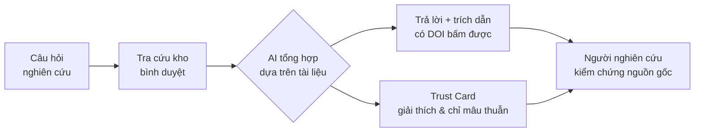
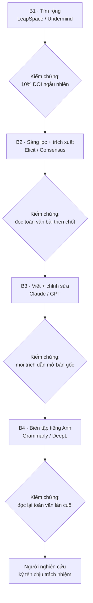

# Chương 11. AI trong nghiên cứu y sinh: từ rà soát tài liệu đến xuất bản

## Mở đầu: luận án và núi tài liệu

Nghiên cứu sinh Minh, năm thứ hai tiến sĩ tại một đại học y ở Hà Nội, có một đề tài nghe rất "hot": ứng dụng AI đọc ảnh X-quang phổi ở tuyến huyện. Vấn đề không nằm ở ý tưởng — mà nằm ở 2.847. Đó là số abstract mà cậu thu được sau một tuần tìm kiếm trên PubMed và Google Scholar với vài từ khóa tưởng chừng đơn giản. Đọc hết? Không thể. Thuê người đọc cùng? Không có kinh phí. Bỏ bớt bằng cảm tính? Sợ bỏ sót nghiên cứu quan trọng, phản biện hỏi không trả lời được.

Minh thử một công cụ AI đa nhiệm (xem chương 4): nó tóm tắt rất nhanh, rất trôi chảy — và bịa ra ba bài báo không hề tồn tại, với tên tác giả nghe rất thật. May mà người hướng dẫn phát hiện kịp trước khi đưa vào đề cương.

Câu chuyện của Minh không hiếm. Nghiên cứu y sinh là một trong những lĩnh vực AI tạo giá trị rõ rệt nhất — nhưng cũng là nơi "ảo giác" của AI gây hậu quả nặng nề nhất: một trích dẫn bịa đặt trong luận án có thể khiến cả công trình bị nghi ngờ.

Câu hỏi trung tâm của chương này: **làm sao dùng AI để nghiên cứu nhanh hơn mà vẫn giữ được tính khoa học — nguồn thật, trích dẫn thật, và người nghiên cứu chịu trách nhiệm cuối cùng?** Đọc xong chương, bạn sẽ:

- Hiểu 4 việc AI hỗ trợ tốt nhất trong nghiên cứu y sinh: rà soát tài liệu, viết bản thảo, phân tích dữ liệu, thiết kế nghiên cứu;
- Nắm case LeapSpace của Elsevier — trợ lý nghiên cứu xây trên kho tài liệu bình duyệt (peer-review) có DOI, khác gì so với chatbot đa nhiệm;
- So sánh được Elicit, Consensus, Undermind và Perplexity Deep Research: mỗi công cụ mạnh ở đâu, khi nào dùng cái nào;
- Có quy trình 4 bước dùng AI cho luận án/bài báo, với điểm kiểm chứng rõ ràng ở mỗi bước;
- Nắm quy tắc của ICMJE về AI trong xuất bản khoa học và các ranh giới đạo đức: paper mill, ghost authorship.

```metrics
[
  {"value":"100M+","label":"Abstract nghiên cứu trong Scopus","hint":"7.000+ nhà xuất bản"},
  {"value":"18M+","label":"Bài toàn văn bình duyệt trong LeapSpace","hint":"Elsevier, 01/2026"},
  {"value":"4","label":"Bước quy trình AI cho luận án","hint":"mỗi bước có điểm kiểm chứng"},
  {"value":"0","label":"Bài báo bịa đặt được chấp nhận","hint":"nguyên tắc bất di bất dịch"}
]
```

## 1. Bốn việc AI làm tốt nhất trong nghiên cứu

Trước khi đi vào công cụ, cần phân biệt rõ AI giúp được gì và không giúp được gì trong nghiên cứu y sinh. Bốn việc dưới đây là nơi AI đã chứng minh giá trị — với điều kiện người nghiên cứu giữ vai trò kiểm chứng.

**Rà soát tài liệu ({t:systematic-review}tổng quan hệ thống{/t} và narrative review):** tìm kiếm, sàng lọc và tóm tắt hàng nghìn abstract theo câu hỏi nghiên cứu. Đây là việc tốn thời gian nhất của NCS (thường chiếm 30–50% thời gian năm đầu), và cũng là việc AI hỗ trợ tốt nhất — miễn là nguồn trích dẫn có thật.

**Viết và biên tập bản thảo:** dàn ý, diễn đạt lại đoạn văn của chính tác giả, biên tập tiếng Anh học thuật, định dạng trích dẫn. AI là "trợ lý viết" đắc lực, nhưng **không bao giờ** là đồng tác giả.

**Phân tích dữ liệu:** viết code phân tích (R, Python), kiểm tra thống kê, vẽ biểu đồ. AI sinh code nhanh, nhưng người nghiên cứu phải hiểu và chịu trách nhiệm về mọi con số trong bài.

**Thiết kế nghiên cứu:** gợi ý khung PICO, cỡ mẫu, phương pháp — ở mức gợi ý để thảo luận với người hướng dẫn, không phải quyết định thay hội đồng đạo đức.

### 1.1. Năm thuật ngữ dùng suốt chương

- {t:peer-review}Bình duyệt{/t} (peer review): quy trình bài báo được các chuyên gia độc lập thẩm định trước khi xuất bản. Đây là "bộ lọc chất lượng" của khoa học — và là lý do công cụ xây trên kho bình duyệt đáng tin hơn chatbot web mở.
- {t:doi}DOI{/t} (Digital Object Identifier): "chứng minh thư" của mỗi bài báo/công trình — một chuỗi định danh duy nhất, bấm vào là tới được bản gốc. Trích dẫn không có DOI (hoặc DOI không tồn tại) là dấu hiệu cảnh báo đầu tiên của thông tin bịa đặt.
- {t:rag}RAG{/t} (Retrieval-Augmented Generation): kỹ thuật cho phép AI **tra cứu tài liệu thật trước, rồi mới trả lời dựa trên tài liệu đó** — thay vì trả lời từ "trí nhớ" của mô hình. Đây là kiến trúc đứng sau các trợ lý nghiên cứu nghiêm túc, và là khác biệt cốt lõi với chatbot đa nhiệm thông thường.
- {t:prisma}PRISMA{/t}: bộ tiêu chuẩn báo cáo cho tổng quan hệ thống và phân tích gộp — quy định rõ quy trình tìm kiếm, sàng lọc, loại trừ phải minh bạch và tái lập được. Dùng AI mà không tuân PRISMA thì tổng quan của bạn khó được tạp chí chấp nhận.
- {t:icmje}ICMJE{/t}: Ủy ban Quốc tế các Tổng biên tập Tạp chí Y khoa — tổ chức ban hành "Khuyến nghị" được hầu hết tạp chí y khoa uy tín áp dụng, trong đó có quy định về việc sử dụng AI trong bản thảo (xem phần 5).

> **Lưu ý về tính thời điểm:** thị trường công cụ AI nghiên cứu thay đổi theo quý: tính năng, giá và giới hạn truy cập có thể khác khi bạn đọc. Cách dùng đúng là nắm **nguyên tắc chọn công cụ** (nguồn có kiểm chứng được không? trích dẫn có DOI không?), rồi kiểm tra lại từng công cụ tại thời điểm dùng.

### 1.2. AI phân tích dữ liệu: nhanh gấp mười lần, nhưng phải hiểu từng dòng

Trong 4 việc ở trên, phân tích dữ liệu là nơi AI "nguy hiểm" một cách tinh vi nhất — vì code AI sinh ra thường **chạy được ngay**, tạo cảm giác đúng. Một đoạn code R/Python phân tích sống còn (survival analysis) do AI viết có thể cho ra biểu đồ Kaplan-Meier đẹp đẽ — nhưng chọn sai kiểm định, xử lý sai dữ liệu khuyết (missing data), hoặc tính sai khoảng tin cậy.

Quy tắc thực hành cho người dùng AI phân tích số liệu:

1. **Hiểu trước, chạy sau:** nếu bạn không giải thích được mỗi khối code làm gì, đừng đưa kết quả của nó vào bài. AI là người gõ phím, bạn là người chịu trách nhiệm về con số.
2. **Tái lập được (reproducible):** mọi phân tích phải chạy lại được từ dữ liệu gốc + code + phiên bản thư viện — lưu trong kho mã (ví dụ GitHub) kèm file ghi môi trường. "Chạy được trên máy tôi hôm đó" không phải khoa học.
3. **Kiểm tra giả định thống kê:** AI thường bỏ qua bước này. Hỏi lại AI (và tự kiểm tra): dữ liệu có phân phối chuẩn không? Có giá trị ngoại lai không? Cỡ mẫu đủ cho kiểm định đã chọn không?
4. **Vẽ trước khi tin:** mọi kết quả số đều phải có biểu đồ minh họa — mắt người phát hiện lỗi mà bảng số che giấu (ví dụ: một điểm ngoại lai kéo cả đường hồi quy).

**Ai kiểm tra:** chính bạn + một đồng nghiệp độc lập đọc lại code (code review) — với luận án, đó là người hướng dẫn. **Khi nào dừng:** khi bạn không thể giải thích được vì sao chọn phương pháp phân tích đó — quay lại sách thống kê, hỏi chuyên gia, đừng để AI "chọn hộ".

## 2. Case chính: LeapSpace — khi "ông lớn" xuất bản làm AI

Tháng 01/2026, Elsevier — nhà xuất bản khoa học lớn nhất thế giới — ra mắt LeapSpace, một "không gian làm việc AI dành cho nhà nghiên cứu". Vì sao case này đáng phân tích kỹ? Vì nó đại diện cho một hướng đi mới: **AI xây trên kho tri thức bình duyệt có bản quyền**, thay vì web mở.

### 2.1. LeapSpace là gì, khác gì ChatGPT

Điểm khác biệt cốt lõi nằm ở **nguồn dữ liệu đầu vào**:

- **Kho tài liệu:** hơn 18 triệu bài báo và sách toàn văn bình duyệt của Elsevier, cộng thêm bài của các nhà xuất bản đối tác (Emerald, IOP, NEJM Group, Sage — theo công bố của Elsevier), và hơn 100 triệu abstract từ Scopus của 7.000+ nhà xuất bản. Đây là kho "vườn có tường bao" (walled garden): mọi thứ bên trong đều đã qua bình duyệt.
- **Kiến trúc {t:rag}RAG{/t} đa mô hình:** AI tra cứu trong kho tài liệu trước, rồi sinh câu trả lời **dựa trên tài liệu tìm được**, kèm trích dẫn có DOI bấm được. Không có chuyện bịa tên bài báo — vì mô hình không được phép "sáng tác" ngoài tài liệu.
- **Trust Card (thẻ tin cậy):** mỗi câu trả lời kèm một thẻ giải thích *vì sao* các nguồn được trích dẫn, và **chỉ ra điểm mâu thuẫn giữa các nguồn** — giúp người đọc đánh giá độ mạnh của bằng chứng thay vì tin mù mờ.
- **Con người kiểm chứng liên tục:** kết quả hiển thị từng bước thực hiện theo thời gian thực, để nhà nghiên cứu theo dõi và can thiệp — triết lý "người lái, AI phụ".

Nói ngắn gọn: ChatGPT trả lời từ trí nhớ của mô hình (dễ bịa); LeapSpace trả lời từ tài liệu thật trong kho bình duyệt (có nguồn để kiểm tra). Với nghiên cứu y sinh — nơi một trích dẫn sai có thể đánh sập uy tín công trình — khác biệt này là quyết định.



🎬 **Video minh họa:** ["LeapSpace goes live!" — Elsevier giới thiệu không gian làm việc AI xây trên kho khoa học bình duyệt](https://www.youtube.com/watch?v=9NVopuID--I) (01/2026).

🎬 **Xem thêm:** ["LeapSpace, built on peer-reviewed research" — Elsevier giải thích vì sao chỉ dùng nội dung khoa học đáng tin cậy, khác với công cụ AI web mở](https://www.youtube.com/watch?v=3jI7pvKGCuY) (01/2026).

### 2.2. Dùng LeapSpace cho tổng quan hệ thống: cách làm gợi ý

Với NCS Minh ở phần mở đầu, quy trình với LeapSpace có thể như sau:

1. **Đặt câu hỏi theo khung PICO** (Population – Intervention – Comparison – Outcome), ví dụ: "Ở bệnh nhân lao phổi (P), AI đọc X-quang (I) so với bác sĩ chẩn đoán hình ảnh (C) cho độ nhạy/độ đặc hiệu thế nào (O)?"
2. **Để AI tìm rộng** trong kho abstract và toàn văn; nhận về danh sách bài có trích dẫn DOI.
3. **Mở bản gốc** của 20–30 bài then chốt để đọc toàn văn — AI tóm tắt giúp định hướng, nhưng đánh giá chất lượng phương pháp (risk of bias) thì **con người phải tự làm**.
4. **Xuất bảng trích xuất dữ liệu** có nguồn, dùng làm đầu vào cho sơ đồ PRISMA và phân tích.

**Kiểm chứng bắt buộc:** bấm ngẫu nhiên 10% trích dẫn để mở DOI gốc — nếu một DOI chết hoặc không khớp nội dung, dừng lại và báo cho quản trị viên công cụ. **Ai chịu trách nhiệm:** người nghiên cứu ký tên trên bài báo, không phải công cụ. **Khi nào dừng:** khi phát hiện công cụ trích dẫn sai hệ thống, quay lại phương pháp thủ công và ghi nhận trong phần phương pháp của bài báo.

> **Lưu ý về chi phí và truy cập (tính thời điểm 10/2026):** theo công bố của Elsevier, LeapSpace bán cho cơ sở (institution) trước; cá nhân mua được từ 02/2026. Giá cụ thể thay đổi theo gói — kiểm tra lại trước khi đề xuất đơn vị mua. <!-- CẦN TÁC GIẢ XÁC MINH: giá và chính sách truy cập LeapSpace tại Việt Nam (có qua nhà phân phối nào không) -->

## 3. Bốn công cụ so sánh: không có "tốt nhất", chỉ có "đúng việc"

LeapSpace mạnh về kho bình duyệt, nhưng không phải việc nào cũng cần "đại bác". Bảng dưới so sánh 4 công cụ phổ biến — mỗi công cụ một điểm mạnh riêng.

| Công cụ | Điểm mạnh nhất | Điểm yếu cần biết | Dùng khi |
|---|---|---|---|
| **LeapSpace** (Elsevier) | Kho 18M+ toàn văn bình duyệt, Trust Card, trích dẫn DOI thật | Trả phí (gói cơ sở/cá nhân); kho "vườn có tường" nên thiếu tài liệu ngoài hệ thống | Cần tổng quan nghiêm túc, trích dẫn phải tuyệt đối thật |
| **Elicit** | Tìm kiếm ngữ nghĩa, sàng lọc và trích xuất dữ liệu cho systematic review (hỗ trợ quy trình PRISMA) | Chất lượng phụ thuộc câu hỏi; bản miễn phí giới hạn | Làm systematic review, cần bảng trích xuất có cấu trúc |
| **Consensus** | Trả lời câu hỏi dạng yes/no kèm "đồng thuận khoa học" và đánh giá mức bằng chứng | Mạnh nhất với câu hỏi đã có nhiều nghiên cứu; câu hỏi mới/hẹp thì nghèo nguồn | Cần câu trả lời nhanh "bằng chứng hiện tại nói gì" |
| **Perplexity Deep Research** | Báo cáo dài có nguồn hỗn hợp (học thuật + web), nhanh, dễ dùng | Nguồn lẫn cả web mở — phải tự lọc; không chuyên sâu bằng công cụ học thuật | Quét nhanh bối cảnh, tìm ý tưởng, việc không đòi hỏi trích dẫn tuyệt đối |

🎬 **Video minh họa:** ["This AI Synthesizes 500 Papers So You Don't Have To" — đánh giá thực tế Elicit: tìm kiếm, sàng lọc, trích xuất dữ liệu và systematic review](https://www.youtube.com/watch?v=bXN9B8_Pfl8).

```callout kind=tip title="Nguyên tắc chọn công cụ nghiên cứu"
Hỏi 2 câu trước khi chọn: (1) Công việc này có cần trích dẫn tuyệt đối thật không? Nếu có — dùng công cụ xây trên kho bình duyệt (LeapSpace) hoặc tự kiểm chứng 100% DOI. (2) Tôi có truy cập trả phí không? Nếu không — Elicit/Consensus bản miễn phí vẫn làm được việc, nhưng khâu kiểm chứng của bạn phải kỹ gấp đôi.
```

Ngoài 4 công cụ trên còn có Undermind (tìm kiếm sâu dạng agent cho tài liệu học thuật) và nhiều công cụ mới xuất hiện hàng quý — nguyên tắc chọn ở khung trên áp dụng được cho mọi công cụ mới.

**Phối hợp công cụ theo bài toán thực tế:** trong thực hành, hiếm khi chỉ dùng một công cụ cho cả công trình. Một cách phối hợp phổ biến: dùng **Perplexity Deep Research** để quét nhanh bối cảnh và tìm từ khóa (việc không đòi hỏi trích dẫn tuyệt đối) → dùng **LeapSpace** để tìm sâu trong kho bình duyệt và chốt danh mục trích dẫn chính → dùng **Elicit** để sàng lọc và trích xuất dữ liệu có cấu trúc → dùng **Consensus** để kiểm tra nhanh "cộng đồng khoa học đang đồng thuận điều gì" trước khi viết phần bàn luận. Mỗi công cụ làm đúng việc nó giỏi nhất; khâu kiểm chứng của bạn là sợi chỉ xuyên suốt.

## 4. Quy trình 4 bước dùng AI cho luận án

Dưới đây là quy trình gợi ý cho NCS/học viên cao học — mỗi bước ghi rõ **kiểm chứng gì**, để AI là trợ lý chứ không phải "người viết thuê".



**B1 — Tìm rộng (LeapSpace/Undermind):** đặt câu hỏi PICO, để AI quét kho tài liệu. *Kiểm chứng:* bấm ngẫu nhiên 10% DOI — DOI chết hoặc nội dung không khớp thì dừng.

**B2 — Sàng lọc và trích xuất (Elicit/Consensus):** phân loại include/exclude theo tiêu chí PRISMA, trích xuất dữ liệu vào bảng. *Kiểm chứng:* tự đọc toàn văn các bài then chốt; AI trích xuất sai số liệu là lỗi phổ biến — đối chiếu bảng với bản gốc.

**B3 — Viết và chỉnh sửa (Claude/GPT):** dùng AI dàn ý và diễn đạt lại **đoạn văn do chính bạn viết**. *Kiểm chứng:* mọi trích dẫn AI đưa ra phải mở bản gốc — {t:hallucination}thông tin bịa đặt{/t} về tài liệu tham khảo là lỗi nguy hiểm nhất với người làm khoa học (xem chương 4).

**B4 — Biên tập tiếng Anh (Grammarly/DeepL):** sửa ngữ pháp, văn phong học thuật. *Kiểm chứng:* đọc lại toàn văn lần cuối — công cụ biên tập đôi khi làm đổi nghĩa thuật ngữ chuyên môn.

**Ai quyết định:** người hướng dẫn và hội đồng — AI không có chỗ trong quyết định khoa học. **Ai chịu trách nhiệm:** tác giả ký tên. **Khi nào dừng:** khi bất kỳ khâu kiểm chứng nào phát hiện lỗi hệ thống — quay lại làm thủ công khâu đó và ghi nhận trung thực trong bài.

## 5. Ranh giới đỏ: quy tắc xuất bản và đạo đức nghiên cứu

### 5.1. ICMJE nói gì về AI

{t:icmje}ICMJE{/t} — tổ chức mà hầu hết tạp chí y khoa uy tín tuân theo — có quy định rõ về AI trong bản thảo (xem Khuyến nghị ICMJE, mục về AI):

- **AI không thể là tác giả:** tác giả phải là con người, chịu trách nhiệm về tính chính xác và liêm chính của công trình — AI không thể chịu trách nhiệm nên không thể đứng tên.
- **Phải khai báo việc sử dụng AI:** nếu dùng AI hỗ trợ viết, phân tích hay tạo hình ảnh, tác giả phải mô tả rõ trong bản thảo (thường ở phần phương pháp hoặc lời cảm ơn): dùng công cụ gì, vào việc gì.
- **Tác giả chịu trách nhiệm toàn bộ:** mọi nội dung AI tạo ra trong bài — kể cả phần chỉ "hỗ trợ" — đều thuộc trách nhiệm của tác giả ký tên.

Thực hành cho NCS Việt Nam: trước khi nộp bài, kiểm tra "hướng dẫn cho tác giả" (author guidelines) của tạp chí đích — nhiều tạp chí đã có mục riêng về AI, và quy định chi tiết có thể chặt hơn ICMJE.

### 5.2. Ba hành vi bị cấm tuyệt đối

```callout kind=danger title="Ba lằn ranh đỏ trong nghiên cứu"
**Paper mill (xưởng sản xuất bài báo):** mua/bán bài báo hoặc dùng AI "sản xuất" hàng loạt bản thảo để đăng — là gian lận khoa học, bài bị rút (retraction) và tác giả vào danh sách đen.
**Ghost authorship (tác giả ma):** để AI (hoặc người khác) viết toàn bộ mà không khai báo — vi phạm quy tắc minh bạch của ICMJE.
**Bịa dữ liệu/trích dẫn:** dùng AI "sáng tác" số liệu hoặc tài liệu tham khảo không tồn tại — dù vô tình hay cố ý, đều là sai phạm liêm chính nghiên cứu.
```

Vi phạm các ranh giới trên không chỉ khiến bài bị rút — với NCS, nó có thể khiến luận án bị hủy kết quả và ảnh hưởng toàn bộ sự nghiệp. AI làm nhanh hơn, nhưng **tốc độ không bao giờ là lý do để cắt khâu kiểm chứng**.

```callout kind=warning title="Checklist trước khi nộp bản thảo có dùng AI (tích vào từng mục)"
<label style="display:block;margin:6px 0;cursor:pointer"><input type="checkbox" style="accent-color:#d97706;margin-right:8px">Mọi trích dẫn AI đưa ra đã được mở bản gốc (DOI thật, nội dung khớp).</label>
<label style="display:block;margin:6px 0;cursor:pointer"><input type="checkbox" style="accent-color:#d97706;margin-right:8px">Đã khai báo việc sử dụng AI trong bản thảo (công cụ gì, dùng vào việc gì) theo yêu cầu của tạp chí.</label>
<label style="display:block;margin:6px 0;cursor:pointer"><input type="checkbox" style="accent-color:#d97706;margin-right:8px">Không có đoạn văn nào do AI viết toàn bộ mà chưa qua tôi viết lại và chịu trách nhiệm.</label>
<label style="display:block;margin:6px 0;cursor:pointer"><input type="checkbox" style="accent-color:#d97706;margin-right:8px">Code phân tích đã được tôi hoặc đồng nghiệp đọc lại; kết quả chạy lại được từ dữ liệu gốc.</label>
<label style="display:block;margin:6px 0;cursor:pointer"><input type="checkbox" style="accent-color:#d97706;margin-right:8px">Người hướng dẫn đã được thông báo đầy đủ về các khâu có AI tham gia.</label>
```

## 6. Case đóng chương: NCS tại AMU dùng AI có kiểm soát

> **Tình huống mô phỏng dựa trên kinh nghiệm tác giả** — các nhân vật và diễn biến đã được khái quát hóa; không phản ánh một cá nhân hay cơ sở cụ thể nào.

Nghiên cứu sinh T., năm thứ ba tiến sĩ tại một đại học y (gọi tắt là AMU), áp dụng quy trình 4 bước ở phần 4 cho chương tổng quan luận án về "AI hỗ trợ sàng lọc lao phổi ở tuyến huyện":

**Tuần 1–2 (B1):** T. dùng công cụ AI học thuật quét 1.200 abstract, thu hẹp còn 180 bài tiềm năng. T. bấm kiểm tra ngẫu nhiên 18 DOI (10%) — phát hiện 1 DOI trỏ nhầm sang bài khác, báo lỗi và loại bài đó khỏi danh sách.

**Tuần 3–4 (B2):** T. dùng công cụ sàng lọc theo tiêu chí PRISMA đã đăng ký trước, còn 64 bài. T. tự đọc toàn văn 20 bài then chốt, phát hiện AI trích xuất sai cỡ mẫu ở 2 bài — sửa thủ công và ghi chú trong nhật ký nghiên cứu.

**Tuần 5–6 (B3–B4):** T. tự viết toàn bộ chương tổng quan, chỉ dùng AI để diễn đạt lại những đoạn văn của chính mình và biên tập tiếng Anh. Mọi trích dẫn được mở bản gốc đối chiếu lần cuối.

**Kết quả:** chương tổng quan hoàn thành trong 6 tuần thay vì 4 tháng như các anh chị khóa trước — nhưng điểm T. tự hào nhất không phải tốc độ, mà là nhật ký kiểm chứng 4 trang đính kèm luận án: mọi khâu AI tham gia đều có ghi nhận, mọi lỗi AI mắc phải đều được phát hiện và sửa. Người hướng dẫn nhận xét: "Đây là cách dùng AI mà hội đồng không thể bắt bẻ."

Bài học: **AI rút ngắn thời gian tìm kiếm và soạn thảo, nhưng không rút ngắn được trách nhiệm.** Nhật ký kiểm chứng chính là "bằng chứng liêm chính" của người nghiên cứu thời AI.

## 7. Lab 11 — Tổng quan hệ thống với AI

```chart
{"type":"bar","title":"Lab 11 — khối lượng công việc theo giai đoạn","data":[{"name":"Sàng lọc 50 abstract","phút":40},{"name":"Trích xuất 10 bài","phút":30},{"name":"So ground truth","phút":20},{"name":"Viết báo cáo ngắn","phút":30}],"keys":["phút"],"yLabel":"phút"}
```

<div class="lab-cta">
<a href="/lab/lab-11" target="_blank" rel="noopener noreferrer" class="lab-btn">
▶ Mở Lab 11 trong tab mới
</a>
<div class="lab-meta">~120 phút · AI chấm rubric 5 tiêu chí · Lưu tiến độ vào sổ grading</div>
<span class="lab-cta-note">Cho trước 50 abstract về một chủ đề y sinh: dùng AI sàng lọc phân loại include/exclude/maybe, so sánh với đáp án chuẩn (ground truth) và phân tích vì sao AI sai ở những ca khó.</span>
</div>

## 8. Nguồn và đọc thêm

**Công cụ:**
- [LeapSpace — Elsevier](https://www.elsevier.com/products/leapspace) (truy cập 10/2026).
- [Elicit](https://elicit.com) — tìm kiếm ngữ nghĩa và systematic review (truy cập 10/2026).
- [Consensus](https://consensus.app) — trả lời kèm đánh giá bằng chứng (truy cập 10/2026).

**Quy định xuất bản:**
- [ICMJE Recommendations](https://www.icmje.org/recommendations/) — xem mục về vai trò của AI trong bản thảo (truy cập 10/2026).

**Đọc thêm trong cẩm nang:** [chương 4 — Nền tảng AI đa nhiệm](/chapters/04-nen-tang-ai-da-nhiem) (phân biệt chatbot đa nhiệm và trợ lý nghiên cứu chuyên dụng), [chương 14 — An toàn, tuân thủ](/chapters/14-an-toan-tuan-thu) (khung liêm chính và quản trị AI).

**Video minh họa trong chương:**
- Elsevier, "LeapSpace goes live!" — 01/2026 ([YouTube](https://www.youtube.com/watch?v=9NVopuID--I)).
- Elsevier, "LeapSpace, built on peer-reviewed research" — 01/2026 ([YouTube](https://www.youtube.com/watch?v=3jI7pvKGCuY)).
- Academia Insider, "This AI Synthesizes 500 Papers So You Don't Have To (Elicit AI)" ([YouTube](https://www.youtube.com/watch?v=bXN9B8_Pfl8)).

> Lưu ý: nội dung video mang tính thời điểm; kiểm tra lại thông tin trước khi trích dẫn.

---

> **Trạng thái bản thảo:** đây là bản nháp do AI soạn theo "Quy chuẩn biên tập chương và Lab" ngày 04/10/2026, **chưa qua tác giả duyệt**. Không phát hành dưới tên chủ biên. Các tính năng, giá công cụ mang tính thời điểm (10/2026) và cần kiểm tra lại khi xuất bản.
