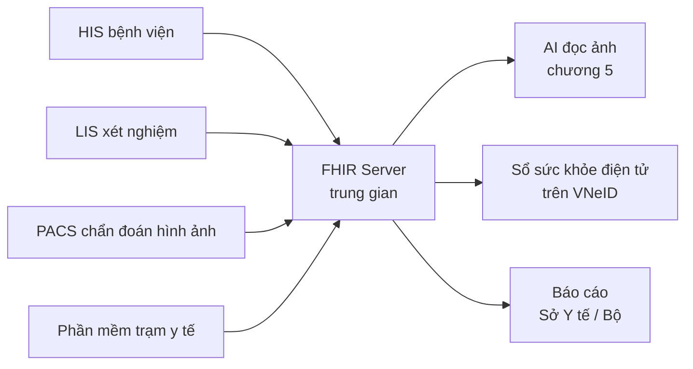
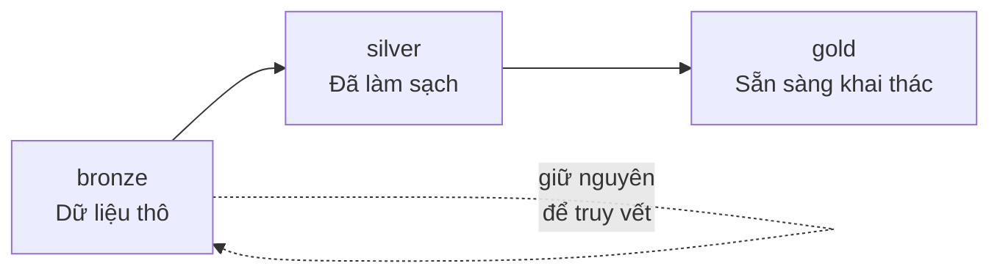

# Chương 12. Hạ tầng dữ liệu: điều kiện tiên quyết của AI y tế

## Mở đầu: bệnh viện mua AI nhưng quên mua... dữ liệu

Bệnh viện đa khoa tỉnh X. (tên đã được thay đổi) đầu tư một hệ thống AI đọc X-quang phổi với kỳ vọng giảm tải cho khoa chẩn đoán hình ảnh. Sáu tháng sau, dự án "đắp chiếu". Không phải vì AI kém — khi chạy thử trên dữ liệu demo của hãng, độ chính xác rất tốt. Vấn đề nằm ở chỗ: ảnh X-quang của bệnh viện lưu ở 3 hệ thống khác nhau (máy chụp mới lưu DICOM chuẩn, máy cũ lưu file ảnh thường, có máy còn... in phim rồi scan lại), thông tin bệnh nhân nằm trong phần mềm HIS viết từ 2012 không có API, và mỗi khoa ghi chẩn đoán theo một "thổ ngữ" riêng: khoa Nội viết "viêm phổi", khoa Nhi viết "VP", phòng khám viết "pneumonia".

AI không đọc được "thổ ngữ". AI cần dữ liệu sạch, chuẩn, liên thông.

Câu chuyện này lặp lại ở hầu hết dự án AI y tế thất bại: **vấn đề không nằm ở mô hình, mà nằm ở dữ liệu đưa vào mô hình.** Trong giới triển khai có câu cửa miệng: "data-ready trước, AI-ready sau" — chương này giải thích vì sao, và làm thế nào để đạt được.

Đọc xong chương, bạn sẽ:

- Hiểu vì sao dữ liệu — chứ không phải thuật toán — là điểm chết của đa số dự án AI y tế;
- Nắm chuẩn {t:fhir}HL7 FHIR{/t} và bộ master data (ICD-10, SNOMED CT, LOINC) cần chuẩn hóa;
- Hiểu kiến trúc data lake y tế 3 lớp bronze/silver/gold và quản trị dữ liệu;
- Có lộ trình liên thông dữ liệu 3 tuyến (trạm – huyện – tỉnh – trung ương) gắn với VNeID và Sổ sức khỏe điện tử;
- Biết mình đang ở mức nào (L0–L3) và bước tiếp theo cụ thể là gì — dù bạn là trạm y tế xã hay Sở Y tế.

```metrics
[
  {"value":"3","label":"Lớp kiến trúc data lake y tế","hint":"bronze → silver → gold"},
  {"value":"3+","label":"Bộ master data bắt buộc","hint":"ICD-10 · SNOMED CT · LOINC"},
  {"value":"4","label":"Mức triển khai L0–L3","hint":"trạm xã → Bộ Y tế"},
  {"value":"1","label":"Chuẩn liên thông bắt buộc","hint":"HL7 FHIR R4"}
]
```

## 1. Data-ready trước, AI-ready sau

### 1.1. Vì sao dữ liệu là điểm chết của dự án AI

Trong cộng đồng triển khai AI y tế, một con số được nhắc đi nhắc lại: phần lớn dự án AI thất bại không phải vì mô hình kém, mà vì dữ liệu đầu vào không dùng được — thiếu, bẩn, phân mảnh, hoặc không ai hiểu cấu trúc.
<!-- CẦN TÁC GIẢ XÁC MINH: con số "80% dự án AI y tế thất bại do dữ liệu" trong khung — cần nguồn khảo sát cụ thể hoặc diễn đạt lại thành kinh nghiệm thực tế -->

Ba "căn bệnh dữ liệu" phổ biến nhất ở y tế Việt Nam:

**Phân mảnh:** mỗi hệ thống một ốc đảo — HIS, LIS, RIS/PACS, phần mềm dược, Excel của từng khoa. Bệnh nhân đi 3 khoa là có 3 "phiên bản" khác nhau của cùng một con người, không có khóa liên kết chung.

**Không chuẩn:** cùng một chẩn đoán "tăng huyết áp" được ghi bằng 5 cách khác nhau; đơn vị xét nghiệm có nơi ghi mg/dL, có nơi ghi mmol/L; ngày tháng khi thì DD/MM/YYYY, khi thì MM/DD/YYYY. AI học trên dữ liệu này sẽ học cả... sự cẩu thả.

**Không ai chịu trách nhiệm:** dữ liệu do nhiều người nhập, nhưng không ai "sở hữu" chất lượng của nó. Sai thì đổ cho phần mềm, phần mềm đổ cho người nhập, người nhập đổ cho... thiếu thời gian.

### 1.3. Bốn chiều đo chất lượng dữ liệu

Để biết dữ liệu của đơn vị mình "bệnh" ở đâu, đo theo 4 chiều — mỗi chiều đều có cách kiểm tra đơn giản:

- **Đầy đủ (completeness):** có bao nhiêu % bản ghi thiếu trường bắt buộc? Ví dụ: 1.000 bệnh án mà 300 cái trống trường "chẩn đoán ra viện" thì AI học được gì?
- **Chính xác (accuracy):** giá trị ghi có đúng thực tế không? Kiểm tra bằng cách đối chiếu ngẫu nhiên 50 bản ghi với hồ sơ gốc — tỷ lệ sai trên 5% là báo động.
- **Nhất quán (consistency):** cùng một khái niệm có được ghi một kiểu không? "Tăng huyết áp" mà có 5 cách viết thì máy đếm thành 5 bệnh khác nhau.
- **Kịp thời (timeliness):** dữ liệu vào kho trễ bao lâu? Báo cáo dịch tễ mà trễ 2 tuần thì AI dự báo cũng chỉ để... ngắm.

```metrics
[
  {"value":"4","label":"Chiều chất lượng dữ liệu","hint":"đầy đủ · chính xác · nhất quán · kịp thời"},
  {"value":"5%","label":"Ngưỡng báo động tỷ lệ sai","hint":"khi đối chiếu ngẫu nhiên hồ sơ gốc"},
  {"value":"50","label":"Bản ghi đối chiếu mẫu","hint":"đủ để đánh giá sơ bộ một nguồn dữ liệu"}
]
```

Đo 4 chiều này cho từng nguồn dữ liệu **trước** khi ký hợp đồng AI — đó chính là nội dung của "đánh giá data-ready" mà nhà cung cấp nghiêm túc nào cũng phải yêu cầu.

```callout kind=warning title="Quy tắc vàng trước mọi dự án AI"
Đừng ký hợp đồng mua AI khi chưa trả lời được 3 câu hỏi: (1) Dữ liệu huấn luyện/vận hành lấy từ đâu, ở định dạng gì? (2) Ai là "chủ dữ liệu" chịu trách nhiệm về chất lượng của nó? (3) Dữ liệu có xuất ra được chuẩn mở (FHIR/CSV) hay bị khóa trong phần mềm của nhà cung cấp? Không trả lời được — dừng lại, làm dữ liệu trước.
```

### 1.2. Năm thuật ngữ dùng suốt chương

- {t:hl7}HL7{/t} (Health Level Seven): tổ chức quốc tế ban hành các chuẩn trao đổi dữ liệu y tế. Cái tên "Level Seven" chỉ tầng ứng dụng trong mô hình mạng — nôm na là "ngôn ngữ chung" để các hệ thống y tế nói chuyện với nhau.
- {t:fhir}FHIR{/t} (Fast Healthcare Interoperability Resources, đọc là "fai-ơ"): chuẩn mới nhất của HL7 (bản R4 là bản ổn định phổ biến nhất) — định nghĩa dữ liệu y tế thành các "tài nguyên" (Patient, Observation, Medication...) trao đổi qua API web hiện đại (REST/JSON), giống cách các app điện thoại gọi nhau.
- {t:emr}EMR{/t} (Electronic Medical Record – bệnh án điện tử): hồ sơ bệnh án số **trong một cơ sở** khám chữa bệnh.
- {t:ehr}EHR{/t} (Electronic Health Record – hồ sơ sức khỏe điện tử): hồ sơ sức khỏe **liên thông nhiều cơ sở**, theo người bệnh suốt đời — đích đến của chuyển đổi số y tế.
- {t:data-lake}Data lake{/t} (hồ dữ liệu): kho lưu trữ tập trung mọi dữ liệu thô của tổ chức, để sau đó làm sạch và khai thác dần — khác với data warehouse (kho dữ liệu) vốn chỉ chứa dữ liệu đã được cấu trúc sẵn.

## 2. Chuẩn hóa: nói cùng một ngôn ngữ

### 2.1. HL7 FHIR R4 — chuẩn liên thông bắt buộc

Nếu phải nhớ một chuẩn duy nhất từ chương này, đó là FHIR. Thay vì mỗi phần mềm y tế "nói tiếng riêng", FHIR quy định cách đóng gói dữ liệu thành các tài nguyên chuẩn: bệnh nhân là `Patient`, kết quả xét nghiệm là `Observation`, đơn thuốc là `MedicationRequest`... — và cách các hệ thống hỏi-đáp nhau qua API web (giống như cách app ngân hàng lấy số dư tài khoản).

Vì sao FHIR mà không phải chuẩn cũ (HL7 v2)? Vì FHIR dùng công nghệ web hiện đại (REST, JSON) mà mọi lập trình viên trẻ đều biết — không cần chuyên gia "cổ học" về HL7 v2 nữa. Một kỹ sư mới ra trường có thể đọc được một bản tin FHIR trong buổi chiều đầu tiên.

Tại Việt Nam, Bộ Y tế đã có các văn bản hướng dẫn áp dụng HL7 FHIR cho liên thông dữ liệu y tế.
<!-- CẦN TÁC GIẢ XÁC MINH: số hiệu "Quyết định 1551" và "Thông tư 13/2025" về FHIR trong khung — kiểm tra số hiệu, ngày ban hành, nội dung chính xác trước khi xuất bản -->

🎬 **Video minh họa:** ["What Is FHIR & Why It Matters?" — giải thích FHIR, cách API hoạt động (REST/JSON) và các tài nguyên dùng trong ứng dụng y tế thực tế](https://www.youtube.com/watch?v=u5rd18TB55g).



Sơ đồ trên là kiến trúc đích: mọi hệ thống "nói" FHIR với một máy chủ trung gian, và mọi ứng dụng (AI, sổ sức khỏe, báo cáo) lấy dữ liệu từ đó — thay vì mỗi cặp hệ thống phải "đấu nối" riêng.

### 2.2. Master data: ICD-10, SNOMED CT, LOINC

Chuẩn FHIR quy định **cấu trúc** (đựng dữ liệu thế nào), còn **nội dung** bên trong phải dùng bộ mã chuẩn (master data):

- **ICD-10:** mã hóa chẩn đoán bệnh (ví dụ: I10 — tăng huyết áp nguyên phát). Việt Nam đã dùng trong thanh toán BHYT — đây là bộ mã "có sẵn" nhất.
- **SNOMED CT:** bộ thuật ngữ lâm sàng chi tiết nhất thế giới (triệu chứng, thủ thuật, tiền sử...) — đích đến cho bệnh án điện tử đầy đủ, nhưng triển khai nặng, cần lộ trình.
- **LOINC:** mã hóa xét nghiệm và đo lường (ví dụ: glucose máu là 2345-7). Thiếu LOINC thì kết quả xét nghiệm liên viện không so sánh được với nhau.

**Bản Việt hóa** là việc không thể né: SNOMED CT và LOINC cần bản dịch thuật ngữ chuẩn tiếng Việt được Bộ Y tế công nhận — nếu mỗi bệnh viện tự dịch một kiểu thì chuẩn cũng như không.
<!-- CẦN TÁC GIẢ XÁC MINH: hiện trạng bản Việt hóa SNOMED CT/LOINC tại Việt Nam (đã có ban hành chính thức chưa) -->

**Lời khuyên thực tế theo mức:** trạm y tế xã — chỉ cần ICD-10 đúng và đầy đủ đã là thắng lợi; bệnh viện tuyến tỉnh — thêm LOINC cho xét nghiệm; bệnh viện trung ương/viện nghiên cứu — mới tính đến SNOMđầy đủ.

## 3. Kiến trúc data lake y tế: 3 lớp bronze/silver/gold

Khi dữ liệu đã có chuẩn để "nói", cần một "kho" để "chứa". Mô hình được dùng rộng rãi nhất là data lake 3 lớp:



- **Bronze (đồng):** đổ mọi dữ liệu thô vào kho đúng như nó vốn có — file Excel của khoa, dump database HIS, ảnh DICOM... Không sửa gì cả. Lớp này là "hộp đen máy bay": khi có sự cố, quay lại đây để biết sự thật gốc.
- **Silver (bạc):** dữ liệu đã được làm sạch — chuẩn hóa mã ICD, thống nhất đơn vị, loại bản ghi trùng, gắn khóa liên kết bệnh nhân. Đây là lớp tốn công nhất (thường chiếm 70–80% công sức dự án), và là lớp quyết định AI có dùng được hay không.
- **Gold (vàng):** dữ liệu đã được "đóng gói" theo mục đích — bảng phục vụ báo cáo Sở, tập dữ liệu huấn luyện AI đọc ảnh, dashboard quản trị... Mỗi "món" gold phục vụ một nhu cầu cụ thể.

**Object storage vs data warehouse:** ảnh y khoa, file PDF bệnh án — những thứ "nặng", phi cấu trúc — hợp với object storage (lưu theo kiểu "kho chứa đồ", rẻ, mở rộng dễ). Số liệu báo cáo, bảng phân tích — hợp với data warehouse (lưu theo bảng, truy vấn nhanh). Một data lake y tế nghiêm túc cần cả hai.

**Catalog và data governance (quản trị dữ liệu):** kho mà không có "mục lục" thì chỉ là bãi rác số. Data catalog ghi lại: dữ liệu này từ đâu, ai sở hữu, cập nhật khi nào, ai được phép xem. Data governance là bộ quy chế: ai được nhập/sửa/xóa, quy trình phê duyệt thay đổi, và — quan trọng nhất — **một người chịu trách nhiệm cuối cùng về chất lượng từng nguồn dữ liệu**.

### 3.1. Ví dụ cụ thể: một bệnh nhân đi qua 3 lớp

Bệnh nhân Nguyễn Văn A., 62 tuổi, vào viện vì khó thở:

- **Bronze:** file Excel của khoa Nội ghi "NVA, 62, khó thở, HA 160/95"; ảnh X-quang lưu dạng JPG trong thư mục chung; phiếu xét nghiệm là file scan PDF. Đúng như thực tế — lộn xộn nhưng trung thực.
- **Silver:** một bản ghi thống nhất — Patient (mã định danh công dân), Encounter (lần vào viện 05/10/2026), Observation (huyết áp 160/95 mmHg, SpO2 93%), Condition (I10 — tăng huyết áp; J18 — viêm phổi), ảnh đã chuyển sang DICOM chuẩn. Tên viết tắt "NVA" đã được đối chiếu thành họ tên đầy đủ; đơn vị đo đã thống nhất.
- **Gold:** bản ghi này xuất hiện trong 3 "món" khác nhau — dashboard "bệnh nhân tăng huyết áp đang điều trị" của khoa, tập huấn luyện AI đọc X-quang (đã khử định danh, chỉ còn ảnh + nhãn), và báo cáo tháng gửi Sở Y tế.

| Tiêu chí | Object storage (lưu ảnh, file) | Data warehouse (lưu bảng, số) |
|---|---|---|
| Chứa gì | Ảnh DICOM, PDF bệnh án, file scan | Bảng bệnh nhân, lượt khám, báo cáo |
| Chi phí | Rẻ, mở rộng dễ | Đắt hơn, nhưng truy vấn nhanh |
| Dùng khi | Lưu trữ dài hạn, huấn luyện AI ảnh | Báo cáo, dashboard, phân tích |

Một data lake y tế nghiêm túc cần cả hai — và lớp silver là nơi tốn công nhất nhưng quyết định tất cả.

## 4. Liên thông 3 tuyến: từ trạm xã đến Bộ

### 4.1. Kiến trúc liên thông

```timeline
[
  {"year":"2018","event":"Thông tư 46/2018/TT-BYT: lộ trình bệnh án điện tử","kind":"policy"},
  {"year":"2023","event":"VNeID định danh điện tử phủ toàn dân — nền tảng liên kết công dân","kind":"milestone"},
  {"year":"2025","event":"Sổ sức khỏe điện tử trên VNeID — hồ sơ sức khỏe theo công dân","kind":"milestone"},
  {"year":"2026","event":"Mục tiêu liên thông dữ liệu y tế 3 tuyến (trạm – huyện – tỉnh – trung ương)","kind":"deadline"}
]
```

<!-- CẦN TÁC GIẢ XÁC MINH: các mốc timeline trên — đặc biệt mốc 2026 và nội dung "Chiến dịch 90 ngày làm sạch dữ liệu của Bộ Y tế 2026" trong khung -->

Mô hình đích: **trạm y tế xã** nhập liệu chuẩn ngay từ đầu (ICD-10 đúng, FHIR đúng); **tuyến huyện/tỉnh** tổng hợp vào data lake của tỉnh; **trung ương** (Bộ Y tế) có bản sao phục vụ quản lý, nghiên cứu, cảnh báo dịch. Công dân xem hồ sơ của mình qua **Sổ sức khỏe điện tử trên VNeID** — một người, một hồ sơ, theo suốt đời.

Nguyên tắc thiết kế: **nhập một lần, dùng nhiều nơi.** Bác sĩ trạm xã nhập một lần — dữ liệu đó vừa phục vụ khám chữa, vừa lên báo cáo huyện, vừa vào sổ sức khỏe của dân, vừa (khi đã khử định danh) phục vụ nghiên cứu. Nhập 3 lần vào 3 phần mềm khác nhau là thiết kế thất bại.

🎬 **Video tiếng Việt:** ["Ứng dụng và triển khai Bệnh án điện tử tại Việt Nam | DX Expert Talks #32" — ông Nguyễn Duy Hiền (FPT IS) phân tích nguyên nhân cốt lõi khiến triển khai bệnh án điện tử còn chậm](https://www.youtube.com/watch?v=EiEwBOi4wx8).

### 4.2. Bài học "làm sạch": chiến dịch 90 ngày

<!-- CẦN TÁC GIẢ XÁC MINH: toàn bộ nội dung "Chiến dịch 90 ngày làm sạch dữ liệu của Bộ Y tế 2026" và "chuẩn hóa 12 cơ sở dữ liệu chuyên ngành" trong khung — nếu chưa có nguồn chính thức thì chuyển thành case mô phỏng hoặc bỏ -->

Theo khung đề cương, Bộ Y tế phát động chiến dịch 90 ngày làm sạch dữ liệu năm 2026, với bài học chuẩn hóa 12 cơ sở dữ liệu chuyên ngành. Khi triển khai case này trong bản chính thức, cần đối chiếu với văn bản/quyết định gốc của Bộ: phạm vi chính xác, kết quả đo được (bao nhiêu bản ghi được chuẩn hóa, tỷ lệ lỗi trước/sau), và bài học có thể tái sử dụng cho địa phương khác. **Nguyên tắc của cẩm nang: mọi case thực tế đều phải có nguồn công khai kiểm chứng được** (xem Quy chuẩn biên tập).

## 5. Bạn đang ở đâu: hướng dẫn L0–L3

Không phải đơn vị nào cũng cần data lake ngay. Bảng dưới giúp bạn xác định mức hiện tại và bước tiếp theo duy nhất cần làm.

| Mức | Bạn là ai | Việc cần làm ngay | Dấu hiệu đạt |
|---|---|---|---|
| **L0** | Trạm y tế xã, phòng khám nhỏ | Dùng dữ liệu đã được chuẩn hóa: nhập ICD-10 đúng, đủ trường bắt buộc; không chế thêm cột Excel riêng | 95%+ bệnh án có mã ICD-10 hợp lệ |
| **L1** | Phòng khám đa khoa | Xuất được dữ liệu ra chuẩn FHIR (dù chỉ 3 tài nguyên: Patient, Encounter, Observation); có hợp đồng rõ với nhà cung cấp phần mềm về quyền xuất dữ liệu | File FHIR validator báo hợp lệ |
| **L2** | Bệnh viện tuyến tỉnh/huyện | Xây data lake nội bộ 3 lớp; bổ nhiệm "chủ dữ liệu" cho từng nguồn; catalog đầy đủ | Báo cáo tháng chạy tự động từ silver, không còn tổng hợp Excel thủ công |
| **L3** | Sở Y tế / Bộ | Kiến trúc liên thông 3 tuyến; data governance cấp vùng/quốc gia; sandbox dữ liệu khử định danh cho nghiên cứu | Sổ sức khỏe điện tử đồng bộ 2 chiều với tuyến dưới |

```callout kind=tip title="Thắng nhanh cho L0: 5 việc trạm xã làm được trong 30 ngày"
1. Rà soát 100 bệnh án gần nhất: bao nhiêu cái thiếu mã ICD-10? Đặt mục tiêu 95%+.
2. Chốt một "từ điển" chẩn đoán thường gặp của trạm (50–100 mã ICD-10) — dán ngay bàn làm việc.
3. Thống nhất đơn vị đo trong toàn trạm (huyết áp mmHg, đường huyết mmol/L...) — viết thành quy định một trang.
4. Ngừng nhập trùng: một bệnh nhân — một dòng trong một sổ/file duy nhất.
5. Phân công một người "chủ dữ liệu" của trạm, kiểm tra ngẫu nhiên 10 bệnh án mỗi tuần.
```

```chart
{"type":"bar","title":"Mức độ sẵn sàng dữ liệu — việc ưu tiên theo từng mức","data":[{"name":"L0 · Trạm xã","việc":1},{"name":"L1 · Phòng khám","việc":2},{"name":"L2 · Bệnh viện","việc":3},{"name":"L3 · Sở/Bộ","việc":4}],"keys":["việc"],"yLabel":"số nhóm việc chính"}
```

**Ai quyết định:** giám đốc đơn vị (phê duyệt đầu tư và bổ nhiệm chủ dữ liệu). **Ai chịu trách nhiệm:** chủ dữ liệu từng nguồn + phòng CNTT. **Khi nào dừng:** khi phát hiện nhà cung cấp phần mềm khóa dữ liệu (không cho xuất chuẩn mở) — dừng mở rộng, đàm phán lại hợp đồng hoặc đổi nhà cung cấp trước khi đổ thêm tiền vào AI.

## 6. Case đóng chương: bài học từ chiến dịch làm sạch

> **Tình huống mô phỏng tổng hợp từ kinh nghiệm triển khai** — các con số và diễn biến đã được khái quát hóa; chi tiết thực tế của chiến dịch cần đối chiếu văn bản gốc của Bộ Y tế (xem mục 4.2).

Một Sở Y tế quyết định "làm sạch" dữ liệu của 12 cơ sở dữ liệu chuyên ngành (tiêm chủng, HIV, lao, sốt rét...) trước khi xây data lake. Tuần đầu, đội phát hiện cùng một đứa trẻ có 3 mã định danh khác nhau ở 3 chương trình — vì mỗi chương trình cấp mã riêng, không dùng chung mã công dân.

Thay vì cố "vá" 12 hệ thống cũ, Sở chọn cách làm ngược: **đóng băng chuẩn đầu vào** — từ tháng thứ hai, mọi nhập liệu mới bắt buộc gắn mã định danh công dân và mã ICD-10 chuẩn; dữ liệu cũ được làm sạch dần theo nguyên tắc "đụng đâu sửa đó" (khi có ca tái khám thì chuẩn hóa luôn hồ sơ cũ của ca đó).

Sau 90 ngày: 100% dữ liệu mới đạt chuẩn; 40% dữ liệu cũ được làm sạch theo cơ chế "đụng đâu sửa đó". Bài học lớn nhất không phải kỹ thuật — mà là **quyết định quản trị**: dám đóng băng chuẩn đầu vào, và chấp nhận dữ liệu cũ sẽ sạch dần chứ không sạch ngay.

## 7. Lab 12 — Chuẩn hóa hồ sơ sang HL7 FHIR

```chart
{"type":"bar","title":"Lab 12 — khối lượng công việc","data":[{"name":"Đọc đặc tả FHIR","phút":20},{"name":"Chuyển 5 bệnh án","phút":60},{"name":"Validator + sửa lỗi","phút":30},{"name":"Viết báo cáo","phút":20}],"keys":["phút"],"yLabel":"phút"}
```

<div class="lab-cta">
<a href="/lab/lab-12" target="_blank" rel="noopener noreferrer" class="lab-btn">
▶ Mở Lab 12 trong tab mới
</a>
<div class="lab-meta">~130 phút · AI chấm rubric 5 tiêu chí · Lưu tiến độ vào sổ grading</div>
<span class="lab-cta-note">Dùng editor JSON có validator: chuyển 5 bệnh án nội bộ (đã khử định danh) sang tài nguyên FHIR R4 hợp lệ — Patient, Encounter, Observation, Condition, MedicationRequest.</span>
</div>

## 8. Nguồn và đọc thêm

**Chuẩn và đặc tả kỹ thuật:**
- [HL7 FHIR R4 — đặc tả chính thức](https://hl7.org/fhir/) (truy cập 10/2026).

**Đọc thêm trong cẩm nang:** [chương 13 — Hạ tầng tính toán](/chapters/13-ha-tang-tinh-toan) (chạy AI trên hạ tầng nào sau khi dữ liệu đã sẵn sàng), [chương 14 — An toàn, tuân thủ](/chapters/14-an-toan-tuan-thu) (quản trị dữ liệu và bảo vệ dữ liệu cá nhân), [chương 5 — AI chẩn đoán hình ảnh](/chapters/05-ai-chan-doan-hinh-anh) (ứng dụng AI cần dữ liệu ảnh chuẩn DICOM).

**Video minh họa trong chương:**
- "What Is FHIR & Why It Matters?" — giải thích FHIR và cách API hoạt động ([YouTube](https://www.youtube.com/watch?v=u5rd18TB55g)).
- DX Expert Talks #32, "Ứng dụng và triển khai Bệnh án điện tử tại Việt Nam" — ông Nguyễn Duy Hiền, FPT IS ([YouTube](https://www.youtube.com/watch?v=EiEwBOi4wx8)).

> Lưu ý: nội dung video mang tính thời điểm; kiểm tra lại thông tin trước khi trích dẫn.

---

> **Trạng thái bản thảo:** đây là bản nháp do AI soạn theo "Quy chuẩn biên tập chương và Lab" ngày 04/10/2026, **chưa qua tác giả duyệt**. Không phát hành dưới tên chủ biên. Các số hiệu văn bản, mốc thời gian và hiện trạng triển khai mang tính thời điểm (10/2026), các mục đánh dấu CẦN XÁC MINH phải được đối chiếu văn bản gốc trước khi xuất bản.
