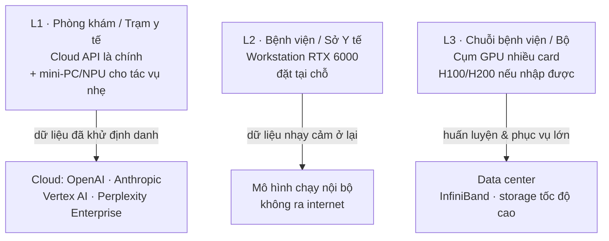

# Chương 13. Hạ tầng tính toán: workstation RTX 6000 là điểm ngọt cho bệnh viện Việt Nam

## Mở đầu: mua máy hay thuê cloud?

Giám đốc một bệnh viện tỉnh gọi cho tác giả với câu hỏi tưởng đơn giản: "Bệnh viện tôi muốn chạy chatbot tư vấn nội bộ và AI ghi chép khám bệnh (ambient scribe). Mua máy chủ GPU hay thuê cloud cho rẻ?"

Câu trả lời không nằm ở "rẻ nhất", mà ở "phù hợp nhất với ràng buộc của bệnh viện": dữ liệu bệnh nhân có được ra khỏi Việt Nam không (xem Nghị định 13/2023 về bảo vệ dữ liệu cá nhân, chương 14)? Bệnh viện có phòng máy lạnh 24/7 và kỹ sư trực không? Nhu cầu là vài chục người dùng hay hàng nghìn? Trả lời sai một câu, tiền tỷ có thể đổ xuống sông xuống biển.

Chương này cho bạn khung quyết định 3 tầng hạ tầng — từ phòng khám xã đến trung tâm dữ liệu cấp Bộ — và lý giải vì sao với đa số bệnh viện Việt Nam, **một workstation RTX 6000 đặt ngay tại bệnh viện** là điểm cân bằng tốt nhất giữa năng lực, chi phí và kiểm soát dữ liệu (tính thời điểm 10/2026).

Đọc xong chương, bạn sẽ:

- Phân biệt 3 tầng hạ tầng AI thực tế ở Việt Nam (L1/L2/L3) và biết đơn vị mình thuộc tầng nào;
- Hiểu vì sao RTX 6000 Ada (48GB) / RTX PRO 6000 Blackwell (96GB) là "điểm ngọt" cho bệnh viện tuyến tỉnh;
- Có cấu hình workstation tham khảo cụ thể để đưa vào dự toán mua sắm;
- Tính được bài toán cloud API (theo token) so với đầu tư máy, gồm cả rủi ro pháp lý dữ liệu ra biên giới;
- Ánh xạ được hạ tầng hiện tại lên thang HIMSS EMRAM và biết cần gì để lên Stage 4–5.

```metrics
[
  {"value":"3","label":"Tầng hạ tầng L1–L3","hint":"phòng khám → bệnh viện → trung tâm"},
  {"value":"48–96GB","label":"VRAM RTX 6000 / RTX PRO 6000","hint":"chạy LLM 30B–70B quantized"},
  {"value":"400–500tr","label":"Tổng đầu tư workstation tham khảo","hint":"VND, tính thời điểm 10/2026"},
  {"value":"0","label":"Dữ liệu bệnh nhân ra biên giới","hint":"mục tiêu của tầng L2"}
]
```

## 1. Ba tầng hạ tầng: mỗi tầng một bài toán



**L1 — Phòng khám/trạm y tế xã:** không có phòng máy, không có kỹ sư trực. Dùng **Cloud API** (trả tiền theo lượng dùng) cho chatbot, tóm tắt bệnh án; các tác vụ nhẹ (nhận dạng giọng nói, OCR) chạy trên **mini-PC có NPU** (chip tăng tốc AI tích hợp, giá vài triệu đồng). Không đầu tư GPU rời ở tầng này — không hiệu quả.

**L2 — Bệnh viện tuyến tỉnh/huyện, Sở Y tế:** có phòng máy lạnh, có 1–2 kỹ sư CNTT. Đây là tầng của **workstation RTX 6000**: một máy trạm mạnh đặt tại bệnh viện, chạy mô hình ngôn ngữ 30B–70B đã {t:quantization}lượng tử hóa{/t} (nén mô hình cho vừa bộ nhớ mà vẫn giữ chất lượng) — đủ cho ambient scribe, chatbot nội bộ, hỗ trợ đọc ảnh. Dữ liệu bệnh nhân **không ra khỏi bệnh viện**.

**L3 — Chuỗi bệnh viện lớn, trung tâm dữ liệu cấp Bộ:** nhu cầu huấn luyện mô hình riêng hoặc phục vụ hàng chục nghìn lượt/ngày. Cần **cụm GPU** (4–16 card RTX PRO 6000, hoặc H100/H200 nếu nhập được chính hãng), mạng InfiniBand, storage tốc độ cao, an ninh vật lý và làm mát chuyên dụng.

**Nguyên tắc chọn tầng:** bắt đầu từ tầng thấp nhất đáp ứng được yêu cầu bảo mật dữ liệu của bạn. Đừng mua cụm GPU khi một workstation đã đủ — và đừng dùng cloud cho dữ liệu không được phép ra biên giới.

### 1.1. Thuật ngữ dùng suốt chương

- {t:gpu}GPU{/t}: chip xử lý đồ họa — nay là "động cơ" của AI vì tính toán song song hàng nghìn phép cùng lúc, nhanh hơn CPU hàng chục lần khi chạy mô hình ngôn ngữ.
- {t:llm}LLM{/t} (mô hình ngôn ngữ lớn): mô hình AI như GPT, Claude, Llama — "bộ não" của chatbot và trợ lý AI (xem chương 4).
- {t:quantization}Lượng tử hóa{/t} (quantization): kỹ thuật nén mô hình AI (ví dụ từ 16-bit xuống 8-bit hoặc 4-bit) để chạy được trên ít bộ nhớ hơn, đánh đổi một chút chất lượng — nhờ đó mô hình 70B mới "vừa" trong một card 48GB.
- {t:tco}TCO{/t} (Total Cost of Ownership): tổng chi phí sở hữu 3–5 năm = tiền mua + điện + bảo trì + nhân sự — con số duy nhất có ý nghĩa khi so sánh mua máy với thuê cloud.
- {t:npu}NPU{/t} (Neural Processing Unit): chip tăng tốc AI tích hợp trong CPU/máy tính hiện đại — đủ chạy tác vụ nhẹ (nhận dạng giọng nói, xử lý ảnh cơ bản) mà không cần GPU rời.

## 2. Vì sao RTX 6000 là điểm ngọt cho bệnh viện Việt Nam

Với tầng L2, có nhiều lựa chọn GPU. Nhưng RTX 6000 Ada (48GB) và thế hệ kế tiếp RTX PRO 6000 Blackwell (96GB) hội tụ 5 yếu tố hiếm có cùng lúc — ít nhất tại thời điểm 10/2026:

1. **Mua được ở Việt Nam qua phân phối chính hãng:** đây là dòng card workstation phân phối rộng rãi, có đại lý chính hãng tại Việt Nam, hóa đơn chứng từ đầy đủ cho mua sắm công — không phải "xách tay".
2. **Không vướng kiểm soát xuất khẩu như H100/H200:** các chip AI cao cấp của NVIDIA (H100/H200) chịu kiểm soát xuất khẩu của Mỹ, việc nhập chính hãng về Việt Nam khó khăn và rủi ro pháp lý cao.
<!-- CẦN TÁC GIẢ XÁC MINH: hiện trạng kiểm soát xuất khẩu chip AI của Mỹ áp dụng với Việt Nam (tính thời điểm 10/2026) và khả năng nhập H100/H200 chính hãng -->
3. **Giá trong tầm với của bệnh viện:** khoảng 250–350 triệu VND cho card RTX 6000 Ada 48GB (tính thời điểm 10/2026).
<!-- CẦN TÁC GIẢ XÁC MINH: giá card RTX 6000 Ada 48GB và RTX PRO 6000 Blackwell 96GB tại Việt Nam qua kênh phân phối chính hãng (10/2026) -->
4. **Không cần data center chuyên dụng:** một workstation chạy được với UPS tốt và điều hòa phòng máy lạnh thông thường — không cần sàn nâng, làm mát chất lỏng hay điện 3 pha công nghiệp như cụm H100.
5. **Đủ mạnh cho nhu cầu thực tế:** 48GB VRAM chạy được LLM 30B–70B đã lượng tử hóa — đủ cho ambient scribe (ghi chép tự động khi khám), chatbot nội bộ tra cứu quy trình, và hỗ trợ đọc ảnh X-quang ở mức suy luận (inference).

```callout kind=info title="Điểm ngọt nghĩa là gì?"
"Điểm ngọt" (sweet spot) không có nghĩa là mạnh nhất hay rẻ nhất — mà là điểm mà mỗi đồng đầu tư thêm cho hiệu năng cao hơn bắt đầu... không đáng. Với bệnh viện Việt Nam 2026: card yếu hơn (24GB) thì không chạy nổi mô hình đủ tốt cho y tế; mạnh hơn (H100) thì chi phí và rào cản tăng gấp nhiều lần trong khi nhu cầu L2 chưa tới. RTX 6000 nằm đúng giữa.
```

🎬 **Video minh họa:** [Keynote GTC 2026/2025 của CEO NVIDIA Jensen Huang — định hướng hạ tầng AI và các dòng chip mới](https://www.youtube.com/watch?v=_waPvOwL9Z8) (03/2025).

🎬 **Xem thêm:** [Tóm tắt 16 phút keynote GTC 2025 (CNET) — nắm nhanh các công bố hạ tầng AI của NVIDIA](https://www.youtube.com/watch?v=erhqbyvPesY) (03/2025).

## 3. Cấu hình workstation tham khảo cho L2

Bảng dưới là cấu hình gợi ý để đưa vào dự toán — tổng mức đầu tư khoảng **400–500 triệu VND** (tính thời điểm 10/2026, đã gồm VAT ước tính; giá linh kiện biến động theo quý).

| Linh kiện | Gợi ý | Ghi chú |
|---|---|---|
| GPU | 1× RTX 6000 Ada 48GB (hoặc RTX PRO 6000 Blackwell 96GB nếu ngân sách cho phép) | Linh kiện đắt nhất và quan trọng nhất — 250–350 triệu VND |
| CPU | AMD Threadripper Pro / Intel Xeon W (16–24 nhân) | Đủ luồng cho tiền xử lý dữ liệu và chạy song song |
| RAM | 128–256GB ECC | ECC bắt buộc cho hệ thống chạy 24/7 phục vụ y tế |
| Lưu trữ | 4TB NVMe (hệ điều hành + mô hình) + 20TB HDD (dữ liệu) | Mô hình 70B quantized chiếm ~40–80GB |
| Mạng | Card 10GbE | Kết nối với PACS/HIS nội bộ không nghẽn cổ chai |
| Nguồn dự phòng | UPS 3kVA online | Chống sụt áp — GPU đang chạy mà mất điện đột ngột dễ hỏng |
| Môi trường | Phòng máy lạnh 24/7, nhiệt độ < 25°C | Không cần data center, nhưng không được để phòng nóng |

**Ai quyết định:** giám đốc bệnh viện (phê duyệt dự toán) + hội đồng mua sắm. **Ai chịu trách nhiệm vận hành:** phòng CNTT — cần ít nhất 1 kỹ sư được đào tạo về triển khai mô hình (không chỉ "biết cài Windows"). **Khi nào dừng:** nếu bệnh viện không bố trí được người vận hành và phòng máy lạnh đảm bảo — dừng mua máy, chuyển sang phương án cloud cho dữ liệu đã khử định danh.

## 4. Cloud API cho L1: rẻ để bắt đầu, đắt khi mở rộng

Với phòng khám/trạm xã (L1), cloud API là lựa chọn hợp lý: không vốn đầu tư ban đầu, trả tiền theo **token** (đơn vị tính lượng văn bản xử lý — nôm na là trả theo "số chữ" AI đọc và viết).

**Nhà cung cấp phổ biến (tính thời điểm 10/2026):** OpenAI API, Anthropic Claude API, Google Vertex AI, Perplexity Enterprise. Mỗi nhà một bảng giá token khác nhau và thay đổi thường xuyên — luôn kiểm tra giá hiện hành trước khi dự toán.

**Bài toán chi phí:** với vài chục người dùng, cloud rẻ hơn mua máy rất nhiều. Nhưng chi phí token tăng tuyến tính theo lượng dùng — đến một ngưỡng (thường khi lên hàng trăm người dùng thường xuyên), TCO 3 năm của cloud có thể vượt tiền mua workstation. **Ngưỡng này phải được tính trước, không phải phát hiện sau.**

**Ví dụ minh họa cách tính (số liệu giả định, kiểm tra giá thực tế khi dự toán):** phòng khám dùng chatbot tóm tắt bệnh án cho 30 bác sĩ, mỗi bác sĩ tóm tắt 20 bệnh án/ngày, mỗi bệnh án tốn khoảng 2.000 token đầu vào + 500 token đầu ra. Một ngày = 30 × 20 × 2.500 = 1,5 triệu token. Một tháng (26 ngày làm việc) ≈ 39 triệu token. Nhân với đơn giá token của nhà cung cấp tại thời điểm dự toán → ra chi phí tháng → nhân 36 tháng → so với 400–500 triệu của workstation L2. Bài toán này mỗi đơn vị một khác — đừng dùng con số của đơn vị khác cho đơn vị mình.

```callout kind=warning title="Rủi ro dữ liệu ra biên giới"
Dùng cloud API nghĩa là dữ liệu (kể cả prompt chứa thông tin bệnh nhân) được gửi ra máy chủ nước ngoài. Nghị định 13/2023 về bảo vệ dữ liệu cá nhân yêu cầu đánh giá tác động và thủ tục khi chuyển dữ liệu cá nhân ra nước ngoài. Thực hành an toàn: (1) ký DPA (thỏa thuận xử lý dữ liệu) với nhà cung cấp; (2) chọn gói enterprise có cam kết không dùng dữ liệu để huấn luyện; (3) khử định danh trước khi gửi — hoặc tốt nhất, dữ liệu nhạy cảm thì chạy nội bộ ở tầng L2. Xem chi tiết tại chương 14.
```

## 5. Cụm GPU cho L3: khi một máy không còn đủ

Khi nhu cầu vượt một workstation — huấn luyện/fine-tune mô hình trên dữ liệu bệnh viện, hoặc phục vụ hàng chục nghìn lượt/ngày — mới tính đến cụm GPU:

- **Quy mô:** 4–16 card RTX PRO 6000, hoặc H100/H200 nếu nhập được chính hãng (xem lưu ý kiểm soát xuất khẩu ở phần 2);
- **Mạng nội cụm:** InfiniBand (không dùng Ethernet thường — băng thông không đủ cho huấn luyện phân tán);
- **Storage:** hệ thống lưu trữ song song tốc độ cao (ảnh y khoa và checkpoint mô hình rất nặng);
- **Vật lý:** phòng data center đạt chuẩn — sàn nâng, làm mát chính xác, điện dự phòng N+1, kiểm soát ra vào.

Đây là bài toán của chuỗi bệnh viện lớn hoặc trung tâm dữ liệu cấp Bộ — **không phải** của bệnh viện tỉnh đơn lẻ. Nếu ai đó chào bán "cụm GPU" cho bệnh viện 500 giường chỉ để chạy chatbot, hãy hỏi lại nhu cầu thực.

### 5.1. Vận hành sau khi mua: MLOps tối thiểu cho bệnh viện

Mua máy chỉ là một nửa câu chuyện. Một hệ thống AI y tế chạy 24/7 cần tối thiểu:

- **Giám sát (monitoring):** theo dõi nhiệt độ GPU, tỷ lệ lỗi truy vấn, thời gian phản hồi — đặt cảnh báo tự động gửi về điện thoại kỹ sư trực. GPU quá nóng (>85°C kéo dài) giảm tuổi thọ nhanh.
- **Cập nhật mô hình có kiểm soát:** mô hình mới ra không có nghĩa là thay ngay — chạy thử song song (A/B) trên dữ liệu nội bộ, so sánh chất lượng rồi mới chuyển. Mọi lần cập nhật đều ghi nhật ký: phiên bản nào, ai phê duyệt, khi nào.
- **Sao lưu và khôi phục:** mô hình đã fine-tune trên dữ liệu bệnh viện là tài sản — sao lưu ra ổ riêng, có kế hoạch khôi phục khi ổ cứng hỏng. Hỏi nhà cung cấp: "nếu máy cháy mainboard, bao lâu thì chạy lại được?"
- **Nhân sự:** ít nhất 1 kỹ sư hiểu triển khai mô hình (không chỉ phần cứng) + 1 người dự phòng được đào tạo chéo. Hệ thống không thể phụ thuộc vào một người duy nhất — người đó nghỉ việc thì AI "chết" theo.

**Ai chịu trách nhiệm:** trưởng phòng CNTT — báo cáo định kỳ cho ban giám đốc như mọi hệ thống trọng yếu khác (HIS, PACS).

## 6. Bảng so sánh chi phí 3 tầng (tính thời điểm 10/2026)

| Hạng mục | L1: Cloud API | L2: Workstation RTX 6000 | L3: Cụm GPU |
|---|---|---|---|
| Đầu tư ban đầu | ~0 (thuê bao) | 400–500 triệu VND | Từ vài tỷ VND trở lên |
| Chi phí vận hành/năm | Theo token, tăng theo dùng | Điện + bảo trì (~30–50 triệu) | Điện + làm mát + nhân sự chuyên |
| Dữ liệu ra biên giới | Có (cần DPA + NĐ 13/2023) | Không | Không |
| Người vận hành | Không cần | 1 kỹ sư CNTT | Đội vận hành chuyên |
| Phù hợp | Phòng khám, trạm xã, thử nghiệm | Bệnh viện tỉnh/huyện, Sở | Chuỗi lớn, cấp Bộ |

```chart
{"type":"bar","title":"So sánh TCO 3 năm ước tính theo tầng (tỷ VND, 10/2026)","data":[{"name":"L1 · Cloud (200 user)","tỷ_VND":1.2},{"name":"L2 · Workstation","tỷ_VND":0.6},{"name":"L3 · Cụm GPU 8 card","tỷ_VND":8}],"keys":["tỷ_VND"],"yLabel":"tỷ VND"}
```

> Số liệu biểu đồ là ước tính minh họa để so sánh tương đối (giả định L1 dùng cloud cho 200 người dùng thường xuyên) — **không phải báo giá**. Mọi dự toán mua sắm phải lấy báo giá chính hãng tại thời điểm lập.

## 7. Ánh xạ EMRAM: hạ tầng của bạn đang ở đâu

HIMSS EMRAM là thang 8 bậc (Stage 0–7) đánh giá mức độ số hóa bệnh viện, được dùng rộng rãi quốc tế. Về hạ tầng liên quan AI:

- **Stage 3:** bệnh án điện tử cơ bản, dữ liệu có nhưng phân mảnh — đa số bệnh viện Việt Nam đang quanh đây.
<!-- CẦN TÁC GIẢ XÁC MINH: phân bố EMRAM thực tế của bệnh viện Việt Nam (có khảo sát nào không) -->
- **Stage 4–5:** hệ thống hỗ trợ quyết định lâm sàng (CDSS), dữ liệu liên thông nội viện, bắt đầu có AI hỗ trợ — **đây là vùng của workstation L2**: đủ dữ liệu chuẩn (chương 12) + đủ sức tính toán tại chỗ.
- **Stage 6–7:** bệnh viện số toàn diện, AI triển khai sâu rộng, dữ liệu liên thông vùng — cần hạ tầng L3 và quản trị dữ liệu cấp hệ thống.

Bài học: **đừng mua GPU khi bệnh viện còn ở Stage 2** (chưa có EMR tử tế). Thứ tự đúng: số hóa và chuẩn hóa dữ liệu (chương 12) → đạt Stage 3–4 → mới đầu tư sức tính toán AI. Ngược lại là đốt tiền.

```callout kind=warning title="Checklist trước khi ký mua hạ tầng AI (tích vào từng mục)"
<label style="display:block;margin:6px 0;cursor:pointer"><input type="checkbox" style="accent-color:#d97706;margin-right:8px">Đã tính TCO 3 năm của cả 3 phương án L1/L2/L3 cho đúng use case của đơn vị.</label>
<label style="display:block;margin:6px 0;cursor:pointer"><input type="checkbox" style="accent-color:#d97706;margin-right:8px">Đã xác định dữ liệu có được ra biên giới không (NĐ 13/2023) — nếu không, loại phương án cloud cho dữ liệu nhạy cảm.</label>
<label style="display:block;margin:6px 0;cursor:pointer"><input type="checkbox" style="accent-color:#d97706;margin-right:8px">Đã có người vận hành (tối thiểu 1 chính + 1 dự phòng) và phòng máy lạnh đảm bảo.</label>
<label style="display:block;margin:6px 0;cursor:pointer"><input type="checkbox" style="accent-color:#d97706;margin-right:8px">Dữ liệu đầu vào đã đạt mức data-ready tối thiểu (mức L0–L1 theo chương 12).</label>
<label style="display:block;margin:6px 0;cursor:pointer"><input type="checkbox" style="accent-color:#d97706;margin-right:8px">Báo giá là báo giá chính hãng, còn hiệu lực, đã gồm VAT và bảo hành.</label>
```

## 8. Case đóng chương: workstation RTX 6000 cho MediBot

> **Case tác giả — đang chờ xác minh chi tiết.** Các con số dưới đây là khung dự kiến; cần đối chiếu hồ sơ triển khai thực tế trước khi xuất bản.
<!-- CẦN TÁC GIẢ XÁC MINH: toàn bộ case MediBot — tổng đầu tư 400 triệu, mô hình 70B, 10.000 lượt/ngày: kiểm tra con số thực tế, thời gian triển khai, đơn vị thực hiện -->

MediBot — chatbot y tế nội bộ phục vụ tra cứu quy trình và tư vấn sức khỏe ban đầu — được triển khai trên một workstation cấu hình theo đúng bảng ở phần 3, tổng đầu tư khoảng **400 triệu VND**. Mô hình ngôn ngữ 70B đã lượng tử hóa chạy hoàn toàn nội bộ: dữ liệu người dùng không ra khỏi máy chủ đặt tại cơ sở.

Kết quả vận hành (theo khung đề cương): hệ thống phục vụ khoảng **10.000 lượt truy vấn mỗi ngày** với độ trễ chấp nhận được, chi phí vận hành chỉ còn tiền điện và bảo trì — thay vì hóa đơn token cloud tăng dần theo lượng dùng. Bài học: với nhu cầu ổn định và yêu cầu dữ liệu ở lại nội bộ, **mua một lần ở L2 rẻ hơn thuê mãi ở L1** — nhưng chỉ đúng khi đã tính TCO 3 năm trước khi quyết định.

## 9. Lab 13 — Ước tính chi phí hạ tầng LLM cho bệnh viện tỉnh

```chart
{"type":"bar","title":"Lab 13 — khối lượng công việc","data":[{"name":"Chọn use case + SLA","phút":20},{"name":"Tính 3 phương án","phút":50},{"name":"So TCO 3 năm","phút":30},{"name":"Viết tờ trình","phút":30}],"keys":["phút"],"yLabel":"phút"}
```

<div class="lab-cta">
<a href="/lab/lab-13" target="_blank" rel="noopener noreferrer" class="lab-btn">
▶ Mở Lab 13 trong tab mới
</a>
<div class="lab-meta">~130 phút · AI chấm rubric 5 tiêu chí · Lưu tiến độ vào sổ grading</div>
<span class="lab-cta-note">Calculator tương tác: chọn use case (ambient scribe / chatbot / đọc ảnh) + số người dùng + SLA → xuất BOM chi tiết và so sánh TCO 3 năm của 3 phương án L1/L2/L3.</span>
</div>

## 10. Nguồn và đọc thêm

**Tham khảo kỹ thuật:**
- [NVIDIA DGX Platform](https://www.nvidia.com/en-us/data-center/dgx-platform/) — tham khảo kiến trúc cụm GPU AI (truy cập 10/2026).
- [HL7 FHIR](https://hl7.org/fhir/) (truy cập 10/2026) — chuẩn dữ liệu cần có trước khi đầu tư AI (xem chương 12).

**Đọc thêm trong cẩm nang:** [chương 12 — Hạ tầng dữ liệu](/chapters/12-ha-tang-du-lieu) (data-ready trước khi mua máy), [chương 4 — Nền tảng AI đa nhiệm](/chapters/04-nen-tang-ai-da-nhiem) (mô hình nào chạy trên hạ tầng này), [chương 14 — An toàn, tuân thủ](/chapters/14-an-toan-tuan-thu) (NĐ 13/2023 và quản trị AI).

**Video minh họa trong chương:**
- NVIDIA, "GTC March 2025 Keynote with NVIDIA CEO Jensen Huang" — 03/2025 ([YouTube](https://www.youtube.com/watch?v=_waPvOwL9Z8)).
- CNET, "Nvidia's GTC 2025 Keynote: Everything Announced in 16 Minutes" — 03/2025 ([YouTube](https://www.youtube.com/watch?v=erhqbyvPesY)).

> Lưu ý: nội dung video và giá linh kiện mang tính thời điểm; kiểm tra lại trước khi lập dự toán hoặc trích dẫn.

---

> **Trạng thái bản thảo:** đây là bản nháp do AI soạn theo "Quy chuẩn biên tập chương và Lab" ngày 04/10/2026, **chưa qua tác giả duyệt**. Không phát hành dưới tên chủ biên. Giá linh kiện, chính sách xuất khẩu và tính năng sản phẩm mang tính thời điểm (10/2026); các mục đánh dấu CẦN XÁC MINH phải được đối chiếu báo giá/văn bản gốc trước khi xuất bản.
