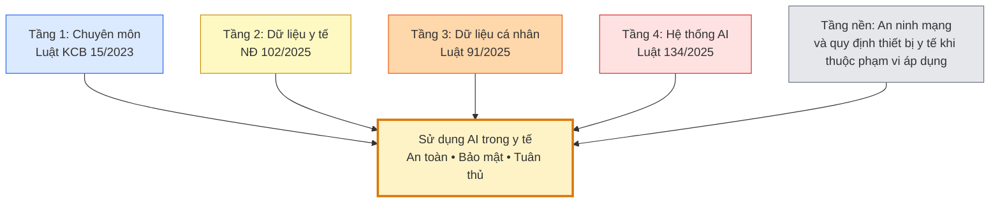

## Bối cảnh: bốn tầng quy định và tầng nền

> **Điểm neo của chương**
>
> Trước khi dùng AI, hãy trả lời ba câu hỏi: người bệnh có thể bị hại ở đâu,
> dữ liệu sẽ đi đâu và ai có thẩm quyền quyết định? Một công cụ thuận tiện
> chưa chắc phù hợp cho bệnh án thật; một câu trả lời trôi chảy chưa chắc đúng.

Nhân viên y tế không cần trở thành lập trình viên để sử dụng AI an toàn.
Điều cần thiết là nhận ra giới hạn của công cụ, biết khi nào phải kiểm
chứng và biết báo cho ai khi phát hiện bất thường. Chương này là cẩm nang
thực hành, không thay thế tư vấn pháp lý hoặc quy trình chuyên môn tại cơ sở.

Bốn tầng dưới đây là **cách tổ chức nội dung của cẩm nang**, không phải
thứ bậc hiệu lực giữa các văn bản. Tầng chuyên môn dựa trên Luật Khám bệnh,
chữa bệnh 15/2023/QH15, có hiệu lực từ 1/1/2024; tầng dữ liệu y tế dựa trên
Nghị định 102/2025/NĐ-CP, có hiệu lực từ 1/7/2025; tầng dữ liệu cá nhân
dựa trên Luật 91/2025/QH15, có hiệu lực từ 1/1/2026; tầng AI dựa trên
Luật 134/2025/QH15, có hiệu lực từ 1/3/2026. ([Luật Khám bệnh, chữa
bệnh](https://xaydungchinhsach.chinhphu.vn/toan-van-luat-15-2023-qh15-kham-benh-chua-benh-119231127164453959.htm);
[Nghị định 102 tại Công báo](https://congbao.chinhphu.vn/van-ban/nghi-dinh-so-102-2025-nd-cp-44865/56285.htm);
[Luật 91 bản tiếng Việt tại Bộ Công an](https://mps.gov.vn/chinh-sach-phap-luat/co-so-du-lieu-van-ban/luat-bao-ve-du-lieu-ca-nhan-1753688803);
[Luật 134 tại Công báo](https://congbao.chinhphu.vn/van-ban/luat-so-134-2025-qh15-468694.htm))

Khi đọc, cần phân biệt ba loại phát biểu: luật quy định điều gì; bệnh
viện cụ thể hóa thành quy trình thao tác chuẩn (SOP) như thế nào; và
thực hành nào được khuyến cáo để giảm rủi ro. Bảng ở Phần III làm rõ
ranh giới này; các SOP nêu trong chương là nội dung đề xuất để cơ sở
phê duyệt, không mặc nhiên là quy chế đã có tại mọi bệnh viện.

## Phần I — An toàn lâm sàng cho bốn nhóm AI y tế

### Nhận diện công cụ trước khi dùng

Không nên tự xếp mọi AI y tế vào cùng một mức rủi ro pháp lý, cũng
không nên coi công cụ có bác sĩ giám sát là đương nhiên rủi ro thấp.
Điều 9 Luật 134/2025 quy định tiêu chí phân loại; Điều 10 quy định
trách nhiệm phân loại và thông báo, trong đó nhà cung cấp tự phân loại
trước khi đưa hệ thống vào sử dụng. ([Luật AI, Điều 9–10](https://luatvietnam.vn/khoa-hoc/luat-tri-tue-nhan-tao-2025-so-134-2025-qh15-422299-d1.html))
Với nhân viên y tế, câu hỏi thực hành là: công cụ này được phê duyệt
cho việc gì, không được dùng cho việc gì và ai kiểm tra kết quả trước
khi tác động đến người bệnh?

Bảng sau nhóm công cụ theo cách sử dụng để dễ nhận diện rủi ro, không
phải danh mục phân loại pháp lý. Các nhóm có thể giao nhau: một hệ
hỗ trợ quyết định có thể tích hợp mô hình ngôn ngữ hoặc AI đọc ảnh.
Hệ hỗ trợ quyết định lâm sàng, viết tắt **CDSS** từ “clinical decision
support system”, là hệ thống cung cấp thông tin, cảnh báo hoặc gợi ý
để hỗ trợ quyết định chăm sóc; không phải mọi CDSS đều sử dụng AI.
([Tổng quan về CDSS, npj Digital Medicine](https://www.nature.com/articles/s41746-020-0221-y))

| Nhóm công cụ | Gặp ở đâu | Rủi ro an toàn cần nhận diện | Điểm cần kiểm tra về dữ liệu |
|---|---|---|---|
| 🤖 **Mô hình ngôn ngữ lớn (LLM) và chatbot** | Trợ lý hỏi đáp, tóm tắt bệnh án, soạn hướng dẫn. | Có thể bịa thông tin, nguồn dẫn hoặc diễn giải sai ngữ cảnh. | Nội dung nhập vào, tệp tải lên và lịch sử trò chuyện có được lưu, chia sẻ hoặc dùng lại không? |
| 🚨 **Hệ hỗ trợ quyết định lâm sàng** | Cảnh báo tương tác thuốc, dị ứng; gợi ý hỗ trợ chẩn đoán. | Cảnh báo có thể không phù hợp; người dùng cũng có thể bỏ qua cảnh báo quan trọng do đã quen với quá nhiều cảnh báo. | Nhật ký cảnh báo có gắn với người bệnh và người thao tác không; ai được truy cập? |
| 🩻 **AI đọc hình ảnh** | Hỗ trợ đọc X-quang, cắt lớp vi tính (CT), cộng hưởng từ (MRI). | Có thể bỏ sót tổn thương hoặc đánh dấu nhầm; kết luận của AI có thể khiến người đọc chủ quan. | Ảnh và thông tin đi kèm đã được kiểm tra trước khi chuyển ra ngoài chưa? |
| 📈 **AI phân tích tín hiệu** | Điện tâm đồ (ECG), theo dõi điện tim kéo dài (Holter), điện não đồ (EEG). | Có thể diễn giải sai tín hiệu; kết luận tự động không thay thế đánh giá triệu chứng. | Thiết bị có kết nối dịch vụ bên ngoài không; gửi loại dữ liệu nào, theo cấu hình và hợp đồng nào? |

### Mười nguy cơ cần nhận diện

Mười nguy cơ dưới đây là các góc nhìn thực hành, có thể chồng lấp;
không phải mọi hệ thống đều có tất cả các nguy cơ ở cùng mức độ.
Chúng giúp người dùng tự hỏi “có thể sai ở đâu?” thay vì mặc nhiên
tin kết quả vì phần mềm được gắn nhãn AI.

- 🤖 **Bịa thông tin nhưng diễn đạt chắc chắn:** Mô hình ngôn ngữ
  có thể tạo ra tên tài liệu, kết quả hoặc khuyến cáo không có thật.
  Cần mở nguồn gốc và đối chiếu nội dung, không chỉ nhìn thấy một đường dẫn.
- 🤖🩻 **Thiên lệch giữa các nhóm người bệnh:** Nếu nhóm người đang
  được khám chưa được đánh giá đầy đủ trong điều kiện sử dụng của công
  cụ, kết quả có thể kém tin cậy. Không suy ra độ phù hợp cho trẻ em,
  thai phụ hoặc nhóm bệnh hiếm chỉ từ kết quả chung của hệ thống.
- 🤖🚨 **Kiến thức hoặc cảnh báo chưa được cập nhật:** Hướng dẫn
  chuyên môn có thể thay đổi trong khi công cụ vẫn sử dụng phiên bản
  cũ. Hãy kiểm tra ngày, phiên bản và phạm vi áp dụng của tài liệu.
- 🩻📈 **Tin tự động hóa quá mức:** Người dùng có thể ưu tiên kết
  luận của máy hơn bằng chứng mình đã quan sát. Khi có bất đồng, phải
  đánh giá lại và hội chẩn khi cần, không bỏ qua dấu hiệu cảnh báo.
- 🚨 **Bỏ qua cảnh báo theo phản xạ:** Quá nhiều cảnh báo ít hữu ích
  có thể làm người dùng mệt mỏi với cảnh báo, thường gọi là “alert
  fatigue”. Cần báo các cảnh báo không phù hợp để đơn vị rà soát, thay
  vì hình thành thói quen đóng mọi cảnh báo.
- 🩻 **Ký kết quả hình ảnh khi chưa kiểm chứng:** Gợi ý “không phát
  hiện bất thường” không phải lý do để bỏ bước đọc và đối chiếu phim
  theo quy trình chuyên môn. Những ca không phù hợp với triệu chứng
  cần được xem xét lại.
- 📈 **Ký kết luận tín hiệu khi chưa đối chiếu lâm sàng:** Bản in
  điện tim có nhận xét tự động không đủ để kết luận người bệnh đau
  ngực là an toàn. Người có trách nhiệm phải đánh giá bản ghi trong
  bối cảnh bệnh sử, triệu chứng và thăm khám.
- 🤖🩻📈 **Mai một kỹ năng do phụ thuộc công cụ:** Nếu chỉ chấp nhận
  đầu ra mà không tự phân tích, người dùng có thể giảm cơ hội rèn
  luyện kỹ năng. Nên duy trì đọc độc lập và thảo luận các ca bất đồng.
- 🤖🚨 **Thiếu ngữ cảnh:** Một thông tin bị bỏ sót, chẳng hạn dị
  ứng hoặc thay đổi chức năng thận, có thể làm gợi ý không phù hợp.
  Không coi sự im lặng của AI là xác nhận rằng không có nguy cơ.
- 🤖🚨🩻📈 **Không lưu được dấu vết sử dụng:** Nếu không biết AI
  đã gợi ý gì, ai kiểm tra và ai quyết định, việc rà soát sự cố sẽ
  khó khăn. Cơ sở cần quy định cách ghi nhận phù hợp, không sao chép
  thêm dữ liệu người bệnh vào nơi lưu trữ chưa được phép.

Những nguy cơ về an toàn, thiên lệch và lệ thuộc công cụ được thảo
luận trong [hướng dẫn WHO về đạo đức và quản trị AI y tế](https://www.who.int/publications/i/item/9789240029200);
nguy cơ thông tin sai của LLM được trình bày riêng ở mục LLM09 của
[OWASP 2025](https://owasp.org/www-project-top-10-for-large-language-model-applications/assets/PDF/OWASP-Top-10-for-LLMs-v2025.pdf).
Các ví dụ trong danh sách là diễn giải để học thực hành, không phải
bằng chứng rằng một sản phẩm cụ thể đã gây ra sự cố.

### Mười quy tắc an toàn lâm sàng

Các quy tắc dưới đây là khuyến cáo để chuyển thành SOP phù hợp với
chuyên khoa và phạm vi hành nghề. Không đọc chúng như mười điều cấm
được trích nguyên văn từ luật.

1. **Không dùng AI để bỏ qua đánh giá chuyên môn cần thiết.** Công
   cụ hỗ trợ không thay việc hỏi bệnh, khám và thực hiện quy trình
   chẩn đoán, điều trị phù hợp.
2. **Có người có thẩm quyền chuyên môn kiểm tra trước khi áp dụng.**
   Trách nhiệm này phải rõ trong quy trình; một chỉ số tự tin do máy
   hiển thị không thay thế việc kiểm chứng.
3. **Không tự đưa ca định danh lên AI công cộng để quyết định điều trị.**
   Chỉ xử lý dữ liệu thật trong phạm vi công cụ và mục đích đã được
   cơ sở phê duyệt.
4. **Đối chiếu nguồn gốc trước khi hành động.** Tên thuốc, liều,
   tương tác, chống chỉ định và khuyến cáo cần được kiểm tra bằng
   tài liệu chuyên môn phù hợp, còn hiệu lực.
5. **Ghi nhận vai trò của AI theo quy trình hồ sơ.** Có thể ghi
   công cụ được tham khảo, nội dung đã kiểm tra và quyết định cuối;
   không biến bản gợi ý chưa duyệt thành kết quả chính thức.
6. **Khi AI và đánh giá chuyên môn khác nhau, dừng để đánh giá lại.**
   Không tự động theo AI, nhưng cũng không mặc nhiên cho rằng người
   đọc luôn đúng; bổ sung bằng chứng hoặc hội chẩn khi cần.
7. **Tăng mức kiểm chứng ở tình huống hậu quả lớn.** Ca bệnh phức
   tạp, thuốc nguy cơ cao hoặc nhóm người bệnh dễ bị tổn thương cần
   mức giám sát phù hợp do cơ sở quy định.
8. 🚨 **Xem nội dung trước khi bỏ qua cảnh báo quan trọng.** Ghi lý
   do theo SOP và báo những cảnh báo thường xuyên không phù hợp cho
   đầu mối chuyên môn; không tự tắt cả nhóm cảnh báo.
9. 🩻 **Duy trì đọc phim độc lập theo quy trình chuyên khoa.** Nên
   có cách hạn chế việc bị kết luận AI dẫn dắt; thứ tự đọc và trường
   hợp cần người đọc thứ hai phải phù hợp với quy trình đã phê duyệt.
10. 📈 **Coi nhận xét tự động trên bản ghi là thông tin hỗ trợ.**
    Đối chiếu chất lượng bản ghi, triệu chứng và diễn biến trước khi
    ký; không dùng một nhận xét “bình thường” để bỏ qua dấu hiệu nguy hiểm.

Trách nhiệm cần được nhìn theo vai trò, không đổ hết cho người dùng
cuối hoặc cho nhà cung cấp. Người hành nghề chịu trách nhiệm về việc
khám chữa bệnh của mình theo khoản 2 Điều 45 Luật Khám bệnh, chữa
bệnh; với hệ AI rủi ro cao, Điều 14 Luật AI phân định nghĩa vụ của nhà
cung cấp, bên triển khai và người sử dụng. ([Luật Khám bệnh, chữa
bệnh](https://xaydungchinhsach.chinhphu.vn/toan-van-luat-15-2023-qh15-kham-benh-chua-benh-119231127164453959.htm);
[Luật AI, Điều 14](https://luatvietnam.vn/khoa-hoc/luat-tri-tue-nhan-tao-2025-so-134-2025-qh15-422299-d1.html))
Khi sự cố xảy ra, cần xem dữ kiện, phạm vi nhiệm vụ, quy trình và quan
hệ nhân quả trước khi kết luận trách nhiệm cụ thể.

## Phần II — Bảo mật thông tin và an ninh mạng

### Bảy điểm nhân viên y tế cần biết

Không phải mọi dữ liệu trong ngành y tế đều là dữ liệu cá nhân; một
báo cáo tổng hợp không nhận diện cá nhân khác với hồ sơ gắn với người
bệnh. Tình trạng sức khỏe nằm trong danh mục dữ liệu cá nhân nhạy cảm
tại điểm d khoản 1 Điều 4 Nghị định 356/2025/NĐ-CP; Điều 26 Luật
91/2025 quy định bảo vệ dữ liệu cá nhân đối với thông tin sức khỏe và
trong hoạt động kinh doanh bảo hiểm. ([Nghị định 356, bản tiếng Việt](https://vbpl.vn/TW/Lists/vbpq/Attachments/187276/ND.356.2025.doc);
[Luật 91](https://mps.gov.vn/chinh-sach-phap-luat/co-so-du-lieu-van-ban/luat-bao-ve-du-lieu-ca-nhan-1753688803))
Bảy điểm sau giúp người dùng đặt câu hỏi đúng trước khi nhập hoặc
chuyển dữ liệu, không yêu cầu họ tự cấu hình hệ thống.

- 🏥 **Nhãn “nội bộ” không tự bảo đảm dữ liệu ở lại bệnh viện.**
  Cần yêu cầu đầu mối phụ trách xác nhận nơi xử lý, nơi lưu, kết nối
  bên ngoài, quyền của nhà cung cấp và điều khoản hợp đồng. Với AI
  công cộng, phải kiểm tra chính sách theo đúng nhà cung cấp, loại
  tài khoản và cấu hình; không suy luận mọi bản miễn phí đều dùng
  dữ liệu để huấn luyện hoặc mọi bản trả phí đều an toàn.
- 👥 **Xóa tên chưa đủ để khử nhận dạng.** Ngày sinh, thời điểm
  khám, mã khoa phòng, địa bàn và bệnh hiếm có thể kết hợp để nhận
  ra một người. Bộ phận hành chính và nghiên cứu cần rà cả các trường
  này, không chỉ cột họ tên.
- 🔐 **Không dùng chung tài khoản theo quy định an toàn của bệnh
  viện.** Đây là biện pháp giúp xác định người thao tác và giới hạn
  quyền truy cập; cần được ban hành trong SOP. Khoản 3 Điều 30 quy
  định xác thực, định danh phù hợp và phân quyền, không ghi nguyên
  văn rằng mỗi người bắt buộc phải có một tài khoản riêng.
  ([Luật 91, Điều 30](https://mps.gov.vn/chinh-sach-phap-luat/co-so-du-lieu-van-ban/luat-bao-ve-du-lieu-ca-nhan-1753688803))
- 🧩 **Không tự cài tiện ích AI lên máy làm việc chuyên môn.** Cần
  kiểm tra quyền mà tiện ích yêu cầu và được bộ phận phụ trách cho
  phép. Một tiện ích đọc nội dung màn hình có thể tiếp cận bệnh án
  đang mở, dù người dùng không chủ động tải tệp lên.
- 💉 **Tài liệu đưa vào AI có thể chứa chỉ dẫn đánh lừa công cụ.**
  Một đoạn văn hoặc tệp từ bên ngoài có thể khiến AI làm sai nhiệm
  vụ hoặc tìm cách tiết lộ thông tin. Người dùng cần báo hành vi bất
  thường; không tự thử khai thác trên dữ liệu thật.
- 🎯 **Có AI không làm mất các rủi ro bảo mật thông thường.** Tài
  khoản bị chiếm, tệp độc hại và quyền truy cập quá rộng vẫn cần được
  kiểm soát. Quy trình AI phải gắn với đầu mối ứng cứu sự cố của cơ sở.
- 🌍 **Kiểm tra việc chuyển dữ liệu xuyên biên giới trước khi sử
  dụng dịch vụ.** Điều 20 điều chỉnh hoạt động này, bao gồm sử dụng
  nền tảng ngoài lãnh thổ Việt Nam để xử lý dữ liệu cá nhân được thu
  thập tại Việt Nam; Điều 22 quy định cập nhật hồ sơ đánh giá tác
  động. Việc áp dụng nghĩa vụ và ngoại lệ phải do đầu mối có trách
  nhiệm rà soát, không để từng nhân viên tự suy đoán.
  ([Luật 91, Điều 20 và 22](https://mps.gov.vn/chinh-sach-phap-luat/co-so-du-lieu-van-ban/luat-bao-ve-du-lieu-ca-nhan-1753688803))

Các bước kiểm tra nhà cung cấp, quyền truy cập, nội dung đầu vào và
cách sử dụng lại dữ liệu phù hợp với hướng giảm rủi ro trong
[OWASP Top 10 for LLM Applications 2025](https://owasp.org/www-project-top-10-for-large-language-model-applications/assets/PDF/OWASP-Top-10-for-LLMs-v2025.pdf).
Đó là khuyến cáo bảo mật để cụ thể hóa, không phải căn cứ để khẳng
định một hãng hoặc một thiết bị mặc nhiên vi phạm.

### Hiểu đúng k-anonymity và nguy cơ tái định danh

**K-anonymity** có thể hiểu là tính không phân biệt được giữa ít nhất
`k` bản ghi theo một tổ hợp trường có khả năng nhận diện gián tiếp.
Trong bảng dữ liệu đã xử lý, mỗi tổ hợp giá trị của các trường được
chọn phải xuất hiện ở ít nhất `k` bản ghi; `k = 5` nghĩa là ít nhất
năm bản ghi tính cả bản ghi đang xét, không phải năm người khác ngoài
người đó. ([NIST SP 800-188](https://nvlpubs.nist.gov/nistpubs/SpecialPublications/NIST.SP.800-188.pdf))
Ví dụ minh họa, với bảng mỗi người một dòng, nhóm nghiên cứu có thể
chuyển ngày sinh thành nhóm tuổi, ngày nhập viện thành tháng và địa
chỉ thành vùng rộng hơn, rồi kiểm tra số dòng có cùng tổ hợp giá trị.
Chỉ thay cách hiển thị mà không kiểm tra lại toàn bộ bảng chưa chứng
minh đã đạt mức `k` mong muốn.

Không có ngưỡng `k ≥ 5` bắt buộc phổ quát trong hướng dẫn NIST
này; việc chọn phương pháp và mức bảo vệ phải gắn với mục đích sử
dụng, dữ liệu được chia sẻ và nguy cơ gây hại. K-anonymity phù hợp
chủ yếu với dữ liệu dạng bảng, không tự xử lý hết thông tin trong
ảnh, văn bản tự do hoặc nguy cơ ghép nối nhiều lần công bố.
([NIST SP 800-188](https://nvlpubs.nist.gov/nistpubs/SpecialPublications/NIST.SP.800-188.pdf))
Ngay cả khi một nhóm có nhiều bản ghi giống nhau về tuổi và địa bàn,
nếu tất cả đều mang cùng một chẩn đoán nhạy cảm thì thông tin sức
khỏe vẫn có thể bị suy ra; vì vậy “đạt `k`” không đồng nghĩa với
“đã an toàn để công khai”. ([NIST SP 800-188](https://nvlpubs.nist.gov/nistpubs/SpecialPublications/NIST.SP.800-188.pdf))

Trong phạm vi Luật 91/2025 và Nghị định 356/2025 được đối chiếu cho
chương này, không có quy định chung bắt buộc mọi bộ dữ liệu y tế Việt
Nam phải đạt `k ≥ 5`. Khoản 11 Điều 2 Luật 91 định nghĩa khử
nhận dạng theo kết quả không thể xác định hoặc giúp xác định một
người cụ thể; khoản 6 Điều 14 yêu cầu kiểm soát quá trình và không
tái nhận dạng, trừ trường hợp pháp luật có quy định khác.
([Luật 91 bản tiếng Việt](https://mps.gov.vn/chinh-sach-phap-luat/co-so-du-lieu-van-ban/luat-bao-ve-du-lieu-ca-nhan-1753688803);
[Nghị định 356 bản tiếng Việt](https://vbpl.vn/TW/Lists/vbpq/Attachments/187276/ND.356.2025.doc))
Do đó, có thể cân nhắc k-anonymity như một công cụ đánh giá trong
quy trình nghiên cứu, nhưng không lấy nó làm giấy phép tự động đưa
dữ liệu lên AI công cộng. Đơn vị vẫn cần rà soát quy định chuyên
ngành, thỏa thuận sử dụng dữ liệu và mức rủi ro của bộ dữ liệu cụ thể.

Các ví dụ dưới đây hoàn toàn giả định, minh họa cách thông tin có thể
bị ghép nối. Biện pháp gợi ý là bước để rà soát, không phải bảo đảm
khử nhận dạng tuyệt đối.

| Tổ hợp trường dữ liệu cần lưu ý | Vì sao có thể nhận ra người bệnh? | Cách xử lý nên cân nhắc |
|---|---|---|
| Ngày sinh đầy đủ + mã khoa phòng + ngày nhập viện. | Người có lịch hẹn hoặc danh sách tiếp nhận có thể ghép lại đúng hồ sơ dù tên đã bị xóa. | Chỉ giữ độ chi tiết thực sự cần; cân nhắc nhóm tuổi, khoảng thời gian và nhóm khoa, rồi đánh giá lại. |
| Xã cư trú + giới + chẩn đoán bệnh hiếm. | Một người có thể là trường hợp duy nhất được cộng đồng biết đến. | Giảm chi tiết địa bàn hoặc chẩn đoán; với nghiên cứu cần độ chi tiết cao, ưu tiên truy cập có kiểm soát thay vì công khai bảng. |
| Mã nghiên cứu + bảng đối chiếu với mã bệnh án. | Người giữ bảng đối chiếu vẫn có thể truy ngược về người bệnh. | Gọi đúng đây là dữ liệu được thay mã, không mặc nhiên là dữ liệu đã khử nhận dạng; tách và giới hạn quyền giữ bảng đối chiếu. |
| Tóm tắt tự do có nghề nghiệp đặc biệt, sự kiện tai nạn và ngày điều trị. | Nội dung có thể khớp với tin tức hoặc bài đăng của gia đình. | Rà bằng người có chuyên môn, lược bỏ chi tiết không cần thiết; dùng ca mô phỏng cho hoạt động học tập. |
| Ảnh lâm sàng, chữ in trên ảnh, hình xăm hoặc đặc điểm khuôn mặt. | Thông tin định danh có thể nằm trong chính hình ảnh, không chỉ ở tên tệp. | Kiểm tra nội dung ảnh và dữ liệu đi kèm bằng quy trình phù hợp; không chỉ đổi tên tệp. |

### Ba điểm riêng của cảnh báo, hình ảnh và tín hiệu

- 🚨 **Nhật ký cảnh báo cũng có thể chứa thông tin cá nhân.** Dòng
  ghi “người dùng A bỏ qua cảnh báo trên bệnh án B” có thể liên kết
  đến người bệnh và nhân viên. Trước khi chuyển nhật ký cho nhà cung
  cấp, cần rà mục đích, dữ liệu tối thiểu, quyền truy cập và thỏa
  thuận xử lý; không coi lời hứa “chỉ để cải tiến” là đủ.
  ([Luật 91, Điều 30 và 37](https://mps.gov.vn/chinh-sach-phap-luat/co-so-du-lieu-van-ban/luat-bao-ve-du-lieu-ca-nhan-1753688803))
- 🩻 **Ảnh DICOM có thể chứa định danh, nhưng không phải luôn còn
  định danh.** DICOM là định dạng trao đổi ảnh y khoa; thông tin đi
  kèm có thể có tên, ngày sinh hoặc mã bệnh án. Dữ liệu có thể được
  khử nhận dạng theo quy trình, song vẫn phải kiểm tra chữ trên ảnh,
  đặc điểm nhận diện và các trường đi kèm; xử lý thuộc tính đơn thuần
  chưa bảo đảm toàn bộ ảnh đã an toàn.
  ([DICOM PS3.15, Phụ lục E](https://dicom.nema.org/medical/dicom/current/output/chtml/part15/chapter_e.html))
- 📈 **Kết nối ra ngoài của thiết bị phải được kiểm tra theo từng
  trường hợp.** Không mặc định mọi máy ECG, Holter hoặc EEG đều tự
  gửi dữ liệu lên máy chủ nhà sản xuất. Cần hỏi bộ phận thiết bị và
  CNTT về chức năng kết nối, cấu hình đang bật, dữ liệu gửi đi, nơi
  lưu và điều khoản hợp đồng; đây là bảng kiểm rủi ro, không phải
  kết luận về thiết bị của khoa.

### OWASP 2025: mười rủi ro của LLM và ứng dụng AI tạo sinh

[“2025 Top 10 Risk & Mitigations for LLMs and Gen AI Apps”](https://genai.owasp.org/llm-top-10/)
là tài liệu nhận diện rủi ro và biện pháp giảm thiểu của OWASP cho mô
hình ngôn ngữ lớn và ứng dụng AI tạo sinh, không phải luật Việt Nam
hay bảng bao phủ toàn bộ AI đọc phim, điện tim. Các mã và tên gốc
dưới đây theo [bản OWASP 2025](https://owasp.org/www-project-top-10-for-large-language-model-applications/assets/PDF/OWASP-Top-10-for-LLMs-v2025.pdf);
ví dụ y tế và cách diễn đạt thực hành do cẩm nang chuyển thể, không
phải ca sự cố do OWASP công bố.

| Rủi ro OWASP 2025 | Ví dụ mô phỏng trong công việc y tế | Cách giảm rủi ro ở mức người dùng và cơ sở |
|---|---|---|
| **LLM01: Prompt Injection.** Chèn chỉ dẫn để đánh lừa AI. | Một tệp tải vào trợ lý chứa chỉ dẫn ẩn yêu cầu bỏ nhiệm vụ và tìm dữ liệu không liên quan. | Người dùng báo hành vi bất thường, không làm theo yêu cầu chuyển dữ liệu lạ. Cơ sở giới hạn quyền của AI và yêu cầu người duyệt hành động nhạy cảm. |
| **LLM02: Sensitive Information Disclosure.** Tiết lộ thông tin nhạy cảm. | Chatbot trả thông tin người bệnh khác hoặc người dùng tải bệnh án lên công cụ chưa được duyệt. | Chỉ nhập dữ liệu được phép; kiểm tra người nhận trước khi chia sẻ. Cơ sở giới hạn nguồn dữ liệu, quyền xem và chính sách lưu, dùng lại dữ liệu. |
| **LLM03: Supply Chain.** Rủi ro từ thành phần và nhà cung cấp. | Một tiện ích AI mới tiếp cận hồ sơ nhưng chưa được kiểm tra nguồn gốc và quyền truy cập. | Không tự cài đặt. Cơ sở đánh giá nhà cung cấp, thành phần phần mềm và các thay đổi trước khi cho sử dụng. |
| **LLM04: Data and Model Poisoning.** Làm sai lệch dữ liệu hoặc mô hình. | Tài liệu chuyên môn bị sửa trái phép được đưa vào kho tham khảo của trợ lý. | Báo nội dung khác nguồn chính thức. Cơ sở quản lý nguồn, phiên bản, quyền cập nhật và kiểm tra trước khi đưa tài liệu vào sử dụng. |
| **LLM05: Improper Output Handling.** Xử lý đầu ra không an toàn. | Văn bản, đường dẫn hoặc chỉ dẫn do AI tạo được phần mềm tiếp nhận và thực thi mà chưa kiểm tra. | Không tự mở hoặc làm theo chỉ dẫn lạ. Cơ sở kiểm tra đầu ra trước khi chuyển sang hệ thống khác; không coi văn bản AI là lệnh đáng tin cậy. |
| **LLM06: Excessive Agency.** Trao quyền hành động quá mức. | Trợ lý được phép tự sửa hồ sơ hoặc tự gửi hướng dẫn điều trị cho người bệnh. | Người có thẩm quyền duyệt trước hành động có hậu quả lớn. Cơ sở chỉ cấp quyền tối thiểu và có cách dừng hoạt động không phù hợp. |
| **LLM07: System Prompt Leakage.** Lộ chỉ dẫn cấu hình của trợ lý. | Phần chỉ dẫn nền chứa mật khẩu hoặc thông tin nội bộ, rồi bị AI tiết lộ. | Không đưa bí mật vào phần cấu hình trò chuyện. Cơ sở quản lý thông tin xác thực riêng và không dùng câu “không tiết lộ” làm hàng rào bảo mật duy nhất. |
| **LLM08: Vector and Embedding Weaknesses.** Điểm yếu ở cơ chế tìm và ghép tài liệu. | Trợ lý lấy hồ sơ thuộc nhóm người dùng khác để trả lời câu hỏi. | Dừng chia sẻ khi thấy tài liệu ngoài quyền được xem. Cơ sở kiểm soát quyền ngay ở nguồn và bước tìm tài liệu, không chỉ ở màn hình đăng nhập. |
| **LLM09: Misinformation.** Thông tin sai hoặc gây hiểu lầm. | AI bịa điều luật, nguồn dẫn hoặc thêm một kết quả xét nghiệm không có trong hồ sơ. | Mở nguồn gốc và đối chiếu từng thông tin quan trọng; không ký hoặc gửi nội dung chưa xác minh. Cơ sở quy định người chịu trách nhiệm duyệt. |
| **LLM10: Unbounded Consumption.** Tiêu thụ tài nguyên không được giới hạn. | Tác vụ lặp gây chậm dịch vụ hoặc phát sinh sử dụng ngoài dự kiến. | Dừng tác vụ bất thường, không gửi lặp liên tục. Cơ sở đặt giới hạn sử dụng, cảnh báo và phương án làm việc khi dịch vụ gián đoạn. |

Thông điệp thực hành là không trao cho AI nhiều dữ liệu, quyền truy
cập và quyền hành động hơn mức cần thiết. Nhân viên y tế không phải
tự xây các hàng rào kỹ thuật, nhưng cần biết yêu cầu đầu mối phụ
trách xác nhận chúng trước khi sử dụng công cụ với công việc thật.

## Phần III — Tuân thủ pháp luật theo bốn tầng và tầng nền

### Tầng 1: chuyên môn khám bệnh, chữa bệnh

Khoản 2 Điều 10 bảo vệ bí mật thông tin trong hồ sơ bệnh án và thông
tin đời tư trong phạm vi luật quy định; khoản 2 và khoản 5 Điều 45
quy định trách nhiệm về việc khám chữa bệnh và giữ bí mật; Điều 69
quy định lập, lưu giữ và khai thác hồ sơ bệnh án, bao gồm yêu cầu
giữ bí mật và sử dụng đúng mục đích. ([Luật 15/2023/QH15](https://xaydungchinhsach.chinhphu.vn/toan-van-luat-15-2023-qh15-kham-benh-chua-benh-119231127164453959.htm))
Vì vậy, dùng AI không làm mất nghĩa vụ chuyên môn hoặc biến quyền
được đọc bệnh án thành quyền tự do sao chép hồ sơ cho một dịch vụ khác.

### Tầng 2: dữ liệu y tế

Nghị định 102/2025/NĐ-CP quy định quản lý dữ liệu y tế số, Cơ sở dữ
liệu quốc gia về y tế và trách nhiệm của các bên liên quan; Điều 9
và Điều 10 quy định xử lý, khai thác và sử dụng dữ liệu.
([Nghị định 102, toàn văn](https://luatvietnam.vn/y-te/nghi-dinh-102-2025-nd-cp-cua-chinh-phu-quy-dinh-quan-ly-du-lieu-y-te-400071-d1.html))
Liên thông dữ liệu không đồng nghĩa với quyền truy cập không giới
hạn; nhân viên cần biết quyền được cấp và mục đích được cho phép
trong công việc của mình.

### Tầng 3: dữ liệu cá nhân

Luật 91/2025 phải được đọc cùng văn bản hướng dẫn phù hợp, trong
đó có Nghị định 356/2025/NĐ-CP; nghị định này có hiệu lực từ 1/1/2026
và quy định Nghị định 13/2023/NĐ-CP hết hiệu lực từ cùng thời điểm.
([Nghị định 356](https://vbpl.vn/TW/Lists/vbpq/Attachments/187276/ND.356.2025.doc))
Không nên học thuộc một danh sách số điều rồi gắn vào mọi tình
huống; cần đọc đúng chủ thể, điều kiện và ngoại lệ của điều khoản.

- **Quyền của chủ thể dữ liệu:** Khoản 1 Điều 4 bao gồm quyền
  được biết; đồng ý, không đồng ý và rút lại sự đồng ý; xem, chỉnh
  sửa; yêu cầu cung cấp, xóa, hạn chế hoặc phản đối xử lý; khiếu nại,
  tố cáo, khởi kiện, yêu cầu bồi thường; yêu cầu biện pháp bảo vệ.
  Không nên rút thành sáu từ đơn làm mất nội hàm hoặc điều kiện
  thực hiện quyền. ([Luật 91, Điều 4](https://mps.gov.vn/chinh-sach-phap-luat/co-so-du-lieu-van-ban/luat-bao-ve-du-lieu-ca-nhan-1753688803))
- **Thông tin sức khỏe:** Điều 26 yêu cầu sự đồng ý khi thu
  thập, xử lý, trừ trường hợp tại khoản 1 Điều 19; khoản 2 có quy
  định riêng về cung cấp dữ liệu cho bên thứ ba là tổ chức cung
  cấp dịch vụ chăm sóc sức khỏe, bảo hiểm sức khỏe hoặc bảo hiểm
  nhân thọ, với ngoại lệ được nêu trong điều khoản. Không bỏ các
  ngoại lệ khi diễn giải và không dùng ngoại lệ khẩn cấp như lý do
  chung để gửi bệnh án ra ngoài. ([Luật 91, Điều 19 và 26](https://mps.gov.vn/chinh-sach-phap-luat/co-so-du-lieu-van-ban/luat-bao-ve-du-lieu-ca-nhan-1753688803))
- **Chuyển dữ liệu và đánh giá tác động:** Điều 20 quy định
  chuyển dữ liệu cá nhân xuyên biên giới; Điều 21 quy định đánh
  giá tác động xử lý dữ liệu cá nhân; Điều 22 quy định cập nhật
  hai loại hồ sơ đánh giá tác động. Khoản 2 Điều 20 và khoản 1
  Điều 21 có mốc gửi hồ sơ trong 60 ngày cùng các ngoại lệ được
  dẫn chiếu; đây không phải quyền cho nhân viên tự chuyển dữ liệu
  trước rồi xin phép sau. ([Luật 91, Điều 20–22](https://mps.gov.vn/chinh-sach-phap-luat/co-so-du-lieu-van-ban/luat-bao-ve-du-lieu-ca-nhan-1753688803))
- **Xử lý dữ liệu bằng AI:** Điều 30 yêu cầu đúng mục đích,
  trong phạm vi cần thiết, có biện pháp bảo mật, xác thực, định
  danh phù hợp, phân quyền và phân loại rủi ro để bảo vệ dữ liệu.
  Quy tắc “không dùng chung tài khoản” là cách cơ sở cụ thể hóa
  an toàn trong SOP, không phải câu trích nguyên văn khoản 3.
  ([Luật 91, Điều 30](https://mps.gov.vn/chinh-sach-phap-luat/co-so-du-lieu-van-ban/luat-bao-ve-du-lieu-ca-nhan-1753688803))
- **Quan hệ với nhà cung cấp:** Điều 37 phân định trách nhiệm
  bên kiểm soát, bên xử lý, bên kiểm soát và xử lý dữ liệu; bên
  xử lý chỉ tiếp nhận dữ liệu sau khi có thỏa thuận, hợp đồng theo
  quy định. Cần xác định vai trò thực tế của các bên, không mặc
  nhiên coi mọi nhà cung cấp đều chỉ là bên xử lý.
  ([Luật 91, Điều 37](https://mps.gov.vn/chinh-sach-phap-luat/co-so-du-lieu-van-ban/luat-bao-ve-du-lieu-ca-nhan-1753688803))

> **Mốc 72 giờ: đọc đúng điều kiện, không chờ đến sát hạn**
>
> Khoản 1 Điều 23 quy định các chủ thể được nêu trong điều khoản phải
> thông báo cho cơ quan chuyên trách bảo vệ dữ liệu cá nhân chậm nhất
> 72 giờ kể từ khi phát hiện vi phạm có thể gây tổn hại đến quốc phòng,
> an ninh quốc gia, trật tự, an toàn xã hội hoặc xâm phạm đến tính mạng,
> sức khỏe, danh dự, nhân phẩm, tài sản của chủ thể dữ liệu. Bên xử lý
> dữ liệu phát hiện vi phạm phải thông báo kịp thời cho bên kiểm soát
> hoặc bên kiểm soát và xử lý dữ liệu.
> ([Luật 91, khoản 1 Điều 23](https://mps.gov.vn/chinh-sach-phap-luat/co-so-du-lieu-van-ban/luat-bao-ve-du-lieu-ca-nhan-1753688803))
>
> Không diễn đạt thành mọi lần dán nhầm đều mặc nhiên chịu cùng một
> nghĩa vụ 72 giờ; cũng không suy ra sự cố dưới ngưỡng này thì khỏi
> báo cáo. SOP nên yêu cầu nhân viên báo nội bộ ngay khi phát hiện,
> bảo toàn thông tin liên quan và để đầu mối có trách nhiệm đánh giá
> nghĩa vụ thông báo, kể cả các quy định khác của Điều 23.

Chế tài cũng phải đọc theo từng hành vi. Điều 8 quy định các mức
phạt tối đa đối với tổ chức, trong đó có mức tính theo khoản thu
từ mua bán dữ liệu, mức 5% doanh thu năm trước liền kề đối với vi
phạm chuyển dữ liệu xuyên biên giới và mức 03 tỷ đồng đối với hành
vi vi phạm khác, kèm quy tắc áp dụng khi không có hoặc có khoản
thu/doanh thu thấp; mức tối đa đối với cá nhân bằng một nửa mức
đối với tổ chức. ([Luật 91, Điều 8](https://mps.gov.vn/chinh-sach-phap-luat/co-so-du-lieu-van-ban/luat-bao-ve-du-lieu-ca-nhan-1753688803))
Không lấy một con số tối đa để dự đoán mức phạt cho ca mô phỏng khi
chưa xác định hành vi, chủ thể và quy định xử phạt áp dụng.

### Tầng 4: hệ thống AI

Luật 134/2025 đặt nguyên tắc AI không thay thế thẩm quyền và trách
nhiệm của con người tại khoản 2 Điều 4; các Điều 9–14 quy định phân
loại, thông báo, minh bạch, sự cố và quản lý hệ thống rủi ro cao.
([Luật AI, toàn văn](https://luatvietnam.vn/khoa-hoc/luat-tri-tue-nhan-tao-2025-so-134-2025-qh15-422299-d1.html))
Tại thời điểm rà soát 18/9/2026, cần đọc cùng Nghị định 142/2026/NĐ-CP,
có hiệu lực từ 1/5/2026, và Quyết định 33/2026/QĐ-TTg về danh mục hệ
thống AI rủi ro cao, có hiệu lực từ 15/8/2026; không còn gọi danh mục
này là “dự kiến”. ([Nghị định 142](https://chinhphu.vn/?pageid=27160&docid=218029);
[Quyết định 33](https://congbao.chinhphu.vn/van-ban/quyet-dinh-so-33-2026-qd-ttg-469951.htm))
Việc xác định mức rủi ro của một chatbot hoặc hệ cảnh báo cụ thể cần
đối chiếu chức năng, mục đích sử dụng, hồ sơ phân loại và quy định
hiện hành, không kết luận chỉ từ tên sản phẩm.

Điểm a khoản 1 Điều 35 dành thời hạn chuyển tiếp 18 tháng kể từ ngày
luật có hiệu lực cho các hệ thống AI trong y tế, giáo dục và tài
chính đã hoạt động trước ngày đó; khoản 2 cho phép yêu cầu tạm dừng
hoặc chấm dứt nếu cơ quan quản lý xác định nguy cơ gây thiệt hại
nghiêm trọng. ([Luật AI, Điều 35](https://luatvietnam.vn/khoa-hoc/luat-tri-tue-nhan-tao-2025-so-134-2025-qh15-422299-d1.html))
Không hiểu thời gian chuyển tiếp là miễn trách nhiệm chuyên môn,
bảo vệ dữ liệu hay an toàn người bệnh.

### Tầng nền: an ninh mạng và quy định về thiết bị y tế

Luật An ninh mạng 116/2025/QH15 có hiệu lực từ 1/7/2026, thay thế
Luật An toàn thông tin mạng 2015 và Luật An ninh mạng 2018; vì vậy
bản cẩm nang cập nhật sau mốc này không tiếp tục trình bày hai luật
cũ như khung hiện hành song song. ([Thông tin của Công an tỉnh
Ninh Bình](https://congan.ninhbinh.gov.vn/mot-so-diem-luu-y-ve-luat-an-ninh-mang-2025-co-hieu-luc-tu-ngay-172026);
[Luật 116, Điều 44](https://luatvietnam.vn/thong-tin/luat-an-ninh-mang-2025-so-116-2025-qh15-422396-d1.html))
Khi công cụ gắn với thiết bị hoặc phần mềm phục vụ mục đích y tế,
cơ sở cần giao đầu mối phụ trách đối chiếu thêm quy định thiết bị y
tế áp dụng cho sản phẩm, không suy ra mọi chatbot đều là thiết bị y
tế chỉ vì được dùng trong bệnh viện.

### Tách ba loại yêu cầu để không hiểu sai

Bảng này là mẫu để bệnh viện chuyển thành quy trình, không xác nhận
một bệnh viện cụ thể đã ban hành các SOP nêu dưới đây. Cột giữa chỉ
có tính bắt buộc nội bộ khi được người có thẩm quyền phê duyệt và
ban hành phù hợp pháp luật; cột phải là khuyến cáo, không phải điều
luật được trích nguyên văn.

| Quy định pháp luật | SOP bắt buộc của bệnh viện | Khuyến cáo thực hành tốt |
|---|---|---|
| **Bí mật bệnh án:** khoản 2 Điều 10, khoản 5 Điều 45 và Điều 69 Luật KCB bảo vệ thông tin và quy định khai thác hồ sơ. ([Luật KCB](https://xaydungchinhsach.chinhphu.vn/toan-van-luat-15-2023-qh15-kham-benh-chua-benh-119231127164453959.htm)) | **Nội dung đề xuất để ban hành:** quy định công cụ được phép dùng, loại dữ liệu được nhập, người duyệt xuất hồ sơ và kênh chuyển dữ liệu. | Chỉ dùng thông tin cần thiết; học tập bằng ca mô phỏng thay vì tự che tên bệnh án thật rồi gửi đi. |
| **Xác thực và phân quyền:** khoản 3 Điều 30 yêu cầu biện pháp bảo mật, xác thực, định danh phù hợp và phân quyền. ([Luật 91](https://mps.gov.vn/chinh-sach-phap-luat/co-so-du-lieu-van-ban/luat-bao-ve-du-lieu-ca-nhan-1753688803)) | **Nội dung đề xuất để ban hành:** không dùng chung tài khoản, cấp và thu hồi quyền theo vị trí việc làm, khóa máy khi rời chỗ. | Rà lại quyền khi đổi vị trí; không chia sẻ mật khẩu để giải quyết nhanh việc phát sinh. |
| **Chuyển dữ liệu và hồ sơ:** Điều 20 quy định chuyển xuyên biên giới; Điều 21 về đánh giá tác động xử lý; Điều 22 về cập nhật hồ sơ. ([Luật 91](https://mps.gov.vn/chinh-sach-phap-luat/co-so-du-lieu-van-ban/luat-bao-ve-du-lieu-ca-nhan-1753688803)) | **Nội dung đề xuất để ban hành:** đầu mối pháp chế/bảo vệ dữ liệu rà dịch vụ và hợp đồng trước khi nhân viên sử dụng với dữ liệu thật. | Duy trì bảng dễ tra về nơi xử lý, nơi lưu, nhà cung cấp và phạm vi được phép của từng công cụ. |
| **Thông báo vi phạm:** khoản 1 Điều 23 có mốc 72 giờ với chủ thể và điều kiện tổn hại được luật xác định; bên xử lý phải báo kịp thời cho bên kiểm soát tương ứng. ([Luật 91](https://mps.gov.vn/chinh-sach-phap-luat/co-so-du-lieu-van-ban/luat-bao-ve-du-lieu-ca-nhan-1753688803)) | **Nội dung đề xuất để ban hành:** báo nội bộ ngay, ghi thời điểm phát hiện, bảo toàn bằng chứng và giao đầu mối đánh giá nghĩa vụ thông báo. | Diễn tập báo sự cố; chuẩn bị kênh thay thế khi đầu mối trực không liên lạc được. |
| **Khử nhận dạng:** khoản 11 Điều 2 và khoản 6 Điều 14 quy định khái niệm và yêu cầu kiểm soát, không tái nhận dạng trừ ngoại lệ luật định. ([Luật 91](https://mps.gov.vn/chinh-sach-phap-luat/co-so-du-lieu-van-ban/luat-bao-ve-du-lieu-ca-nhan-1753688803)) | **Nội dung đề xuất để ban hành:** quy trình rà dữ liệu trước khi chia sẻ, gồm trường trực tiếp, gián tiếp, văn bản tự do, ảnh và người phê duyệt. | Cân nhắc k-anonymity cho bảng dữ liệu; không dùng một ngưỡng duy nhất để tuyên bố an toàn cho mọi loại dữ liệu. |
| **Giám sát và trách nhiệm:** khoản 2 Điều 4, Điều 12 và Điều 14 Luật AI quy định kiểm soát của con người, xử lý sự cố và nghĩa vụ với hệ rủi ro cao. ([Luật AI](https://luatvietnam.vn/khoa-hoc/luat-tri-tue-nhan-tao-2025-so-134-2025-qh15-422299-d1.html)) | **Nội dung đề xuất để ban hành:** xác định ai duyệt đầu ra, ai được tạm dừng công cụ, cách báo lỗi và ghi nhận quyết định. | Thảo luận ca bất đồng với AI; dùng bảng kiểm OWASP khi đánh giá trợ lý tạo sinh. |

## Phần IV — Đạo đức nghề nghiệp

WHO nêu sáu nguyên tắc trong hướng dẫn về đạo đức và quản trị AI y
tế. Danh sách dưới đây giữ đúng sáu nội dung gốc; phần giải thích là
diễn giải thực hành của cẩm nang, không phải bản dịch có giá trị pháp
lý. ([WHO: sáu nguyên tắc định hướng](https://www.who.int/news/item/28-06-2021-who-issues-first-global-report-on-ai-in-health-and-six-guiding-principles-for-its-design-and-use))

- 🧭 **Bảo vệ quyền tự chủ của con người:** Con người phải duy
  trì quyền kiểm soát quyết định y tế; quyền riêng tư và sự đồng ý
  có hiểu biết cần được bảo vệ. Khi trao đổi với người bệnh, giải
  thích vai trò và giới hạn của công cụ thay vì dùng “AI đã nói”
  để thay cho giải thích chuyên môn.
- ❤️ **Thúc đẩy sức khỏe, sự an toàn và lợi ích công cộng:** Lợi
  ích của AI phải được cân nhắc cùng nguy cơ gây hại trong mục đích
  sử dụng cụ thể. Không đổi sự an toàn lấy tốc độ xử lý hồ sơ.
- 🔍 **Bảo đảm minh bạch, khả năng giải thích và dễ hiểu:** Cần
  có thông tin phù hợp để người dùng hiểu công cụ làm gì và giới
  hạn ở đâu. Một lời giải thích dài nhưng không kiểm chứng được
  chưa phải là minh bạch.
- 📋 **Thúc đẩy trách nhiệm và trách nhiệm giải trình:** Cần xác
  định ai quyết định, ai giám sát và người bị ảnh hưởng có thể phản
  ánh qua đâu. Ghi nhận quá trình sử dụng AI phải phục vụ việc
  giải trình, không chỉ để hoàn thiện hồ sơ hình thức.
- ⚖️ **Bảo đảm tính bao trùm và công bằng:** Không để lợi ích
  của AI chỉ đến với những nhóm có điều kiện tiếp cận tốt. Việc
  bảo vệ trẻ em, người cao tuổi, người khuyết tật và các nhóm dễ
  bị tổn thương được đặt trong nguyên tắc này, không thay thế một
  nguyên tắc khác của WHO.
- 🌱 **Thúc đẩy AI có khả năng đáp ứng và bền vững:** Cần tiếp
  tục đánh giá công cụ trong sử dụng thực tế, điều chỉnh theo nhu
  cầu, chú ý nguồn lực, tác động môi trường và đào tạo nhân lực.
  Một hệ thống chỉ hoạt động tốt ở giai đoạn trình diễn chưa đủ
  để duy trì chăm sóc an toàn lâu dài.

Tại Việt Nam, V-RHAIN ra mắt ngày 14/1/2026, được giới thiệu là mạng
lưới thúc đẩy AI y tế có trách nhiệm, kết nối các bên và hỗ trợ thử
nghiệm trong điều kiện có kiểm soát. ([Trung tâm Thông tin Y tế Quốc
gia](https://nhic.vn/hoi-thao-ai-y-te-thanh-cong-ra-mat-mang-luoi-v-rhain-va-thuc-day-cac-giai-phap-ai-y-te-co-trach-nhiem/))
Thông tin đó không phải căn cứ để gán toàn bộ nguyên tắc và SOP
trong chương này cho V-RHAIN; khi dẫn một hướng dẫn chính thức của
mạng lưới cần chỉ rõ đúng tài liệu đã ban hành.

Về thông báo cho người bệnh, khoản 1 Điều 11 Luật AI yêu cầu nhà
cung cấp bảo đảm người sử dụng nhận biết khi đang tương tác trực
tiếp với hệ AI, trừ trường hợp pháp luật quy định khác.
([Luật AI, Điều 11](https://luatvietnam.vn/khoa-hoc/luat-tri-tue-nhan-tao-2025-so-134-2025-qh15-422299-d1.html))
Không từ đó suy ra mọi công cụ hỗ trợ hậu trường đều cần cùng một
biểu mẫu đồng ý, hoặc ngược lại rằng quy chế nội bộ luôn đủ để khỏi
thông tin cho người bệnh. Cơ sở cần rà nghĩa vụ minh bạch, sự đồng
ý cho xử lý dữ liệu và yêu cầu chuyên môn/nghiên cứu theo đúng hoạt
động; đây là những câu hỏi liên quan nhưng không đồng nhất.

## Phần V — Việc được làm và việc cần dừng

Bảng dưới đây là hướng dẫn thực hành để đưa vào SOP, không phải
danh mục đầy đủ các hành vi bị cấm theo luật. “Được làm” luôn gắn
với đúng thẩm quyền, mục đích và quy trình đã được cơ sở phê duyệt.

| ✅ Có thể làm trong phạm vi được phép | ❌ Cần dừng và báo đầu mối khi chưa được phép hoặc chưa kiểm chứng |
|---|---|
| Dùng công cụ được phê duyệt để hỗ trợ công việc, với người có trách nhiệm kiểm tra đầu ra. | Để AI tự sửa bệnh án, gửi chỉ dẫn điều trị hoặc phát hành kết quả ngoài quy trình đã duyệt. |
| Dùng AI công cộng để học với tài liệu công khai và tình huống mô phỏng. | Dán dữ liệu sức khỏe có thể nhận diện người bệnh lên công cụ chưa được duyệt, kể cả sau khi chỉ xóa tên. |
| Đối chiếu gợi ý AI với hồ sơ, nguồn chính thức và đánh giá chuyên môn. | Coi câu trả lời AI, điểm tự tin hoặc một nguồn dẫn chưa mở là bằng chứng đủ để quyết định. |
| Chuyển dữ liệu phục vụ nghiên cứu qua quy trình được phê duyệt. | Tự xuất bệnh án hoặc nhật ký hệ thống cho nhà cung cấp vì lời đề nghị “cải tiến mô hình”. |
| Báo lỗi công cụ và nghi ngờ sự cố qua kênh chính thức. | Tự xóa dấu vết, che giấu sự cố hoặc tiếp tục thao tác gây lan truyền dữ liệu. |

## Phần VI — Sáu việc cần trở thành nếp làm

Những việc dưới đây chuyển các nguyên tắc thành hành động dễ nhớ.
Cơ sở cần quy định rõ người phụ trách và kênh thực hiện, để nhân
viên không phải tự xử lý sự cố ngoài thẩm quyền.

1. 🏥 **Kiểm tra công cụ và mục đích được phép.** Không chỉ hỏi
   “công cụ này có trong bệnh viện không”, mà hỏi “được dùng cho
   nhiệm vụ và loại dữ liệu này chưa”.
2. 🔒 **Kiểm tra dữ liệu trước khi nhập.** Rà định danh trực tiếp,
   tổ hợp trường gián tiếp, ảnh và văn bản tự do; nếu chưa chắc,
   không gửi ra ngoài và xin ý kiến đầu mối.
3. ✍️ **Kiểm chứng rồi mới xác nhận.** Ghi nhận quyết định chuyên
   môn và vai trò của công cụ theo quy trình; không đưa phần AI
   suy đoán thành dữ kiện đã quan sát.
4. 🚨 **Báo nội bộ ngay khi phát hiện nguy cơ.** Ưu tiên an toàn
   người bệnh, dừng thao tác có thể làm lan rộng sự cố và lưu lại
   thông tin cần thiết ở nơi được phép. Đầu mối có trách nhiệm
   đánh giá nghĩa vụ thông báo ra ngoài, không để nhân viên chờ
   đến sát mốc 72 giờ mới báo.
5. 💻 **Không tự mở rộng quyền hoặc kết nối.** Không tự cài tiện
   ích, bật đồng bộ hay cấp quyền truy cập bệnh án cho trợ lý
   ngoài phạm vi được duyệt.
6. 🎓 **Học lại khi công cụ hoặc quy trình thay đổi.** Thay đổi
   phiên bản, nơi xử lý dữ liệu hoặc tính năng có thể làm thay đổi
   cách sử dụng an toàn; cần biết thông tin cập nhật từ đơn vị.

## Phần VII — 06 tình huống thực hành

> **Các tình huống dưới đây là tình huống mô phỏng tổng hợp từ những
> dạng rủi ro thường gặp, không phản ánh một người bệnh hoặc cơ sở y tế
> cụ thể.** Các chi tiết được xây dựng cho mục đích học tập, không
> phải số liệu nghiên cứu hoặc hướng dẫn điều trị.

Sáu phần trước cung cấp khung để phân tích; 06 tình huống sau giúp
người đọc vận dụng với chatbot, hệ cảnh báo, hình ảnh, tín hiệu và
hoạt động nghiên cứu. Mục tiêu là nhận diện điều cần kiểm chứng và
đề xuất xử trí phù hợp, không tìm một người để quy lỗi ngay từ đầu.

> 💊 **Tình huống 1: Hỏi chatbot về liều thuốc**
>
> Một điều dưỡng nghi ngờ liều thuốc trên y lệnh của người bệnh có
> suy giảm chức năng thận. Điều dưỡng dán phần bệnh án còn mã người
> bệnh lên chatbot công cộng, nhận câu trả lời “liều này an toàn”
> và tiếp tục thực hiện mà không trao đổi với người phụ trách.

> 🫁 **Tình huống 2: Tin kết quả AI đọc CT**
>
> Người bệnh có triệu chứng kéo dài được chụp CT. Bác sĩ ký nhận
> xét “không phát hiện bất thường” sau khi xem gợi ý AI nhưng chưa
> đọc đầy đủ phim; lần rà soát sau phát hiện một tổn thương cần
> được đánh giá tiếp. Chưa có dữ kiện cho thấy ảnh đã bị chuyển
> khỏi hệ thống được phê duyệt.

> 🧬 **Tình huống 3: Chia sẻ dữ liệu nghiên cứu**
>
> Một khoa gửi bộ hồ sơ và ảnh da liễu cho nhóm nghiên cứu bên
> ngoài. Tệp đã xóa tên nhưng còn ngày sinh, mã khoa, ngày khám,
> chẩn đoán bệnh hiếm và một số ảnh nhận diện khuôn mặt; người
> gửi chưa kiểm tra căn cứ xử lý và quy trình phê duyệt chia sẻ.

> 💬 **Tình huống 4: Chatbot đưa hướng dẫn thay đổi thuốc**
>
> Người bệnh có tiền sử đặt stent mạch vành hỏi chatbot của cơ sở
> về chuẩn bị làm thủ thuật nha khoa. Chatbot khuyên tự ngừng
> aspirin và clopidogrel, là thuốc chống kết tập tiểu cầu, mà
> không chuyển câu hỏi cho người có thẩm quyền chuyên môn duyệt.
> Người bệnh làm theo và sau đó xuất hiện triệu chứng phải cấp cứu.

> 🚨 **Tình huống 5: Bỏ qua cảnh báo tương tác thuốc**
>
> Một bác sĩ đã quen đóng nhanh các cảnh báo ít phù hợp trong
> phần mềm bệnh viện. Khi kê thêm amiodarone cho người bệnh đang
> dùng warfarin, bác sĩ bỏ qua cảnh báo tương tác mà chưa đánh
> giá và chưa ghi lý do; sau đó xảy ra biến cố chảy máu cần rà
> soát. Nhật ký cho thấy cảnh báo đã hiển thị; nhà cung cấp đề
> nghị nhận toàn bộ nhật ký để hỗ trợ điều tra.

> 📈 **Tình huống 6: Tin nhận xét tự động trên điện tim**
>
> Người bệnh đến khám vì đau ngực; máy điện tim có AI in nhận
> xét “không có biến đổi cấp tính”. Bác sĩ dùng nhận xét đó làm
> căn cứ cho về khi chưa hoàn thành đánh giá theo quy trình;
> người bệnh quay lại vì tình trạng nặng hơn. Chưa rõ máy có
> gửi bản ghi kèm định danh đến dịch vụ bên ngoài hay không.

> **CẤM DÁN PHI VÀO CÔNG CỤ AI CÔNG CỘNG HOẶC Ô NỘP BÀI CỦA LAB.**
> Trong cẩm nang này, PHI được dùng để chỉ thông tin sức khỏe có thể
> nhận diện người bệnh, trực tiếp hoặc khi kết hợp với dữ liệu khác;
> đây không phải việc mặc nhiên áp dụng luật HIPAA của Hoa Kỳ tại
> Việt Nam. Chỉ sử dụng các ca mô phỏng đã cho, không thay bằng bệnh
> án thật dù đã xóa tên.

Lab 14 yêu cầu chọn **01 trong 06 tình huống**, dùng công cụ AI gợi
ý để hỗ trợ phân tích rồi tự kiểm chứng trước khi nộp bài 400–700 từ
theo năm tiêu chí. Học viên phải phân biệt sự kiện đã cho với
điều chưa biết, quy định pháp luật với SOP và khuyến cáo; không được
tự thêm sự cố lộ dữ liệu hoặc tự kết luận trách nhiệm pháp lý khi
đề bài chưa đủ dữ kiện.

<a href="/lab/lab-14" target="_blank" rel="noopener noreferrer" class="lab-btn">▶ Mở Lab 14 trong tab mới</a>
~35 phút · Chọn 01 trong 06 tình huống mô phỏng · 400–700 từ · Thang điểm 1–5

## Đọc thêm

- **Luật Bảo vệ dữ liệu cá nhân 91/2025/QH15:** đọc bản tiếng Việt
  tại [Bộ Công an](https://mps.gov.vn/chinh-sach-phap-luat/co-so-du-lieu-van-ban/luat-bao-ve-du-lieu-ca-nhan-1753688803)
  hoặc [Công báo Chính phủ](https://congbao.chinhphu.vn/van-ban/luat-so-91-2025-qh15-45578.htm).
  Ưu tiên đối chiếu các Điều 2, 4, 14, 19–23, 26, 30 và 37 cho
  những vấn đề được trình bày trong chương.
- **Nghị định quản lý dữ liệu y tế 102/2025/NĐ-CP:** sử dụng
  [trang văn bản tại Công báo](https://congbao.chinhphu.vn/van-ban/nghi-dinh-so-102-2025-nd-cp-44865/56285.htm).
  Đọc cùng văn bản về dữ liệu cá nhân, không thay thế văn bản này
  bằng văn bản kia.
- **Luật Trí tuệ nhân tạo 134/2025/QH15:** tham khảo [bản tại
  Công báo](https://congbao.chinhphu.vn/van-ban/luat-so-134-2025-qh15-468694.htm)
  và các văn bản hướng dẫn đã dẫn ở Phần III.
- **WHO về đạo đức và quản trị AI y tế:** xem [báo cáo đầy đủ](https://www.who.int/publications/i/item/9789240029200)
  để hiểu bối cảnh của sáu nguyên tắc, không chỉ học thuộc tên gọi.
- **OWASP 2025:** xem [trang mười rủi ro và biện pháp giảm thiểu](https://genai.owasp.org/llm-top-10/)
  và [bản tài liệu 2025](https://owasp.org/www-project-top-10-for-large-language-model-applications/assets/PDF/OWASP-Top-10-for-LLMs-v2025.pdf).
  Phần chuyển thể y tế trong chương không thay cho đánh giá bảo mật
  hệ thống của bộ phận chuyên trách.
- **Khử nhận dạng:** tham khảo [NIST SP 800-188](https://nvlpubs.nist.gov/nistpubs/SpecialPublications/NIST.SP.800-188.pdf)
  và [DICOM PS3.15, Phụ lục E](https://dicom.nema.org/medical/dicom/current/output/chtml/part15/chapter_e.html).
  Đây là tài liệu kỹ thuật tham khảo, không phải quy định pháp luật Việt Nam.
