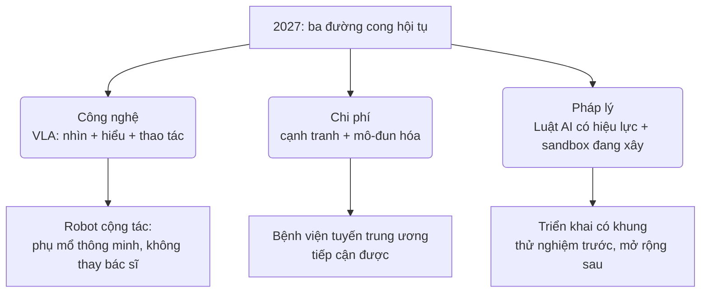
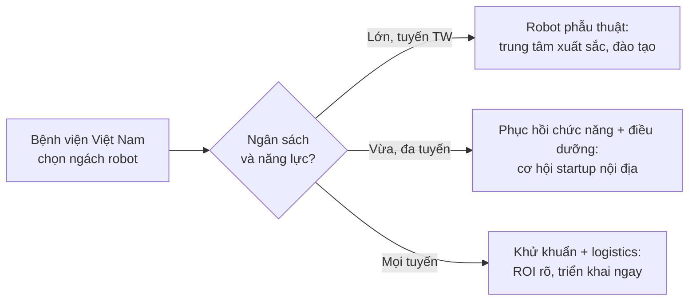

# Chương 16. Robotic AI trong y tế (từ 2027)

## Mở đầu: hợp đồng hàng chục tỷ đồng

Hãy tưởng tượng một buổi sáng thứ Hai. Giám đốc một bệnh viện đa khoa tuyến tỉnh nhận được lời chào mua một hệ thống {t:robot-phau-thuat}robot phẫu thuật{/t} thế hệ mới: hình ảnh 3D sắc nét, tay máy lọc rung, tích hợp AI hỗ trợ nhận diện cấu trúc giải phẫu. Giá niêm yết: hàng chục tỷ đồng cho máy, chưa kể chi phí dụng cụ tiêu hao cho mỗi ca, phí bảo trì hàng năm và chi phí đào tạo ê-kíp. Hãng hứa hẹn "nâng tầm bệnh viện", "thu hút bệnh nhân", "đón đầu xu thế AI".

Ông nhìn sang Trưởng khoa Ngoại, người thì thầm: "Máy thì tốt, nhưng khoa mình một năm có bao nhiêu ca đủ chỉ định? Ai sẽ ngồi console? Bảo trì thì gọi ai, chờ bao lâu?"

Quyết định này — ký hay không ký — không thể dựa vào brochure. Nó cần một khung lập luận: công nghệ này đang ở đâu, vì sao 2027 được coi là điểm bùng phát, Việt Nam nên đặt cược vào ngách nào, và với bệnh viện của mình thì 5 câu hỏi nào phải trả lời được trước khi ký.

Đó là câu hỏi trung tâm của chương này. Đọc xong chương, bạn sẽ:

- Hiểu bức tranh robotic AI trong y tế đến cuối 2026: robot phẫu thuật AI-augmented, robot ngoài phòng mổ, và các mô hình nền tảng cho robotics;
- Giải thích được vì sao 2027 là điểm bùng phát — và đâu là phần "đã chín", đâu là phần "đang xây" về mặt pháp lý;
- Biết Việt Nam nên tập trung vào ngách nào thay vì chạy theo cuộc đua đắt đỏ nhất;
- Có trong tay khung 5 câu hỏi ra quyết định đầu tư robot cho bệnh viện và ma trận ưu tiên theo tuyến;
- Nắm rõ nguyên tắc an toàn: ai chịu trách nhiệm khi robot sai, human-in-the-loop bắt buộc, và khi nào phải dừng.

Chương này thuộc Phần IV (Tương lai): một phần nội dung nhìn về 2027 trở đi, nên các dự báo được ghi rõ là dự báo, các số liệu mang tính thời điểm (10/2026), và những chi tiết vận hành chưa kiểm chứng được gắn cờ để tác giả xác minh.

```metrics
[
  {"value":"25+","label":"Năm robot phẫu thuật trên lâm sàng","hint":"từ FDA clearance da Vinci năm 2000"},
  {"value":"3","label":"Họ công nghệ hội tụ tạo điểm bùng phát","hint":"mô hình nền · thị giác · thao tác"},
  {"value":"5","label":"Câu hỏi trước khi ký hợp đồng robot","hint":"mục 4"},
  {"value":"3","label":"Ngách Việt Nam nên tập trung","hint":"phục hồi CN · điều dưỡng · khử khuẩn"}
]
```

## 1. Robotic AI đang ở đâu — cuối 2026

### 1.1. Robot phẫu thuật AI-augmented: da Vinci và Hugo

{t:robot-phau-thuat}Robot phẫu thuật{/t} thế hệ hiện tại không phải robot "tự mổ". Chúng là hệ thống **phẫu thuật có robot hỗ trợ** (robotic-assisted): bác sĩ ngồi ở bàn điều khiển (console), tay điều khiển hai cần thao tác; hệ thống chuyển động tay của bác sĩ thành chuyển động của tay máy bên trong cơ thể bệnh nhân, với hai cơ chế cốt lõi: {t:motion-scaling}motion scaling{/t} (thu nhỏ chuyển động — tay bác sĩ di chuyển 5 cm, tay máy chỉ di chuyển 5 mm) và {t:tremor-filtration}lọc rung{/t} (loại bỏ rung sinh lý tự nhiên của tay người). Kết quả: phẫu thuật nội soi ít xâm lấn với độ chính xác và tầm nhìn 3D vượt trội.

{t:ai-augmented}AI-augmented{/t} là lớp mới phủ lên nền tảng này: AI phân tích hình ảnh nội soi theo thời gian thực để nhận diện cấu trúc giải phẫu, cảnh báo vùng nguy hiểm, tự động phân đoạn video ca mổ thành từng bước để phục vụ đào tạo và đánh giá. Robot vẫn không tự quyết định đường cắt — nhưng nó "nhìn" cùng bác sĩ và ghi nhớ mọi thứ.

Hai cái tên dẫn dắt thị trường:

- **da Vinci (Intuitive Surgical, Hoa Kỳ):** hệ thống lâu đời nhất và phổ biến nhất, được FDA chấp thuận từ năm 2000, trải qua nhiều thế hệ (Si, Xi, X, SP và da Vinci 5 ra mắt 2024 với phản hồi lực — force feedback). Tại Việt Nam, một số bệnh viện lớn đã triển khai da Vinci Xi, trong đó có bệnh viện tư nhân tại TP.HCM công bố trang bị 2 hệ thống và Bệnh viện Đại học Y Hà Nội đưa vào vận hành hệ thống được giới thiệu là hiện đại nhất miền Bắc trong năm 2026. <!-- CẦN TÁC GIẢ XÁC MINH: số lượng bệnh viện Việt Nam đang vận hành da Vinci và số ca/năm -->
- **Hugo (Medtronic):** đối thủ thách thức trực diện nhất, thiết kế mô-đun linh hoạt (các tay máy độc lập thay vì một khối duy nhất), tích hợp nền tảng số Touch Surgery với AI phân tích video ca mổ. Đã được lưu hành tại châu Âu và một số thị trường; tình trạng phê duyệt thay đổi theo từng quốc gia — cần kiểm tra tài liệu chính thức của hãng trước khi đưa vào kế hoạch mua sắm. <!-- CẦN TÁC GIẢ XÁC MINH: tình trạng phê duyệt của Hugo tại Việt Nam -->

🎬 **Video minh họa:** [Medtronic — "Hugo™ RAS System: Product Animation", giới thiệu thiết kế mô-đun và triết lý linh hoạt của hệ Hugo — đăng 2025](https://www.youtube.com/watch?v=5PfG_I4Yv8g).

🎬 **Video minh họa:** [Intuitive — "What is the da Vinci SP robotic system?", demo hệ da Vinci SP mổ qua một đường rạch duy nhất — hãng Intuitive](https://www.youtube.com/watch?v=TGjnb86HndU).

Điểm cần nhớ cho người ra quyết định: cả hai hệ thống đều là **công cụ mở rộng tay nghề bác sĩ, không thay thế bác sĩ**. Mọi ca mổ robot hiện nay đều có bác sĩ chịu trách nhiệm toàn bộ — nguyên tắc này sẽ quay lại ở mục 5.

### 1.2. Ngoài phòng mổ: ba nhóm robot đang đi vào bệnh viện

Phòng mổ chỉ là một phần của bức tranh. Ba nhóm robot sau đang âm thầm đi vào vận hành hằng ngày, với rào cản đầu tư thấp hơn nhiều:

- **Robot phục hồi chức năng:** khung xương trợ lực (exoskeleton) giúp bệnh nhân đột quỵ, chấn thương tủy sống tập đi; cánh tay robot hỗ trợ tập vận động chi trên. Khác với robot phẫu thuật, nhóm này tương tác trực tiếp và liên tục với bệnh nhân tỉnh táo — nên bài toán an toàn là giới hạn lực, dừng khẩn cấp, và cá nhân hóa theo tiến triển của từng người bệnh.
- **Robot điều dưỡng và logistics:** robot vận chuyển thuốc, mẫu xét nghiệm, suất ăn trong bệnh viện; robot hỗ trợ nhắc lịch, trò chuyện với người bệnh cao tuổi. Giá trị không nằm ở độ chính xác vi mô mà ở việc giải phóng điều dưỡng khỏi công việc chạy đi chạy lại.
- **Robot khử khuẩn:** robot UV-C hoặc phun sương khử khuẩn phòng bệnh, phòng mổ giữa các ca. Đây là nhóm có bài toán hoàn vốn (ROI) rõ ràng nhất: chi phí đầu tư đối chiếu trực tiếp với giờ phòng trống và tỷ lệ nhiễm khuẩn bệnh viện.

🎬 **Video minh họa:** ["Robots Are Performing Surgery Now — And It's Getting Unbelievable", tổng quan 2026: da Vinci 5, Hugo, phẫu thuật từ xa, robot vận chuyển và khử khuẩn trong bệnh viện — 09/2026](https://www.youtube.com/watch?v=bggL_MhWIow).

### 1.3. Lớp nền mới: foundation models cho robotics

Bước nhảy vọt thực sự không nằm ở tay máy khỏe hơn, mà ở "bộ não" điều khiển chúng. Ba cái tên cần biết:

- **RT-2 (Google DeepMind, 2023):** mô hình {t:vision-language-action}thị giác–ngôn ngữ–hành động{/t} (VLA) đầu tiên chứng minh được rằng một mô hình học từ dữ liệu internet (ảnh, chữ) có thể điều khiển robot thực hiện thao tác vật lý, kể cả với vật thể chưa từng thấy trong dữ liệu huấn luyện robot.
- **π0 / pi-zero (Physical Intelligence, 2024):** mô hình VLA mã nguồn mở theo hướng điều khiển khéo léo (dexterous manipulation) — gấp quần áo, lắp ráp chi tiết — những thao tác đòi hỏi phối hợp tinh vi gần với thao tác phẫu thuật.
- **NVIDIA GR00T (2024–2025):** họ {t:mohinh-nen-robotics}mô hình nền tảng cho robotics{/t} của NVIDIA, trong đó GR00T N1 (03/2025) là mô hình mở đầu tiên cho robot hình người với kiến trúc hai hệ thống: phản xạ nhanh và suy luận có chủ đích. NVIDIA còn cung cấp cả hệ sinh thái mô phỏng (Isaac Sim) để huấn luyện robot trong thế giới ảo trước khi chạm vào thế giới thật.

Vì sao nhân viên y tế cần biết những cái tên này? Vì chúng là **lớp nền dùng chung**: cùng một tiến bộ về VLA vừa giúp robot kho bãi gắp hàng, vừa giúp cánh tay robot phòng thí nghiệm, và ngày mai sẽ giúp robot hỗ trợ phẫu thuật "hiểu" mệnh lệnh bằng ngôn ngữ tự nhiên của bác sĩ. Khi lớp nền rẻ đi và mở ra, mọi ứng dụng y tế phía trên đều được hưởng lợi — đó chính là logic của điểm bùng phát 2027 ở mục 2.

Lưu ý quan trọng: các mô hình này là mô hình robotics **đa dụng**, không phải thiết bị y tế được chứng nhận. Đưa chúng vào môi trường lâm sàng vẫn phải đi qua toàn bộ quy trình đánh giá an toàn của thiết bị y tế (mục 5).

🎬 **Video minh họa:** [NVIDIA — "Isaac GR00T N1 Robot REVEAL", giới thiệu mô hình nền tảng mở cho robot hình người với kiến trúc hai hệ thống — 03/2025](https://www.youtube.com/watch?v=MhZIHMV5Q9Q).

```timeline
[
  {"year":"2000","event":"FDA chấp thuận hệ thống da Vinci — robot phẫu thuật bước vào lâm sàng","kind":"milestone"},
  {"year":"2012–2013","event":"Ca phẫu thuật robot đầu tiên tại Việt Nam (BV Bình Dân, TP.HCM) <!-- CẦN TÁC GIẢ XÁC MINH -->","kind":"milestone"},
  {"year":"2021","event":"Hugo (Medtronic) được lưu hành tại châu Âu — cuộc đua song mã bắt đầu","kind":"event"},
  {"year":"2023–2024","event":"RT-2, π0, GR00T: mô hình nền tảng cho robotics ra đời","kind":"milestone"},
  {"year":"2025","event":"Luật Trí tuệ nhân tạo 134/2025/QH15 được Quốc hội thông qua (hiệu lực 01/03/2026)","kind":"event"},
  {"year":"2026","event":"da Vinci Xi vận hành tại BV Đại học Y Hà Nội; robot khử khuẩn, logistics đi vào nhiều bệnh viện","kind":"success"},
  {"year":"2027","event":"Điểm bùng phát dự báo: AGI + thị giác + thao tác hội tụ, chi phí giảm, pháp lý chín dần","kind":"event"}
]
```

## 2. Vì sao 2027 là điểm bùng phát

Ba đường cong độc lập đang hội tụ cùng lúc — đó là lý do chương này đặt mốc 2027 thay vì "một ngày nào đó".

**Đường cong 1 — Công nghệ: AGI + thị giác + thao tác hội tụ.** Mười năm trước, robot giỏi một trong ba việc: nhìn, hiểu, hoặc cầm nắm. Mô hình VLA (mục 1.3) lần đầu gộp cả ba vào một kiến trúc: robot nhìn thấy dụng cụ, hiểu mệnh lệnh "đưa kéo cho tôi", và thực hiện thao tác. Trong y tế, điều này mở ra thế hệ robot **cộng tác** (collaborative): không thay bác sĩ mổ, mà làm phụ mổ thông minh — giữ camera nội soi đúng góc, đưa dụng cụ đúng lúc, cảnh báo khi phát hiện bất thường.

**Đường cong 2 — Chi phí: giảm nhanh nhờ cạnh tranh và mô-đun hóa.** Độc quyền da Vinci kéo dài hơn hai thập kỷ đang bị thách thức từ nhiều phía: Hugo (Medtronic), Versius (CMR Surgical), và các hãng châu Á với chiến lược giá thấp hơn. Thiết kế mô-đun (mua từng tay máy, nâng cấp dần) thay thế mô hình "một khối hàng chục tỷ" giúp bệnh viện bắt đầu nhỏ và mở rộng dần. Xu hướng này chưa đưa robot phẫu thuật thành "hàng phổ thông", nhưng đang kéo nó từ phân khúc "chỉ bệnh viện tỷ đô" xuống phân khúc "bệnh viện tuyến trung ương có chiến lược".

**Đường cong 3 — Pháp lý: bắt đầu chín, nhưng chưa chín đều.** Cần phân biệt rạch ròi ba tầng:

```callout kind=info title="Pháp lý robot AI y tế: cái nào đã có, cái nào đang xây (tính đến 10/2026)"
**ĐÃ CÓ:**
- *Luật Trí tuệ nhân tạo 134/2025/QH15* (hiệu lực 01/03/2026): yêu cầu minh bạch hệ thống AI, đánh giá rủi ro, ghi nhãn nội dung do AI tạo ra — áp dụng cho mọi hệ thống AI, gồm cả AI trong thiết bị y tế.
- Pháp luật về quản lý trang thiết bị y tế hiện hành (Nghị định 98/2021/NĐ-CP và văn bản sửa đổi): robot phẫu thuật là trang thiết bị y tế, phải đăng ký lưu hành, kiểm định, bảo trì theo quy định chung.

**ĐANG XÂY (chưa có văn bản hoàn chỉnh — cần theo dõi, không được coi là đã áp dụng):**
- Nghị định hướng dẫn chi tiết Luật AI, trong đó có cơ chế {t:sandbox-phap-ly}sandbox pháp lý{/t} (thử nghiệm có kiểm soát) cho AI rủi ro cao.
- Khung đánh giá riêng của Bộ Y tế cho thiết bị y tế ứng dụng AI (tiêu chí kiểm định thuật toán, cập nhật phần mềm sau lưu hành, trách nhiệm khi AI tham gia quyết định).
```



Thực tế cho nhà quản lý: 2027 không phải năm "robot tự mổ", mà là năm **rào cản gia nhập giảm đủ để bệnh viện nghiêm túc đưa robot vào kế hoạch trung hạn**. Ai chuẩn bị khung đánh giá từ 2026 sẽ không bị động khi hãng gõ cửa.

## 3. Việt Nam nên tập trung ngách nào

Không phải ngách nào cũng đáng tiền với Việt Nam. Ba nhận định chiến lược:

### 3.1. Robot phẫu thuật hạng nặng: có mặt ở bệnh viện lớn, nhưng khó bung rộng

da Vinci đã hiện diện tại một số bệnh viện lớn — đó là tín hiệu tốt về năng lực. Nhưng bung rộng mô hình này ra tuyến tỉnh gặp ba nút thắt cứng:

1. **Chi phí toàn vòng đời:** giá máy chỉ là phần nổi. Dụng cụ tiêu hao tính theo ca, phí bảo trì hàng năm, nâng cấp phần mềm — tổng {t:total-cost-of-ownership}chi phí toàn vòng đời{/t} (TCO) 5–7 năm mới là con số quyết định. <!-- CẦN TÁC GIẢ XÁC MINH: khoảng giá hệ thống và chi phí/ca theo báo giá chính thức của hãng tại Việt Nam -->
2. **Khối lượng ca (case volume):** robot phẫu thuật chỉ hiệu quả khi ê-kíp mổ đủ thường xuyên để duy trì kỹ năng — ngưỡng thường được nhắc tới là hàng trăm ca/năm cho mỗi chuyên khoa. Bệnh viện không đủ ca phù hợp sẽ rơi vào vòng luẩn quẩn: ít ca → kỹ năng giảm → kết quả kém → càng ít ca.
3. **Ê-kíp và bảo trì:** bác sĩ console cần đào tạo hàng trăm giờ; kỹ sư bảo trì chính hãng tại Việt Nam còn mỏng — máy hỏng chờ linh kiện từ nước ngoài nghĩa là phòng mổ robot đắp chiếu.

Kết luận: robot phẫu thuật hạng nặng nên tập trung ở **trung tâm xuất sắc** (center of excellence) tuyến trung ương và một số bệnh viện tư lớn, làm đầu mối đào tạo và chuyển giao — không phải mua rải đều mỗi tỉnh một máy.

### 3.2. Cơ hội cho startup nội địa: phục hồi chức năng và điều dưỡng

Đây là ngách Việt Nam có lợi thế cạnh tranh thật:

- **Bài toán vừa sức công nghệ:** exoskeleton tập đi, cánh tay robot tập vận động, robot vận chuyển trong viện — độ phức tạp thấp hơn robot phẫu thuật một bậc, phù hợp năng lực R&D trong nước và hợp tác viện–trường.
- **Nhu cầu thật, thanh toán được:** dân số già hóa, đột quỵ và chấn thương tăng; dịch vụ phục hồi chức năng có thu (BHYT một phần, viện phí một phần) tạo dòng tiền nuôi sản phẩm.
- **Dữ liệu là lợi thế:** robot phục hồi chức năng học từ dữ liệu vận động của chính bệnh nhân Việt Nam — hãng ngoại không có dữ liệu này.

### 3.3. Robot khử khuẩn: thị trường đã có, bài toán ROI rõ

Trong ba ngách, đây là ngách **dễ ra quyết định nhất** cho bệnh viện tuyến tỉnh hôm nay:

```callout kind=tip title="Vì sao robot khử khuẩn là 'mua sắm dễ nhất'"
(1) So sánh được trực tiếp: chi phí robot đối chiếu với chi phí nhân công khử khuẩn thủ công + giờ phòng trống giữa các ca + chi phí xử lý nhiễm khuẩn bệnh viện. (2) Rủi ro lâm sàng thấp: robot không chạm vào người bệnh, vận hành ngoài giờ. (3) Triển khai nhanh: không cần đào tạo bác sĩ, chỉ cần quy trình vận hành và lịch chạy. Hãy yêu cầu nhà cung cấp đưa số liệu khử khuẩn (log UV, diện tích bao phủ) để kiểm chứng thay vì tin brochure.
```



## 4. Khung ra quyết định đầu tư robot cho bệnh viện

Trước khi ký bất kỳ hợp đồng nào, ban giám đốc cần trả lời được 5 câu hỏi. Không trả lời được — dừng lại, chưa phải lúc mua.

**Câu 1 — Nhu cầu lâm sàng có thật không?** Liệt kê 3 loại phẫu thuật/thủ thuật mà robot sẽ làm trong 12 tháng đầu, kèm số ca dự kiến mỗi loại. Nếu không điền được con số, đó là mua vì hình ảnh, không phải vì người bệnh.

**Câu 2 — Ê-kíp vận hành ở đâu ra?** Ai ngồi console (đã được đào tạo chính quy hay "sẽ cử đi học")? Ai phụ mổ robot? Ai bảo trì? Một hệ robot không có ê-kíp là một món đồ trưng bày hàng chục tỷ.

**Câu 3 — Chi phí toàn vòng đời là bao nhiêu?** Yêu cầu hãng báo giá TCO 5 năm: máy + lắp đặt + dụng cụ tiêu hao/ca + bảo trì năm + nâng cấp phần mềm + đào tạo. Chia cho số ca dự kiến → chi phí/ca. So với chi phí/ca của phương pháp hiện tại. Chênh lệch này ai trả — bệnh viện, BHYT, hay người bệnh?

**Câu 4 — Dữ liệu và bảo trì thế nào?** Dữ liệu video ca mổ, dữ liệu vận hành lưu ở đâu, ai sở hữu, có ra nước ngoài không (xem chương 14 về an toàn, tuân thủ)? Hợp đồng bảo trì cam kết thời gian khắc phục bao lâu, linh kiện dự phòng ở đâu?

**Câu 5 — Lộ trình đánh giá hiệu quả ra sao?** Định trước 3 chỉ số: lâm sàng (tai biến, thời gian nằm viện), vận hành (số ca/tháng, tỷ lệ chuyển mổ mở), tài chính (chi phí/ca thực tế). Đánh giá sau 6 tháng và 12 tháng. Không đạt — có điều khoản dừng/hoàn trả không?

```callout kind=danger title="Checklist 5 câu hỏi trước khi ký hợp đồng robot"
<label style="display:block;margin:8px 0;cursor:pointer"><input type="checkbox" style="margin-right:10px;transform:scale(1.3);accent-color:#dc2626"> Nhu cầu lâm sàng: đã liệt kê loại ca và số ca dự kiến 12 tháng đầu?</label>
<label style="display:block;margin:8px 0;cursor:pointer"><input type="checkbox" style="margin-right:10px;transform:scale(1.3);accent-color:#dc2626"> Ê-kíp: đã có người được đào tạo chính quy, không phải "sẽ cử đi"?</label>
<label style="display:block;margin:8px 0;cursor:pointer"><input type="checkbox" style="margin-right:10px;transform:scale(1.3);accent-color:#dc2626"> TCO 5 năm và chi phí/ca đã tính, đã rõ ai trả phần chênh lệch?</label>
<label style="display:block;margin:8px 0;cursor:pointer"><input type="checkbox" style="margin-right:10px;transform:scale(1.3);accent-color:#dc2626"> Dữ liệu lưu ở đâu, hợp đồng bảo trì cam kết thời gian khắc phục?</label>
<label style="display:block;margin:8px 0;cursor:pointer"><input type="checkbox" style="margin-right:10px;transform:scale(1.3);accent-color:#dc2626"> Đã định trước chỉ số đánh giá 6 và 12 tháng + điều khoản dừng?</label>

Thiếu 1 dấu tick: chưa ký được.
```

Ma trận ưu tiên dưới đây là **đánh giá minh họa của tác giả** — mỗi bệnh viện phải hiệu chỉnh theo thực tế của mình (quy mô, chuyên khoa mạnh, ngân sách):

```chart
{"type":"bar","title":"Ma trận ưu tiên đầu tư robot theo tuyến bệnh viện (minh họa, thang 1–10)","data":[{"name":"Tuyến trung ương / chuyên khoa sâu","Phẫu thuật robot":9,"Phục hồi chức năng":8,"Khử khuẩn / logistics":8},{"name":"Tuyến tỉnh","Phẫu thuật robot":4,"Phục hồi chức năng":7,"Khử khuẩn / logistics":9},{"name":"Tuyến huyện","Phẫu thuật robot":2,"Phục hồi chức năng":5,"Khử khuẩn / logistics":8}],"keys":["Phẫu thuật robot","Phục hồi chức năng","Khử khuẩn / logistics"],"yLabel":"mức ưu tiên (1–10)"}
```

Đọc ma trận theo hàng ngang: tuyến trung ương ưu tiên robot phẫu thuật (đủ ca, đủ ê-kíp, làm trung tâm đào tạo); tuyến tỉnh đặt cược vào khử khuẩn/logistics trước, phục hồi chức năng sau; tuyến huyện gần như không nên chạm vào robot phẫu thuật — nguồn lực dồn cho khử khuẩn và vận chuyển, những thứ cải thiện an toàn cho mọi người bệnh mỗi ngày.

## 5. An toàn và trách nhiệm

Đây là phần không được phép mơ hồ. Robot càng thông minh, câu hỏi "ai chịu trách nhiệm khi có sự cố" càng phải trả lời trước, không phải sau.

### 5.1. Ba chủ thể, ba tầng trách nhiệm

- **Bác sĩ điều khiển:** chịu trách nhiệm chuyên môn về chỉ định, quyết định trong mổ và xử trí tai biến — giống như mọi ca mổ khác. "Robot gợi ý" không phải lý do miễn trừ; bác sĩ là người ra quyết định cuối cùng và ký vào hồ sơ.
- **Bệnh viện:** chịu trách nhiệm về quy trình — lựa chọn đúng chỉ định, ê-kíp đủ năng lực, bảo trì đúng hạn, và có quy trình dừng robot chuyển mổ mở. Tai biến do máy quá hạn bảo trì hay ê-kíp chưa đủ chuẩn là lỗi của bệnh viện.
- **Nhà sản xuất:** chịu trách nhiệm về lỗi thiết kế, lỗi phần mềm, và thông tin an toàn không đầy đủ — theo pháp luật về trách nhiệm sản phẩm và hợp đồng mua bán. Bệnh viện cần giữ đầy đủ nhật ký vận hành (log) làm bằng chứng khi tranh chấp.

### 5.2. Human-in-the-loop: bắt buộc, không phải khẩu hiệu

{t:human-in-the-loop}Human-in-the-loop{/t} nghĩa là con người luôn ở trong vòng quyết định: robot đề xuất hoặc hỗ trợ, con người phê duyệt và chịu trách nhiệm. Trong phẫu thuật robot, điều này cụ thể hóa thành:

1. Mọi chuyển động của tay máy đều bắt nguồn từ tay bác sĩ ở console — không có chế độ "tự mổ".
2. Mọi cảnh báo/gợi ý của AI (nhận diện mạch máu, gợi ý đường cắt) đều là **tham khảo**; bác sĩ xác nhận trước khi hành động.
3. {t:teleoperation}Điều khiển từ xa{/t} (bác sĩ mổ từ xa qua mạng) chỉ được thực hiện khi đường truyền đạt chuẩn dự phòng và có bác sĩ tại chỗ đủ năng lực chuyển mổ mở — không mổ từ xa "cho tiện".

### 5.3. Khi nào phải dừng

Quy trình dừng phải được viết ra, dán ở phòng mổ, và diễn tập — không để đến lúc sự cố mới bàn:

```callout kind=warning title="Bốn điểm dừng bắt buộc với robot phẫu thuật"
**1. Dừng kỹ thuật:** mất kết nối console–tay máy, cảnh báo lỗi hệ thống, hình ảnh 3D mất — chuyển ngay sang quy trình dự phòng (mổ nội soi thường hoặc mổ mở). **2. Dừng lâm sàng:** chảy máu không kiểm soát được bằng tay máy, nghi ngờ tổn thương cơ quan lân cận — bác sĩ quyết định chuyển mổ mở, không cố "cứu" bằng robot. **3. Dừng năng lực:** ca vượt quá phạm vi đã được phê duyệt cho ê-kíp (ví dụ ê-kíp mới chỉ được mổ các ca loại A) — không nâng độ khó "thử xem sao". **4. Dừng hệ thống:** hết hạn kiểm định, bản cập nhật phần mềm chưa được phê duyệt nội bộ — máy nằm yên cho đến khi đủ điều kiện.
```

Nguyên tắc vàng gói gọn trong một câu: **robot không bao giờ được phép đặt bác sĩ vào tình huống mà bác sĩ không dám chịu trách nhiệm.**

## 6. Case đóng chương: một ngày vận hành robot tại bệnh viện tuyến trung ương

> **Tình huống mô phỏng tổng hợp** — quy trình dưới đây được dựng từ các mô hình vận hành đã công bố của các trung tâm phẫu thuật robot trên thế giới và điều kiện bệnh viện Việt Nam, **không phản ánh một bệnh viện hay ca bệnh cụ thể nào**. Các con số vận hành mang tính minh họa.

**06:30 — Họp ê-kíp trước mổ.** Hôm nay có 3 ca robot: 2 cắt túi mật, 1 cắt đại tràng sigma. Bác sĩ console chính đã thực hiện hơn 200 ca robot; bác sĩ phụ mổ (bedside) 3 năm kinh nghiệm. Kỹ sư của hãng trực tại viện theo hợp đồng bảo trì. Điểm danh checklist: máy kiểm định còn hạn, bản phần mềm đã được hội đồng kỹ thuật phê duyệt, dụng cụ tiêu hao đủ cho 3 ca.

**07:30 — Ca 1: chỉ định và consent.** Bệnh nhân được giải thích: mổ bằng robot hỗ trợ, bác sĩ là người điều khiển và chịu trách nhiệm toàn bộ; nêu rõ khả năng chuyển mổ mở (tỷ lệ minh họa ~5% trong giai đoạn đầu triển khai <!-- CẦN TÁC GIẢ XÁC MINH: tỷ lệ chuyển mổ mở thực tế tại các trung tâm Việt Nam -->); ký cam kết sau khi hiểu. Hồ sơ ghi rõ "phẫu thuật có robot hỗ trợ" — không ghi "robot mổ".

**08:00–10:30 — Vận hành human-in-the-loop.** Bác sĩ ngồi console, mọi đường cắt do tay bác sĩ điều khiển. AI của hệ thống hiển thị cảnh báo khi tay máy đến gần vùng mạch máu lớn — bác sĩ xác nhận bằng mắt thường qua camera 3D trước khi tiếp tục. Một lần hệ thống báo lỗi cảm biến lực ở tay máy số 2: dừng 10 phút, kỹ sư kiểm tra, thay tay máy dự phòng, ghi log sự cố. Ca mổ tiếp tục an toàn.

**11:00 — Đánh giá nhanh sau ca.** Video ca mổ được AI phân đoạn tự động thành các bước; ê-kíp xem lại 2 đoạn then chốt trong 15 phút — đây chính là giá trị đào tạo mà mổ mở không có: mọi ca đều là tài liệu giảng dạy.

**Bài học vận hành rút ra (tổng hợp):**
1. **Ca đầu tiên không phải ca khó nhất mà là ca chuẩn nhất:** các trung tâm thành công đều bắt đầu bằng loại phẫu thuật ê-kíp đã thuần thục ở dạng nội soi thường (ví dụ cắt túi mật), rồi mới nâng dần độ khó.
2. **Log là tài sản:** mọi cảnh báo AI, mọi lần dừng kỹ thuật đều được ghi lại — vừa để bảo vệ bệnh viện khi tranh chấp, vừa là dữ liệu cải tiến quy trình.
3. **Người hùng thầm lặng là kỹ sư trực:** hợp đồng bảo trì có kỹ sư trực tại viện trong 6 tháng đầu quyết định sự sống còn của chương trình — máy lỗi mà chờ 48 giờ thì ê-kíp mất nhịp, lịch mổ vỡ.

<!-- CẦN TÁC GIẢ XÁC MINH: chi phí đầu tư, chi phí/ca và thời gian đào tạo console surgeon thực tế tại Việt Nam; tên bệnh viện và số liệu ca/năm nếu muốn nêu case thật -->

## 7. Lab 16 — Thiết kế quy trình robot phẫu thuật hỗ trợ

```chart
{"type":"bar","title":"Lab 16 — thời lượng ước tính theo mức nhiệm vụ","data":[{"name":"L0 · Đọc hiểu","phút":15},{"name":"L1 · Quy trình 6 bước","phút":30},{"name":"L2 · Quy trình + phân vai","phút":60},{"name":"L3 · Quy trình + kế hoạch triển khai","phút":90}],"keys":["phút"],"yLabel":"phút"}
```

<div class="lab-cta">
<a href="/lab/lab-16" target="_blank" rel="noopener noreferrer" class="lab-btn">
▶ Mở Lab 16 trong tab mới
</a>
<div class="lab-meta">15–90 phút tùy mức (L0–L3) · AI chấm rubric 5 tiêu chí · Lưu tiến độ vào sổ grading</div>
<span class="lab-cta-note">Chọn 1 trong 4 mức: đọc hiểu quy trình mẫu, thiết kế quy trình 6 bước, quy trình đầy đủ phân vai trách nhiệm, hoặc quy trình kèm kế hoạch triển khai tại bệnh viện bạn.</span>
</div>

## 8. Nguồn và đọc thêm

**Văn bản pháp luật Việt Nam:**
- Quốc hội (2025), *Luật Trí tuệ nhân tạo số 134/2025/QH15* (thông qua ngày 10/12/2025, hiệu lực từ 01/03/2026) — khung minh bạch, đánh giá rủi ro và nghĩa vụ đối với hệ thống AI, áp dụng cho AI trong thiết bị y tế ([văn bản đầy đủ](https://vanban.chinhphu.vn/?pageid=27160&docid=216334&classid=1&typegroupid=3)).
- Chính phủ, *Nghị định 98/2021/NĐ-CP về quản lý trang thiết bị y tế* (và văn bản sửa đổi): robot phẫu thuật là trang thiết bị y tế, phải đăng ký lưu hành, kiểm định, bảo trì theo quy định chung.

**Khuyến nghị quốc tế (tham khảo, không phải nghĩa vụ pháp lý tại Việt Nam):**
- WHO (2021), *Ethics and governance of artificial intelligence for health* — khung đạo đức và quản trị AI trong y tế, gồm nguyên tắc human-in-the-loop.
- Liên minh châu Âu, *AI Act (2024)*: AI là bộ phận an toàn của thiết bị y tế thuộc nhóm rủi ro cao — tham khảo cách phân loại rủi ro khi xây dựng khung trong nước.
- FDA Hoa Kỳ: các hướng dẫn về thiết bị y tế ứng dụng AI/ML (mã nguồn cập nhật liên tục) — tham khảo quy trình đánh giá trước và sau lưu hành.

> Lưu ý phân biệt: các tài liệu WHO/EU/FDA là khuyến nghị và thực tiễn quốc tế để tham khảo; chỉ văn bản pháp luật Việt Nam mới là nghĩa vụ pháp lý áp dụng tại Việt Nam.

**Đọc thêm trong cẩm nang:** chương [04-nen-tang-ai-da-nhiem](/chapters/04-nen-tang-ai-da-nhiem) (AI đa nhiệm làm lớp nền), chương [13-ha-tang-tinh-toan](/chapters/13-ha-tang-tinh-toan) (tự chủ mô hình và dữ liệu huấn luyện robot), chương [14-an-toan-tuan-thu](/chapters/14-an-toan-tuan-thu) (khung quản trị an toàn đầy đủ, gồm dữ liệu video ca mổ).

**Video minh họa trong chương:**
- Medtronic, "Hugo™ RAS System — Product Animation" — đăng 2025 ([YouTube](https://www.youtube.com/watch?v=5PfG_I4Yv8g)).
- Intuitive, "What is the da Vinci SP robotic system?" ([YouTube](https://www.youtube.com/watch?v=TGjnb86HndU)).
- NVIDIA, "Isaac GR00T N1 Robot REVEAL" — 03/2025 ([YouTube](https://www.youtube.com/watch?v=MhZIHMV5Q9Q)).
- AI Unfiltered, "Robots Are Performing Surgery Now — And It's Getting Unbelievable" — 09/2026 ([YouTube](https://www.youtube.com/watch?v=bggL_MhWIow)).

> Lưu ý: nội dung video mang tính thời điểm; kiểm tra lại thông tin trước khi trích dẫn.

---

> **Trạng thái bản thảo:** đây là bản nháp do AI soạn theo "Quy chuẩn biên tập chương và Lab" ngày 04/10/2026, **chưa qua tác giả duyệt**. Không phát hành dưới tên chủ biên. Các số liệu giá, tên sản phẩm mang tính thời điểm (10/2026) và cần kiểm tra lại khi xuất bản.
