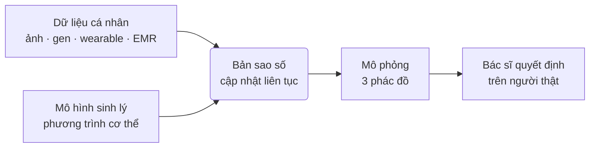

# Chương 17. Physical AI, Digital Twin và y học chính xác

## Mở đầu: giá như được "thử trước" trên chính mình

Ông Hòa, 57 tuổi, tăng huyết áp độ 2 kèm đái tháo đường type 2. Phác đồ đầu tiên: lợi tiểu thiazide — huyết áp giảm nhưng kali máu tụt, chân chuột rút. Phác đồ thứ hai: đổi sang ức chế men chuyển — huyết áp chưa đạt mục tiêu, lại ho khan dai dẳng. Phác đồ thứ ba: phối hợp chẹn kênh canxi — cuối cùng ổn định, nhưng đã mất gần nửa năm thử–sai, kèm theo những tác dụng phụ mà lẽ ra ông không phải chịu.

Câu chuyện của ông Hòa không hiếm. Phần lớn y học hiện nay vẫn là y học "thử rồi điều chỉnh": kê đơn dựa trên phác đồ chung cho hàng nghìn người, rồi chờ xem cơ thể *của riêng người bệnh này* phản ứng ra sao. Câu hỏi của chương này — và của cả Phần IV — là: **nếu có một "bản sao số" của ông Hòa, được xây từ dữ liệu thật của chính ông, để thử trước cả ba phác đồ trong máy tính rồi mới kê đơn, thì sao?**

Bản sao số đó có tên: {t:digital-twin}bản sao số{/t} (digital twin). Kết hợp với {t:physical-ai}AI vật lý{/t} (physical AI — trí tuệ nhân tạo điều khiển các hệ thống trong thế giới thật: robot phẫu thuật, robot vận hành bệnh viện, thiết bị đeo phản hồi sinh lý) và {t:precision-medicine}y học chính xác{/t} (precision medicine — điều trị đúng người, đúng thuốc, đúng liều, đúng thời điểm dựa trên dữ liệu cá nhân), đây là bức tranh tương lai mà chương này phác thảo.

Đọc xong chương, bạn sẽ:

- Giải thích được digital twin trong y tế ở ba cấp độ: cơ quan, bệnh nhân, bệnh viện;
- Hiểu nguyên lý của hai case quốc tế tiêu biểu (Dassault Living Heart, Siemens Healthineers) và giới hạn của chúng;
- Nắm bài toán đặc thù của người Việt: dữ liệu di truyền, độ lệch mô hình và chủ quyền dữ liệu sinh học;
- Biết Việt Nam đã có gì, còn thiếu gì, và ai là người quyết định đầu tư cho các điều kiện triển khai.

> **Lưu ý về tính thời điểm:** đây là Phần IV — Tương lai. Nhiều nội dung trong chương là công nghệ đang phát triển, chưa phải thực hành thường quy tại Việt Nam. Chương trình bày ở mức nguyên lý đã công khai; những chi tiết kỹ thuật cụ thể chưa kiểm chứng được sẽ được gắn cờ rõ ràng.

```metrics
[
  {"value":"3","label":"Cấp độ digital twin trong y tế","hint":"cơ quan → bệnh nhân → bệnh viện"},
  {"value":"2","label":"Case quốc tế phân tích ở mức nguyên lý","hint":"Living Heart · Siemens"},
  {"value":"4","label":"Điều kiện triển khai tại Việt Nam","hint":"dữ liệu · hạ tầng · pháp lý · nhân lực"},
  {"value":"5","label":"Lằn ranh đỏ bắt buộc nhớ","hint":"mô hình ≠ người thật · quá tin…"}
]
```

## 1. Digital twin trong y tế là gì

### 1.1. Định nghĩa làm việc

{t:digital-twin}Bản sao số{/t} (digital twin) trong y tế là **mô hình số của một thực thể y sinh (cơ quan, người bệnh, hay cả một bệnh viện), được cập nhật liên tục từ dữ liệu thật của thực thể đó, và có thể dùng để mô phỏng "điều gì sẽ xảy ra nếu..."** trước khi hành động trong thế giới thật.

Ba từ khóa trong định nghĩa này đều quan trọng:

- **Mô hình số:** không phải một file ảnh 3D tĩnh, mà là mô hình tính toán chạy được — ví dụ mô phỏng dòng máu, điện sinh lý tim, chuyển hóa thuốc.
- **Cập nhật liên tục:** twin khác với mô hình giải phẫu ở chỗ nó "sống" cùng dữ liệu mới — kết quả xét nghiệm hôm nay, chỉ số từ đồng hồ đeo tay tuần này.
- **Mô phỏng trước khi hành động:** giá trị cốt lõi là thử nghiệm an toàn trong máy tính, thay vì thử trên người bệnh như câu chuyện ông Hòa.

Nền tảng của một twin y tế gồm hai trụ: {t:physiological-model}mô hình sinh lý{/t} (các phương trình mô tả cơ thể hoạt động thế nào — từ mức tế bào đến mức cơ quan) và **dữ liệu cá nhân** (ảnh y khoa, điện tim, xét nghiệm, {t:genomics}dữ liệu hệ gen{/t}, dữ liệu từ {t:wearable}thiết bị đeo{/t}, {t:emr}bệnh án điện tử{/t}). Mô hình cho "luật chơi", dữ liệu cá nhân biến mô hình chung thành bản sao của *riêng một người*.



### 1.2. Ba cấp độ: từ trái tim đến cả bệnh viện

**Cấp 1 — Twin cơ quan:** bản sao số của một cơ quan, ví dụ trái tim. Dùng để mô phỏng dòng máu, nhịp tim, vị trí đặt stent, hoặc thử thiết bị y tế mới trên hàng nghìn "trái tim ảo" thay vì thử nghiệm trên động vật hay người ở giai đoạn sớm. Đây là cấp độ trưởng thành nhất hiện nay.

**Cấp 2 — Twin bệnh nhân:** bản sao số của cả một con người — tích hợp tim mạch, chuyển hóa, dược động học, dữ liệu lối sống. Dùng để mô phỏng đáp ứng thuốc, dự báo biến cố (đột quỵ, suy tim mất bù), cá nhân hóa phác đồ. Đây là cấp độ của câu hỏi mở đầu chương — và cũng là cấp độ còn nhiều thách thức nhất, vì cơ thể người phức tạp hơn bất kỳ mô hình nào chúng ta có.

**Cấp 3 — Twin bệnh viện:** bản sao số của toàn bộ vận hành một cơ sở y tế — luồng bệnh nhân, giường bệnh, lịch mổ, nhân lực, thiết bị. Dùng để mô phỏng "nếu khoa cấp cứu tăng 30% bệnh nhân vào mùa dịch thì tắc ở đâu", tối ưu lịch phẫu thuật, bố trí nhân lực. Không liên quan trực tiếp đến một người bệnh cụ thể, nhưng quyết định chất lượng và chi phí của cả hệ thống.

```callout kind=info title="Phân biệt nhanh để khỏi nhầm"
Twin cơ quan trả lời "thiết bị/phác đồ này tác động lên cơ quan ra sao". Twin bệnh nhân trả lời "phác đồ này tác động lên *người này* ra sao". Twin bệnh viện trả lời "quyết định này tác động lên *hệ thống* ra sao". Ba câu hỏi khác nhau, ba loại mô hình khác nhau — đừng dùng đáp án của cấp này để trả lời câu hỏi của cấp kia.
```

### 1.3. Physical AI: khi bản sao số bước ra đời thực

Nếu digital twin là "bộ não mô phỏng", thì {t:physical-ai}AI vật lý{/t} (physical AI) là "đôi tay trong thế giới thật": robot phẫu thuật thực hiện đường mổ đã được mô phỏng tối ưu trên twin, robot logistics vận chuyển thuốc trong bệnh viện theo lịch mà twin bệnh viện tính ra, thiết bị đeo vừa đo vừa phản hồi (nhắc uống thuốc, cảnh báo rối loạn nhịp).

Vòng kín của tương lai là: **twin mô phỏng → AI vật lý thực hiện → dữ liệu thật quay về cập nhật twin**. Robot phẫu thuật (đã đề cập ở chương 16 trong Phần IV) là mảnh ghép physical AI gần nhất với lâm sàng hiện nay; twin là mảnh ghép "suy nghĩ trước khi làm". Hai mảnh này sẽ gặp nhau — nhưng ở Việt Nam hiện tại, cả hai đều còn ở giai đoạn chuẩn bị nền tảng (xem phần 4).

## 2. Case quốc tế: hai dự án đã đi trước

Phần này trình bày ở **mức nguyên lý đã công khai**. Chi tiết kỹ thuật cụ thể (độ chính xác mô hình, phạm vi phê duyệt lâm sàng) chưa kiểm chứng độc lập được sẽ được gắn cờ.

### 2.1. Dassault Systèmes — Living Heart Project

Dự án Living Heart của Dassault Systèmes xây dựng mô hình 3D chức năng của tim người — được giới thiệu là mô hình tim người đầy đủ chức năng đầu tiên dạng này — nhằm mô phỏng hoạt động điện–cơ của tim, thử nghiệm thiết bị y tế (van tim, máy tạo nhịp) trên tim ảo trước khi thử trên người thật.

Điểm đáng chú ý về nguyên lý:

- **{t:in-silico}Thử nghiệm in silico{/t}:** thay một phần thử nghiệm trên động vật/người ở giai đoạn sớm bằng mô phỏng trên hàng nghìn biến thể tim ảo — nhanh hơn, rẻ hơn, và không đặt ai vào rủi ro trong giai đoạn sàng lọc ban đầu.
- **Hợp tác với cơ quan quản lý:** dự án có chương trình nghiên cứu hợp tác với FDA Hoa Kỳ về việc dùng bằng chứng từ mô phỏng số trong phát triển thiết bị y tế <!-- CẦN TÁC GIẢ XÁC MINH: phạm vi, thời gian và kết quả cụ thể của hợp tác FDA; trạng thái phê duyệt pháp lý hiện tại của mô hình -->.
- **Từ tim đến cơ thể:** Living Heart là điểm khởi đầu cho tham vọng lớn hơn — "ảo hóa" dần các cơ quan khác của cơ thể người.

🎬 **Video minh họa:** [Dassault Systèmes — "Virtual Twins in Healthcare: Living Heart Project": nguồn gốc dự án và cập nhật hiện trạng, với Steve Levine (người sáng lập dự án) — ngày phát hành xem trên trang YouTube](http://youtube.com/watch?v=Skn74h0CQ-4).

### 2.2. Siemens Healthineers — Digital Twin of the Heart

Siemens Healthineers phát triển hướng tiếp cận twin tim từ dữ liệu hình ảnh: **dựng mô hình số của tim từ ảnh cộng hưởng từ (MR) và điện tâm đồ (ECG) của chính người bệnh**, rồi mô phỏng quá trình sinh lý của cơ quan đó. Mục tiêu thực tế: **lập kế hoạch can thiệp trên bản sao số trước** — hình dung đáp ứng với điều trị trước khi chạm vào người bệnh thật.

Nguyên lý đáng học cho nhân viên y tế:

- **Cá nhân hóa từ dữ liệu sẵn có:** không cần công nghệ viễn tưởng — ảnh MR và ECG vốn đã có trong quy trình tim mạch hiện nay; giá trị nằm ở lớp mô hình dựng trên dữ liệu đó.
- **Twin phục vụ quyết định, không thay quyết định:** mô phỏng giúp bác sĩ can thiệp "thấy trước" kịch bản, nhưng người ký chỉ định vẫn là bác sĩ.

Ngoài twin cơ quan, Siemens Healthineers còn phát triển khái niệm twin cho vận hành bệnh viện (mô phỏng luồng bệnh nhân, tối ưu công suất) <!-- CẦN TÁC GIẢ XÁC MINH: tên sản phẩm, phạm vi triển khai thực tế và các bệnh viện đã áp dụng -->.

🎬 **Video minh họa:** [Siemens Healthineers — "Digital Twin of the Heart": dựng mô hình tim từ ảnh MR và ECG, mô phỏng sinh lý để lập kế hoạch điều trị trước can thiệp — ngày phát hành xem trên trang YouTube](https://www.youtube.com/watch?v=BqB1bwvv2-M).

```timeline
[
  {"year":"2014","event":"Dassault Systèmes khởi động Living Heart Project — mô hình tim người 3D chức năng (năm khởi động cần tác giả xác minh)","kind":"milestone"},
  {"year":"2015–2020","event":"Thử nghiệm in silico trên tim ảo được đưa vào quy trình phát triển thiết bị; hợp tác nghiên cứu với FDA Hoa Kỳ","kind":"event"},
  {"year":"2020","event":"Siemens Healthineers giới thiệu hướng digital twin tim từ ảnh MR và ECG của người bệnh","kind":"event"},
  {"year":"2026","event":"AI for Good Global Summit (Geneva): lãnh đạo WHO cùng bàn về AI, genomics và y học chính xác cho mọi người","kind":"success"}
]
```

```callout kind=tip title="Cách đọc case quốc tế cho đúng"
Hỏi ba câu với mỗi case: (1) Họ mô phỏng *cái gì* (cơ quan nào, quá trình sinh lý nào)? (2) Dữ liệu đầu vào là gì, và ở Việt Nam mình có dữ liệu đó không? (3) Ai chịu trách nhiệm khi mô phỏng sai? Case quốc tế cho ta nguyên lý và lộ trình — không cho ta đáp án "mua về là dùng được".
```

## 3. Y học chính xác cho người Việt: cơ hội và bài toán dữ liệu

### 3.1. Công thức: AI + hệ gen + thiết bị đeo

{t:precision-medicine}Y học chính xác{/t} là thực hành điều trị dựa trên đặc điểm riêng của từng người — thay vì "trung bình của nghìn người". Ba nguồn dữ liệu làm nên nó:

1. **{t:genomics}Hệ gen{/t} (genomics):** trình tự gen quyết định một phần đáp ứng thuốc và nguy cơ bệnh. Ví dụ kinh điển trong {t:pharmacogenomics}dược di truyền học{/t} (pharmacogenomics): người mang biến thể mất chức năng của gen CYP2C19 chuyển hóa clopidogrel kém — thuốc chống kết tập tiểu cầu này giảm tác dụng, tăng nguy cơ biến cố tim mạch. Biết trước kiểu gen thì đổi thuốc sớm, khỏi chờ "thử rồi mới biết".
2. **Thiết bị đeo ({t:wearable}wearable{/t}):** đồng hồ, vòng đeo tay đo liên tục nhịp tim, huyết áp (một số dòng), giấc ngủ, vận động — biến twin bệnh nhân từ "ảnh chụp một lần" thành "phim trực tiếp".
3. **AI:** con người không thể đọc 3 tỷ cặp base của hệ gen hay tìm mẫu hình trong nhiều năm dữ liệu đeo tay — AI làm việc đó, rồi tóm tắt thành thông tin bác sĩ dùng được: {t:polygenic-risk-score}điểm nguy cơ đa gen{/t} (tổng hợp hàng nghìn biến thể nhỏ thành một con số nguy cơ), dự báo đáp ứng thuốc, cảnh báo sớm.

🎬 **Video minh họa:** [AI for Good Global Summit 2026 (Geneva) — "The future of health: AI, genomics and the next era of medicine": lãnh đạo WHO (Alain Labrique) cùng chuyên gia y học di truyền Harvard bàn về AI thúc đẩy y học chính xác, chẩn đoán bệnh hiếm và dự phòng cá thể — ghi hình 2026](https://www.youtube.com/watch?v=Tg4bpNidYFE).

🎬 **Xem thêm:** [Demis Hassabis (CEO Google DeepMind) đối thoại tại Davos, 01/2025 — từ AlphaFold (dự đoán cấu trúc protein) đến đổi mới y sinh: cầu nối giữa AI trong chương này và khám phá thuốc, sinh học phân tử](https://www.youtube.com/watch?v=yuz0mF1qSaw) — nội dung mang tính thời điểm.

### 3.2. Bài toán dữ liệu di truyền của người Việt

Đây là điểm nghẽn lớn nhất, và cần nói thẳng:

- **Thiếu {t:cohort}đoàn hệ{/t} (cohort) lớn của người Việt:** các mô hình dự báo nguy cơ từ gen được huấn luyện chủ yếu trên dữ liệu người châu Âu (UK Biobank và các cohort phương Tây). Tần suất biến thể gen khác nhau giữa các quần thể — một điểm nguy cơ đa gen tính trên người châu Âu có thể **lệch** khi áp cho người Việt. Chưa có cohort hệ gen quy mô hàng trăm nghìn người Việt để hiệu chỉnh <!-- CẦN TÁC GIẢ XÁC MINH: quy mô các dự án giải trình tự hệ gen người Việt đã công bố (ví dụ các dự án có sự tham gia của Việt Nam trong GenomeAsia 100K) và số liệu mới nhất đến 10/2026 -->.
- **Hệ quả thực tế:** dùng mô hình "ngoại nhập" chưa hiệu chỉnh cho quần thể Việt Nam có thể cho dự báo sai — nguy hiểm nhất là sai theo hướng yên tâm giả (nguy cơ thật cao nhưng điểm số báo thấp). Nguyên tắc: **mọi công cụ dự báo từ gen dùng cho người Việt đều phải được kiểm chứng (validate) trên dữ liệu người Việt trước khi đưa vào quyết định lâm sàng** — ai ký triển khai, người đó chịu trách nhiệm về việc kiểm chứng này.
- **Dữ liệu wearable ở Việt Nam:** mặt tích cực là độ phủ smartphone và thiết bị đeo giá rẻ đang tăng nhanh — đây là nguồn dữ liệu dọc (longitudinal) rẻ nhất để nuôi twin bệnh nhân. Mặt hạn chế: dữ liệu phân mảnh theo hãng, chưa có chuẩn liên thông vào bệnh án điện tử (xem phần 4).

### 3.3. Chủ quyền dữ liệu sinh học: dữ liệu gen là dữ liệu nhạy cảm

Dữ liệu gen không giống dữ liệu khám bệnh thông thường ở một điểm căn bản: **bạn không thể "đổi" gen như đổi mật khẩu** — lộ một lần là lộ vĩnh viễn, và nó còn tiết lộ thông tin về cả người thân ruột thịt của bạn.

Pháp luật Việt Nam xếp dữ liệu di truyền vào nhóm **dữ liệu cá nhân nhạy cảm** (Nghị định 13/2023/NĐ-CP) — mức bảo vệ cao nhất: xử lý phải có sự đồng ý rõ ràng của chủ thể, phải đánh giá tác động, và chịu trách nhiệm giải trình cao hơn. Ba câu hỏi mọi đơn vị phải trả lời trước khi chạm vào dữ liệu gen:

1. **Xử lý ở đâu?** Giải trình tự và phân tích gen có thực hiện trong nước hay gửi mẫu/dữ liệu ra phòng lab nước ngoài? Nếu ra nước ngoài — căn cứ pháp lý nào, cơ chế bảo vệ nào, và ai phê duyệt?
2. **Ai được truy cập?** Bác sĩ điều trị, nhà nghiên cứu, công ty bảo hiểm, nhà tuyển dụng — ranh giới ở đâu? Dữ liệu gen dùng cho nghiên cứu có được dùng cho mục đích thương mại không?
3. **Lưu bao lâu, xóa thế nào?** Người bệnh có quyền rút lại sự đồng ý không, và khi rút thì dữ liệu đã chia sẻ cho bên thứ ba xử lý ra sao?

```callout kind=warning title="Dữ liệu gen: đồng ý một lần không có nghĩa là đồng ý mãi mãi"
Khác với xét nghiệm máu thường quy, kết quả giải trình tự gen có giá trị suốt đời và ảnh hưởng cả gia đình người bệnh. Quy trình đồng ý (consent) phải giải thích rõ: dữ liệu lưu ở đâu, ai truy cập, dùng cho nghiên cứu gì, và quyền rút lại đồng ý. Đây là trách nhiệm của đơn vị triển khai — không thể khoán trắng cho nhà cung cấp công nghệ.
```

## 4. Điều kiện triển khai tại Việt Nam: đã có gì, thiếu gì, ai quyết định

Digital twin và y học chính xác không phải "mua phần mềm là xong". Chúng đứng trên bốn chân — thiếu một chân thì không đứng được. Bảng dưới nói thẳng tình trạng từng chân đến 10/2026:

| Điều kiện | Đã có gì | Còn thiếu gì | Ai quyết định đầu tư |
|---|---|---|---|
| **Dữ liệu** | Bệnh án điện tử (EMR) theo Thông tư 46/2018/TT-BYT đang triển khai ở nhiều bệnh viện; dữ liệu BHYT tập trung; Đề án 06 thúc đẩy liên thông dữ liệu | Chuẩn hóa và liên thông giữa các bệnh viện còn yếu; dữ liệu có cấu trúc phục vụ AI còn ít; thiếu kho dữ liệu dùng chung cho nghiên cứu | Bộ Y tế (chuẩn, chính sách liên thông); giám đốc bệnh viện (đầu tư EMR/HIS đạt chuẩn) |
| **Hạ tầng tính toán** | Xem chương 13 — các trung tâm dữ liệu, GPU cloud trong nước đang phát triển | Năng lực tính toán hiệu năng cao (HPC) phục vụ mô phỏng sinh lý quy mô lớn còn hạn chế; chi phí GPU cao | Doanh nghiệp công nghệ, bệnh viện lớn, chương trình quốc gia |
| **Khung pháp lý** | {t:luatai}Luật Trí tuệ nhân tạo số 134/2025/QH15{/t} (hiệu lực 01/03/2026): yêu cầu minh bạch, trách nhiệm con người; Nghị định 13/2023/NĐ-CP về bảo vệ dữ liệu cá nhân | Hướng dẫn chi tiết áp dụng Luật AI cho y tế (phân loại rủi ro thiết bị/sản phẩm AI y tế); quy định riêng về dữ liệu gen và thử nghiệm in silico | Quốc hội, Chính phủ, Bộ Y tế, Bộ KH&CN |
| **Nhân lực liên ngành** | Đội ngũ bác sĩ, kỹ sư y sinh, khoa học dữ liệu đang lớn lên; các chương trình đào tạo AI y tế xuất hiện | Người "nói được cả hai thứ tiếng" (vừa hiểu sinh lý bệnh vừa hiểu mô hình) rất hiếm; thiếu chương trình đào tạo chính quy về mô phỏng y sinh | Trường đại học y – kỹ thuật, bệnh viện (đào tạo liên tục), cơ quan quản lý (chuẩn năng lực) |

Ba kết luận thực tế rút ra từ bảng này:

1. **Thứ tự ưu tiên đúng là: dữ liệu trước, mô hình sau.** Một twin chạy trên dữ liệu rác thì chỉ cho ra mô phỏng rác nhanh hơn. Đầu tư vào chuẩn hóa EMR, liên thông dữ liệu và kho dữ liệu dùng chung (data commons) là bước đi khôn ngoan nhất hiện nay — rẻ hơn và nền tảng hơn mua một "nền tảng twin" hào nhoáng.
2. **Bắt đầu từ twin bệnh viện, không phải twin bệnh nhân.** Mô phỏng vận hành (giường, lịch mổ, luồng cấp cứu) dùng dữ liệu tổng hợp, ít rủi ro riêng tư, và cho lợi ích thấy ngay về chi phí — là "bài tập vỡ lòng" hợp lý trước khi chạm vào twin của từng con người.
3. **Mọi quyết định đầu tư đều cần chủ thể chịu trách nhiệm rõ ràng:** giám đốc bệnh viện quyết định ngân sách công nghệ của đơn vị mình; Bộ Y tế quyết định chuẩn và chính sách; hội đồng khoa học/đạo đức quyết định việc dùng dữ liệu người bệnh cho nghiên cứu. Không có "AI quyết định thay".

## 5. Giới hạn và rủi ro: năm điều phải khắc cốt ghi tâm

### 5.1. Twin không phải người thật — sai số mô hình là bản chất

Mô hình sinh lý dù tinh vi đến đâu cũng là **xấp xỉ** của cơ thể người. Nó không biết hôm qua ông Hòa thức trắng vì lo tiền viện phí, không biết ông vừa uống thêm thuốc nam của người quen mách. Mọi mô phỏng đều kèm sai số — và trong y tế, sai số có thể là một mạng người. Nguyên tắc: **kết quả mô phỏng là thông tin tham khảo có độ không chắc chắn, không phải "đáp án"**.

### 5.2. Nguy cơ quá tin vào mô phỏng

Rủi ro tinh vi nhất không phải mô hình sai, mà là **con người ngừng tư duy** vì mô hình trông quá thuyết phục — đồ họa 3D đẹp, con số có hai chữ số thập phân. Hiện tượng này có tên trong y văn: tự động hóa thiên lệch (automation bias). Khắc phục bằng quy trình: mọi quyết định dựa trên mô phỏng đều phải ghi rõ giả định đầu vào, và bác sĩ phải tự trả lời được "nếu không có mô phỏng này, tôi quyết định thế nào" trước khi xem kết quả.

### 5.3. Quyền riêng tư dữ liệu sinh học

Twin bệnh nhân là tập hợp dữ liệu nhạy cảm nhất của một con người: gen, bệnh sử, dữ liệu đeo tay từng phút. Một vụ rò rỉ twin tương đương rò rỉ toàn bộ "bản thiết kế" sức khỏe của người đó — không thể thu hồi. Yêu cầu tối thiểu: mã hóa, phân quyền chặt, nhật ký truy cập, và **không bao giờ** đưa dữ liệu định danh người bệnh vào các nền tảng AI công cộng (xem chương 4, mục 6.1 và chương 14).

### 5.4. Chi phí và khoảng cách tiếp cận

Giải trình tự gen, thiết bị đeo cao cấp, hạ tầng tính toán — tất cả đều tốn tiền. Nếu y học chính xác chỉ đến được với người giàu ở thành phố lớn, nó sẽ **nới rộng** bất bình đẳng sức khỏe thay vì thu hẹp. Mọi đề án triển khai tại Việt Nam cần trả lời: ai chi trả, và người nghèo ở tuyến cơ sở được gì?

### 5.5. Trách nhiệm pháp lý khi mô phỏng sai

Nếu bác sĩ làm theo gợi ý của twin và người bệnh gặp biến cố — ai chịu trách nhiệm? Nhà cung cấp mô hình, bệnh viện, hay bác sĩ ký đơn? Luật AI 134/2025/QH15 đặt nguyên tắc trách nhiệm của con người, nhưng chi tiết áp dụng cho sản phẩm AI y tế còn chờ hướng dẫn <!-- CẦN TÁC GIẢ XÁC MINH: cập nhật văn bản hướng dẫn dưới Luật AI liên quan thiết bị y tế/AI y tế đến thời điểm xuất bản -->. Đến khi có hướng dẫn rõ ràng, nguyên tắc an toàn là: **người có chuyên môn ký quyết định cuối cùng và chịu trách nhiệm** — mô phỏng không ký được.

```callout kind=danger title="Checklist 1 phút trước khi tin một kết quả mô phỏng"
<label style="display:block;margin:8px 0;cursor:pointer"><input type="checkbox" style="margin-right:10px;transform:scale(1.3);accent-color:#dc2626"> Dữ liệu đầu vào của mô phỏng có phải của chính người bệnh này không?</label>
<label style="display:block;margin:8px 0;cursor:pointer"><input type="checkbox" style="margin-right:10px;transform:scale(1.3);accent-color:#dc2626"> Mô hình đã được kiểm chứng trên quần thể người Việt chưa?</label>
<label style="display:block;margin:8px 0;cursor:pointer"><input type="checkbox" style="margin-right:10px;transform:scale(1.3);accent-color:#dc2626"> Tôi có trả lời được "nếu không có mô phỏng, tôi quyết định thế nào" không?</label>
<label style="display:block;margin:8px 0;cursor:pointer"><input type="checkbox" style="margin-right:10px;transform:scale(1.3);accent-color:#dc2626"> Ai là người ký và chịu trách nhiệm cho quyết định cuối cùng?</label>

Đủ 4 dấu tick mới dùng kết quả mô phỏng cho quyết định thật.
```

## 6. Case đóng chương: "thử trước" ba phác đồ trên bản sao số của ông Hòa

> **Tình huống mô phỏng tổng hợp** — nhân vật, số liệu và diễn biến dưới đây do tác giả dựng để minh họa cách tư duy với digital twin, không phản ánh một người bệnh hay một sản phẩm cụ thể nào. Mọi con số "kết quả mô phỏng" trong case đều là giả định minh họa.

Quay lại ông Hòa ở phần mở đầu — 57 tuổi, tăng huyết áp độ 2, đái tháo đường type 2. Lần này, thay vì thử trực tiếp trên người ông, nhóm bác sĩ có một bản sao số được dựng từ: hồ sơ bệnh án điện tử 5 năm, kết quả xét nghiệm gen CYP2C19/CYP2D6 (đã được ông đồng ý bằng văn bản), và 3 tháng dữ liệu huyết áp đo tại nhà bằng máy đo có kết nối.

Trên bản sao số này, họ chạy **mô phỏng** ba kịch bản trong vài giờ thay vì thử trên người thật trong nửa năm:

- **Kịch bản A (lợi tiểu thiazide + thay đổi lối sống):** mô phỏng cho thấy huyết áp giảm nhưng kali máu có xu hướng tụt — đúng như những gì sau này xảy ra ở người thật. Nếu có twin từ đầu, tác dụng phụ này đã được *dự báo*, không phải *trải nghiệm*.
- **Kịch bản B (ức chế men chuyển + chẹn kênh canxi):** mô phỏng dự báo kiểm soát huyết áp tốt, nhưng gắn cờ nguy cơ ho khan (tiền sử gia đình có người ho khi dùng nhóm thuốc này) — thông tin mà phác đồ chung không "biết".
- **Kịch bản C (B + can thiệp lối sống có theo dõi thiết bị đeo):** mô phỏng cho kết quả kiểm soát tốt nhất với liều thuốc thấp nhất — nhưng đòi hỏi ông Hòa đeo thiết bị và tái khám đúng hẹn, tức phụ thuộc vào tuân thủ của người bệnh, điều mô hình chỉ ước lượng được một phần.

Quyết định cuối cùng: bác sĩ chọn kịch bản C, **giải thích cho ông Hòa rằng đây là gợi ý từ mô phỏng — không phải lời tiên tri** — và hẹn tái khám sau 4 tuần để đối chiếu với thực tế. Nếu thực tế lệch khỏi mô phỏng, mô hình được hiệu chỉnh lại bằng dữ liệu thật.

Bài học của case không phải "AI chọn thuốc giỏi hơn bác sĩ". Bài học là: **twin biến quá trình thử–sai từ "thử trên người" thành "thử trong máy"** — rẻ hơn, nhanh hơn, và nhân văn hơn. Nhưng người quyết định, người giải thích, và người chịu trách nhiệm vẫn là bác sĩ — như checklist ở phần 5 đã nêu.

## 7. Lab 17 — Digital twin bệnh nhân tăng huyết áp

```chart
{"type":"bar","title":"Lab 17 — thời lượng ước tính theo mức nhiệm vụ","data":[{"name":"L0 · Làm quen","phút":15},{"name":"L1 · Mô phỏng 1 kịch bản","phút":30},{"name":"L2 · So sánh 3 kịch bản","phút":60},{"name":"L3 · So sánh + kế hoạch","phút":90}],"keys":["phút"],"yLabel":"phút"}
```

<div class="lab-cta">
<a href="/lab/lab-17" target="_blank" rel="noopener noreferrer" class="lab-btn">
▶ Mở Lab 17 trong tab mới
</a>
<div class="lab-meta">15–90 phút tùy mức (L0–L3) · AI chấm rubric 5 tiêu chí · Lưu tiến độ vào sổ grading</div>
<span class="lab-cta-note">Mô phỏng trên hồ sơ GIẢ LẬP: dùng AI so sánh 3 kịch bản điều trị tăng huyết áp, rồi phân tích giới hạn của mô phỏng. Tuyệt đối không dùng dữ liệu bệnh nhân thật.</span>
</div>

## 8. Nguồn và đọc thêm

**Văn bản pháp luật Việt Nam:**
- Quốc hội (2025), *Luật Trí tuệ nhân tạo số 134/2025/QH15* (thông qua ngày 10/12/2025, hiệu lực từ 01/03/2026) — nguyên tắc minh bạch, trách nhiệm của con người đối với hệ thống AI: [Cổng văn bản pháp luật Chính phủ](https://vanban.chinhphu.vn/?pageid=27160&docid=216334&classid=1&typegroupid=3).
- Chính phủ (2023), *Nghị định 13/2023/NĐ-CP về bảo vệ dữ liệu cá nhân* — dữ liệu di truyền thuộc nhóm dữ liệu cá nhân nhạy cảm, mức bảo vệ cao nhất.
- Bộ Y tế (2018), *Thông tư 46/2018/TT-BYT* — quy định hồ sơ bệnh án điện tử, nền tảng dữ liệu cho twin trong tương lai.

**Khuyến nghị quốc tế (tham khảo, không phải nghĩa vụ pháp lý tại Việt Nam):**
- WHO (2021), *Ethics and governance of artificial intelligence for health* ([who.int](https://www.who.int/publications/i/item/9789240029200)) — khung đạo đức và quản trị AI trong y tế.
- WHO (2024), *Ethics and governance of artificial intelligence for health: Guidance on large multi-modal models* ([who.int](https://www.who.int/publications/i/item/9789240084759)) — hướng dẫn về mô hình đa phương thức lớn trong y tế.

> Lưu ý phân biệt: các tài liệu WHO là khuyến nghị quốc tế để tham khảo; chỉ văn bản pháp luật Việt Nam mới là nghĩa vụ pháp lý áp dụng tại Việt Nam.

**Đọc thêm trong cẩm nang:** chương 13 (Hạ tầng tính toán — nền tảng phần cứng cho mô phỏng: [/chapters/13-ha-tang-tinh-toan](/chapters/13-ha-tang-tinh-toan)), chương 14 (An toàn, tuân thủ — khung quản trị đầy đủ: [/chapters/14-an-toan-tuan-thu](/chapters/14-an-toan-tuan-thu)), chương 4 (Nền tảng AI đa nhiệm — dùng AI hỗ trợ mô phỏng: [/chapters/04-nen-tang-ai-da-nhiem](/chapters/04-nen-tang-ai-da-nhiem)).

**Video minh họa trong chương:**
- Dassault Systèmes, "Virtual Twins in Healthcare: Living Heart Project" — nguồn gốc và hiện trạng dự án tim ảo ([YouTube](http://youtube.com/watch?v=Skn74h0CQ-4)).
- Siemens Healthineers, "Digital Twin of the Heart" — dựng mô hình tim từ ảnh MR và ECG ([YouTube](https://www.youtube.com/watch?v=BqB1bwvv2-M)).
- AI for Good Global Summit 2026 (Geneva), "The future of health: AI, genomics and the next era of medicine" — ghi hình 2026, có lãnh đạo WHO ([YouTube](https://www.youtube.com/watch?v=Tg4bpNidYFE)).
- Demis Hassabis (Google DeepMind), "The Future of AI & Human-Machine Innovation" — đối thoại tại Davos, 01/2025 ([YouTube](https://www.youtube.com/watch?v=yuz0mF1qSaw)).

> Lưu ý: nội dung video mang tính thời điểm (ngày phát hành của hai video đầu xem trực tiếp trên trang YouTube); kiểm tra lại thông tin trước khi trích dẫn.

---

> **Trạng thái bản thảo:** đây là bản nháp do AI soạn theo "Quy chuẩn biên tập chương và Lab" ngày 04/10/2026, **chưa qua tác giả duyệt**. Không phát hành dưới tên chủ biên. Các số liệu, tên sản phẩm mang tính thời điểm (10/2026) và cần kiểm tra lại khi xuất bản.
