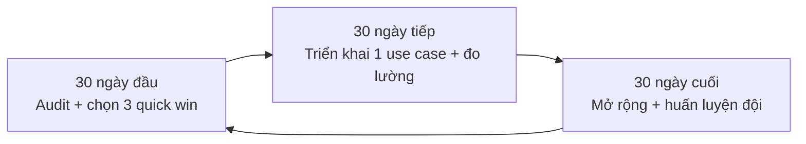

# Chương 18. Lộ trình cá nhân và tổ chức 2026–2030

## Mở đầu: câu hỏi sáng thứ Hai

Hãy quay lại điểm xuất phát. [Chương 1](/chapters/01-hau-covid) mở đầu bằng một hệ thống y tế vừa đi qua đại dịch COVID-19 — kiệt sức, thiếu người, ngập trong giấy tờ, nhưng cũng lần đầu tiên chứng kiến công nghệ số giữ cho guồng máy không đổ sập. [Chương 2](/chapters/02-ai-sinh-tao) kể câu chuyện AI sinh tạo bùng nổ và tràn vào mọi ngóc ngách của đời sống. [Chương 3](/chapters/03-buoc-ngoat-chinh-sach) đánh dấu bước ngoặt chính sách: Việt Nam có {t:luatai}Luật Trí tuệ nhân tạo số 134/2025/QH15{/t}, và từ đó AI trong y tế không còn là chuyện "thích thì dùng" mà là chuyện "dùng thế nào cho đúng luật, đúng đạo đức". Rồi 14 chương tiếp theo đi qua từng lớp: từ trợ lý AI đa nhiệm ai cũng chạm tới ([chương 4](/chapters/04-nen-tang-ai-da-nhiem)), qua các ứng dụng chuyên sâu lâm sàng và quản trị, đến hạ tầng tính toán ([chương 13](/chapters/13-ha-tang-tinh-toan)) và khung an toàn, tuân thủ ([chương 14](/chapters/14-an-toan-tuan-thu)).

Mười bảy chương là một hành trình dài — từ hậu COVID đến ngưỡng cửa AGI. Nhưng cẩm nang này không viết ra để bạn "đọc cho biết". Nó viết ra để trả lời đúng một câu hỏi, và đó cũng là câu hỏi mở đầu chương cuối cùng này:

**Đọc xong 17 chương, sáng thứ Hai tới tôi bắt đầu từ đâu?**

Chương này không dạy thêm kiến thức mới. Nó là bản đồ gấp lại toàn bộ cẩm nang thành một lộ trình hành động: bạn đang ở đâu, 90 ngày tới làm gì, và đích đến năm 2030 trông như thế nào. Đọc xong chương này, bạn sẽ có trong tay một kế hoạch cụ thể cho chính mình — không phải cho "ngành y tế" nói chung.

```metrics
[
  {"value":"6","label":"Vai trò có lộ trình riêng","hint":"bác sĩ → nhà nghiên cứu"},
  {"value":"90","label":"Ngày cho kế hoạch đầu tiên","hint":"30 audit · 30 triển khai · 30 mở rộng"},
  {"value":"2030","label":"Đích đến của lộ trình","hint":"AI thành đồng nghiệp thường trực"},
  {"value":"6","label":"Tháng cho mỗi chu kỳ cập nhật","hint":"đọc với tinh thần kiểm chứng"}
]
```

## 1. Ma trận "Tôi ở đâu — làm gì tiếp theo"

Mọi người đọc cùng một cuốn cẩm nang, nhưng không ai bắt đầu từ cùng một điểm. Một bác sĩ lâm sàng bận 40 bệnh nhân mỗi sáng cần lộ trình khác một giám đốc bệnh viện, và khác hẳn một kỹ sư HealthTech. Dưới đây là lộ trình riêng cho 6 vai trò phổ biến nhất. Mỗi vai trò gồm: **xuất phát điểm** (điểm mà đa số người trong vai trò đó đang đứng), **3 việc ưu tiên trong năm 2026**, và **đích đến 2030**. Mỗi lộ trình cũng được ánh xạ với hồ sơ Grade (thang năng lực L0–L5 dùng trong các Lab) và Domain của cẩm nang để bạn biết mình đang học phần nào, còn thiếu phần nào.

### 1.1. Bác sĩ lâm sàng

**Xuất phát điểm:** đã dùng AI đa nhiệm cho việc văn phòng (soạn báo cáo, dịch y văn) ở mức thử nghiệm; chưa có quy trình kiểm chứng chuẩn; lo ngại trách nhiệm pháp lý khi AI tham gia vào quyết định lâm sàng. Hồ sơ điển hình: Grade 1–2, Domain mạnh Communication, yếu Technical.

**3 việc ưu tiên 2026:**

1. Chuẩn hóa "quy trình 15 phút" cho mọi việc dùng AI: kiểm tra năng lực trên việc thật → yêu cầu nguồn trích dẫn → tự đối chiếu trước khi ký (xem [chương 4](/chapters/04-nen-tang-ai-da-nhiem), phần 6). Mục tiêu: 100% sản phẩm AI hỗ trợ đều qua 3 bước này.
2. Chọn 1 use case lâm sàng có giám sát: ví dụ dùng AI tóm tắt guideline thành 1 trang cho phòng khám, hoặc hỗ trợ soạn giấy ra viện — với ranh giới rõ ràng: AI soạn khung, bác sĩ điền chẩn đoán và ký.
3. Học cách đọc và phản biện đầu ra AI về thuốc và liều: đây là kỹ năng sống còn, vì {t:hallucination}thông tin bịa đặt{/t} về liều dùng là rủi ro trực tiếp với người bệnh.

**Đích 2030:** bác sĩ làm việc với AI như một "trợ lý lâm sàng thường trực" — AI chuẩn bị hồ sơ, tóm tắt diễn biến, gợi ý phác đồ có nguồn; bác sĩ giữ toàn quyền quyết định và chịu trách nhiệm. Hồ sơ mục tiêu: Grade 3–4, cân bằng các Domain.

### 1.2. Điều dưỡng / kỹ thuật viên

**Xuất phát điểm:** tiếp xúc AI ít nhất trong các vai trò, chủ yếu qua điện thoại cá nhân; công việc nhiều thao tác tay và giao tiếp trực tiếp nên cảm thấy AI "không liên quan đến mình". Hồ sơ điển hình: Grade 0–1.

**3 việc ưu tiên 2026:**

1. Dùng AI cho 2 việc "giấy tờ" tốn thời gian nhất: bàn giao ca theo mẫu SBAR và tờ hướng dẫn giáo dục sức khỏe cho người bệnh (viết ở trình độ dễ hiểu, câu ngắn).
2. Học 1 kỹ thuật duy nhất nhưng dùng thuần thục: đọc to ý chính cho AI ghi lại thành văn bản có cấu trúc, rồi tự sửa trước khi dùng chính thức.
3. Tham gia 1 nhóm học viên (xem phần 3) để hỏi những thắc mắc rất thực tế: "AI có nghe được giọng miền Trung không?", "bàn giao ca đêm viết sao cho ngắn?".

**Đích 2030:** điều dưỡng dùng AI để giảm gánh nặng ghi chép, dành thời gian cho chăm sóc trực tiếp; là người phát hiện sớm khi AI trong quy trình của khoa cho ra kết quả bất thường. Hồ sơ mục tiêu: Grade 2–3.

### 1.3. Giám đốc / quản lý bệnh viện

**Xuất phát điểm:** chịu áp lực "chuyển đổi số" từ trên xuống nhưng thiếu người hiểu cả y tế lẫn công nghệ; các dự án AI manh mún, mỗi khoa một kiểu; lo ngại rủi ro dữ liệu và trách nhiệm khi có sự cố. Hồ sơ điển hình: Grade 1–2, Domain mạnh Administration, yếu Technical.

**3 việc ưu tiên 2026:**

1. Ban hành quy chế nội bộ về dùng AI trong đơn vị: danh mục việc được/không được dùng AI công cộng, quy định không nhập dữ liệu định danh người bệnh, quy định ghi nhãn nội dung AI tạo ra theo {t:luatai}Luật AI 134/2025{/t}. Một trang A4 rõ ràng có giá trị hơn mười cuộc họp.
2. Chọn 1–2 quick win cấp đơn vị: ambient scribe cho phòng khám đông, hoặc tự động hóa tổng hợp báo cáo từ số liệu đã khử định danh — đo thời gian tiết kiệm được trước và sau.
3. Chỉ định 1 "đầu mối AI" của bệnh viện: người chịu trách nhiệm theo dõi chính sách, đánh giá công cụ mới và làm cầu nối với cộng đồng học viên.

**Đích 2030:** bệnh viện có khung quản trị AI hoàn chỉnh — từ quy chế, đánh giá rủi ro, đến đo lường hiệu quả; AI là một hạng mục ngân sách và nhân sự chính thức, không còn là "dự án thí điểm của ai đó". Hồ sơ mục tiêu: Grade 3–4, mạnh Administration + Technical ở mức quản trị.

### 1.4. Cán bộ chính sách, quản lý nhà nước

**Xuất phát điểm:** phải soạn thảo, rà soát văn bản trong bối cảnh pháp luật về AI, dữ liệu thay đổi nhanh; cần đối chiếu nhiều văn bản nhưng thiếu công cụ; chịu trách nhiệm về tính chính xác của căn cứ pháp lý. Hồ sơ điển hình: Grade 1–2, Domain mạnh Administration.

**3 việc ưu tiên 2026:**

1. Dùng AI để rà soát và đối chiếu văn bản quy phạm: lập bảng so sánh chủ thể áp dụng, điều kiện, ngoại lệ, hiệu lực giữa các văn bản — nhưng **căn cứ pháp lý cuối cùng luôn mở văn bản gốc đối chiếu**, không tin AI về số hiệu điều/khoản.
2. Xây dựng 1 bộ mẫu prompt hành chính dùng chung cho đơn vị: dự thảo tờ trình, công văn, báo cáo — để cả đơn vị dùng nhất quán và dễ kiểm soát chất lượng.
3. Theo dõi cập nhật pháp luật 6 tháng/lần cùng nhịp với cẩm nang này (xem phần 4): Luật AI, pháp luật bảo vệ dữ liệu cá nhân, các nghị định hướng dẫn.

**Đích 2030:** cán bộ chính sách "song ngữ" — vừa thạo nghiệp vụ quản lý nhà nước, vừa đủ năng lực kỹ thuật để thẩm định các đề xuất ứng dụng AI của cơ sở; là người viết ra các quy định giúp AI trong y tế vừa đổi mới vừa an toàn.

### 1.5. Kỹ sư HealthTech

**Xuất phát điểm:** đã dùng AI để viết code hằng ngày; thách thức lớn nhất không phải công nghệ mà là tuân thủ: {t:fhir}FHIR{/t}, bảo mật dữ liệu sức khỏe, đánh giá thiết bị y tế có AI. Hồ sơ điển hình: Grade 2–3, Domain mạnh Technical, yếu Administration/Patient Care.

**3 việc ưu tiên 2026:**

1. Đưa "kiểm thử tuân thủ" vào quy trình phát triển: mỗi tính năng AI chạm dữ liệu sức khỏe đều có checklist bảo mật, phân quyền, nhật ký truy cập trước khi release — học khung ở [chương 14](/chapters/14-an-toan-tuan-thu).
2. Học ngôn ngữ của người dùng cuối: dành thời gian quan sát 1 ca trực, 1 buổi khám để hiểu bác sĩ/điều dưỡng thực sự cần gì — sản phẩm tốt bắt đầu từ việc hiểu đúng vấn đề, không phải từ mô hình mạnh nhất.
3. Đánh giá 1 phương án tự chủ hạ tầng (mô hình mã nguồn mở triển khai nội bộ) cho đơn vị mình, so với dùng API quốc tế — cân nhắc chi phí, kiểm soát dữ liệu và năng lực vận hành ([chương 13](/chapters/13-ha-tang-tinh-toan)).

**Đích 2030:** kỹ sư HealthTech là cầu nối giữa lâm sàng và công nghệ: thiết kế được hệ thống AI vừa mạnh vừa tuân thủ, vừa được bác sĩ tin dùng; một số trở thành "đầu mối AI" của bệnh viện hoặc startup.

### 1.6. Nhà nghiên cứu / nghiên cứu sinh

**Xuất phát điểm:** đã dùng AI để đọc y văn, viết bản thảo; rủi ro lớn nhất là trích dẫn bịa và "đạo văn vô ý" — AI diễn đạt lại quá giống nguồn. Hồ sơ điển hình: Grade 2, Domain mạnh Communication/Technical.

**3 việc ưu tiên 2026:**

1. Chuẩn hóa quy trình "AI + EBM": AI quét tài liệu và dàn ý, nhưng các bài then chốt phải tự đọc toàn văn; mọi trích dẫn mở bản gốc xác minh trước khi đưa vào bản thảo.
2. Công khai việc dùng AI trong nghiên cứu theo quy định của tạp chí/cơ sở đào tạo: ghi trong phương pháp hoặc lời cảm ơn — minh bạch từ đầu rẻ hơn giải trình về sau.
3. Dùng AI để rút ngắn thời gian việc "không phải khoa học": định dạng tài liệu tham khảo, dịch tóm tắt, vẽ biểu đồ từ số liệu của chính mình.

**Đích 2030:** nhà nghiên cứu dùng AI để tăng tốc toàn bộ vòng đời nghiên cứu — từ đặt câu hỏi, quét y văn, phân tích số liệu đến viết và phản biện — nhưng chuẩn mực liêm chính khoa học vẫn do con người giữ; là người có thể thẩm định các nghiên cứu "có AI tham gia" của người khác.

```callout kind=info title="Đọc ma trận này thế nào cho đúng"
Mỗi vai trò trên mô tả **điểm xuất phát phổ biến**, không phải nhãn dán cho bạn. Bạn hoàn toàn có thể là bác sĩ nhưng đã ở Grade 3, hoặc kỹ sư nhưng mạnh về quản trị. Cách dùng đúng: xác định vai trò gần nhất → đối chiếu xuất phát điểm với thực tế của mình → điều chỉnh 3 việc ưu tiên cho khớp. Lộ trình của bạn là của bạn, ma trận chỉ là điểm khởi đầu để bạn không phải vẽ từ trang giấy trắng.
```

## 2. Kế hoạch 90 ngày đầu tiên

Lý thuyết đủ rồi. Phần này là việc của sáng thứ Hai. Kế hoạch 90 ngày chia làm ba chặng 30 ngày, mỗi chặng có mục tiêu rõ ràng và checklist kiểm tra. Nguyên tắc xuyên suốt: **bắt đầu nhỏ, đo được, rồi mới mở rộng**. Đừng triển khai AI cho cả bệnh viện trong 90 ngày; hãy làm cho đúng một việc, đo được kết quả, rồi mới nhân rộng.



```timeline
[
  {"year":"Ngày 1–30","event":"Audit hiện trạng: việc nào tốn thời gian nhất, dữ liệu nào được chạm, năng lực đội ở Grade mấy","kind":"milestone"},
  {"year":"Ngày 31–60","event":"Triển khai 1 use case duy nhất, đo thời gian/chất lượng trước–sau","kind":"event"},
  {"year":"Ngày 61–90","event":"Mở rộng cho đội/khoa, viết quy trình 1 trang, huấn luyện người kế tiếp","kind":"success"}
]
```

### Chặng 1 — Ngày 1–30: Audit hiện trạng, chọn 3 quick win

Đừng mua công cụ vội. 30 ngày đầu là để trả lời ba câu hỏi: việc gì đang ngốn thời gian nhất của tôi/đội tôi? Dữ liệu nào tôi được phép đưa vào AI, dữ liệu nào tuyệt đối không? Năng lực hiện tại của tôi và đội đang ở Grade mấy?

**Quick win** là use case hội đủ 3 điều kiện: (1) việc lặp đi lặp lại, tốn thời gian rõ rệt; (2) đầu ra kiểm chứng được dễ dàng (có mẫu đúng để đối chiếu); (3) không chạm dữ liệu định danh người bệnh. Ví dụ: tóm tắt guideline thành 1 trang, soạn khung báo cáo tháng, dịch tóm tắt y văn, bàn giao ca theo mẫu.

```callout kind=tip title="Checklist chặng 1 — Audit và chọn quick win"
<label style="display:block;margin:8px 0;cursor:pointer"><input type="checkbox" style="margin-right:10px;transform:scale(1.3);accent-color:#2563eb"> Liệt kê 5 việc tốn thời gian nhất trong tuần của tôi/đội tôi.</label>
<label style="display:block;margin:8px 0;cursor:pointer"><input type="checkbox" style="margin-right:10px;transform:scale(1.3);accent-color:#2563eb"> Xác định ranh giới dữ liệu: việc nào được dùng AI công cộng, việc nào không.</label>
<label style="display:block;margin:8px 0;cursor:pointer"><input type="checkbox" style="margin-right:10px;transform:scale(1.3);accent-color:#2563eb"> Tự đánh giá Grade hiện tại theo thang của cẩm nang (L0–L5).</label>
<label style="display:block;margin:8px 0;cursor:pointer"><input type="checkbox" style="margin-right:10px;transform:scale(1.3);accent-color:#2563eb"> Chọn 3 quick win đạt đủ 3 điều kiện (lặp lại · kiểm chứng được · không dữ liệu định danh).</label>
<label style="display:block;margin:8px 0;cursor:pointer"><input type="checkbox" style="margin-right:10px;transform:scale(1.3);accent-color:#2563eb"> Thử 1 nền tảng AI miễn phí với đúng 3 việc thật, chấm điểm trước khi mua.</label>

Xong 5 dấu tick mới sang chặng 2.
```

### Chặng 2 — Ngày 31–60: Triển khai 1 use case, đo lường

Chỉ một. Chọn quick win dễ nhất trong 3 cái đã chọn, triển khai thật trong công việc hằng ngày, và **đo lường**: trước khi dùng AI việc này tốn bao lâu? Sau khi dùng AI tốn bao lâu, chất lượng thế nào, có lỗi nào AI gây ra không? Không đo thì không biết mình tiến hay lùi.

```callout kind=tip title="Checklist chặng 2 — Triển khai và đo lường"
<label style="display:block;margin:8px 0;cursor:pointer"><input type="checkbox" style="margin-right:10px;transform:scale(1.3);accent-color:#2563eb"> Viết quy trình 1 trang cho use case: các bước, ai kiểm chứng, ai ký duyệt.</label>
<label style="display:block;margin:8px 0;cursor:pointer"><input type="checkbox" style="margin-right:10px;transform:scale(1.3);accent-color:#2563eb"> Ghi số liệu gốc (baseline): thời gian và chất lượng trước khi dùng AI.</label>
<label style="display:block;margin:8px 0;cursor:pointer"><input type="checkbox" style="margin-right:10px;transform:scale(1.3);accent-color:#2563eb"> Chạy thử 2 tuần trong công việc thật, ghi lại mọi lỗi AI gây ra.</label>
<label style="display:block;margin:8px 0;cursor:pointer"><input type="checkbox" style="margin-right:10px;transform:scale(1.3);accent-color:#2563eb"> So sánh trước–sau: thời gian tiết kiệm, lỗi phát sinh, mức hài lòng.</label>
<label style="display:block;margin:8px 0;cursor:pointer"><input type="checkbox" style="margin-right:10px;transform:scale(1.3);accent-color:#2563eb"> Quyết định: giữ lại, điều chỉnh, hay dừng use case này.</label>

Có số liệu trước–sau mới sang chặng 3.
```

### Chặng 3 — Ngày 61–90: Mở rộng, huấn luyện đội

Chỉ mở rộng khi chặng 2 có số liệu tốt. Mở rộng ở đây không có nghĩa là "triển khai toàn viện" — mà là: viết lại quy trình 1 trang cho người khác làm được, huấn luyện 2–3 đồng nghiệp cùng làm, và chọn use case thứ hai từ danh sách 3 quick win ban đầu. Người biết dùng AI một mình thì giỏi; người huấn luyện được đội thì mới tạo ra thay đổi bền vững.

```callout kind=tip title="Checklist chặng 3 — Mở rộng và huấn luyện"
<label style="display:block;margin:8px 0;cursor:pointer"><input type="checkbox" style="margin-right:10px;transform:scale(1.3);accent-color:#2563eb"> Hoàn thiện quy trình 1 trang: người mới đọc là làm được.</label>
<label style="display:block;margin:8px 0;cursor:pointer"><input type="checkbox" style="margin-right:10px;transform:scale(1.3);accent-color:#2563eb"> Huấn luyện ít nhất 2 đồng nghiệp cùng thực hiện use case.</label>
<label style="display:block;margin:8px 0;cursor:pointer"><input type="checkbox" style="margin-right:10px;transform:scale(1.3);accent-color:#2563eb"> Khởi động use case thứ hai từ danh sách quick win.</label>
<label style="display:block;margin:8px 0;cursor:pointer"><input type="checkbox" style="margin-right:10px;transform:scale(1.3);accent-color:#2563eb"> Tổng kết 90 ngày: 3 con số (thời gian tiết kiệm, lỗi, người được huấn luyện).</label>
<label style="display:block;margin:8px 0;cursor:pointer"><input type="checkbox" style="margin-right:10px;transform:scale(1.3);accent-color:#2563eb"> Lập kế hoạch 90 ngày tiếp theo — chu kỳ mới bắt đầu.</label>
```

🎬 **Video minh họa:** [Demis Hassabis (CEO Google DeepMind) về tương lai AI và đổi mới y sinh — đối thoại tại Davos, 01/2025](https://www.youtube.com/watch?v=yuz0mF1qSaw) — góc nhìn dài hạn cho lộ trình 2026–2030 của bạn: AI không thay thế nhân viên y tế, mà khuếch đại năng lực của người biết dùng nó.

## 3. Cộng đồng học viên: đừng đi một mình

Không ai tự học AI trong y tế một mình mà đi xa được. Công nghệ đổi theo tháng, mỗi đơn vị một hoàn cảnh, và những câu hỏi thực tế nhất ("AI có đọc được chữ viết tay trong bệnh án không?", "Sở tôi chưa có quy chế thì làm sao?") chỉ có người cùng hoàn cảnh mới trả lời được. Cẩm nang này vì thế không kết thúc ở trang sách — nó mở ra một cộng đồng học viên với bốn trụ cột:

1. **Nhóm hỏi đáp (Zalo/Telegram):** nơi đặt câu hỏi nhanh và nhận câu trả lời từ người đã làm thật. Quy tắc vàng: hỏi cụ thể ("tôi là điều dưỡng khoa nội, muốn AI hỗ trợ bàn giao ca thì bắt đầu thế nào?") thay vì hỏi chung chung ("AI nào tốt nhất?").
2. **Diễn đàn chia sẻ case:** nơi đăng các case đã triển khai thành công — và quan trọng không kém, các case thất bại. Một case "tôi đã thử và phải dừng vì lý do này" có giá trị không kém một case thành công, vì nó giúp người khác không lặp lại sai lầm.
3. **Mentor cho Grade 4/5:** người học ở trình độ cao được kết nối với mentor — chuyên gia đã triển khai AI trong y tế thực tế — để phản biện lộ trình, thay vì tự mò mẫm. Mentor không làm thay; mentor giúp bạn không đi sai đường đắt giá.
4. **Nguyên tắc chia sẻ an toàn:** đây là lằn ranh đỏ của cộng đồng — **tuyệt đối không đưa dữ liệu bệnh nhân thật** (kể cả đã "xóa tên" sơ sài) lên nhóm chat hay diễn đàn. Chia sẻ bằng case mô phỏng, số liệu tổng hợp, hoặc bài học quy trình. Vi phạm nguyên tắc này là vi phạm niềm tin của cả cộng đồng và có thể vi phạm pháp luật về {t:pdpd}bảo vệ dữ liệu cá nhân{/t}.

```callout kind=warning title="Văn hóa cộng đồng: cho đi trước khi nhận lại"
Cộng đồng chỉ sống được khi người tham gia vừa hỏi vừa trả lời. Sau 90 ngày đầu tiên của mình, bạn đã có ít nhất một bài học đáng chia sẻ — hãy viết lại thành case ngắn cho diễn đàn. Người mới hôm nay là người trả lời ngày mai. Đó cũng là cách nhanh nhất để bạn tự nâng Grade: dạy lại là học sâu nhất.
```

## 4. Những giới hạn của cẩm nang này

Một cuốn cẩm nang trung thực phải nói rõ mình **không** làm được gì. Bốn giới hạn dưới đây không phải lời thoái thác — chúng là để bạn dùng sách đúng cách và không đặt niềm tin sai chỗ:

1. **Không thay thế đào tạo lâm sàng chính quy.** Cẩm nang dạy bạn dùng AI trong công việc y tế; nó không dạy bạn chẩn đoán, điều trị hay chăm sóc người bệnh. Mọi quyết định lâm sàng vẫn thuộc về đào tạo chuyên môn, phác đồ của Bộ Y tế và người có chứng chỉ hành nghề. AI là trợ lý, không phải thầy thuốc.
2. **Không giải quyết bài toán tài chính bệnh viện.** Cẩm nang có thể giúp bạn tiết kiệm thời gian và tối ưu quy trình, nhưng nó không trả lời câu hỏi "lấy tiền đâu để mua hệ thống AI", "mô hình tài chính nào bền vững cho bệnh viện tuyến huyện". Đó là bài toán của quản trị và chính sách, nằm ngoài phạm vi cuốn sách.
3. **Nội dung được cập nhật 6 tháng một lần.** AI thay đổi theo tháng: mô hình mới, tính năng mới, luật mới. Cẩm nang này cam kết rà soát và cập nhật mỗi 6 tháng. Giữa hai kỳ cập nhật, những gì liên quan đến tên sản phẩm, giá cả, tính năng cụ thể cần được bạn kiểm chứng lại tại thời điểm đọc — như đã lưu ý từ [chương 4](/chapters/04-nen-tang-ai-da-nhiem).
4. **Đọc với tinh thần kiểm chứng.** Mọi khuyến nghị trong sách — kể cả chương này — đều cần được bạn đối chiếu với hoàn cảnh đơn vị mình, quy định hiện hành và ý kiến chuyên môn. Nếu một lời khuyên trong sách mâu thuẫn với quy chế của bệnh viện bạn hoặc văn bản pháp luật mới hơn, hãy theo văn bản và quy chế. Sách là bản đồ, không phải mệnh lệnh.

## 5. Case đóng chương: hồ sơ lộ trình mẫu của 6 persona

> **Tình huống mô phỏng** — các nhân vật, tên gọi, đơn vị và diễn biến dưới đây do tác giả dựng hoàn toàn để minh họa cách xây lộ trình, không phản ánh một cá nhân hay cơ sở y tế cụ thể nào.

**Persona 1 — BS. Minh Anh, bác sĩ nội khoa tuyến tỉnh (Grade 1).** Xuất phát điểm: dùng ChatGPT miễn phí để soạn báo cáo nhưng chưa bao giờ kiểm chứng nguồn. 90 ngày của chị: 30 ngày đầu audit và phát hiện mình tốn 6 giờ/tuần cho báo cáo; 30 ngày tiếp triển khai use case "tóm tắt guideline tăng huyết áp thành 1 trang" với quy trình kiểm chứng 3 bước; 30 ngày cuối huấn luyện 2 điều dưỡng trong khoa cùng làm và dán bản tóm tắt tại phòng khám. Kết quả: thời gian làm báo cáo giảm một nửa, và lần đầu tiên chị tự tin trả lời khi đồng nghiệp hỏi "AI có đáng tin không?".

**Persona 2 — Điều dưỡng Tuấn, khoa cấp cứu (Grade 0).** Xuất phát điểm: chưa từng dùng AI cho công việc, nghĩ "AI là chuyện của bác sĩ". 90 ngày của anh: 30 ngày đầu chỉ học đúng 1 kỹ năng — đọc to nội dung bàn giao cho AI ghi lại thành mẫu SBAR; 30 ngày tiếp áp dụng cho ca đêm, nhờ điều dưỡng trưởng kiểm tra lại mỗi bản trong 2 tuần đầu; 30 ngày cuối chia sẻ cách làm trong buổi sinh hoạt khoa. Kết quả: bàn giao ca ngắn gọn hơn, ít sót ý hơn — và anh trở thành người "rành AI nhất khoa" dù xuất phát từ con số 0.

**Persona 3 — Giám đốc Hải, bệnh viện đa khoa tuyến huyện (Grade 2).** Xuất phát điểm: bệnh viện có vài khoa tự mua tool AI dùng riêng, không ai quản lý. 90 ngày của ông: 30 ngày đầu audit toàn viện và ban hành quy chế 1 trang A4 về dùng AI (việc được/không được, cấm nhập dữ liệu định danh); 30 ngày tiếp chọn 1 quick win cấp viện — tổng hợp báo cáo tháng từ số liệu đã khử định danh; 30 ngày cuối chỉ định 1 bác sĩ trẻ làm "đầu mối AI" và cử đi học cùng cộng đồng. Kết quả: từ "mỗi khoa một kiểu" thành một khung quản trị thống nhất, lãnh đạo Sở đánh giá cao khi kiểm tra chuyển đổi số.

**Persona 4 — Chị Lan Phương, cán bộ Sở Y tế (Grade 1).** Xuất phát điểm: ngập trong rà soát văn bản, mỗi lần đối chiếu quy định mất cả tuần. 90 ngày của chị: 30 ngày đầu xây bộ mẫu prompt hành chính cho phòng mình (dự thảo công văn, tờ trình, bảng đối chiếu văn bản); 30 ngày tiếp áp dụng vào đợt rà soát văn bản quý, luôn mở văn bản gốc đối chiếu số hiệu điều/khoản; 30 ngày cuối chia sẻ bộ mẫu cho 2 phòng bạn. Kết quả: thời gian rà soát giảm 40%, và quan trọng hơn — không còn lỗi trích dẫn sai số hiệu văn bản.

**Persona 5 — Kỹ sư Nam, startup HealthTech (Grade 3).** Xuất phát điểm: code giỏi, nhưng sản phẩm AI của team bị bệnh viện từ chối vì "không rõ dữ liệu đi đâu". 90 ngày của anh: 30 ngày đầu audit lại toàn bộ luồng dữ liệu của sản phẩm theo checklist bảo mật; 30 ngày tiếp bổ sung phân quyền, nhật ký truy cập và tài liệu tuân thủ cho 1 module thí điểm; 30 ngày cuối dành 3 buổi quan sát trực tiếp tại khoa khám bệnh để hiểu người dùng thật. Kết quả: module thí điểm được 1 bệnh viện chấp nhận chạy thử — vì lần đầu tiên team trả lời được câu hỏi "dữ liệu của chúng tôi được bảo vệ thế nào?".

**Persona 6 — NCS. Thảo, nghiên cứu sinh tiến sĩ (Grade 2).** Xuất phát điểm: dùng AI viết tổng quan tài liệu nhưng bị phản biện phát hiện 2 trích dẫn không tồn tại. 90 ngày của chị: 30 ngày đầu xây quy trình "AI + EBM" cho riêng mình (AI quét và dàn ý, tự đọc toàn văn bài then chốt, mở bản gốc xác minh mọi trích dẫn); 30 ngày tiếp áp dụng cho 1 chương luận án và khai báo minh bạch việc dùng AI với người hướng dẫn; 30 ngày cuối chia sẻ quy trình cho nhóm nghiên cứu. Kết quả: chương luận án hoàn thành nhanh hơn nhưng không còn lỗi trích dẫn — và chị có một phương pháp làm việc khoa học để dùng suốt sự nghiệp.

Sáu con người, sáu điểm xuất phát, một điểm chung: **không ai bắt đầu bằng việc lớn, và không ai đi một mình**. Đó cũng là tinh thần của toàn bộ chương này.

🎬 **Video tiếng Việt:** [Workshop "Ứng dụng AI cho Nhân viên Y tế" — BS Trương Công Hậu chia sẻ lộ trình thực chiến, khung năng lực 5 tầng và kỹ thuật kiểm chứng cho nhân viên y tế Việt Nam](https://www.youtube.com/watch?v=m7UQsjKj3xE) — xem để định vị mình đang ở tầng năng lực nào trước khi vẽ lộ trình 90 ngày.

## 6. Lab 18 — Xây lộ trình 90 ngày cá nhân

```chart
{"type":"bar","title":"Lab 18 — thời lượng ước tính theo mức nhiệm vụ","data":[{"name":"L0 · Audit bản thân","phút":15},{"name":"L1 · Khung 90 ngày","phút":30},{"name":"L2 · Lộ trình đầy đủ","phút":45},{"name":"L3 · Lộ trình + kế hoạch đơn vị","phút":75}],"keys":["phút"],"yLabel":"phút"}
```

<div class="lab-cta">
<a href="/lab/lab-18" target="_blank" rel="noopener noreferrer" class="lab-btn">
▶ Mở Lab 18 trong tab mới
</a>
<div class="lab-meta">15–75 phút tùy mức (L0–L3) · AI chấm rubric 5 tiêu chí · Lưu tiến độ vào sổ grading</div>
<span class="lab-cta-note">Dựa trên hồ sơ pre-test của bạn (vai trò, Grade, Domain mạnh/yếu), xây lộ trình 90 ngày cá nhân: audit hiện trạng, 3 use case quick win, kế hoạch 30-30-30 và 1 rủi ro lớn nhất cần kiểm soát.</span>
</div>

## 7. Nguồn và đọc thêm

**Văn bản pháp luật Việt Nam:**
- Quốc hội (2025), *Luật Trí tuệ nhân tạo số 134/2025/QH15* (thông qua ngày 10/12/2025, hiệu lực từ 01/03/2026) — khung pháp lý cho mọi lộ trình ứng dụng AI trong y tế giai đoạn 2026–2030: [văn bản gốc](https://vanban.chinhphu.vn/?pageid=27160&docid=216334&classid=1&typegroupid=3).

**Đọc lại trong cẩm nang (theo lộ trình):**
- Bắt đầu từ đâu: [chương 1 — Hậu COVID](/chapters/01-hau-covid), [chương 2 — AI sinh tạo](/chapters/02-ai-sinh-tao), [chương 3 — Bước ngoặt chính sách](/chapters/03-buoc-ngoat-chinh-sach).
- Nền tảng và công cụ: [chương 4 — Nền tảng AI đa nhiệm](/chapters/04-nen-tang-ai-da-nhiem), [chương 13 — Hạ tầng tính toán](/chapters/13-ha-tang-tinh-toan).
- An toàn và quản trị: [chương 14 — An toàn, tuân thủ](/chapters/14-an-toan-tuan-thu).

**Video minh họa trong chương:**
- UN Security Council, "AI session with Sam Altman, Dario Amodei, Yoshua Bengio" — 23/09/2026 ([YouTube](https://www.youtube.com/watch?v=5nAe_t6cy4s)) — quản trị AI toàn cầu: bối cảnh chính sách cho lộ trình 2026–2030 của bạn.
- Demis Hassabis, "The Future of AI & Human-Machine Innovation" — Davos 01/2025 ([YouTube](https://www.youtube.com/watch?v=yuz0mF1qSaw)) — góc nhìn dài hạn: AI khuếch đại năng lực con người, đặc biệt trong y sinh.
- BS Trương Công Hậu, "Workshop Ứng dụng AI cho Nhân viên Y tế" ([YouTube](https://www.youtube.com/watch?v=m7UQsjKj3xE)) — lộ trình thực chiến và khung năng lực 5 tầng cho nhân viên y tế Việt Nam.

> Lưu ý: nội dung video mang tính thời điểm; kiểm tra lại thông tin trước khi trích dẫn.

---

> **Trạng thái bản thảo:** đây là bản nháp do AI soạn theo "Quy chuẩn biên tập chương và Lab" ngày 04/10/2026, **chưa qua tác giả duyệt**. Không phát hành dưới tên chủ biên.
